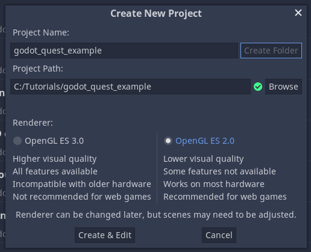
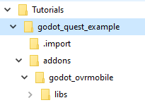
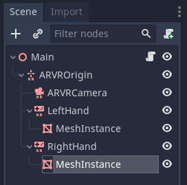
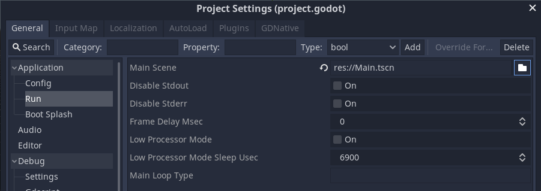
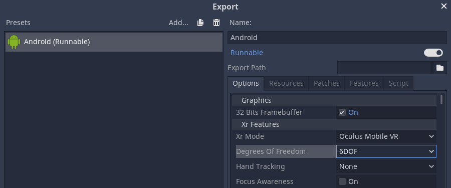
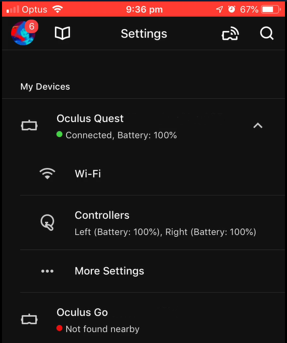
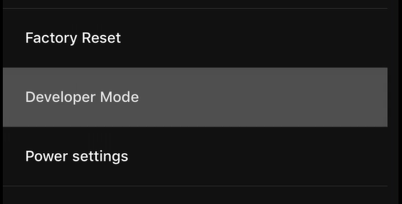
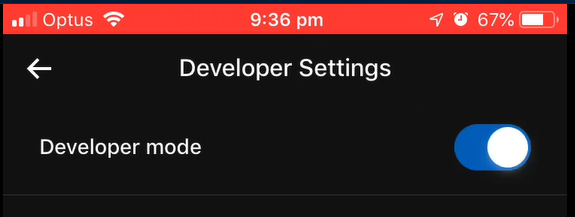

.. _doc_developing_for_oculus_quest:

Developing for Oculus Quest
===========================

Introduction
------------

This tutorial goes over how to get started developing for the
*Oculus Quest* with an official Godot plugin.

Before starting, there are two things you need to do:

First you need to go through the steps on the :ref:`doc_exporting_for_android`
page. This leads you through installing the toolset that Godot
needs to export to Android devices.

Next you need the Quest plugin. You can get it from the Asset
Library or manually download it from `here <https://github.com/GodotVR/godot-oculus-mobile-asset>`__.

Setting Up Godot
----------------

To get started open Godot and create a new project.

Make sure to choose the ``GLES2`` renderer. Due to the
Quest's GPU this backend is far better suited for the Quest.

Copy the addons folder from the Oculus Mobile asset into your Godot
project. Your project tree should look similar to this:

Now you can start building the main scene:

- Add an :ref:`ARVROrigin <class_ARVROrigin>` node first.
- Then add three child nodes to the origin node, one :ref:`ARVRCamera <class_ARVRCamera>` and two :ref:`ARVRController <class_ARVRController>` nodes.
- Assign controller ID 1 to the first :ref:`ARVRController <class_ARVRController>` and rename that to ``LeftHand``.
- Assign controller ID 2 to the second :ref:`ARVRController <class_ARVRController>` and rename that to ``RightHand``.
- Finally add a :ref:`MeshInstance <class_MeshInstance>` as a child node to our first :ref:`ARVRController <class_ARVRController>` and create a box shape, resize the box so each side is set to 0.1. Now duplicate the :ref:`MeshInstance <class_MeshInstance>` and move it to the second :ref:`ARVRController <class_ARVRController>` node. These will stand in for our controllers.

Now add a script to the main node and add the following code:

.. tabs::
 .. code-tab:: gdscript GDScript

    extends Spatial

    var perform_runtime_config = false

    onready var ovr_init_config = preload("res://addons/godot_ovrmobile/OvrInitConfig.gdns").new()
    onready var ovr_performance = preload("res://addons/godot_ovrmobile/OvrPerformance.gdns").new()

    func _ready():
        var interface = ARVRServer.find_interface("OVRMobile")
        if interface:
            ovr_init_config.set_render_target_size_multiplier(1)

            if interface.initialize():
                get_viewport().arvr = true

    func _process(_delta):
        if !perform_runtime_config:
            ovr_performance.set_clock_levels(1, 1)
            ovr_performance.set_extra_latency_mode(1)
            perform_runtime_config = true

Before you can export this project to the Quest you need to do three
more things.

First go into the project settings and make sure that the main scene
is the scene we run. Godot does not ask you to set this on export.

Then go into the export menu and configure a new Android export. if
you still haven't gone through the :ref:`doc_exporting_for_android`
page do it now. If you didn't you'll have some red messages on this
screen.

If you did you can forge ahead and make a few small changes to the
export settings. First change the XR Mode to ``Oculus Mobile VR``.
Then change the Degrees of Freedom mode to ``6DOF``.

Now save and close the export window.

Setting Up Your Quest
---------------------

Finally take out your phone, when you got your Quest you needed to
install an Oculus app on it and link it up to your Quest. Start the
Oculus app. Press the settings cogwheel on the bottom right hand side.
Select your Quest:

Select "More Settings", and select "Developer Mode":

Now turn developer mode on:

This allows you to deploy your games to the Quest.

Connect the Quest to your PC with the provided USB cable. Put the Quest
on, it may give a few dialogs to give the PC permission to deploy apps.
Now hit the little Android button that should be visible in the top right
hand side of your Godot window. It should build your game and export it
to the Quest.

The above does the bare minimum to get your project running on the Quest,
it's not very exciting. Holger Dammertz has made a great toolkit for the
quest that contains a lot of scenes to get help you on your way including
really nice controller meshes.

You can find the toolkit `here <https://github.com/NeoSpark314/godot_oculus_quest_toolkit>`__.

If you want to help out with improving the plugin please join us `here <https://github.com/GodotVR/godot_oculus_mobile>`__.
