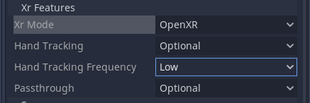

.. _doc_deploy_on_quest:

Deploying on Quest
==================

The OpenXR plugin makes developing for Android seamless with developing desktop XR experiences. 
Note that many Android based devices are very constrained performance-wise. Therefore,
**we highly recommend using the GLES2 renderer.**

.. note::

    Currently, the only Android-based device supported is the Meta Quest. 
    As Khronos is finalizing the official Android support for OpenXR, we will be able to offer further support soon.

.. seealso::

    As with any other Android device, please follow 
    `the instructions in the official Godot documentation for deploying to Android <https://docs.godotengine.org/en/stable/getting_started/workflow/export/exporting_for_android.html#doc-exporting-for-android>`__.

Enable developer mode on the Quest
----------------------------------

You can only deploy games to the Meta Quest if developer mode is enabled.
You can do this from the Oculus support application installed on your phone.
Please `follow the instructions on the Oculus developer site <https://developer.oculus.com/documentation/native/android/mobile-device-setup/>`__.

Setting up the export template
------------------------------

The instruction in the official Godot documentation already has you configuring an export template in Godot. However, a few extra settings are needed for XR deployment.

Open the export settings again by opening the **Project > Export...** menu and select the Android export template you created. 
If you haven't created it yet, do so now by pressing **Add...** and selecting **Android**.

Scroll down to the **Xr Features** section. Here, the important setting is the **Xr Mode** which should be set to **OpenXR**.
Note that the other options shown here should be set according to your project's needs.

