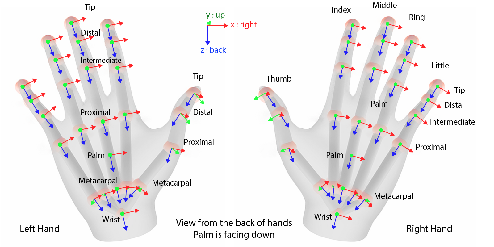
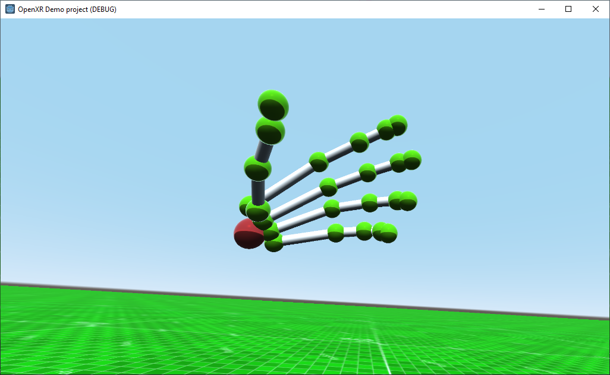
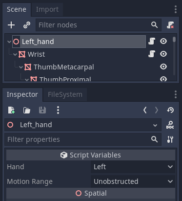
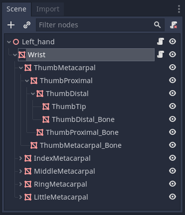
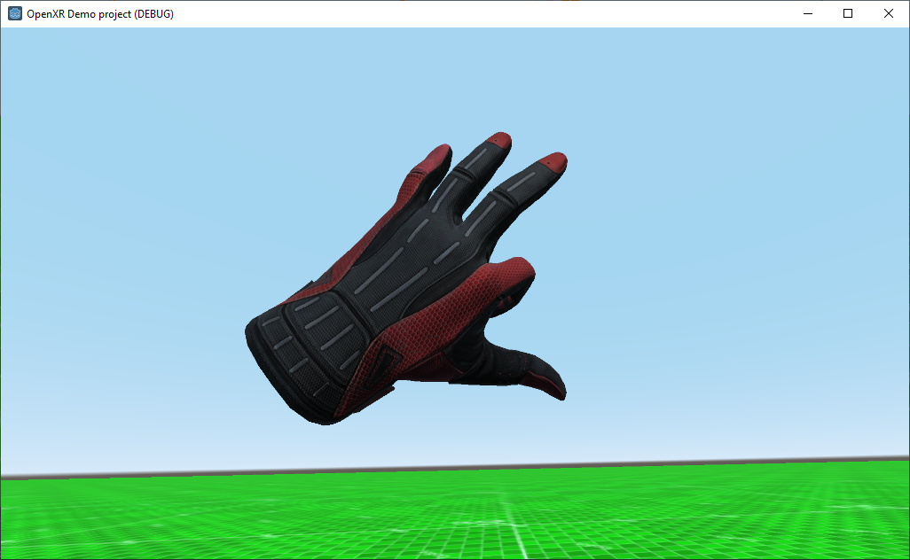
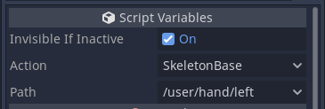

.. _doc_handtracking:

Hand tracking
=============

.. note::

    Only available in versions **1.1.0 and later** of the OpenXR plugin.

The hand tracking API was originally added to OpenXR by Microsoft to make the tracking information for the users hands and fingers available to the XR client. The API provides pose data for all the bones in the players hands but leaves some room for interpretation in how the API is implemented by the XR runtime.

In SteamVR support was added based on Valves existing hand tracking system that also provides fully rigged bone data extrapolated from controller inputs and proximity sensors if hand tracking is not supported natively on the system used.

Meta added support for this API to their mobile OpenXR runtime tied into their existing hand tracking functionality on the Quest. Note that you do need to enable hand tracking in the export settings for this to be active. The hand tracking API is only used for pure hand tracking, no pose data is presented when controllers are used.

.. note::

    When using the hand tracking API it is thus important that the capabilities of the target platform are taken into account. 
    This may improve in time as feedback is provided to the OpenXR working group.

The hand tracking API defines the bone structure that all XR runtimes must abide to however it doesn't dictate the orientation of the bones in rest or any size requirements.

Image courtesy of Khronos OpenXR specification.

The hand tracking API is independent of the action system and doesn't make use of it's poses. Hand tracking data is provided internally in global space (relative to the tracking volumes origin point) and the hand tracking nodes should thus have the :ref:`ARVROrigin <class_ARVROrigin>` node as their parent, not a :ref:`ARVRController <class_ARVRController>` node.

The plugin exposes the hand tracking API as two seperate systems. One that updates positions of a tree of nodes and one that updates bones of a :ref:`Skeleton <class_Skeleton>` so mesh deformation can be used.

Node based hand tracking
------------------------

This implementation is the most versatile as it doesn't require any knowledge of the hand model in rest pose. Note that the plugin comes with two example scenes called `left_hand_nodes.tscn` and `right_hand_nodes.tscn` that you can instance as child nodes of the `ARVROrigin` node. These scenes contain logic to automatically resize the used meshes to fit the size of the provided bone data.

At the root of this scene is a :ref:`Spatial <class_Spatial>` node that has `config/OpenXRHand.gdns` assigned as its script. This class from the plugin will position the spatial node at the base of the hand (see Palm in our image up above) and will update the position and orientation of its children. 

There are two properties here:

* `Hand` identifies whether we are tracking the position of the left or right hand. 
* `Motion Range` is only available on SteamVR and limits how far the hand can close, this is only used in conjunction with infered hand tracking based on controller input.

Our spatial node needs a number of child nodes with hardcoded names that will be updated by our hand tracking system. The type of nodes is not important, our example script uses :ref:`MeshInstance <class_MeshInstance>` nodes to also visualise the bones. 

First we find the child node `Wrist`, underneath here there are nodes for each finger. Each node starts with the name of the finger followed by the name of the bone. The finger names are `Thumb`, `Index`, `Middle`, `Ring` and `Little`. The bone names are `Metacarpal`, `Proximal`, `Intermediate`, `Distal` and `Tip`. Ergo IndexDistal is the distal bone of the index finger.

.. note::
    The thumb is the only finger that does not have a intermediate bone! 

The parent-child relationships of these nodes are important and the hand will only look correct if this structure if followed exactly. Note that adding extra nodes isn't a problem, the example scenes add a number of extra bone meshes in to complete the look of the hand. Note also that the example scenes have scripts attached to the wrist node that update the size and positions of these extra nodes. 

Skeleton based hand tracking
----------------------------

The second method supported by the OpenXR plugin is exposing the bone data as a :ref:`Skeleton <class_Skeleton>` node. In this case the solution is divided in two classes, one for placing the hand in space and the second to animate the aforementioned skeleton by updating the bone poses of the skeleton.

This approach allows deforming a mesh which is a visually more pleasing solution however differences in implementation between the platforms does pose some problems.

.. note::
    Microsoft has added another API to OpenXR that allows for retrieving a properly skinned hand mesh however as they are currently the only platform supporting this API it has not yet been added to the plugin.

At this point in time the plugin only exposes the data as it is provided by the OpenXR runtime. The plugin has an example implementation based on meshes that Valve has made publicly available however these work most reliable when used in conjunction with SteamVR.
These scenes are `scenes/left_hand_mesh.tscn` and `scenes/right_hand_mesh.tscn` and can be childed to the :ref:`ARVROrigin <class_ARVROrigin>` node.

Below is an overview of the steps needed to implement your own version.

.. note::
    The best way to implement this logic is to ask an artist to model a hand in 3D software using real hands dimensions and create an armature for the hand that follows the bone structure exactly as the OpenXR specification dictates in the image at the top of this article. When skinning special care needs to be taken keeping in mind that if full hand tracking is available, the distance between joints will be determined by the actual size of the players hand and may thus be different to the 3D model. After importing the model into Godot you can add the required scripts to make everything work.

To place the hand mesh in space a node needs to be added as a child to the :ref:`ARVROrigin <class_ARVROrigin>` node, this node needs to have the `config/OpenXRPose.gdns` script attached. When importing a 3D file you can add this script to the root node of the imported model.

The `OpenXRPose` script isn't just used by the hand logic but also exposes other pose locations configured in the action map.

The following properties can be set on this node:

* `Invisible If Inactive` enables logic that will automatically make this node invisible if the hand is not being tracked. 
* `Action` specifies which action in the actionmap is being tracked, this needs to be set to the special type `SkeletonBase`.
* `Path` specified the OpenXR input path, this is `/user/hand/left` for the left hand and `/user/hand/right` for the right hand.

The next step is adding the script `config/OpenXRSkeleton.gdns` to the skeleton node of the 3D model. This script has the same two properties as the `OpenXRHand` script namely `Hand` and `Motion Range` and they have the same use.

Note that the bone names are standardised, the list of bone names is presented below and need to be suffixed with either `_L` or `_R` depending on whether the bone is for respectively the left hand or the right hand:

* Palm
* Wrist
* Thumb_Metacarpal
* Thumb_Proximal
* Thumb_Distal
* Thumb_Tip
* Index_Metacarpal
* Index_Proximal
* Index_Intermediate
* Index_Distal
* Index_Tip
* Middle_Metacarpal
* Middle_Proximal
* Middle_Intermediate
* Middle_Distal
* Middle_Tip
* Ring_Metacarpal
* Ring_Proximal
* Ring_Intermediate
* Ring_Distal
* Ring_Tip
* Little_Metacarpal
* Little_Proximal
* Little_Intermediate
* Little_Distal
* Little_Tip

Finally, and this is standard Godot functionality, a common addition to hand tracking is to track the location of the tip of a finger for physics interaction. This can be accomplished with the :ref:`BoneAttachment <class_BoneAttachment>` node. Simply add this as a child node to the :ref:`Skeleton <class_Skeleton>` node and select the bone you want to track. Now you can add the desired physics object as a child to this node. 
