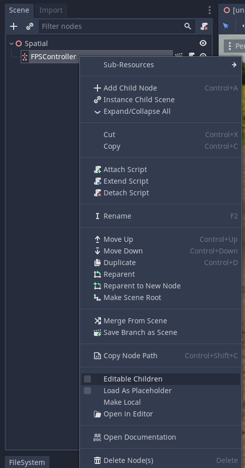

.. _doc_openxr_introduction:

OpenXR plugin
=============

Welcome to the Godot OpenXR documentation!

Introduction
------------

This is the documentation for the `Godot OpenXR plugin <https://github.com/GodotVR/godot_openxr>`__.

The plugin is supported on Godot 3.4 and later. However, it does **not** support the upcoming Godot 4.0 release.

Getting started
---------------

To start a new project that supports OpenXR, start by opening up the Godot editor and creating a new project.

Copy the plugin into this new project in the subfolder ``addons/godot_openxr/`` using your operating system's file manager.
It is important that the plugin is placed in this **exact** location in your project folder.

Back in Godot, create a new 3D scene and press the **Instance Child Scene** button
(represented by a chain link icon) in the scene tree dock.
Select the ``addons/godot_openxr/scenes/first_person_controller_vr.tscn`` subscene
and add it to your scene.
Right-click the added node and select **Editable Children** to gain access
to some of the nodes in this subscene:

This is the bare minimum you need. However, for good measure, we suggest adding
a DirectionalLight node and a few MeshInstance nodes so you have something to see.
If you add those to the hand nodes, you can visualize where your controllers
are tracking.

Your scene should now look something like this:

.. image:: img/default_scene.png

Now you can press the **Run** button in the top-right corner of the editor
to start your project and you should be able to look around.

Next steps
----------

To turn this simple scene into a proper game, the sky is the limit.
Below, there are a few more topics specific to this plugin.
However, the following resources are a good place to continue:

- :ref:`VR starter tutorial <doc_vr_starter_tutorial_part_one>`
  in the official documentation may focus on OpenVR, but almost everything
  there applies to OpenXR as well.
- `Godot XR tools <https://github.com/GodotVR/godot-xr-tools>`__ is a plugin
  that contains a set of handy sub scene to quickly
  implement locomotion, object interaction and UI elements in your XR experience.

Please check the `Godot Engine community page <https://godotengine.org/community>`__ to find help from other Godot developers.
The ``#xr`` channel on the Godot Discord has become a vibrant Godot XR community.

Plugin features
---------------

.. toctree::
   :maxdepth: 1
   :name: toc-tutorials-vr-openxr

   enable_plugin
   runtime_selection
   passthrough
   deploy_on_quest
   handtracking
