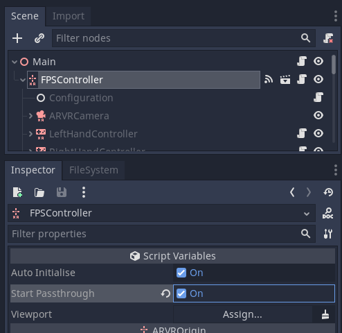

.. _doc_passthrough:

Passthrough
===========

.. note::

    Only available in versions **1.1.1 and later** of the OpenXR plugin.

Passthrough is a new feature introduced on the Meta Quest and added to the OpenXR spec as a Meta extension. 
It is likely this implementation will be implemented by other vendors where the hardware supports a passthrough mode
and promoted to core at some point.

Keep in mind that this feature is not guaranteed to be available.
Passthrough allows for the camera input on the headset to be used within the headset so the user can see the real world. 
This allows us to implement an AR-like experience in a VR headset.

If you are using the ``first person controller`` scene, you can simply
enable passthrough by checking the **Start Passthrough** option
on the controller node:

If you rather do this through code, you will first need to create an instance
of the ``OpenXRConfig`` object. 
You can do this the same way the ``first person controller`` does
and assign the ``OpenXRConfig.gdns`` as the script to a node,
or you can instance it in code as shown below:

.. code::

    var openxr_config = null

    func _ready():
        var config_gdns = load("res://addons/godot_ovrmobile/OvrInitConfig.gdns")
        if config_gdns:
            openxr_config = config_gdns.new()

    func start_passthrough():
        if openxr_config:
            return openxr_config.start_passthrough()
        else:
            return false

    func stop_passthrough():
        if openxr_config:
            openxr_config.stop_passthrough()

.. note::

        The Viewport's **Transparent Bg** property must be enabled prior to starting passthrough.
        The plugin will log a warning message if it detects an incorrect configuration. 

.. seealso::

    A fix for a bug related to turning transparent background on/off
    is scheduled for the Godot 3.4.3 release. If you wish to toggle passthrough
    in your game, you will need to be on that version or newer.
