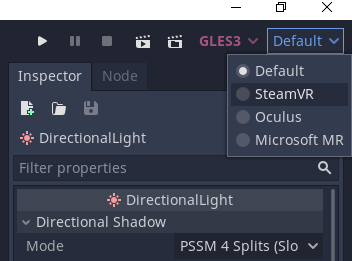

.. _doc_runtime_selection:

Switching runtimes
==================

In OpenXR, it is standard for each runtime to implement a mechanism to make it
the current runtime. In Steam, the Oculus application or Windows MR portal,
there will be an option to switch to their runtime as the current OpenXR runtime.

Generally speaking, end users will have a preferred runtime due to not having a reason
to switch runtimes when playing games that support OpenXR. However, developers may wish to
test multiple runtimes to see if their game behaves.

To make this easy, Godot provides a dropdown in the top-right corner which can
switch the runtime Godot will use when testing:

The OpenXR plugin will **not** work with the Microsoft MR runtime.
That runtime only supports OpenXR applications that use DirectX,
but Godot uses OpenGL ES 3.0 or 2.0.

.. note::

    Selecting a runtime in this dropdown only applies to running the game
    from the editor. It does **not** change the runtime used by other
    applications. Exported projects will use the computers current runtime.
    Also, if you are deploying to an external device, this setting has no effect.

As OpenXR doesn't have a mechanism for registering runtimes that we can query,
Godot will check common locations for runtime configuration files.
The locations that are checked are stored in the ``addons/godot_openxr/runtimes.json`` file.
If you've installed a runtime in a nonstandard location or a runtime not currently present in this file, you can add it manually using a text editor.

.. seealso::

    If the dropdown isn't shown in your editor, make sure the plugin is enabled. 
    See :ref:`doc_enable_plugin`.
