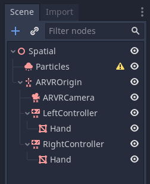
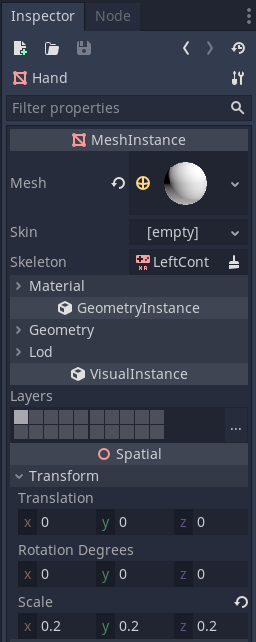
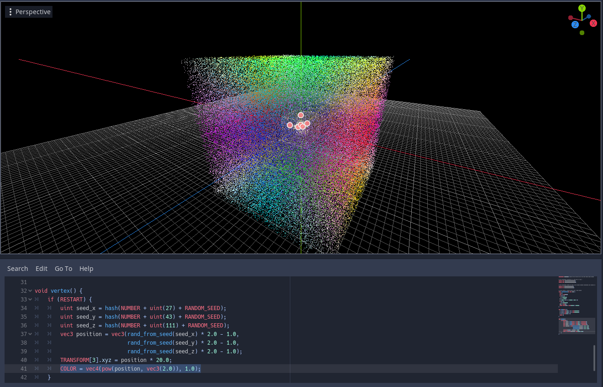
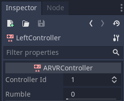
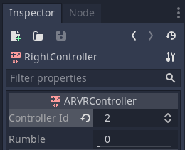
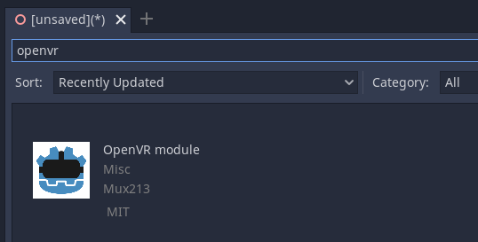
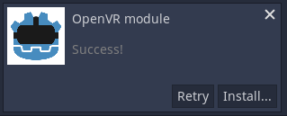
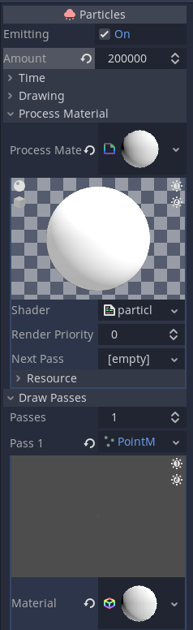
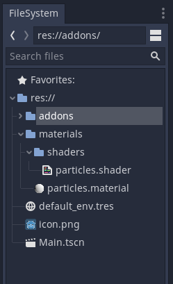

How to make a Cosmic Sugar clone: Part 1
=================================================

If you do not know Cosmic Sugar, it is one of the classic VR psychedelic
experience where millions of particles surround you, and with your
controllers you will be able to generate force fields that will make the
particles flow towards, or be repulsed by each controller. Well if you
don't know it, definitely check it out it is free: `Steam
page <https://store.steampowered.com/app/559010/Cosmic_Sugar_VR/>`__.

In this tutorial, we will start by coding a simple particle shader to
control each particles, then we will implement a very simple VR support,
and finally we will bind the VR controller actions to the particles
shader. In the second part we will continue by making the force fields
more than just attraction and repulsion and play with some vector field
math.

What you need to know
---------------------

If you don't know how to create a scene, or how to parent objects, you
should follow the beginner's tutorial on Godot before you attempt to do
this. Also, if you have never seen GLSL shader code, or C, or at minima
a typed language, well this might be a little hard to follow, but you
can try to learn something here!

The scene
---------

The required nodes
~~~~~~~~~~~~~~~~~~

Alright, before we dive into the whole shader part of this project,
let's first setup the scene in Godot, what we want is a particle system
and a VR setup. First, create a 3D scene (or start from a spatial node,
it's the same thing) and save it (call it Main?). Then add a
**Particle** node (we want the Particle and not the CPUParticle node as
we are going to use that sweet sweet GPU capacity), an **ARVROrigin**
node, and as children of this node, add one **ARVRCamera** and two
**ARVRController** nodes. Rename the two ARVRcontroller nodes as
LeftController and RightController (This is not necessary but it helps
to keep things organized). Finally, to be able to see our hands in VR we
need a 3D representation of it, also called a Mesh ! For the purpose of
this tutorial we are going to simply use a sphere as our hands because
it will be sufficiant, add a **MeshInstance** node to each of the
controllers and call them **Hand** (again keeping things organized !).
Your setup should look like this:

   Scene setup

The overall configuration of the scene
~~~~~~~~~~~~~~~~~~~~~~~~~~~~~~~~~~~~~~

We need to do a few final configuration steps before we can get started.
First, you want to assign a unique ID to each controller so that the
underlying VR library knows what to assign to what! Select the
RightController and set its Controller ID to 2.

|LeftController setup| |RightController setup|

Second, we want to add an actual mesh to our hands. Select each hand and
click on the **[empty]** dropdown in the **Mesh** field. Select a
**Sphere** (or whatever you fancy to be honest it doesn't matter much
here). Finally, set the scale of the MeshInstance to 0.2 on all three
axis.

   Hands setup

Third, for the VR to work we need to install a VR library. The nodes in
Godot serve as instances to be used by different VR backends. Basically,
out the multiple existing VR backend there are two that are mostly in
use (in 2020!), OpenVR (Vive, Index, SteamVR compatible devices) and
OculusVR (Oculus quest, rift). The purpose of this tutorial isn't really
to discuss the different backend so we are going to just download the
OpenVR one (because I have a Vive headset). Go to the asset store
**AssetLib** and search for **OpenVR**. Download and install it, it will
create an addons folder and place all of its magic there.

|OpenVR setup| |OpenVR setup|

Fourth, our Particle system doesn't seem to be happy as a yellow
exclamation mark is next to it, what it is lacking is a key component, a
particle material, which will contain our particle shader. This will be
the main topic for the rest of this tutorial so let's just go ahead and
create one. In the Particle inspector, open *Process material* and click
on the *[empty]* and select **New ShaderMaterial**. This will create a
new material, and at the bottom you will see the field *Shader*. Click
on the *[empty]* and select **New Shader**. Ok finally we are going to
save our material and our shader as files so that it is easier to find
them. Click on the *down arrow* next to the material and click **Save**,
crate a folder called *materials* and inside of it a folder called
*shaders*. Save your material as *particles.material* in the material
folder, then repeat those steps with the shader. Click on the down arrow
and click **Make Unique** then click **Save** and place it in the
*shaders* folder and call it *particles.shader*. Now everytime we want
to edit the shader code we can simply double click on the shader file!
Then, we will increase the number of particles, lets start with a small
value, say **200000**. Finally, we want our particle to have an
incarnation in 3D, but we want millions of them, so we cannot affort
complex meshes, let's go for the very simple **Dot**. Click on **Draw
Passes** and click on the *[empty]* next to *Pass 1* and select **New
PointMesh**. Then assign a new material to this mesh by clicking on the
*[empty]* field. Create a **New ShaderMaterial** and add a **New
Shader**. Then click on the shader and copy paste those lines (this
tutorial is not about fragment shaders):

::

    shader_type spatial;

    void fragment() {
        EMISSION = COLOR.xyz;
    }

|Particle setup| |Particle setup|

The Particle Shader
-------------------

So first, you should probably at least read the godot
`Shader <https://docs.godotengine.org/en/stable/tutorials/shading/shading_reference/shaders.html?highlight=shader%20type#shader-types>`__
and the `Particle
Shader <https://docs.godotengine.org/en/stable/tutorials/shading/shading_reference/particle_shader.html>`__
documentations. Have a read, it'll help you understand what's going to
happen. Once you feel ready, double click on that *particle.shader* file
we saved before. You should see this:

.. figure:: img/jj.png
   :alt: Shader new

   Shader new

If you have read the documentation, you'll know what to do! (Also it's
literally written in red!)

The concept
~~~~~~~~~~~

What we are going to use here is the power of multiplexed computation on
the GPU to change the movement of the particles given a force field (it
is called a Vector Field in math!). The thing with GPU computing is that
each piece of code is run independently of the other ones, so we cannot
share states between objects easily (sorry this is an oversimplification
but GPU computing takes a book to fully explain). In our case it won't
be a problem though, at each frame we will compute the direction a
particle needs to go to which only requires knowledge of a few "fixed"
things (fixed as in for a given frame, this will not change, though
between frames those values might change). In summary, to create a Force
Field effect each particle will need to know the following things: - The
position of the attractor/repulsor, in our case the VR controllers - The
state of the attraction repulsion, are we neutral, attracting or pushing
away - Its own position and velocity

The uniform variables
~~~~~~~~~~~~~~~~~~~~~

In GLSL shader code, we can defined such "fixed" variables as
**uniform** (uniform across all computation, aka "fixed"). According to
the
`documentation <https://docs.godotengine.org/en/stable/tutorials/shading/shading_reference/particle_shader.html#doc-particle-shader>`__,
the Godot engine provides us with built-in variables for the position
(``inout mat4 TRANSFORM`` Particle transform) and velocity
(``inout vec3 VELOCITY`` Particle velocity) in the Vertex function.
Notice the ``inout`` part? Well that means that Godot both provides us
with the current value, but we can also override it! Let's define the
other variables

::

    shader_type particles; //Well now you know how to fix that error above right?

    // The controlers positions as a vec3 for X Y and Z
    uniform vec3 LeftController_position;
    uniform vec3 RightController_position;

    // The controller states so that we can switch between attracting and pushing away
    uniform int LeftController_state;
    uniform int RightController_state;

Pseudo random function
~~~~~~~~~~~~~~~~~~~~~~

Alright, one thing that GLSL or Godot doesn't really implement (such a
shame ...) is a Random Number generator. Why do we need this you asked?
Well, how else are we going to generate millions or particles randomly
scattered in our psychedelic universe we are creating?!? In short, we
need a random number generator function so that we can instanciate each
particle at a random location in our scene.

I have shamelessly stolen this bit of code from the godot `particle
shader
tutorial <https://docs.godotengine.org/en/stable/tutorials/3d/vertex_animation/controlling_thousands_of_fish.html>`__
which in turn stole it from the `Godot source code of the
ParticleMaterial <https://github.com/godotengine/godot/blob/master/scene/resources/particles_material.cpp>`__.
Let's just copy past it and not wonder how it does what it does!

::

    ...
    uniform vec3 RightController_state;

    // This creates a random number from a seed number
    float rand_from_seed(in uint seed) {
      int k;
      int s = int(seed);
      if (s == 0)
        s = 305420679;
      k = s / 127773;
      s = 16807 * (s - k * 127773) - 2836 * k;
      if (s < 0)
        s += 2147483647;
      seed = uint(s);
      return float(seed % uint(65536)) / 65535.0;
    }

    uint hash(uint x) {
      x = ((x >> uint(16)) ^ x) * uint(73244475);
      x = ((x >> uint(16)) ^ x) * uint(73244475);
      x = (x >> uint(16)) ^ x;
      return x;
    }

Vertex function
~~~~~~~~~~~~~~~

It is time, the vertex function is to be started, this function is the
``main``, it is what will be called for each particle. so let's just
write an empty one. Because we are in a Particle system in Godot, it is
also in this function that we will need to deal with the initialization
of our particle. In short, when a particle is created, the vertex
function will be called and the special variable ``RESTART`` will be set
to ``true``. In all other instances, this will be set to ``false``. This
allows us to split the execution between init and exec. Let's create the
vertex function.

::

    ...
    return x;
    }

    void vertex() {
      if (RESTART) { // initialization!
        // we will write something here
      }
      // execution at each frame
    }

Initialization
~~~~~~~~~~~~~~

Ok let's start with the simple things first! We want to initialize our
particle at a random location. To get a random number we use that sweet
magic from up there! Huh wait, but how? Well, each particle in
*Particle* system has a unique number (``in uint NUMBER``: Unique number
since emission start.) and a random seed (``in uint RANDOM_SEED`` Random
seed used as base for random). Lets first pass this to our hash function
(just because) and then use that hash as a seed to our random function
(why well I don't know but we don't get any good value otherwise?). (I
am skipping over the fact that the random function returns a number
between 0 and 1 and we want a position between -1 and 1 so we random \*
2.0 - 1.0) Then using this position vector we set the TRANSFORM matrix
third column (google `transformation
matrix <https://en.wikipedia.org/wiki/Transformation_matrix>`__ if you
don't understand why). Oh, and while we are at it, let's make this whole
thing pretty? We are in the business of psychedelic after all! Let's set
the COLOR as our position value, but squared (``pow()`` *power of*
function, square is power of 2) to avoid having black particles.

::

    void vertex() {
      if (RESTART) {
        uint seed_x = hash(NUMBER + uint(27) + RANDOM_SEED);
        uint seed_y = hash(NUMBER + uint(43) + RANDOM_SEED);
        uint seed_z = hash(NUMBER + uint(111) + RANDOM_SEED);
        vec3 position = vec3(rand_from_seed(seed_x) * 2.0 - 1.0,
                             rand_from_seed(seed_y) * 2.0 - 1.0,
                             rand_from_seed(seed_z) * 2.0 - 1.0);
        TRANSFORM[3].xyz = position * 20.0;
        COLOR = vec4(pow(position, vec3(2.0)), 1.0);
      }
    }

Now the magic should start on your screen:

   Shader new

That's it for Part 1, next we will learn about Vector Fields and how to
apply them to our system. Your particle shader should look like:

::

    shader_type particles; //Well now you know how to fix that error above right?

    // The controlers positions as a vec3 for X Y and Z
    uniform vec3 LeftController_position;
    uniform vec3 RightController_position;

    // The controller states so that we can switch between attracting and pushing away
    uniform int LeftController_state;
    uniform int RightController_state;

    // This creates a random number from a seed number
    float rand_from_seed(in uint seed) {
      int k;
      int s = int(seed);
      if (s == 0)
        s = 305420679;
      k = s / 127773;
      s = 16807 * (s - k * 127773) - 2836 * k;
      if (s < 0)
        s += 2147483647;
      seed = uint(s);
      return float(seed % uint(65536)) / 65535.0;
    }

    uint hash(uint x) {
      x = ((x >> uint(16)) ^ x) * uint(73244475);
      x = ((x >> uint(16)) ^ x) * uint(73244475);
      x = (x >> uint(16)) ^ x;
      return x;
    }

    void vertex() {
        if (RESTART) {
            uint seed_x = hash(NUMBER + uint(27) + RANDOM_SEED);
            uint seed_y = hash(NUMBER + uint(43) + RANDOM_SEED);
            uint seed_z = hash(NUMBER + uint(111) + RANDOM_SEED);
            vec3 position = vec3(rand_from_seed(seed_x) * 2.0 - 1.0,
                                 rand_from_seed(seed_y) * 2.0 - 1.0,
                                 rand_from_seed(seed_z) * 2.0 - 1.0);
            TRANSFORM[3].xyz = position * 20.0;
            COLOR = vec4(pow(position, vec3(2.0)), 1.0);
        }
    }

