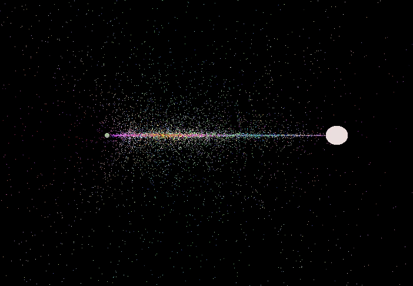

How to make a Cosmic Sugar clone: Part 3
=================================================

VR initialization
-----------------

The next part of this tutorial will require to test things in VR to be
able to check whether what we did is working, so it is time to setup the
VR initialization of the main scene.

As one should always do, the first thing to do is to read the
documentation on VR right? Oh but like VR has many headset and many
libraries how am I going to figure this out -> realize the madness, go
cry for a second, breath, ok !

So I'll be presenting how to setup "OpenVR" which is the implementation
developped by Steam and used by the HTC Vive and Valve Index (The
documentation is `on
GitHub <https://github.com/GodotVR/godot_openvr>`__). Oh yeah so if you
want info on other HMDs, well a good place to start is the `VR
Primer <https://docs.godotengine.org/en/stable/tutorials/vr/vr_primer.html>`__
but it is a bit tricky to find good information.

Ok so, as per the "OpenVR" documentation we need to do two things,
initialize our headset and set the rendering engine of Godot to use
Linear Color space. Go ahead a create a new GDscript for the root node
of our main scene, call it ``Main.gd`` and place it in the ``script``
folder.

Then on ``_ready`` let's initialize and set rendering options:

::

    extends Spatial

    func _ready():
      # This will try and find a compatible and connected VR interface
        var VR = ARVRServer.find_interface("OpenVR")

        # Then we test, to see if we found one, and if it initialized ok, because if we did not, well we need to write a catch or someting.
        if VR and VR.initialize():
            # This tells Godot that we have a VR headset, so please activate all the magic
            get_viewport().arvr = true

            # This is the necessary trick so that we don't need to deactivate the HDR capacity of Godot
            get_viewport().keep_3d_linear = true

        # Disable Vsync so that we get that sweet 90FPS we need to not puke in VR
        OS.vsync_enabled = false

            # Also, the physics FPS in the project settings is also 90 FPS. This makes the physics
            # run at the same frame rate as the display, which makes things look smoother in VR!
            Engine.target_fps = 90
        else:
            # Here you will want to write some function that says that no VR headset was found -> sad
            pass

All good, at this point, you should be able to plug in your headset,
start SteamVR, and launch the scene (with F6). If all went well, you
should see the particles around you, and they should go towards points
in space. Your hands are spheres and you can move them.

Common issue with hands not in the right place
~~~~~~~~~~~~~~~~~~~~~~~~~~~~~~~~~~~~~~~~~~~~~~

If you experience that your hands are not where your controllers are,
make sure that the transform of the "Hand" mesh instance is set as 0,0,0
for the translation. Otherwise you will get some weird motion artifacts
due to the parents movement.

VR controllers
--------------

Ok, we can see but we cannot do anything yet! It is time to add some
logic to our VR controllers. First off, we want to create a script that
we will use to communicate the states of our controllers to our
ParticleShader. There are two ways to code this, either the controller
will inform the particle system about the state, or the particle system
will pull info from the controller. Here I'll send information because
we have a very simple scene, but if you had a more complex scene then
defining states and checks the other way will be cleaner.

Let's select the ``LeftController`` and add a script called
``VRController.gd`` (keep things tidy, place it in the script folder).

Alright, we will need to define a few things in this script so that
things can run smooth. We will need: - The controller identity (Left or
Right) - A pointer to our Particle system so that we can interact with
its material - An event function to catch a button press - An event
function to catch a button release - A method to send our controllers
positions at each frame (that we will call from the physics process)

Ok let's start with the particle system because that's trivial, we just
go in the arborescence and preload it. And while we are at it, we also
grab the material and set it as a global variable. Then we define some
global variables we will need. Because we have two controllers and that
we defined in our shaders the position and state of each controller, we
need to store this information.

::

    extends ARVRController

    # Get the particle instance
    onready var particles = get_node("../../Particles")
    # Get the particle material
    onready var particles_material = particles.get_process_material()

    # Define some helper variables for the right a left controllers
    var shader_controller_position
    var shader_controller_state

Then we define our functions that will need:

::

    extends ARVRController

    onready var particles = get_node("../../Particles")
    onready var particles_material = particles.get_process_material()

    func _ready():
      pass

    func _physics_process(delta):
      pass

    func _set_position():
      pass

    func _set_state(state):
      pass

    func _event_button_pressed(button_index):
      pass

    func _event_button_released(button_index):
      pass

Next we will get the controller ID so that we can send the correct
information to the ParticleShader. As per the
`documentation <https://docs.godotengine.org/en/stable/classes/class_arvrcontroller.html#class-arvrcontroller-method-get-controller-name>`__
we can get the controller id with ``get_controller_id``, or we can just
access the built in variable ``controller_id``. So let's just use the
built in and set some helpers for the rest of the code:

::

    _func ready():
      if controller_id == 1:
        # Those are the name of the uniforms we wrote at the beginning of our shader code!
        shader_controller_position = "LeftController_position"
        shader_controller_state = "LeftController_state"
      elif controller_id == 2:
        shader_controller_position = "RightController_position"
        shader_controller_state = "RightController_state"
      else:
        print("The controller ID is outside of the legal values (1: Left, 2: Right)")

We also need to add the even binding system to our ready function such
that button press and button release works:

::

    _func ready():
      ...
      connect("button_pressed", self, "_event_button_pressed")
      connect("button_release", self, "_event_button_released")

Let's continue by writing our function that will send the information to
the shader, let's start with the position. As per `Godot
documentation <https://docs.godotengine.org/en/stable/classes/class_transform.html>`__
(Again!?) the position of our controller is stored in the Transform, at
the Origin. Also, to set a material shader value, we need to use the
``set_shader_param`` function which takes the ``uniform`` name (**Case
sensitive**) and the value to pass. We already defined the name to use
above, so we are going to use it here: ``shader_controller_position``.

::

    func _set_position():
      var position = transform.origin
      particles_material.set_shader_param(shader_controller_position, position)

Let's do the same with the state, but because the state is dynamic, we
want to give it as a parameter so its easier to code it and cleaner to
read.

::

    func _set_state(state):
      if state in [-1, 0, 1]:
        particles_material.set_shader_param(shader_controller_state, state)
      else:
        print("Error the state is not a valid state")

Notice how I keep adding if else statements with a print error message?
Those are reallllllllly useful in debugging!

Next, for the button events, I am here showing a "Hacky" way of doing
it. There exists an "Action Binding" implementation that is 1000x more
potent and clean and that should be used if you are making something to
be released. You can `learn more about it
here <https://github.com/GodotVR/godot-openvr-asset/wiki/OpenVR-actions>`__.

If you don't know the biding of your controllers you can just write
this:

::

    func _event_button_pressed(button_index):
      print(button_index)

    func _event_button_released(button_index):
      print(button_index)

But I am going to assume the biding for the Vive controllers: - Trigger
button: button\_index == 15 - Grip button: button\_index == 2

We now simply need to do a simple switch case and we are good. Oh sorry,
I meant a **Match** function because why follow conventions? Let's just
add a print statement, launch the game, and press the buttons to see if
it is working:

::

    func _event_button_pressed(button_index):
      match button_index:
        15:
            print("Trigger pressed")
        2:
            print("Grip pressed")

    func _event_button_released(button_index):
      match button_index:
        15:
            print("Trigger released")
        2:
            print("Grip released")

All good then let's do some state sending!

::

    func _event_button_pressed(button_index):
      match button_index:
        15:
            print("Trigger pressed")
            _set_state(1)
        2:
            print("Grip pressed")
            _set_state(-1)

    func _event_button_released(button_index):
      match button_index:
        15:
            print("Trigger released")
            _set_state(0)
        2:
            print("Grip released")
            _set_state(0)

You might notice a problem here, if I press the trigger AND the grip
together this will override the trigger, and if I release the grip, the
trigger won't work anymore. A cleaner way to code this is to define both
states in variables (``bool trigger_pressed`` and ``bool grip_pressed``)
and to do the logic inside the ``_set_state`` function. Let's say its
homework?

Alright finally we just need to get the ``_physics_process`` function
and we are done with the code. At each frame, we want to send the
position of our controllers. It is as trivial as just calling our
position update function every frame:

::

    func _physics_process(delta):
      _set_position()

Voila !

Now we just need to add that script to the ``RightController``, select
it in the scene, and at the bottom in the **script** section select
*[empty]* then **load**. Find the ``VRController.gd`` script and load
it.

The final script should look like this:

::

    extends ARVRController

    onready var particles = get_node("../../Particles")
    onready var particles_material = particles.get_process_material()

    var shader_controller_position
    var shader_controller_state

    func _ready():
        if controller_id == 1:
            shader_controller_position = "LeftController_position"
            shader_controller_state = "LeftController_state"
        elif controller_id == 2:
            shader_controller_position = "RightController_position"
            shader_controller_state = "RightController_state"
        else:
            print("The controller ID is outside of the legal values (1: Left, 2: Right)")
        connect("button_pressed", self, "_event_button_pressed")
        connect("button_release", self, "_event_button_released")

    func _physics_process(delta):
      _set_position()

    func _set_position():
        var position = transform.origin
        particles_material.set_shader_param(shader_controller_position, position)

    func _set_state(state):
        if state in [-1, 0, 1]:
            particles_material.set_shader_param(shader_controller_state, state)
        else:
            print("Error the state is not a valid state")

    func _event_button_pressed(button_index):
        match button_index:
            15:
                print("Trigger pressed")
                _set_state(1)
            2:
                print("Grip pressed")
                _set_state(-1)

    func _event_button_released(button_index):
        match button_index:
            15:
                print("Trigger released")
                _set_state(0)
            2:
                print("Grip released")
                _set_state(0)

Testing
-------

That's it, fire it up and you should be able to interact with the
particles.

   Particles

A few things to consider
------------------------

You can try and play with the number of particles, and go pretty high,
on a Nvidia 2080 I can go as high as 8 millions particle and still
maintain 90FPS :D.

You can play with the colors of the particles as well!

Finally you can extend this code and change the Vector Field we used for
some pretty trippy stuff:

-  https://demonstrations.wolfram.com/ArnoldBeltramiChildressABCFlows/
-  https://demonstrations.wolfram.com/LorenzAttractor/
-  https://demonstrations.wolfram.com/LorenzsModelOfGlobalAtmosphericCirculation/
-  https://demonstrations.wolfram.com/ChaosAndOrderInTheDampedForcedPendulumInAPlane/

Homework
--------

If you want the solution to the button presses issues:

::

    extends ARVRController

    onready var particles = get_node("../../Particles")
    onready var particles_material = particles.get_process_material()

    var shader_controller_position
    var shader_controller_state
    var trigger_pressed = false
    var grip_pressed = false

    func _ready():
        if controller_id == 1:
            shader_controller_position = "LeftController_position"
            shader_controller_state = "LeftController_state"
        elif controller_id == 2:
            shader_controller_position = "RightController_position"
            shader_controller_state = "RightController_state"
        else:
            print("The controller ID is outside of the legal values (1: Left, 2: Right)")
        connect("button_pressed", self, "_event_button_pressed")
        connect("button_release", self, "_event_button_released")

    func _physics_process(delta):
        _set_position()
        _set_state()

    func _set_position():
        var position = transform.origin
        particles_material.set_shader_param(shader_controller_position, position)

    func _set_state():
        if trigger_pressed and not grip_pressed:
            particles_material.set_shader_param(shader_controller_state, 1)
        elif grip_pressed and not trigger_pressed:
            particles_material.set_shader_param(shader_controller_state, -1)
        elif grip_pressed and trigger_pressed:
            particles_material.set_shader_param(shader_controller_state, 0)
        else:
            particles_material.set_shader_param(shader_controller_state, 0)

    func _event_button_pressed(button_index):
        match button_index:
            15:
                print("Trigger pressed")
                trigger_pressed = true
            2:
                print("Grip pressed")
                grip_pressed = true

    func _event_button_released(button_index):
        match button_index:
            15:
                print("Trigger released")
                trigger_pressed = false
            2:
                print("Grip released")
                grip_pressed = false
