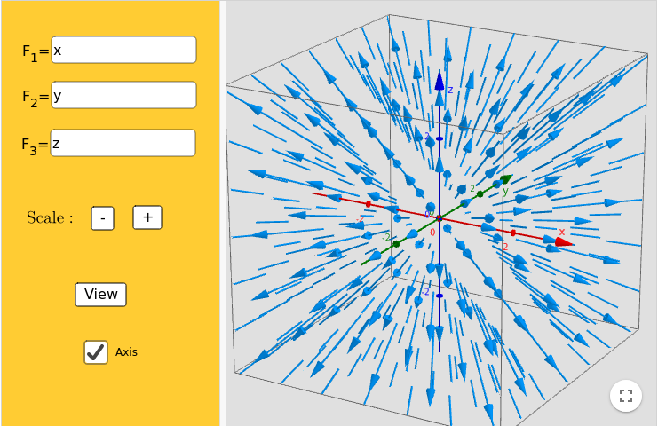
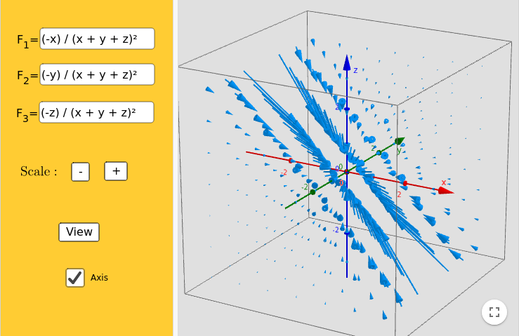
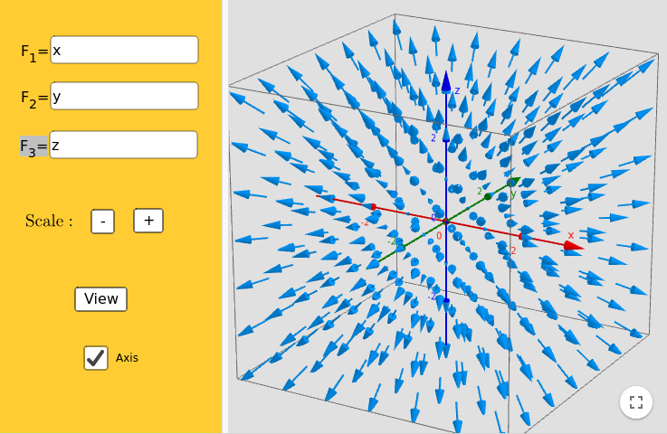
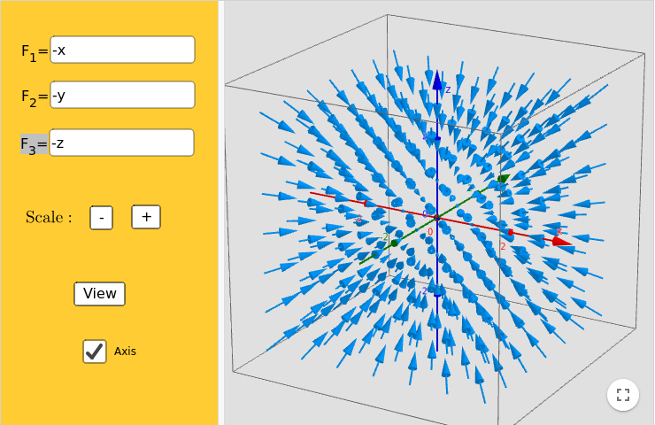
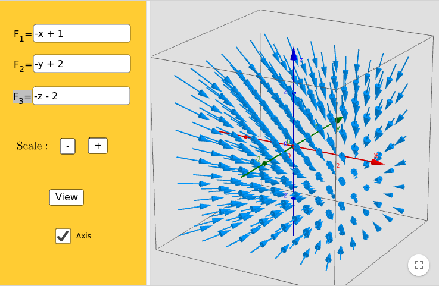
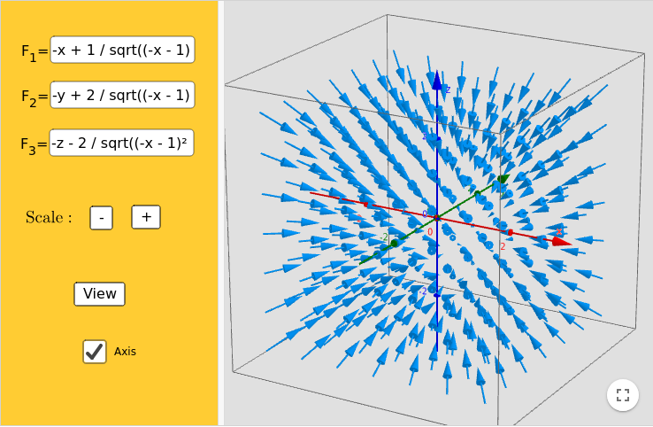
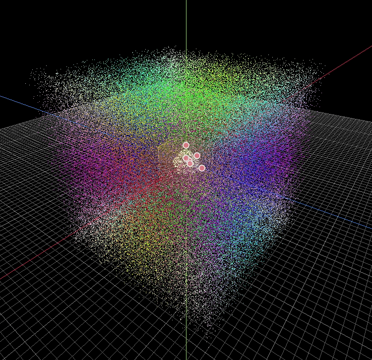
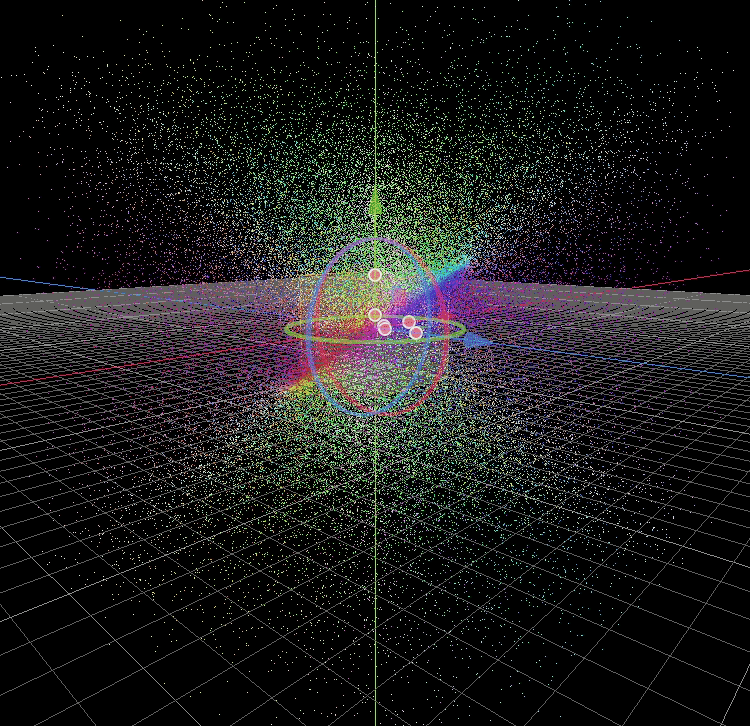

How to make a Cosmic Sugar clone: Part 2
=================================================

Vector fields
-------------

If you have never taken a physics course on magnets, or fluids, you
probably have not learned about Vector Fields. If that's the case, its
fine, it is actually not a very hard mathematical tool to understand (at
least at the level we need it!). I highly reccomend you spend 20 minutes
of your life watching the `Khan academy class about vector
fields <https://www.khanacademy.org/math/multivariable-calculus/thinking-about-multivariable-function/visualizing-vector-valued-functions/v/vector-fields-introduction>`__,
it is (as all Khan academy classes) really well done.

In short, a vector field is a mathematical function which, for any point
in space x, y, and z returns a 3D vector (we are in 3D so I am going to
assume a 3 dimentional space from now on, but vector fields word in N
dimensions). A simple example is the identity function:

f(x, y, z) = [x, y, z]

If we evaluate this function at x = 2, y = 3 and z = -2, we will get in
return the vector: [2, 3, -2]. If we keep on evaluating this function at
many points, we can then draw a vector representation of this space. (If
you want to experiment with vector fields, you can play with equations
on `GeoGebra <https://www.geogebra.org/m/KKB2Ndez>`__)

   Vector Field

As you can see, the further away from the origin we are, the stronger
the vector becomes.

If we try another function, we can get an interesting flat field:

   Vector Field

But how is this math any use to us ??? Well, as we said above, a vector
field is a 3D function, that for any point will return a vector. Hum...
a particle exist in space, and it has a coordinate. If we want to
influence it we can change its velocity, which is a 3D vector ... So if
we could sample a vector field at the 3D coordinate of our particle it
would give us the velocity for that particle!

A simple attractor field
------------------------

Ok let's do some math! As a good basic vector field, we can try to model
an attractor uniform field. Let's come back to our identity function
f(x, y, z) = [x, y, z]. When we plot it we can realize that first, it
will push the particles away from the center at 0, 0, 0.

   Vector Field

So we need to change two things, first we want to attract, so we reverse
the field simply by multiplying it by -1: f(x, y, z) = [-x, -y, -z].

   Vector Field

Second, we want the field to be centered around our controller! So we
need to change the center by adding the coordinate of our controller
that I will name here C.x C.y and C.z: f(x, y, z) = [-x + C.x, -y + C.y,
-z + C.z]. Let's assume the controller is at position C = [1, 2, -2].

   Vector Field

Now as you can see, the vectors are increasing in intensity the further
away they are to the center, this could be something you want, but, in
general it is good that the vector field function is bounded (has a min
and max) so that the system does not "explode". The simplest way to
avoid this behavior is to normalize each vector. To normalize a vector,
one must divide it by its length, and the length of a vector is defined
as the square root of the sum of its valued squared: length = sqrt((-x +
C.x)^2 + (-y + C.y)^2 + (-z + C.z)^2). Therefore our function becomes:
f(x, y, z) = [-x + C.x / length, -y + C.y / length, -z + C.z / length]

   Vector Field

The issue now is that all vectors have length of 1, so the velocity of
the particles is going to be small. The final step will be to rescale
this to our scene scale by multiplying this vector by a scalar f(x, y,
z) \* scale.

Shader implementation of a vector field
---------------------------------------

Ok so we simply need to define a function that can take a position and
return the sampling of a vector field at that point, let's call it
``get_velocity`` and give it the position of the particle as a
parameter. Notice that we write this function above the ``vertex``
function? Well that is because GLSL compiler will read the code from top
to bottom, and if the function is not yet defined it will complain about
it missing...

::

    vec3 field_gravity(vec3 position, vec3 center, float scale) {
      // compute the length of the vector
      float length = sqrt(pow((-position.x + center.x), 2.0) +
                          pow((-position.y + center.y), 2.0) +
                          pow((-position.z + center.z), 2.0));
      // compute the value of the vector fields
      vec3 vector = vec3((-x - center.x) / length,
                         (-y - center.y) / length,
                         (-z - center.z) / length);
      // finally rescale the vector
      vector = vector * scale;
      return vector;
    }

    void vertex() {
      ...

Ok, in reality though we don't need to write this very long and error
prone function, we can do the exact same math in one line using GLSL
math functions:

::

    vec3 field_gravity(vec3 position, vec3 center, float scale) {
      return normalize(-position + center) * scale;
    }

Next we need to handle the fact that we have two controllers! we are
going to do a simple vector addition.

::

    vec3 get_velocity(vec3 position) {
      // we divide by the number of controller such that the maximum velocity is bounded to our value
      float scale = 5.0 / 2.0;
      // We compute the vector field with the two centers
      // Then we multiply the value by the controller state, which is 1 for attracting, -1 for pushing away and 0 for neutral.
      vec3 left_velocity = field_gravity(position, LeftController_position, scale) * LeftController_state;
      vec3 right_velocity = field_gravity(position, RightController_position, scale) * RightController_state;
      // Finally we sum the two vector fields and return the velocity
      vec3 velocity = left_velocity + right_velocity;
      return velocity;
    }

Finally, we implement our function into our main loop. Remember that
``TRANSFORM[3].xyz`` is the position of our particle, and that
``VELOCITY`` is an ``inout`` value that we can change.

::

    void vertex() {
        if (RESTART) {
       ... // the code from part 1
        }
      VELOCITY = get_velocity(TRANSFORM[3].xyz);
    }

And nothing happens ... well, we have not given any values to our
controllers position and state uniform variable, so to just test if our
code even works, let's change their initialization value:

::

    // The controlers positions as a vec3 for X Y and Z
    uniform vec3 LeftController_position = vec3(5.0);
    uniform vec3 RightController_position = vec3(-5.0);

    // The controller states so that we can switch between attracting and pushing away
    uniform int LeftController_state = 1;
    uniform int RightController_state = 1;

And then suddenly the particles are moving !

   there is movement

But clearly, this doesn't look like Cosmic Sugar, that's because the
particles have a short life time of 1 second, we need to increase this
value. At 10 seconds, it is accumulating more particles.

   there is movement

And at 100 seconds, it looks much more like Cosmic Sugar. *Remember that
we are aiming for a dynamic simulation with controllers, so it needs to
accumumate so that you feel like you are manipulating the particles*

.. figure:: img/movment_lifetime_100s.gif
   :alt: there is movement

   there is movement

Conclusion
----------

In Part 2 we created the shader code required to control our particles
and apply a vector field to them. In the next part we will bind the
controllers to the ParticleShader by injecting the position and states
onto its uniform variables. The final shader code should look like this:

::

    shader_type particles;

    uniform vec3 LeftController_position = vec3(5.0);
    uniform vec3 RightController_position = vec3(-5.0);

    uniform int LeftController_state = 1;
    uniform int RightController_state = 1;

    float rand_from_seed(in uint seed) {
      int k;
      int s = int(seed);
      if (s == 0)
        s = 305420679;
      k = s / 127773;
      s = 16807 * (s - k * 127773) - 2836 * k;
      if (s < 0)
        s += 2147483647;
      seed = uint(s);
      return float(seed % uint(65536)) / 65535.0;
    }

    uint hash(uint x) {
      x = ((x >> uint(16)) ^ x) * uint(73244475);
      x = ((x >> uint(16)) ^ x) * uint(73244475);
      x = (x >> uint(16)) ^ x;
      return x;
    }

    vec3 field_gravity(vec3 position, vec3 center, float scale) {
      return normalize(-position + center) * scale;
    }

    vec3 get_velocity(vec3 position) {
      float scale = 5.0 / 2.0;
      vec3 left_velocity = field_gravity(position, LeftController_position, scale) * float(LeftController_state);
      vec3 right_velocity = field_gravity(position, RightController_position, scale) * float(RightController_state);
      vec3 velocity = left_velocity + right_velocity;
      return velocity;
    }

    void vertex() {
        if (RESTART) {
            uint seed_x = hash(NUMBER + uint(27) + RANDOM_SEED);
            uint seed_y = hash(NUMBER + uint(43) + RANDOM_SEED);
            uint seed_z = hash(NUMBER + uint(111) + RANDOM_SEED);
            vec3 position = vec3(rand_from_seed(seed_x) * 2.0 - 1.0,
                                 rand_from_seed(seed_y) * 2.0 - 1.0,
                                 rand_from_seed(seed_z) * 2.0 - 1.0);
            TRANSFORM[3].xyz = position * 20.0;
            COLOR = vec4(pow(position, vec3(2.0)), 1.0);
        }
        VELOCITY = get_velocity(TRANSFORM[3].xyz);
    }
