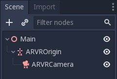

.. _doc_vr_primer:

AR/VR primer
============

This tutorial gives you a springboard into the world of AR and VR in the Godot game engine.

A new architecture was introduced in Godot 3 called the AR/VR Server. On top of this architecture, specific implementations are available as interfaces, most of which are plugins based on GDNative.
This tutorial focuses purely on the core elements abstracted by the core architecture. This architecture has enough features for you to create an entire VR experience that can then be deployed for various interfaces. However, each platform often has some unique features that are impossible to abstract. Such features will be documented on the relevant interfaces and fall outside of the scope of this primer.

AR/VR server
------------

When Godot starts, each available interface will make itself known to the AR/VR server. GDNative interfaces are setup as singletons; as long as they are added to the list of GDNative singletons in your project, they will make themselves known to the server.

You can use the function :ref:`get_interfaces() <class_ARVRServer_method_get_interfaces>` to return a list of available interfaces, but for this tutorial, we're going to use the :ref:`native mobile VR interface <class_MobileVRInterface>` in our examples. This interface is a straightforward implementation that uses the 3DOF sensors on your phone for orientation and outputs a stereoscopic image to the screen. It is also available in the Godot core and outputs to screen on desktop, which makes it ideal for prototyping or a tutorial such as this one.

To enable an interface, you execute the following code:

.. tabs::
 .. code-tab:: gdscript GDScript

    var arvr_interface = ARVRServer.find_interface("Native mobile")
    if arvr_interface and arvr_interface.initialize():
        get_viewport().arvr = true

 .. code-tab:: csharp

    var arvrInterface = ARVRServer.FindInterface("Native mobile");
    if (arvrInterface != null && arvrInterface.Initialize())
    {
        GetViewport().Arvr = true;
    }

This code finds the interface we wish to use, initializes it and, if that is successful, binds the main viewport to the interface. This last step gives some control over the viewport to the interface, which automatically enables things like stereoscopic rendering on the viewport.

For our mobile VR interface, and any interface where the main input is directly displayed on screen, the main viewport needs to be the viewport where :ref:`arvr<class_Viewport_property_arvr>` is set to ``true``. But for interfaces that render on an externally attached device, you can use a secondary viewport. In the latter case, a viewport that shows its output on screen will show an undistorted version of the left eye, while showing the fully processed stereoscopic output on the device.

Finally, you should only initialize an interface once; switching scenes and reinitializing interfaces will just introduce a lot of overhead. If you want to turn the headset off temporarily, just disable the viewport or set :ref:`arvr<class_Viewport_property_arvr>` to ``false`` on the viewport. In most scenarios though, you wouldn't disable the headset once you're in VR, this can be disconcerting to the gamer.

New AR/VR nodes
---------------

Three new node types have been added for supporting AR and VR in Godot and one additional node type especially for AR. These are:

* :ref:`ARVROrigin <class_ARVROrigin>` - our origin point in the world
* :ref:`ARVRCamera <class_ARVRCamera>` - a special subclass of the camera, which is positionally tracked
* :ref:`ARVRController <class_ARVRController>` - a new spatial class, which tracks the location of a controller
* :ref:`ARVRAnchor <class_ARVRAnchor>` - an anchor point for an AR implementation mapping a real world location into your virtual world

The first two must exist in your scene for AR/VR to work and this tutorial focuses purely on them.

:ref:`ARVROrigin <class_ARVROrigin>` is an important node, you must have one and only one of these somewhere in your scene. This node maps the center of your real world tracking space to a location in your virtual world. Everything else is positionally tracked in relation to this point. Where this point lies exactly differs from one implementation to another, but the best example to understand how this node works is to take a look at a room scale location. While we have functions to adjust the point to center it on the player by default, the origin point will be the center location of the room you are in. As you physically walk around the room, the location of the HMD is tracked in relation to this center position and the tracking is mirror in the virtual world.

To keep things simple, when you physically move around your room, the ARVR Origin point stays where it is, the position of the camera and controllers will be adjusted according to your movements.
When you move through the virtual world, either through controller input or when you implement a teleport system, it is the position of the origin point which you will have to adjust.

:ref:`ARVRCamera <class_ARVRCamera>` is the second node that must always be a part of your scene and it must always be a child node of your origin node. It is a subclass of Godot's normal camera. However, its position is automatically updated each frame based on the physical orientation and position of the HMD. Also due to the precision required for rendering to an HMD or rendering an AR overlay over a real world camera, most of the standard camera properties are ignored. The only properties of the camera that are used are the near and far plane settings. The FOV, aspect ratio and projection mode are all ignored.

Note that, for our native mobile VR implementation, there is no positional tracking, only the orientation of the phone and by extension, the HMD is tracked. This implementation artificially places the camera at a height (Y) of 1.85.

Conclusion: your minimum setup in your scene to make AR or VR work should look like this:

And that's all you need to get started. Obviously, you need to add something more into your scene, so there is something to see, but after that, you can export the game to your phone of choice, pop it into a viewer and away you go.

Other things to consider
------------------------

There are a few other subjects that we need to briefly touch upon in this primer that are important to know.

The first are our units. In normal 3D games, you don't have to think a lot about units. As long as everything is at the same scale, a box sized 1 unit by 1 unit by 1 unit can be any size from a cube you can hold in your hand to something the size of a building.
In AR and VR, this changes because things in your virtual world are mapped to things in the real world. If you step 1 meter forward in the real world, but you only move 1 cm forward in your virtual world, you have a problem. The same with the position of your controllers; if they don't appear in the right relative space, it breaks the immersion for the player.
Most VR platforms, including our AR/VR Server, assume that 1 unit = 1 meter. The AR/VR server, however, has a property that, for convenience, is also exposed on the ARVROrigin node called world scale. For instance, setting this to a value of 10 changes our coordinate system so 10 units = 1 meter.

Performance is another thing that needs to be carefully considered. Especially VR taxes your game a lot more than most people realize. For mobile VR, you have to be extra careful here, but even for desktop games, there are three factors that make life extra difficult:

* You are rendering stereoscopic, two for the price of one. While not exactly doubling the work load and with things in the pipeline such as supporting the new MultiView OpenGL extension in mind, there still is an extra workload in rendering images for both eyes
* A normal game will run acceptably on 30fps and ideally manages 60fps. That gives you a big range to play with between lower end and higher end hardware. For any HMD application of AR or VR, however, 60fps is the absolute minimum and you should target your games to run at a stable 90fps to ensure your users don't get motion sickness right off the bat.
* The high FOV and related lens distortion effect require many VR experiences to render at double the resolution. Yes a VIVE may only have a resolution of 1080x1200 per eye, we're rendering each eye at 2160x2400 as a result. This is less of an issue for most AR applications.

All in all, the workload your GPU has in comparison with a normal 3D game is a fair amount higher. While things are in the pipeline to improve this, such as MultiView and foveated rendering, these aren't supported on all devices. This is why you see many VR games using a more art style and if you pay close attention to those VR games that go for realism, you'll probably notice they're a bit more conservative on the effects or use some good old optical trickery.
