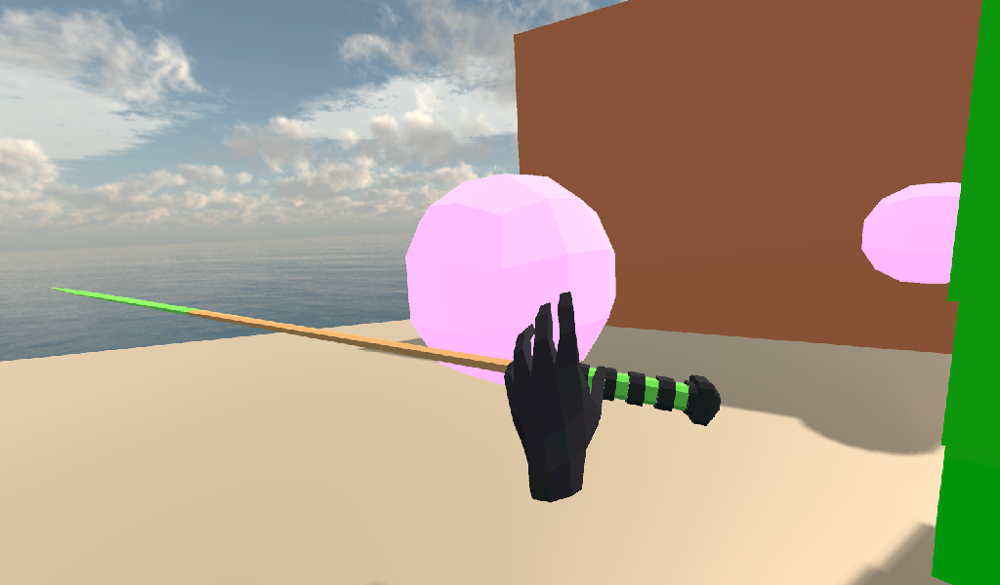
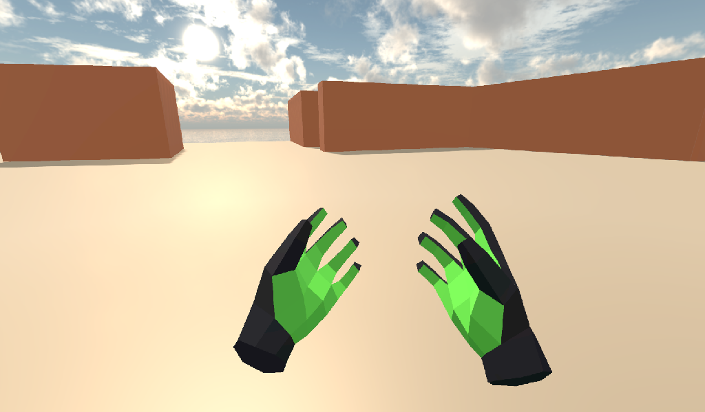
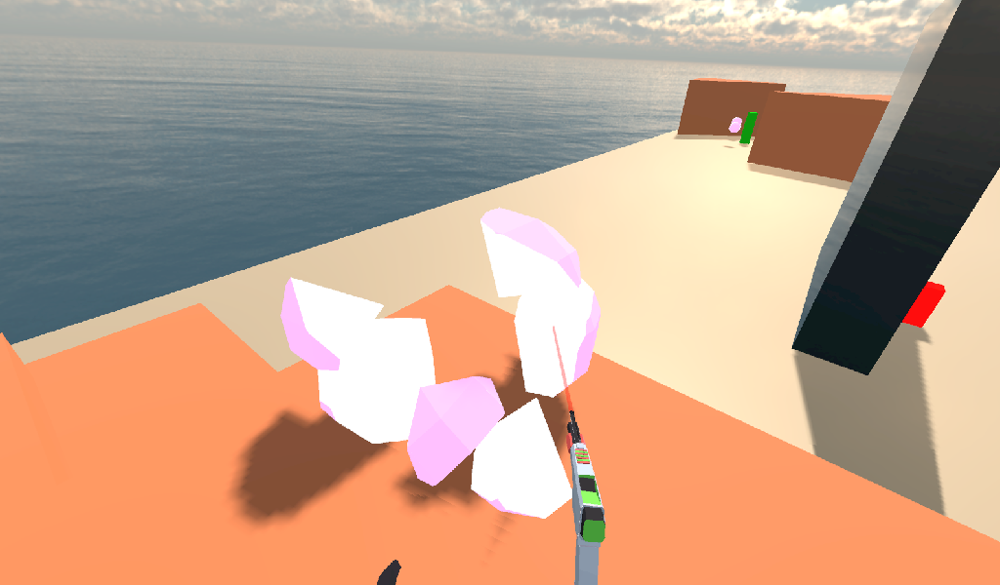

.. _doc_vr_starter_tutorial:

VR starter tutorial
===================

Introduction
------------

This tutorial series will show you how to make a simple VR game/project. The intent of this tutorial is to give you an idea
on how to make VR games in Godot.

Keep in mind, **one of the most important things when making VR content is getting the scale of your assets correct**!
It can take lots of practice and iterations to get this right, but there are a few things you can do to make it easier:

- In VR, 1 unit is often considered 1 meter. If you design your assets around that standard, you can save yourself a lot of headache.
- In your 3D model program, see if there is a way to measure and use real world distances. In Blender you can use the MeasureIt add-on, in Maya you can use the Measure Tool.
- You can make rough models using a tool like Google Blocks, and then refine in another 3D modelling program.
- Test often, as the assets can look dramatically different in VR then on a flat screen!

Throughout the course of this tutorial, we will cover:

- How to tell Godot to run in VR.
- How to make a teleportation system for moving the player.
- How to make a directional movement system (locomotion) for moving the player.
- How to make a :ref:`RigidBody <class_RigidBody>` based pick up and drop system.
- How to make various items that can be used in VR

.. note:: While this tutorial can be completed by beginners, it is highly
          advised to complete :ref:`doc_your_first_game`,
          if you are new to Godot and/or game development and have some experience with making 3D games
          **before** going through this tutorial series.

          This tutorial assumes you know have experience working with the Godot editor,
          have basic programming experience in GDScript, and have basic 3D game development experience.
          
          Also, it is assumed you have both a OpenVR ready headset and two OpenVR ready controllers! This tutorial was written using a Windows Mixed Reality headset on Windows 10,
          so the tutorial is written to work on that. You may need to adjust and/or the code to work with other VR headsets like the Oculus Rift, or the HTC Vive.

You can find the start assets for this tutorial here: :download:`VR_Starter_Tutorial_Start.zip <files/VR_Starter_Tutorial_Start.zip>`

The provided starter assets contain some 3D models, Sounds, and a few scenes already set up and configured for this tutorial.

Feel free to use these assets however you want! All original assets belong to the Godot community, with the other assets belonging to those listed below:

.. note:: The skybox is created by **CGTuts** and is a ocean HDRI freebie, which you can find here: https://cgi.tutsplus.com/articles/freebie-8-awesome-ocean-hdris--cg-5684

          The font used is **Titillium-Regular**, and is licensed under the ``SIL Open Font License, Version 1.1``.
          
          The audio used are from several different sources, all **downloaded from the Sonnis #GameAudioGDC Bundle**. The license for the sound effects is included as a PDF,
          and you can find at this link: (https://sonniss.com/gdc-bundle-license/).
          The folders where the audio files are stored have the same name as folders in the bundle.
          
          The **OpenVR addon** is created by Bastiaan Olij, and is released under the MIT license, and can be found both on the Godot Asset Library, and here on
          Github: https://github.com/GodotVR/godot-openvr-asset
          
          Everything else is original and created solely for this tutorial by TwistedTwigleg. They are released under the MIT license, so feel free to use however you see fit!

.. tip:: You can find the finished project at the bottom of this page

Getting everything ready
------------------------

Launch Godot and open up the project included in the starter assets.

.. note:: While these assets are not necessarily required to use the scripts provided in this tutorial,
          they will make the tutorial much easier to follow as there are several pre-setup scenes we
          will be using throughout the tutorial series.

First, you may notice there is already quite a bit set up. This includes A pre-built level, several instanced scenes placed around,
some background music, and several GUI related :ref:`MeshInstances <class_MeshInstance>` nodes.

You may notice that the GUI related meshes already have a script attached to them, and this is simply used to show whatever is inside the :ref:`Viewport <class_Viewport>`
on the mesh. Feel free to take a look if you want, but this tutorial will not be going over how to use the :ref:`Viewport <class_Viewport>` nodes for making 3D GUI
:ref:`MeshInstance <class_MeshInstance>` nodes. 

The other thing to notice before we jump in to writing the code is how the :ref:`ARVROrigin <class_ARVROrigin>` node works. How it works is kind of hard to explain,
especially if you have never used VR before, but here is the gist of it:
The :ref:`ARVROrigin <class_ARVROrigin>` node is the center point of the room. If there is no room scale tracking, then the :ref:`ARVROrigin <class_ARVROrigin>` will
be directly below the player, but if there is room scale tracking, then the :ref:`ARVROrigin <class_ARVROrigin>` will be the center of the tracked room.

.. note:: This is a bit of a simplification, and honestly, I do not know enough about the various different VR headsets and how they work to give a more detailed
          and complete explanation. The simple way is to look at it like this: The :ref:`ARVROrigin <class_ARVROrigin>` is the center of the VR world. If there is
          room tracking, the player can move away from the center point, the :ref:`ARVROrigin <class_ARVROrigin>` node, but only as far as the room scaling tracks.

If you select the :ref:`ARVROrigin <class_ARVROrigin>` node, you may notice that the world scale is set to ``1.4``. This is because I originally made the world too big,
and so I needed to scale the VR player slightly so they better fit the world. As mentioned earlier, keeping the scale relatively constant is very important!
          
Another thing to notice here is how we have everything set up under the :ref:`ARVROrigin <class_ARVROrigin>` node. The player camera is a :ref:`ARVRCamera <class_ARVRCamera>`
that represents the player's head in the game. The :ref:`ARVRCamera <class_ARVRCamera>` will be offset by the player's height, and if there is room tracking, then the camera
can move around 3D space as well, relative to the :ref:`ARVROrigin <class_ARVROrigin>`. This is important to note, especially for later when we add teleporting.

Notice how there is a :ref:`ColorRect <class_ColorRect>` node called ``Movement_Vignette``. This will be a vignette shader that will only be visible when the player is moving.
We are going to use the vignette shader to help reduce motion sickness while moving in VR.
The reason it is a child of :ref:`ARVROrigin <class_ARVROrigin>` is because we want it to easily access the VR controllers.

The final thing to note is that there are two :ref:`ARVRController <class_ARVRController>` nodes, and these will represent the left and right controllers in 3D space.
A :ref:`ARVRController <class_ARVRController>` with an ID of ``1`` is the left hand, while a :ref:`ARVRController <class_ARVRController>` with an ID of ``2`` is the right hand.

Starting VR
-----------

First, let's get the VR up and going! While ``Game.tscn`` is open, select the ``Game`` node and make a new script called ``Game.gd``. Add the following code:

::
    
    extends Spatial
    
    func _ready():
        var VR = ARVRServer.find_interface("OpenVR")
        if VR and VR.initialize():
            get_viewport().arvr = true
            get_viewport().hdr = false
            
            OS.vsync_enabled = false
            Engine.target_fps = 90
            # Also, the physics FPS in the project settings is also 90 FPS. This makes the physics
            # run at the same frame rate as the display, which makes things look smoother in VR!

Now, for this to work you will need to have the OpenVR asset from the Godot asset library. The OpenVR asset is included in the starter assets, but there may be newer
versions that work better, so I would highly suggest deleting the ``addons`` folder, going to the asset library, searching for ``OpenVR``, and downloading the newest
version from Bastiaan-Olij/Mux213!

With that done, let's quickly go over what this script does.

First, we find a VR interface from the ARVR server. We do this because by default Godot does not include any VR interfaces, but rather exposes a API so anyone can make
AR/VR interfaces with GDNative/C++. Next, we check to see if a OpenVR interface was found, and then we initialize it.

Assuming nothing went wrong with initializing, we then turn the main :ref:`Viewport <class_Viewport>` into a AR/VR viewport, by setting ``arvr`` to ``true``.
We also set HDR to ``false``, since in OpenVR you cannot use HDR.

Then we disable VSync and set the target FPS to ``90`` frames per second. ``90`` FPS is what most VR headsets run at, and since the game will both display
on the VR headset and on the computer's monitor, we want to disable VSync and set the target FPS manually so the computer's monitor does not drag the VR display down to 60 FPS.

.. note:: One thing to notice as well is that the physics FPS is also set to ``90``! This makes the physics run at the same frame rate as the display, which makes
          things look smoother in VR.

          
With that done, go ahead and give the game a try! If everything goes well, you will now be able to look around the world! If you have a VR headset with room tracking,
you will be able to move around as far as the room tracking allows.

Coding the controllers
----------------------

While perhaps interesting if we were making a VR film, we really want to do more than stand around and look. Currently we cannot move outside of the room tracking boundaries
(assuming your VR headset has room tracking) and we cannot interact with anything! Let's change that!

You may have noticed that you have a pair of green and black hands following the controllers. Now let's write the code for those controllers, which will allow the player to teleport
around the world and allow the player to grab and release :ref:`RigidBody <class_RigidBody>` nodes.

Open either ``Left_Controller.tscn`` or ``Right_Controller.tscn``.

Feel free to look at how the scene is set up. There is only a couple things of note to point out.

First, notice how there is a couple :ref:`Raycast <class_Raycast>` nodes. We will be using one :ref:`Raycast <class_Raycast>` to teleport around the game world (``Raycast``) and
we will use the other for picking up objects (``GrabCast``) if the player is using :ref:`Raycast <class_Raycast>` nodes to pick up objects.

The other thing to note is how there is an :ref:`Area <class_Area>`, simply called ``Area``, that is a small sphere in the palm of the hand. This will be used to detect
objects the player can pick up with that hand if the player is using :ref:`Area <class_Area>` nodes to pick up objects.

We also have a larger :ref:`Area <class_Area>` called ``Sleep_Area``, which will simply be used to wake :ref:`RigidBody <class_RigidBody>` nodes when the hands get close.

Select the root node, either ``Left_Controller`` or ``Right_Controller`` depending on which scene you chose, and create a new script called ``VR_Controller.gd``.
Add the following to ``VR_Controller.gd``:

::
    
    extends ARVRController

    var controller_velocity = Vector3(0,0,0)
    var prior_controller_position = Vector3(0,0,0)
    var prior_controller_velocities = []

    var held_object = null
    var held_object_data = {"mode":RigidBody.MODE_RIGID, "layer":1, "mask":1}

    var grab_area
    var grab_raycast
    var grab_mode = "AREA"
    var grab_pos_node

    var hand_mesh

    var teleport_pos
    var teleport_mesh
    var teleport_button_down
    var teleport_raycast

    const CONTROLLER_DEADZONE = 0.65

    const MOVEMENT_SPEED = 1.5

    var directional_movement = false

    func _ready():
        teleport_raycast = get_node("RayCast")
        teleport_mesh = get_tree().root.get_node("Game/Teleport_Mesh")
        teleport_button_down = false
        
        grab_area = get_node("Area")
        grab_raycast = get_node("GrabCast")
        grab_pos_node = get_node("Grab_Pos")
        grab_mode = "AREA"
        
        get_node("Sleep_Area").connect("body_entered", self, "sleep_area_entered")
        get_node("Sleep_Area").connect("body_exited", self, "sleep_area_exited")
        
        hand_mesh = get_node("Hand")
        
        connect("button_pressed", self, "button_pressed")
        connect("button_release", self, "button_released")

    func _physics_process(delta):
        
        if teleport_button_down == true:
            teleport_raycast.force_raycast_update()
            if teleport_raycast.is_colliding():
                if teleport_raycast.get_collider() is StaticBody:
                    if teleport_raycast.get_collision_normal().y >= 0.85:
                        teleport_pos = teleport_raycast.get_collision_point()
                        teleport_mesh.global_transform.origin = teleport_pos
        
        
        # Controller velocity
        # --------------------
        if get_is_active() == true:
            
            controller_velocity = Vector3(0,0,0)
            
            if prior_controller_velocities.size() > 0:
                for vel in prior_controller_velocities:
                    controller_velocity += vel
                
                # Get the average velocity, instead of just adding them together.
                controller_velocity = controller_velocity / prior_controller_velocities.size()
            
            prior_controller_velocities.append((global_transform.origin - prior_controller_position) / delta)
            
            controller_velocity += (global_transform.origin - prior_controller_position) / delta
            prior_controller_position = global_transform.origin
            
            if prior_controller_velocities.size() > 30:
                prior_controller_velocities.remove(0)
        
        # --------------------
        
        if held_object != null:
            var held_scale = held_object.scale
            held_object.global_transform = grab_pos_node.global_transform
            held_object.scale = held_scale
        
        
        # Directional movement
        # --------------------
        # NOTE: you may need to change this depending on which VR controllers
        # you are using and which OS you are on.
        var trackpad_vector = Vector2(-get_joystick_axis(1), get_joystick_axis(0))
        var joystick_vector = Vector2(-get_joystick_axis(5), get_joystick_axis(4))
        
        if trackpad_vector.length() < CONTROLLER_DEADZONE:
            trackpad_vector = Vector2(0,0)
        else:
            trackpad_vector = trackpad_vector.normalized() * ((trackpad_vector.length() - CONTROLLER_DEADZONE) / (1 - CONTROLLER_DEADZONE))
        
        if joystick_vector.length() < CONTROLLER_DEADZONE:
            joystick_vector = Vector2(0,0)
        else:
            joystick_vector = joystick_vector.normalized() * ((joystick_vector.length() - CONTROLLER_DEADZONE) / (1 - CONTROLLER_DEADZONE))
        
        var forward_direction = get_parent().get_node("Player_Camera").global_transform.basis.z.normalized()
        var right_direction = get_parent().get_node("Player_Camera").global_transform.basis.x.normalized()
        
        var movement_vector = (trackpad_vector + joystick_vector).normalized()
        
        var movement_forward = forward_direction * movement_vector.x * delta * MOVEMENT_SPEED
        var movement_right = right_direction * movement_vector.y * delta * MOVEMENT_SPEED
        
        movement_forward.y = 0
        movement_right.y = 0
        
        if (movement_right.length() > 0 or movement_forward.length() > 0):
            get_parent().translate(movement_right + movement_forward)
            directional_movement = true
        else:
            directional_movement = false
        # --------------------

    func button_pressed(button_index):
        
        # If the trigger is pressed...
        if button_index == 15:
            if held_object != null:
                if held_object.has_method("interact"):
                    held_object.interact()
            
            else:
                if teleport_mesh.visible == false and held_object == null:
                    teleport_button_down = true
                    teleport_mesh.visible = true
                    teleport_raycast.visible = true
        
        
        # If the grab button is pressed...
        if button_index == 2:
            
            if (teleport_button_down == true):
                return
            
            if held_object == null:
                
                var rigid_body = null
                
                if (grab_mode == "AREA"):
                    var bodies = grab_area.get_overlapping_bodies()
                    if len(bodies) > 0:
                        
                        for body in bodies:
                            if body is RigidBody:
                                if !("NO_PICKUP" in body):
                                    rigid_body = body
                                    break
                
                elif (grab_mode == "RAYCAST"):
                    grab_raycast.force_raycast_update()
                    if (grab_raycast.is_colliding()):
                        if grab_raycast.get_collider() is RigidBody and !("NO_PICKUP" in grab_raycast.get_collider()):
                            rigid_body = grab_raycast.get_collider()
                
                
                if rigid_body != null:
                    
                    held_object = rigid_body
                    
                    held_object_data["mode"] = held_object.mode
                    held_object_data["layer"] = held_object.collision_layer
                    held_object_data["mask"] = held_object.collision_mask
                    
                    held_object.mode = RigidBody.MODE_STATIC
                    held_object.collision_layer = 0
                    held_object.collision_mask = 0
                    
                    hand_mesh.visible = false
                    grab_raycast.visible = false
                    
                    if (held_object.has_method("picked_up")):
                        held_object.picked_up()
                    if ("controller" in held_object):
                        held_object.controller = self
            
            
            else:
                
                held_object.mode = held_object_data["mode"]
                held_object.collision_layer = held_object_data["layer"]
                held_object.collision_mask = held_object_data["mask"]
                
                held_object.apply_impulse(Vector3(0, 0, 0), controller_velocity)
                
                if held_object.has_method("dropped"):
                    held_object.dropped()
                
                if "controller" in held_object:
                    held_object.controller = null
                
                held_object = null
                hand_mesh.visible = true
                
                if (grab_mode == "RAYCAST"):
                    grab_raycast.visible = true
                
            
            get_node("AudioStreamPlayer3D").play(0)
        
        
        # If the menu button is pressed...
        if button_index == 1:
            if grab_mode == "AREA":
                grab_mode = "RAYCAST"
                
                if held_object == null:
                    grab_raycast.visible = true
            elif grab_mode == "RAYCAST":
                grab_mode = "AREA"
                grab_raycast.visible = false

    func button_released(button_index):
        
        # If the trigger button is released...
        if button_index == 15:
            
            if (teleport_button_down == true):
                
                if teleport_pos != null and teleport_mesh.visible == true:
                    var camera_offset = get_parent().get_node("Player_Camera").global_transform.origin - get_parent().global_transform.origin
                    camera_offset.y = 0
                    
                    get_parent().global_transform.origin = teleport_pos - camera_offset
                
                teleport_button_down = false
                teleport_mesh.visible = false
                teleport_raycast.visible = false
                teleport_pos = null

    func sleep_area_entered(body):
        if "can_sleep" in body:
            body.can_sleep = false
            body.sleeping = false

    func sleep_area_exited(body):
        if "can_sleep" in body:
            body.can_sleep = true

This is quite a bit of code (``245`` lines to be exact) of code to go through, so let's break it down bit by bit. First, let's start with the class variables, which are
variables outside of any/all functions.

- ``controller_velocity`` : The velocity the controller is moving at. We will calculate this by changes in position every physics frame.
- ``prior_controller_position`` : The controller's previous position. We will use this to calculate the controller's velocity.
- ``prior_controller_velocities`` : The last ``30`` calculated velocities (1/3 of a second worth of velocities, assuming the game is running at ``90`` FPS)
- ``held_object`` : The currently held object, a :ref:`RigidBody <class_RigidBody>`, if there is one.
- ``held_object_data`` : The data of the currently held object, used to reset the object when it is no longer being held.
- ``grab_area`` : The :ref:`Area <class_Area>` node used to grab objects.
- ``grab_pos_node`` : The position where held objects stay.
- ``hand_mesh`` : The hand mesh, used to represent the player's hand when they are not holding anything.
- ``teleport_pos`` : The position the teleport :ref:`Raycast <class_Raycast>` is aimed at.
- ``teleport_mesh`` : The meshed used to represent the teleport position.
- ``teleport_button_down`` : A variable for tracking whether the teleport button is being held down or not.
- ``teleport_raycast`` : The teleport :ref:`Raycast <class_Raycast>` node, used for calculating the teleportation position.
- ``CONTROLLER_DEADZONE`` : The dead zone for both the trackpad and the joystick.
- ``MOVEMENT_SPEED`` : The speed the player moves at when moving using the trackpad and/or the joystick.
- ``directional_movement`` : A boolean to track whether the player is moving using this controller.

_________

Next, let's go through ``_ready``.

First we get the teleport :ref:`Raycast <class_Raycast>` node and assign it to ``teleport_raycast``.

Next we get the teleport mesh, and notice how we are getting it from ``Game/Teleport_Mesh`` using ``get_tree().root``. This is because we need the teleport mesh
to be separate from the controller, so moving and rotating the controller does not effect the position and rotation of the teleporation mesh.

Then we get the grab area, grab :ref:`Raycast <class_Raycast>`, and position node and assign them to the proper variables.

We set the default grab mode to ``AREA`` so it uses the :ref:`Area <class_Area>` node to grab objects by default.

Then we connect the ``body_entered`` and ``body_exited`` signals from the sleep area node, we get the hand mesh and assign it the proper variable, and finally
we connect the ``button_pressed`` and ``button_released`` signals from the :ref:`ARVRController <class_ARVRController>`.

_________

Now let's go through ``_physics_process``.

First we check to see if the teleportation button is down or not. If the teleportation button is down, we then force the teleportation :ref:`Raycast <class_Raycast>`
to update, which will give us frame perfect collision detection. We then check to see if the :ref:`Raycast <class_Raycast>` is colliding with anything.

Next, we check to see if the collision body the :ref:`Raycast <class_Raycast>` is colliding with is a :ref:`StaticBody <class_StaticBody>`. We do this to ensures the player
can only teleport on :ref:`StaticBody <class_StaticBody>` nodes. We then check to see if the ``Y`` value returned by the :ref:`Raycast <class_Raycast>`'s
``get_collision_normal`` function is more than ``0.85``, which is mostly pointing straight up. This allows the player only to teleport on fairly flat faces pointing upwards.

If all those checks for the teleport :ref:`Raycast <class_Raycast>` return true, we then set ``teleport_pos`` to the collision point, and we move the teleportation
mesh to ``teleport_pos``.

The next thing we check is to see if the :ref:`ARVRController <class_ARVRController>` is active or not. If the :ref:`ARVRController <class_ARVRController>` is active, then
that means there is a controller and it is being tracked. If the controller is active, we then reset ``controller_velocity`` to a empty :ref:`Vector3 <class_Vector3>`.

We then add all of the prior velocity calculations in ``prior_controller_velocities`` to ``controller_velocity``. By using the prior calculations, we get a smoother
throwing/catching experience, though it is not perfect. We want to get the average of these velocities, as otherwise we'd get crazy high velocity numbers that are not realistic.

Next we calculate the velocity from the position the controller currently is, from the position the controller was at. We can use this difference in position to help track
the controller's velocity.

We then add the velocity from the controller this physics frame and the last physics frame to ``controller_velocity``. We then update ``prior_controller_position`` to the
current position, so we can use it in the calculations in the velocity next physics frame.

.. note:: The way we are calculating velocity is not perfect by any means, since it relies on a consistent amount of frames per second.
          Ideally we would be able to find the velocity directly from the VR controller but currently in OpenVR there is not way to access the controller's velocity.
          We can get pretty close to the real velocity by comparing positions between frames though, and this will work just fine for this project.
            
Then we check to see if we have more than ``30`` stored velocities (more than a third of a second). If there are more than ``30``, we remove the oldest velocity
from ``prior_controller_velocities``.

Next we check to see if there is a held object. If there is, we update the position and rotation of the held object to the
position and rotation of ``grab_pos_node``. Because of how scale works, we need to temporarily store the scale and then reset the scale once we have updated the transform, as
otherwise the scale will always be the same as the controller, which will break the immersion if the player grabs a scaled object.

The last thing we are going to do in ``_physics_process`` is move the player if they are moving the trackpad/joystick on the VR controller.

First, we convert the axis values into :ref:`Vector2 <class_Vector2>` variables so we can process them. We invert the X axis so moving the trackpad/joystick left
will move the player left.

.. note:: Depending on your VR controller and OS, you may need to change the code so it gets the proper axis values!

Next we account for dead zones on both the trackpad and the joystick. The code for doing this is adapted from the link below, and I would highly recommend looking at it.

.. tip:: You can find a great article explaining joystick deads zone here: http://www.third-helix.com/2013/04/12/doing-thumbstick-dead-zones-right.html

One thing to note is how large we are making the dead zones. The reason we are using such large dead zones is to the player cannot move themselves accidentaly by placing their
finger on the center of the touchpad/joystick, which make players feel motion sick if they are not expecting it.

Next, we get the forward and right directional vectors from the VR camera. We need these so we can move the player forward/backwards and right/left based on where
they are currently looking.

Then we calculate how much the player will be moving by adding both the trackpad and the joystick vectors together and normalizing them.

Next we calculate how far the player will go forwards/backwards and right/left by multiplying the VR camera's directional vectors by the combined trackpad/joystick vector.

We then remove movement on the Y axis so the player cannot fly/fall simply by moving using the trackpad/joystick.

And finally, we move the player if there is any movement forwards/backwards or right/left. If we are moving the player, we set ``directional_movement`` accordingly.

_________

Now, let's look at ``button_pressed``.

If the button pressed is button ``15``, which for the Windows Mixed Reality controllers is the trigger button, we will interact with the held object assuming the
controller is holding one, and if the player is not holding a object, we will try to start teleporting.

If the controller is holding a object, and the held object has a method/function called ``interact``, we call the ``interact`` function
on the held object.

If the controller is not holding a object, we then check to make sure the teleportation mesh is not visible. This check ensure the player cannot teleport cannot teleport with
both hands/controllers at the same time. If the teleportation mesh is not visible, we set ``teleport_button_down`` to ``true``, make ``teleport_mesh`` visible,
and make the teleportation raycast visible. This makes it where the teleportation mesh will follow the :ref:`Raycast <class_Raycast>` coming from the pointer
finger of the hand.

If the button pressed is button ``2``, which for the Windows Mixed Reality controllers is the grab/grip button, we will grab/throw a object.

First, we make sure the player is not trying to teleport, as we do not want the player to be able to grab something while in the middle of trying to teleport.

Then we check to see if the controller is already holding a object or not.

If the controller is not holding a object, we check to see which grab mode the player is using.

If the player is using the ``AREA`` grab mode, we then get all of the bodies overlapping the grab :ref:`Area <class_Area>`. We go through all of the bodies in the
grab :ref:`Area <class_Area>` and see if there is a :ref:`RigidBody <class_RigidBody>`. We also check to make sure any :ref:`RigidBody <class_RigidBody>` nodes in
the :ref:`Area <class_Area>` do not have a variable called ``NO_PICKUP``, since we do not want to be able to pick up nodes with that variable.

Assuming there is a :ref:`RigidBody <class_RigidBody>` node inside the grab :ref:`Area <class_Area>` that does not have a variable called ``NO_PICKUP``,
we assign it to ``rigid_body`` for additional processing.

If the player is using the ``RAYCAST`` grab mode, we first force the :ref:`Raycast <class_Raycast>` to update. We then check to see if the :ref:`Raycast <class_Raycast>`
is colliding with something.

If the :ref:`Raycast <class_Raycast>` is colliding with something, we then check to see if what is colliding with is a :ref:`RigidBody <class_RigidBody>`, and that it does not have
a variable called ``NO_PICKUP``. If the :ref:`Raycast <class_Raycast>` is colliding with a :ref:`RigidBody <class_RigidBody>`, and it does not have a
variable called ``NO_PICKUP``, we assign it to ``rigid_body`` for additional processing.

If ``rigid_body`` is not ``null``, meaning we found a :ref:`RigidBody <class_RigidBody>` in the grab :ref:`Area <class_Area>`, we assign ``held_object`` to it.
Then we store the now held :ref:`RigidBody <class_RigidBody>`'s information in ``held_object_data``. We are storing the :ref:`RigidBody <class_RigidBody>` mode, layer,
and mask so later when we drop it, we can reset all of those variables back to what they were before we picked up the :ref:`RigidBody <class_RigidBody>`.

We then set the held object's :ref:`RigidBody <class_RigidBody>` mode to ``MODE_STATIC`` and set the collision layer and mask to ``0`` so it cannot collide with any
other physic bodies.

We make the hand mesh invisible so it does not get in the way of the object we are holding (and also because I did not feel like animating the hand :P ). We also make the
grab :ref:`Raycast <class_Raycast>` invisible so the mesh used for showing the :ref:`Raycast <class_Raycast>` is no longer visible.

If the :ref:`RigidBody <class_RigidBody>` we picked up has the ``picked_up`` method/function, we call it. If the :ref:`RigidBody <class_RigidBody>` we picked up has a
variable called ``controller``, we set it to this controller.

If the controller is not holding a object, and the button pressed is ``2``, we want to drop/throw the held object.

First, we set the held :ref:`RigidBody <class_RigidBody>`'s mode, layer, and mask back to what they were when we picked the object up.
We then apply a impulse to the held object, using the controller's velocity as the force.

If the previously held :ref:`RigidBody <class_RigidBody>` has a function called ``dropped``, we call it. If the :ref:`RigidBody <class_RigidBody>` has a variable
called ``controller`` we set it to ``null``.

Then we set ``held_object`` to ``null``, since we are no longer holding any objects, and we make the hand mesh visible again.

If we are using the ``RAYCAST`` grab mode, we make the :ref:`Raycast <class_Raycast>` visible so we can see the mesh used for showing the grab :ref:`Raycast <class_Raycast>`.

Finally, regardless of whether we are grabbing a object or releasing it, we play the sound loaded into ``AudioStreamPlayer3D``, which is a pick-up/drop noise.

The last thing we are doing in ``button_pressed`` is checking to see if the button pressed is ``1``, which for the Windows Mixed Reality controllers is the menu button.

If the menu button is pressed, we change grab modes, and set the visibility of the grab :ref:`Raycast <class_Raycast>` so it is only visible when using ``RAYCAST`` as the grab mode.

_________

Let's look at ``button_released`` next.

If the button released is button ``15``, the trigger, then we potentially want to teleport.

First, we check to see if ``teleport_button_down`` is ``true``. If it is, that means the player is intending to teleport, while if it is ``false``, the player
has simply released the trigger while holding a object.

We then check to see if this controller has a teleport position, and we check to make sure the teleport mesh is visible.

If both of those conditions are ``true``, we then calculate the offset the :ref:`ARVRCamera <class_ARVRCamera>` has from the :ref:`ARVROrigin <class_ARVROrigin>`. We do this
because of how :ref:`ARVRCamera <class_ARVRCamera>` and :ref:`ARVROrigin <class_ARVROrigin>` work with room scale tracking.

Because we want to teleport the player in their current position to the teleport position, and remember because of room scale tracking their current position can be offset from
the origin, we have to figure out that offset so when we teleport we can remove it so that player's current position is teleported to the teleport position.

We set the Y value of the camera_offset to zero because we do not want to account for offsets in the player's height.

Then we teleport the :ref:`ARVROrigin <class_ARVROrigin>` to the teleport position, applying the camera offset.

Regardless of whether we teleported or not, we reset all of the teleport related variables so the controller has to get new ones before teleporting again.

_________

Finally, let's look at ``sleep_area_entered`` and ``sleep_area_exited``.

When a body enters or exists the sleep area, we check to see if it has a variable called ``can_sleep``. If it does, we then set it to ``false`` and wake the body if it has entered
the sleep area, while if it has exited we set it to ``true`` so the :ref:`RigidBody <class_RigidBody>` nodes can sleep (and so we save some performance!)

_________

Okay, phew! That was a lot of code! Add the same script, ``VR_Controller.gd`` to the other controller so both controllers have the same script.

Now go ahead and try the game again, and you should find you can teleport around by pressing the touch pad, and can grab and throw objects
using the grab/grip buttons.

Now, you may want to try moving using the trackpads and/or joysticks, but **it may make you motion sick!**

One of the main reasons this can make you feel motion sick is because your vision tells you that you are moving, while your body is not moving.
This conflict of signals makes the body feel sick, so lets fix it!

Reducing motion sickness
------------------------

.. note:: There are plenty of ways to reduce motion sickness in VR, and there is no one perfect way to reduce motion sickness. See:
          https://developer.oculus.com/design/latest/concepts/bp-locomotion/ for more information on how to implement locomotion, and how to
          reduce motion sickness.

To help reduce motion sickness while moving, we are going to add a vignette effect that will only be visible while the player moves.

Open up ``Movement_Vignette.tscn``, which you can find in the ``Scenes`` folder. Notice how it is just a :ref:`ColorRect <class_ColorRect>` node with a custom
shader. Feel free to look at the custom shader if you want, it is just a slightly modified version of the vignette shader you can find in the Godot demo repository.

With ``Movement_Vignette`` selected, make a new script called ``Movement_Vignette.gd``. Add the following code to ``Movement_Vignette.gd``:

::
    
    extends Control

    var controller_one
    var controller_two

    func _ready():
        yield(get_tree(), "idle_frame")
        yield(get_tree(), "idle_frame")
        yield(get_tree(), "idle_frame")
        yield(get_tree(), "idle_frame")
        
        var interface = ARVRServer.get_primary_interface()
        
        rect_size = interface.get_render_targetsize()
        rect_position = Vector2(0,0)
        
        controller_one = get_parent().get_node("Left_Controller")
        controller_two = get_parent().get_node("Right_Controller")
        
        visible = false

    func _process(delta):
        
        if (controller_one == null or controller_two == null):
            return
        
        if (controller_one.directional_movement == true or controller_two.directional_movement == true):
            visible = true
        else:
            visible = false

Because this script is fairly simple, let's quickly go over what it does.

In ``_ready``, we wait for four frames. We do this to ensure the VR interface is ready and going.

Next, we get the current VR interface, and resize the :ref:`ColorRect <class_ColorRect>` node's size and position so that it covers the entire view in VR.

Then we get the left and right controllers, assigning them to ``controller_one`` and ``controller_two``.

We then make the vignette invisible by default.

In ``_process`` we check to see if either of the controllers are moving the player by checking ``directional_movement``. If either controller is moving the player,
we make the vignette visible, while if neither controller is moving the player, we make the vignette invisible.

_________

With that done, go ahead and try moving around with the joystick and/or the trackpad. You should find it is much less motion sickness inducing than before!

Let's add some special :ref:`RigidBody <class_RigidBody>` nodes we can interact with next.

Adding destroyable targets
--------------------------

First, let's start by making some targets we will destroy in various different ways with various different special :ref:`RigidBody <class_RigidBody>` nodes.

Open up ``Sphere_Target.tscn``, which you can find in the ``Scenes`` folder. ``Sphere.tscn`` is just a :ref:`StaticBody <class_StaticBody>`
with a :ref:`CollisionShape <class_CollisionShape>`, a mesh, and a audio player.

Select the ``Sphere_Target`` root node, the :ref:`StaticBody <class_StaticBody>` node, and make a new script called ``Sphere_Target.gd``. Add the following
to ``Sphere_Target.gd``:

::
    
    extends Spatial

    var destroyed = false
    var destroyed_timer = 0
    const DESTROY_WAIT_TIME = 80

    var health = 80

    const RIGID_BODY_TARGET = preload("res://Assets/RigidBody_Sphere.scn")

    func _ready():
        set_physics_process(false)

    func _physics_process(delta):
        destroyed_timer += delta
        if destroyed_timer >= DESTROY_WAIT_TIME:
            queue_free()

    func damage(bullet_global_transform, damage):
        
        if destroyed == true:
            return
        
        health -= damage
        
        if health <= 0:
            
            get_node("CollisionShape").disabled = true
            get_node("Shpere_Target").visible = false
            
            var clone = RIGID_BODY_TARGET.instance()
            add_child(clone)
            clone.global_transform = global_transform
            
            destroyed = true
            set_physics_process(true)
            
            get_node("AudioStreamPlayer").play()
            get_tree().root.get_node("Game").remove_sphere()

            
Let's go over how this script works, starting with the class variables.

- ``destroyed`` : A variable to track if this target is destroyed or not.
- ``destroyed_timer`` : A variable to track how long the target has been destroyed.
- ``DESTROY_WAIT_TIME`` : A constant to tell the sphere target how long to wait before destroying/deleting itself.
- ``health`` : The amount of health the target has.
- ``RIGID_BODY_TARGET`` : The target broken into several smaller :ref:`RigidBody <class_RigidBody>` nodes.

________

Let's go over ``_ready``.

All we are doing in ``_ready`` is setting ``_physics_process`` to ``false``. This is because we will only use ``_physics_process``
for destroying the target, so we do not want to call it until the target is broken.

________

Next, let's go over ``_physics_process``.

First we add time to ``destroyed_timer``. Then we check to see if enough time has passed and we can destroy the target. If enough time has
passed, we free/destroy the target using ``queue_free``.

________

Finally, let's go over ``damage``.

First, we check to make sure the target has not already been destroyed.

Then, we remove however much damage the target has taken from the target's health.

If the target has zero or less health, then it has taken enough damage to break.

First, we disable the collision shape and make the whole target mesh invisible.
Next, we spawn/instance the :ref:`RigidBody <class_RigidBody>` version of the target, and instance it at this target's position.

Then we set ``destroyed`` to ``true`` and start processing ``_physics_process``.
Finally, we play a sound, and remove a sphere from ``Game.gd`` by calling ``remove_sphere``.

________

Now, you may have noticed we are calling a function in ``Game.gd`` we have not made yet, so let's fix that!

First, open up ``Game.gd`` and add the following additional class variables:

::
    
    var spheres_left = 10
    var sphere_ui = null

- ``spheres_left`` : The amount of sphere targets left in the game world.
- ``sphere_ui`` : A reference to the sphere UI. We will use this later!

Next, we need to add the ``remove_sphere`` function. Add the following to ``Game.gd``:

::
    
    func remove_sphere():
        spheres_left -= 1
        
        if sphere_ui != null:
            sphere_ui.update_ui(spheres_left)

What this function does is it removes one from ``spheres_left``.

Then it checks to see if ``sphere_ui`` is not null, and if it is not, then it calls it's ``update_ui`` function, passing in the amount of sphere's left.
We'll add the UI code later in this part.

Now that we have destroyable targets, we need a way to destroy them!

Adding a pistol
---------------

Okay, let's add a simple pistol.

Open up ``Pistol.tscn``, which you will find in the ``Scenes`` folder.

There is a few things to note here.

The first thing to note is how everything is rotated. This is to make the pistol rotate correctly when the player grabs it. The other thing to notice is
how there is a laser sight mesh, and a flash mesh, both of these do what you'd expect: act as a laser pointer and act as a muzzle flash respectively.

The other thing to notice is how there is a :ref:`Raycast <class_Raycast>` node at the end of the pistol. This is what we will be using to calculate where the bullets impact.

Now that we have looked at the scene, let's write the code. Select the ``Pistol`` root node, the :ref:`RigidBody <class_RigidBody>` node, and make a new
script called ``Pistol.gd``. Add the following code to ``Pistol.gd``:

::
    
    extends RigidBody

    var flash_mesh
    const FLASH_TIME = 0.25
    var flash_timer = 0

    var laser_sight_mesh

    var raycast
    var BULLET_DAMAGE = 20

    func _ready():
        
        flash_mesh = get_node("Pistol_Flash")
        flash_mesh.visible = false
        
        laser_sight_mesh = get_node("LaserSight")
        laser_sight_mesh.visible = false
        
        raycast = get_node("RayCast")

    func _physics_process(delta):
        if flash_timer > 0:
            flash_timer -= delta
            # If the flash has been visible enough, then make the flash mesh invisible.
            if flash_timer <= 0:
                flash_mesh.visible = false

    # Called when the interact button is pressed while the object is held.
    func interact():
        
        if flash_timer <= 0:
            
            flash_timer = FLASH_TIME
            flash_mesh.visible = true
            
            raycast.force_raycast_update()
            if raycast.is_colliding():
                
                var body = raycast.get_collider()
                
                if body.has_method("damage"):
                    body.damage(raycast.global_transform, BULLET_DAMAGE)
                elif body.has_method("apply_impulse"):
                    var direction_vector = raycast.global_transform.basis.z.normalized()
                    body.apply_impulse((raycast.global_transform.origin - body.global_transform.origin).normalized(), direction_vector * 1.2)
            
            get_node("AudioStreamPlayer3D").play()

    # Called when the object is picked up.
    func picked_up():
        laser_sight_mesh.visible = true

    # Called when the object is dropped.
    func dropped():
        laser_sight_mesh.visible = false

        
Let's go over what this script does, starting with the class variables:

- ``flash_mesh`` : The mesh used to make the muzzle flash.
- ``FLASH_TIME`` : The length of time the muzzle flash is visible.
- ``flash_timer``: A variable to track how long the muzzle flash has been visible.
- ``laser_sight_mesh``: A long rectangular mesh used for the laser sight.
- ``raycast``: The raycast node used for the pistol firing.
- ``BULLET_DAMAGE``: The amount of damage a single bullet does.

________

Let's go over ``_ready``.

All we are doing here is getting the nodes and assigning them to the proper variables. We also make sure the flash and laser
sight meshes are invisible.

________

Next, let's look at ``_physics_process``.

First, we check to see if the flash is visible. We do this by checking to see if ``flash_timer`` is more than zero. This is because ``flash_timer`` will be a inverted timer,
a timer that counts down instead of counting up.

If ``flash_timer`` is more than zero, we remove ``delta`` from it and check to see if it is equal to zero or less.
If it is, we make the flash mesh invisible.

This makes it where the flash mesh becomes invisible after ``FLASH_TIME`` many seconds has gone by.

________

Now let's look at ``interact``, which is called when the trigger button on the VR controller is pressed and the pistol is being held.

First, we check to see if the flash timer is less than or equal to zero. This check makes it where we cannot fire when the flash is visible, limiting how many bullets
the pistol can fire.

If we can fire, we reset ``flash_timer`` by setting it to ``FLASH_TIME``, and we make the flash mesh visible.

We then update the :ref:`Raycast <class_Raycast>` and check to see if it is colliding with anything.

If the :ref:`Raycast <class_Raycast>` is colliding with something, we get the collider. We check to see if the collider has the ``damage`` function, and if it does we call it.
If it does not, we then check to see if the collider has the ``apply_impulse`` function, and if it does, we call it after calculating the direction from the
:ref:`Raycast <class_Raycast>` to the collider.

Finally, regardless of whether the pistol hit something or not, we play the pistol firing sound.

________

Finally, let's look at ``picked_up`` and ``dropped``, which are called when the pistol is picked up and dropped respectively.

All we are doing in these functions is making the laser pointer visible when the pistol is picked up, and making it invisible when the pistol is dropped.

________

With that done, go ahead and give the game a try! If you climb up the stairs and grab the pistols, you should be able to fire at the spheres and they will break!

Adding a shotgun
----------------

Let's add a different type of shooting :ref:`RigidBody <class_RigidBody>`: A shotgun. This is fairly simple to do, and almost everything is the same as the pistol.

Open up ``Shotgun.tscn``, which you can find in ``Scenes``. Notice how everything is more or less the same, but instead of a single :ref:`Raycast <class_Raycast>`,
there are five, and there is no laser pointer.
This is because a shotgun generally fires in a cone shape, and so we are going to emulate that by having several :ref:`Raycast <class_Raycast>` nodes, all rotated randomly
in a cone shape, and for fun I removed the laser pointer so the player has to aim without knowing for sure where the shotgun is pointing.

Alright, select the ``Shotgun`` root node, the :ref:`RigidBody <class_RigidBody>` and make a new script called ``Shotgun.gd``. Add the following to ``Shotgun.gd``:

::
    
    extends RigidBody

    var flash_mesh
    const FLASH_TIME = 0.25
    var flash_timer = 0

    var raycasts
    var BULLET_DAMAGE = 30

    func _ready():
        flash_mesh = get_node("Shotgun_Flash")
        flash_mesh.visible = false
        
        raycasts = get_node("Raycasts")

    func _physics_process(delta):
        if flash_timer > 0:
            flash_timer -= delta
            if flash_timer <= 0:
                flash_mesh.visible = false

    # Called when the interact button is pressed while the object is held.
    func interact():
        
        if flash_timer <= 0:
            
            flash_timer = FLASH_TIME
            flash_mesh.visible = true
            
            for raycast in raycasts.get_children():
                
                raycast.rotation_degrees = Vector3(90 + rand_range(10, -10), 0, rand_range(10, -10))
                
                raycast.force_raycast_update()
                if raycast.is_colliding():
                    
                    var body = raycast.get_collider()
                    
                    # If the body has the damage method, then use that, otherwise use apply_impulse.
                    if body.has_method("damage"):
                        body.damage(raycast.global_transform, BULLET_DAMAGE)
                    elif body.has_method("apply_impulse"):
                        var direction_vector = raycast.global_transform.basis.z.normalized()
                        body.apply_impulse((raycast.global_transform.origin - body.global_transform.origin).normalized(), direction_vector * 4)
            
            get_node("AudioStreamPlayer3D").play()

    func picked_up():
        pass

    func dropped():
        pass

You may have noticed this is almost exactly the same as the pistol, and indeed it is, so let's only go over what has changed.

- ``raycasts``: The node that holds all of the five :ref:`Raycast <class_Raycast>` nodes used for the shotgun's firing.

In ``_ready``, we get the ``Raycasts`` node, instead of just a single :ref:`Raycast <class_Raycast>`.

The only other change, besides there being nothing in ``picked_up`` and ``dropped`` is in ``interact``.

Now we go through each :ref:`Raycast <class_Raycast>` in ``raycasts``. We then rotate it on the X and Z axis, making within a ``10`` to ``-10`` cone.
From there, we process each :ref:`Raycast <class_Raycast>` like we did the single :ref:`Raycast <class_Raycast>` in the pistol, nothing changed at all,
we are just doing it five times, once for each :ref:`Raycast <class_Raycast>` in ``raycasts``.

________

Now you can find and fire the shotgun too! The shotgun is located around the back behind one of the walls (not in the building though!)

Adding a bomb
-------------

While both of those are well and good, let's add something we can throw next! Let's add a bomb!

Open up ``Bomb.tscn``, which you will find in the ``Scenes`` folder.

First, notice how there is a rather large :ref:`Area <class_Area>` node. This is the explosion radius for the bomb. Anything within this :ref:`Area <class_Area>` will be
effected by the explosion when the bomb explodes.

The other thing to note is how there are two sets of :ref:`Particles <class_Particles>`: One for smoke coming out of the fuse, and another for the explosion itself.
Feel free to take a look at the :ref:`Particles <class_Particles>` nodes if you want!

The only thing to notice his how long the explosion :ref:`Particles <class_Particles>` node will last, their lifetime, which is 0.75 seconds. We need to know this so we can time
the removal of the bomb with the end of the explosion :ref:`Particles <class_Particles>`.

Alright, now let's write the code for the bomb. Select the ``Bomb`` :ref:`RigidBody <class_RigidBody>` node and make a new script called ``Bomb.gd``. Add the following code to
``Bomb.gd``:

::
    
    extends RigidBody

    var bomb_mesh

    const FUSE_TIME = 4
    var fuse_timer = 0

    var explosion_area
    var EXPLOSION_DAMAGE = 100
    var EXPLOSION_TIME = 0.75
    var explosion_timer = 0
    var explode = false

    var fuse_particles
    var explosion_particles

    var controller = null

    func _ready():
        
        bomb_mesh = get_node("Bomb")
        explosion_area = get_node("Area")
        fuse_particles = get_node("Fuse_Particles")
        explosion_particles = get_node("Explosion_Particles")
        
        set_physics_process(false)

    func _physics_process(delta):
        
        if fuse_timer < FUSE_TIME:
            
            fuse_timer += delta
            
            if fuse_timer >= FUSE_TIME:
                
                fuse_particles.emitting = false
                explosion_particles.one_shot = true
                explosion_particles.emitting = true
                bomb_mesh.visible = false
                
                collision_layer = 0
                collision_mask = 0
                mode = RigidBody.MODE_STATIC
                
                for body in explosion_area.get_overlapping_bodies():
                    if body == self:
                        pass
                    else:
                        if body.has_method("damage"):
                            body.damage(global_transform.looking_at(body.global_transform.origin, Vector3(0,1,0)), EXPLOSION_DAMAGE)
                        elif body.has_method("apply_impulse"):
                            var direction_vector = body.global_transform.origin - global_transform.origin
                            body.apply_impulse(direction_vector.normalized(), direction_vector.normalized() * 1.8)
                
                explode = true
                get_node("AudioStreamPlayer3D").play()
        
        
        if explode:
            
            explosion_timer += delta
            if explosion_timer >= EXPLOSION_TIME:
                
                explosion_area.monitoring = false
                
                if controller != null:
                    controller.held_object = null
                    controller.hand_mesh.visible = true
                    
                    if controller.grab_mode == "RAYCAST":
                        controller.grab_raycast.visible = true
                
                queue_free()

    func interact():
        set_physics_process(true)
        fuse_particles.emitting = true

    func picked_up():
        pass

    func dropped():
        pass

Let's go through what this script does, starting with the class variables:

- ``bomb_mesh``: The :ref:`MeshInstance <class_MeshInstance>` used for the bomb mesh.
- ``FUSE_TIME``: The length of time the fuse burns for.
- ``fuse_timer``: A variable for tracking how long the fuse has been burning.
- ``explosion_area``: The :ref:`Area <class_Area>` node used for detecting what nodes are inside the explosion.
- ``EXPLOSION_DAMAGE``: The amount of damage the explosion does.
- ``EXPLOSION_TIME``: The length of time the explosion :ref:`Particles <class_Particles>` take (you can calculate this number by multiplying the particles ``lifetime`` by it's ``speed scale``)
- ``explosion_timer``: A variable for tracking how long the explosion has lasted.
- ``explode``: A boolean for tracking whether the bomb has exploded.
- ``fuse_particles``: The fuse :ref:`Particles <class_Particles>` node.
- ``explosion_particles``: The explosion :ref:`Particles <class_Particles>` node.
- ``controller``: The controller that is currently holding the bomb, if there is one. This is set by the controller, so we do not need to check anything outside of checking if it is ``null``.

________

Let's go through ``_ready``.

First, we get all of the nodes and assign them to the proper variables for later use.

Then, we make sure ``_physics_process`` is not going to be called. We do this since we will be using ``_physics_process`` only for the fuse and
for destroying the bomb, so we do not want to trigger that early, we only want the fuse to start when the player interacts while holding a bomb.

________

Now let's look at ``_physics_process``.

First we check to see if ``fuse_timer`` is less than ``FUSE_TIME``. If ``fuse_timer`` is less than ``FUSE_TIME``, then the bomb must be burning down the fuse.

We then add time to ``fuser_timer``, and check to see if the bomb has waited long enough and has burned through the entire fuse.

If the bomb has waited long enough, then we need to explode the bomb. We do this first by stopping the smoke :ref:`Particles <class_Particles>` from emitting, and
making the explosion :ref:`Particles <class_Particles>` emit. We also hide the bomb mesh so it is no longer visible.

Next, we make the set the collision layer and mask to zero, and set the :ref:`RigidBody <class_RigidBody>` mode to static. This makes it where the now exploded bomb cannot
interact with the physics world, and so it will stay in place.

Then we go through everything inside the explosion :ref:`Area <class_Area>`. We make sure the bodies inside the explosion :ref:`Area <class_Area>` are not the bomb itself, since we
do not want to explode the bomb with itself. We then check to see if the bodies have the ``damage`` method/function, and if it does we call that, while if it does not we check to
see if it has the ``apply_impulse`` method/function, and call that instead.

Then we set ``explode`` to true since the bomb has exploded, and we play a sound.

Next we check to see if the bomb has exploded, as we need to wait until the explosion :ref:`Particles <class_Particles>` are done.

If the bomb has exploded, we add time to ``explosion_timer``. We then check to see if the explosion :ref:`Particles <class_Particles>` are done. If they are, we set the explosion
:ref:`Area <class_Area>`'s monitoring property to ``false`` to ensure we do not get any bugs in the debugger, we make the controller drop the bomb if it is holding onto it,
we make the grab :ref:`Raycast <class_Raycast>` visible if the grab mode is ``RAYCAST``, and we free/destroy the bomb using ``queue_free``.

________

Finally, let's look at ``interact``.

All we are doing here is making it where ``_physics_process`` will be called, which will start the fuse.
We also make the fuse :ref:`Particles <class_Particles>` start emitting, so smoke comes out the top of the bomb.

________

With that done, the bombs are ready to go! You can find them in the orange building. Because of how we are calculating velocity, it is easiest to throw bombs in a trusting like
motion as opposed to a more natural throwing like motion. The smooth curve of a throwing like motion is harder to track, and the because of how we are tracking velocity it does
not always work.

Adding a sword
--------------

Finally, let's add a sword so we can slice through things!

Open up ``Sword.tscn``, which you will find in ``Scenes``.

There is not a whole lot to note here, but there is just one thing, and that is how the length of the blade of the sword is broken into several small :ref:`Area <class_Area>` nodes.
This is because we need to roughly know where on the blade the sword collided, and this is the easiest (and only) way I could figure out how to do this.

.. tip:: If you know how to find the point where a :ref:`Area <class_Area>` and a :ref:`CollisionObject <class_CollisionObject>` meet, please let me know and/or make a PR on the
         Godot documentation! This method of using several small :ref:`Area <class_Area>` nodes works okay, but it is not ideal.

Other than that, there really is not much of note, so let's write the code. Select the ``Sword`` root node, the :ref:`RigidBody <class_RigidBody>` and make a new script called
``Sword.gd``. Add the following code to ``Sword.gd``:

::
    
    extends RigidBody

    const SWORD_DAMAGE = 20

    var controller

    func _ready():
        get_node("Damage_Area_01").connect("body_entered", self, "body_entered_sword", ["01"])
        get_node("Damage_Area_02").connect("body_entered", self, "body_entered_sword", ["02"])
        get_node("Damage_Area_03").connect("body_entered", self, "body_entered_sword", ["03"])
        get_node("Damage_Area_04").connect("body_entered", self, "body_entered_sword", ["04"])

    # Called when the interact button is pressed while the object is held.
    func interact():
        pass

    # Called when the object is picked up.
    func picked_up():
        pass

    # Called when the object is dropped.
    func dropped():
        pass

    func body_entered_sword(body, number):
        if body == self:
            pass
        else:
            
            var sword_part = null
            if number == "01":
                sword_part = get_node("Damage_Area_01")
            elif number == "02":
                sword_part = get_node("Damage_Area_02")
            elif number == "03":
                sword_part = get_node("Damage_Area_03")
            elif number == "04":
                sword_part = get_node("Damage_Area_04")
            
            if body.has_method("damage"):
                body.damage(sword_part.global_transform.looking_at(body.global_transform.origin, Vector3(0, 1, 0)), SWORD_DAMAGE)
                
                get_node("AudioStreamPlayer3D").play()
           
           elif body.has_method("apply_impulse"):
                
                var direction_vector = sword_part.global_transform.origin - body.global_transform.origin
                
                if controller == null:
                    body.apply_impulse(direction_vector.normalized(), direction_vector.normalized() * self.linear_velocity)
                else:
                    body.apply_impulse(direction_vector.normalized(), direction_vector.normalized() * controller.controller_velocity)
                
                get_node("AudioStreamPlayer3D").play()

Let's go over what this script does, starting with the two class variables:

- ``SWORD_DAMAGE`` : The amount of damage a single sword slice does.
- ``controller`` : The controller that is holding the sword, if there is one. This is set by the controller, so we do not need to set it here in ``Sword.gd``.

________

Let's go over ``_ready`` next.

All we are doing here is connecting each of the :ref:`Area <class_Area>` nodes ``body_entered`` signal to the ``body_entered_sword`` function, passing in a additional argument
which will be the number of the damage :ref:`Area <class_Area>`, so we can figure out where on the sword the body collided.

________

Now let's go over ``body_entered_sword``.

First, we make sure the body the sword has collided with is not itself.

Then we figure out which part of the sword the body collided with, using the passed in number.

Next, we check to see if the body the sword collided with has the ``damage`` function, and if it does, we call it and play a sound.

If it does not have the damage function, we then check to see if it has the ``apply_impulse`` function. If it does, we then calculation the direction from the sword part the
body collided with to the body. We then check to see if the sword is being held or not.

If the sword is not being held, we use the :ref:`RigidBody <class_RigidBody>`'s velocity as the force in ``apply_impulse``, while if the sword is being held, we use the
controller's velocity as the force in the impulse.

Finally, we play a sound.

________

With that done, you can now slice through the targets! You can find the sword in the corner in between the shotgun and the pistol.

Updating the target UI
----------------------

Okay, let's update the UI as the sphere targets are destroyed.

Open up ``Game.tscn`` and then expand the ``GUI`` :ref:`MeshInstance <class_MeshInstance>`. From there, expand the ``GUI`` :ref:`Viewport <class_Viewport>` node
and then select the ``base_control`` node. Add a new script called ``Base_Control``, and add the following:

::
    
    extends Control

    var sphere_count_label

    func _ready():
        sphere_count_label = get_node("Label_Sphere_Count")
        
        get_tree().root.get_node("Game").sphere_ui = self

    func update_ui(sphere_count):
        if sphere_count > 0:
            sphere_count_label.text = str(sphere_count) + " Spheres remaining"
        else:
            sphere_count_label.text = "No spheres remaining! Good job!"

Let's go over what this script does quickly, as it is fairly simple.

First, in ``_ready``, we get the :ref:`Label <class_Label>` that shows how many spheres are left and assign it to the ``sphere_count_label`` class variable.
Next, we get ``Game.gd`` by using ``get_tree().root`` and assign ``sphere_ui`` to this script.

In ``update_ui`` we change the sphere :ref:`Label <class_Label>`'s text. If there is at least one sphere remaining, we change the text to show how many sphere's are still
left in the world. If there is not any more spheres left remaining, we change the text and congratulate the player.

Adding the final special RigidBody
----------------------------------

Finally, before we finish this tutorial, let's add a way to reset the game while in VR.

Open up ``Reset_Box.tscn``, which you will find in ``Scenes``. Select the ``Reset_Box`` :ref:`RigidBody <class_RigidBody>` node and make a new script called ``Reset_Box.gd``.
Add the following code to ``Reset_Box.gd``:

::
    
    extends RigidBody

    var start_transform

    var reset_timer = 0
    const RESET_TIME = 120

    func _ready():
        start_transform = global_transform

    func _physics_process(delta):
        reset_timer += delta
        if reset_timer >= RESET_TIME:
            global_transform = start_transform
            reset_timer = 0

    # Called when the interact button is pressed while the object is held.
    func interact():
        get_tree().change_scene("res://Game.tscn")

    # Called when the object is picked up.
    func picked_up():
        pass

    # Called when the object is dropped.
    func dropped():
        global_transform = start_transform
        reset_timer = 0

Let's go over what this does quickly, as it is also fairly simple.

First, we get the starting global :ref:`Transform <class_Transform>` in ``_ready``, and assign it to ``start_transform``. We will use this to reset the position of the reset box ever so often.

In ``_physics_process`` we check to see if enough time has passed to reset. If it has, we reset the box's :ref:`Transform <class_Transform>` and then reset the timer.

If the player interacts while holding the reset box, we reset the scene by calling ``get_tree().change_scene`` and passing in the path to the current scene. This resets/restarts
the scene completely.

When the reset box is dropped, we reset the :ref:`Transform <class_Transform>` and timer.

________

With that done, when you grab and interact with the reset box, the entire scene will reset/restart and you can destroy all of the targets again!

Final notes
-----------

Phew! That was a lot of work. Now you have a fairly simple VR project!

.. warning:: If you ever get lost, be sure to read over the code again!

             You can download the finished project for this part here: :download:`VR_Starter_Tutorial_Complete.zip <files/VR_Starter_Tutorial_Complete.zip>`

This hopefully will serve as a introduction into making fully featured VR games in Godot! The code written here can be expanded to make puzzle games, action games,
story based games, and more!
