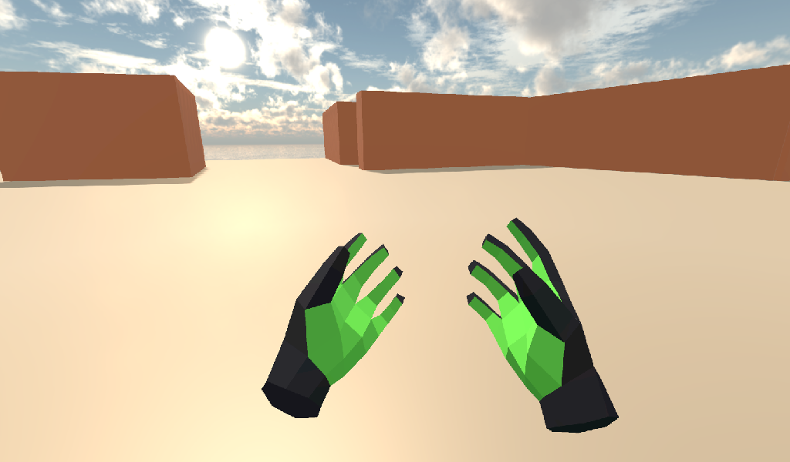

.. _doc_vr_starter_tutorial_part_one:

VR Starter Tutorial Part One
============================

Introduction
------------

.. image:: img/starter_vr_tutorial_sword.png

This tutorial will show you how to make a beginner VR game project in Godot.

Keep in mind, **one of the most important things when making VR content is getting the scale of your assets correct**!
It can take lots of practice and iterations to get this right, but there are a few things you can do to make it easier:

- In VR, 1 unit is typically considered 1 meter. If you design your assets around that standard, you can save yourself a lot of headache.
- In your 3D modeling program, see if there is a way to measure and use real world distances. In Blender, you can use the MeasureIt add-on; in Maya, you can use the Measure Tool.
- You can make rough models using a tool like `Google Blocks <https://vr.google.com/blocks/>`_, and then refine in another 3D modelling program.
- Test often, as the assets can look dramatically different in VR than on a flat screen!

Throughout the course of this tutorial, we will cover:

- How to tell Godot to run in VR.
- How to make a teleportation locomotion system that uses the VR controllers.
- How to make a artificial movement locomotion system that uses the VR controllers.
- How to create a :ref:`RigidBody <class_RigidBody>`-based system that allows for picking up, dropping, and throwing RigidBody nodes using the VR controllers.
- How to create simple destroyable target.
- How to create some special :ref:`RigidBody <class_RigidBody>`-based objects that can destroy the targets.

.. tip:: While this tutorial can be completed by beginners, it is highly
          advised to complete :ref:`doc_your_first_game`,
          if you are new to Godot and/or game development.
          
          **Some experience with making 3D games is required** before going through this tutorial series.
          This tutorial assumes you have experience with the Godot editor, GDScript, and basic 3D game development.
          A OpenVR-ready headset and two OpenVR-ready controllers are required.
          
          This tutorial was written and tested using a Windows Mixed Reality headset and controllers. This project has also been tested on the HTC Vive. Code adjustments may be required
          for other VR Headsets, such as the Oculus Rift.

The Godot project for this tutorial is found on the `OpenVR GitHub repository <https://github.com/GodotVR/godot_openvr_fps>`_. The starter assets for this tutorial can be found in the releases
section on the GitHub repository. The starter assets contain some 3D models, sounds, scripts, and scenes that are configured for this tutorial.

.. note:: **Credits for the assets provided**:
          
          - The sky panorama was created by `CGTuts <https://cgi.tutsplus.com/articles/freebie-8-awesome-ocean-hdris--cg-5684>`_.
          
          - The font used is Titillium-Regular 
          - - The font is licensed under the SIL Open Font License, Version 1.1
          
          - The audio used are from several different sources, all downloaded from the Sonniss #GameAudioGDC Bundle (`License PDF <https://sonniss.com/gdc-bundle-license/>`_) 
          - - The folders where the audio files are stored have the same name as folders in the Sonniss audio bundle.
          
          - The OpenVR addon was created by `Bastiaan Olij <https://github.com/BastiaanOlij>`_ and is released under the MIT license. It can be found both on the `Godot Asset Library <https://godotengine.org/asset-library/asset/150>`_ and on `GitHub <https://github.com/GodotVR/godot-openvr-asset>`_.
          
          - The initial project, 3D models, and scripts were created by `TwistedTwigleg <https://github.com/TwistedTwigleg>`_ and is released under the MIT license.

.. tip:: You can find the finished project on the `OpenVR GitHub repository <https://github.com/GodotVR/godot_openvr_fps>`_.

Getting everything ready
------------------------

If you have not already, go to the `OpenVR GitHub repository <https://github.com/GodotVR/godot_openvr_fps>`_ and download the "Starter Assets" file from the releases. Once you have the
starter assets downloaded, open up the project in Godot.

.. note:: The starter assets are not required to use the scripts provided in this tutorial.
          The starter assets include several premade scenes and scripts that will be used throughout the tutorial.

When the project is first loaded, the Game.tscn scene will be opened. This will be the main scene used for the tutorial. It includes several nodes and scenes already placed
throughout the scene, some background music, and several GUI-related :ref:`MeshInstance <class_MeshInstance>` nodes.

_________________

The GUI-related :ref:`MeshInstance <class_MeshInstance>` nodes already have scripts attached to them. These scripts will set the texture of a :ref:`Viewport <class_Viewport>`
node to the albedo texture of the material of the :ref:`MeshInstance <class_MeshInstance>` node. This is used to display text within the VR project. Feel free to take a look
at the script, ``GUI.gd``, if you want. We will not be going over how to to use :ref:`Viewport <class_Viewport>` nodes for displaying UI on :ref:`MeshInstance <class_MeshInstance>`
nodes in this tutorial .

If you are interested in how to use :ref:`Viewport <class_Viewport>` nodes for displaying UI on :ref:`MeshInstance <class_MeshInstance>` nodes, see the :ref:`doc_viewport_as_texture`
tutorial. It covers how to use a :ref:`Viewport <class_Viewport>` as a render texture, along with how to apply that texture onto a :ref:`MeshInstance <class_MeshInstance>` node.

_________________

Before we jump into the tutorial, let's take a moment to talk about how the nodes used for VR work.

The :ref:`ARVROrigin <class_ARVROrigin>` node is the center point of the VR tracking system. The position of the :ref:`ARVROrigin <class_ARVROrigin>` is the position
the VR system considers the 'center' point on the floor. The :ref:`ARVROrigin <class_ARVROrigin>` has a `world scale` property that effects the size of the user within
the VR scene. For this tutorial, it is set to `1.4`, as the world was originally just a tad to big. As mentioned earlier, keeping the scale relatively consistent is
important in VR.

The :ref:`ARVRCamera <class_ARVRCamera>` is the player's headset and view into the scene. The :ref:`ARVRCamera <class_ARVRCamera>` is offset on the Y axis by the VR user's height,
which will be important later when we add teleportation locomotoin. If the VR system supports room tracking, then the :ref:`ARVRCamera <class_ARVRCamera>` will move as the player moves.
This means that the :ref:`ARVRCamera <class_ARVRCamera>` is not guaranteed to be in the same position as the :ref:`ARVROrigin <class_ARVROrigin>` node.

The :ref:`ARVRController <class_ARVRController>` node represents a VR controller. The :ref:`ARVRController <class_ARVRController>` will follow the position and rotation of the VR
controller relative to the :ref:`ARVROrigin <class_ARVROrigin>` node. All of the input for the VR controllers happens through the :ref:`ARVRController <class_ARVRController>` node.
An :ref:`ARVRController <class_ARVRController>` node with an ``ID`` of ``1`` represents the left VR controller, while an :ref:`ARVRController <class_ARVRController>` controller with an
``ID`` of ``2`` represents the right VR controller.

To summerize: 

- The :ref:`ARVROrigin <class_ARVROrigin>` node is the center of the VR tracking system and is positioned on the floor.

- The :ref:`ARVRCamera <class_ARVRCamera>` is the player's VR headset and view into the scene.

- The :ref:`ARVRCamera <class_ARVRCamera>` node is offset on the Y axis by the user's height.

- If the VR system supports room tracking, then the :ref:`ARVRCamera <class_ARVRCamera>` node may be offset on the X and Z axises as the player moves.

- The :ref:`ARVRController <class_ARVRController>` nodes represent the VR controllers and handle all of the input from the VR controllers.

Starting VR
-----------

Now that we have gone over the VR nodes, let's start working on the project. While in ``Game.tscn``, select the ``Game`` node and make a new script called ``Game.gd``.
In the ``Game.gd`` file, add the following code:

.. tabs::
 .. code-tab:: gdscript GDScript

    extends Spatial

    func _ready():
        var VR = ARVRServer.find_interface("OpenVR")
        if VR and VR.initialize():
            get_viewport().arvr = true
            get_viewport().hdr = false

            OS.vsync_enabled = false
            Engine.target_fps = 90
            # Also, the physics FPS in the project settings is also 90 FPS. This makes the physics
            # run at the same frame rate as the display, which makes things look smoother in VR!

 .. code-tab:: csharp

    using Godot;
    using System;

    public class Game : Spatial
    {
        public override void _Ready()
        {
            var vr = ARVRServer.FindInterface("OpenVR");
            if (vr != null && vr.Initialize())
            {
                GetViewport().Arvr = true;
                GetViewport().Hdr = false;

                OS.VsyncEnabled = false;
                Engine.TargetFps = 90;
                // Also, the physics FPS in the project settings is also 90 FPS. This makes the physics
                // run at the same frame rate as the display, which makes things look smoother in VR!
            }
        }
    }

Let's go over what this code does.

_________________

In the ``_ready`` function, we first get the OpenVR VR interface using the ``find_interface`` function in the :ref:`ARVRServer <class_ARVRServer>` and assign it to a variable
called `VR`. If the :ref:`ARVRServer <class_ARVRServer>` finds an interface with the name OpenVR, it will return it, otherwise it will return ``null``.

.. note:: The OpenVR VR interface is not included with Godot by default. You will need to download the OpenVR asset from the
          `Asset Library <https://godotengine.org/asset-library/asset/150>`_ or `GitHub <https://github.com/GodotVR/godot-openvr-asset>`_.

The code then combines two conditionals, one to check if the `VR` variable is NOT null (``if VR``) and another calls the initialize function, which returns a boolean based on
whether the OpenVR interface was able to initialize or not. If both of these conditionals return true, then we can turn the main Godot :ref:`Viewport <class_Viewport>` into
an ARVR viewport.

If the VR interface initialized successfully, we then get the root :ref:`Viewport <class_Viewport>` and set the `arvr` property to ``true``. This will tell Godot to use the initialized
ARVR interface to drive the :ref:`Viewport <class_Viewport>` display. After setting the ``arvr`` property to ``true``, we set the ``hdr`` property to ``false``. We do this because
most of the VR headsets do not currently support HDR rendering.

Finally, we disable VSync so the Frames Per Second (FPS) is not capped by the computer monitor. After this we tell Godot to render at ``90`` frames per second, which is the
standard for most VR headsets. Without disabling VSync, the normal computer monitor may limit the frame rate of the VR headset to the frame rate of the computer monitor.

.. note:: In the project settings, under the ``Physics->Common`` tab, the physics FPS has been set to ``90``. This makes the physics engine run at the same frame rate as
          the VR display, which makes physics reactions look smoother when in VR.

_________________

That is all we need to do for Godot to launch OpenVR within the project! Go ahead and give it a try if you want. Assuming everything works, you will be able to look around
the world. If you have a VR headset with room tracking, then you will be able to move around the scene within the limits of the room tracking.

Creating the controllers
------------------------

Right now all that the VR user can do is stand around, which isn't really what we are going for unless we are working on a VR film. Lets write the code for the
VR controllers. We are going to write all of the code for the VR controllers in one go, so the code is rather long. That said, once we are finished you will be
able to teleport around the scene, artificially move using the touchpad/joystick on the VR controller, and be able to pick up, drop, and throw
:ref:`RigidBody <class_RigidBody>`-based nodes.

First we need to open the scene used for the VR controllers. ``Left_Controller.tscn`` or ``Right_Controller.tscn``. Let's briefly go over how the scene is setup.

How the VR controller scene is setup
^^^^^^^^^^^^^^^^^^^^^^^^^^^^^^^^^^^^

In both scenes the root node is a ARVRController node. The only difference is that the ``Left_Controller`` scene has the ``Controller Id`` property set to ``1`` while
the ``Right_Controller`` has the ``Controller Id`` property set to ``2``.

Next is the ``Hand`` :ref:`MeshInstance <class_MeshInstance>` node. This node is used to display the hand mesh that will be used when the VR controller is not holding onto a
:ref:`RigidBody <class_RigidBody>` node. The hand in the ``Left_Controller`` scene is a left hand, while the hand on the ``Right_Controller`` scene is a right hand.

The node named ``Raycast`` is a :ref:`Raycast <class_Raycast>` node that is used for aiming where to teleport to when the VR controller is teleporting.
The length of the :ref:`Raycast <class_Raycast>` is set to ``-16`` on the Y axis and is rotated so that it points out of the pointer finger of the hand. The ``Raycast`` node has
a single child node, ``Mesh``, that is a :ref:`MeshInstance <class_MeshInstance>`. This is used for visually showing where the teleportation :ref:`Raycast <class_Raycast>` is aiming.

The node named ``Area`` is a :ref:`Area <class_Area>` node will be used for grabbing :ref:`RigidBody <class_RigidBody>`-based nodes when the VR controller grab mode is set to ``AREA``.
The ``Area`` node has a single child node, ``CollisionShape``, that defines a sphere :ref:`CollisionShape <class_CollisionShape>`. When the VR controller is not holding any objects and the grab button is pressed,
the first :ref:`RigidBody <class_RigidBody>`-based node within the ``Area`` node will be picked up.

Next is a :ref:`Position3D <class_Position3D>` node called ``Grab_Pos``. This is used to define the position that grabbed :ref:`RigidBody <class_RigidBody>` nodes will follow then
they are held by the VR controller.

A large :ref:`Area <class_Area>` node called ``Sleep_Area`` is used to disable sleeping for any RigidBody nodes within its :ref:`CollisionShape <class_CollisionShape>`,
simple called ``CollisionShape``. This is needed because if a :ref:`RigidBody <class_RigidBody>` node falls asleep, then the VR controller will be unable to grab it.
By using ``Sleep_Area``, we can write code that makes any :ref:`RigidBody <class_RigidBody>` node within it not able to sleep, therefore allowing the VR controller to grab it.

An :ref:`AudioStreamPlayer3D <class_AudioStreamPlayer3D>` node called ``AudioStreamPlayer3D`` has a sound loaded that we will use when an object has been picked up, dropped
or thrown by the VR controller. While this is not necessary for the functionality of the VR controller, it makes grabbing and dropping objects feel more natural.

Finally, the last nodes are the ``Grab_Cast`` node and it's only child node, ``Mesh``. The ``Grab_Cast`` node will be used for grabbing :ref:`RigidBody <class_RigidBody>`-based
nodes when the VR controller grab mode is set to ``RAYCAST``. This will allow the VR controller to grab objects that are just slightly out of reach using a Raycast. The ``Mesh``
node is used for visually showing where the teleportation :ref:`Raycast <class_Raycast>` is aiming.

That is a quick overview of how the VR controller scenes are setup, and how we will be using the nodes to provide the functionality for them. Now that we have looked at the
VR controller scene, let's write the code that will drive them.

The code for the VR controllers
^^^^^^^^^^^^^^^^^^^^^^^^^^^^^^^

Select the root node of the scene, either ``Right_Controller`` or ``Left_Controller``, and make a new script called ``VR_Controller.gd``. Both scenes will be using
the same script, so it doesn't matter which you use first. With ``VR_Controller.gd`` opened, add the following code:

.. tip:: You can copy and paste the code from this page directly into the script editor.
         
         If you do this, all of the code copied will be using spaces instead of tabs.

         To convert the spaces to tabs in the script editor, click the ``Edit`` menu and select ``Convert Indent To Tabs``.
         This will convert all the spaces into tabs. You can select ``Convert Indent To Spaces`` to convert tabs back into spaces.

.. tabs::
 .. code-tab:: gdscript GDScript
    extends ARVRController

    var controller_velocity = Vector3(0,0,0)
    var prior_controller_position = Vector3(0,0,0)
    var prior_controller_velocities = []

    var held_object = null
    var held_object_data = {"mode":RigidBody.MODE_RIGID, "layer":1, "mask":1}

    var grab_area
    var grab_raycast
    
    var grab_mode = "AREA"
    var grab_pos_node

    var hand_mesh
    var hand_pickup_drop_sound

    var teleport_pos = Vector3.ZERO
    var teleport_mesh
    var teleport_button_down
    var teleport_raycast

    # A constant to define the dead zone for both the trackpad and the joystick.
    # See (http://www.third-helix.com/2013/04/12/doing-thumbstick-dead-zones-right.html)
    # for more information on what dead zones are, and how we are using them in this project.
    const CONTROLLER_DEADZONE = 0.65

    const MOVEMENT_SPEED = 1.5

    const CONTROLLER_RUMBLE_FADE_SPEED = 2.0

    var directional_movement = false

    func _ready():
        # Ignore the warnings the from the connect function calls.
        # (We will not need the returned values for this tutorial)
        # warning-ignore-all:return_value_discarded

        teleport_raycast = get_node("RayCast")
        
        teleport_mesh = get_tree().root.get_node("Game/Teleport_Mesh")
        
        teleport_button_down = false
        teleport_mesh.visible = false
        teleport_raycast.visible = false
        
        grab_area = get_node("Area")
        grab_raycast = get_node("Grab_Cast")
        grab_pos_node = get_node("Grab_Pos")
        
        grab_mode = "AREA"
        grab_raycast.visible = false
        
        get_node("Sleep_Area").connect("body_entered", self, "sleep_area_entered")
        get_node("Sleep_Area").connect("body_exited", self, "sleep_area_exited")
        
        hand_mesh = get_node("Hand")
        hand_pickup_drop_sound = get_node("AudioStreamPlayer3D")
        
        connect("button_pressed", self, "button_pressed")
        connect("button_release", self, "button_released")

    func _physics_process(delta):
        if rumble > 0:
            rumble -= delta * CONTROLLER_RUMBLE_FADE_SPEED
            if rumble < 0:
                rumble = 0
        
        if teleport_button_down == true:
            teleport_raycast.force_raycast_update()
            if teleport_raycast.is_colliding():
                if teleport_raycast.get_collider() is StaticBody:
                    if teleport_raycast.get_collision_normal().y >= 0.85:
                        teleport_pos = teleport_raycast.get_collision_point()
                        teleport_mesh.global_transform.origin = teleport_pos
        
        
        if get_is_active() == true:
            _physics_process_update_controller_velocity(delta)
        
        if held_object != null:
            var held_scale = held_object.scale
            held_object.global_transform = grab_pos_node.global_transform
            held_object.scale = held_scale
        
        _physics_process_directional_movement(delta);

    func _physics_process_update_controller_velocity(delta):
        controller_velocity = Vector3(0,0,0)

        if prior_controller_velocities.size() > 0:
            for vel in prior_controller_velocities:
                controller_velocity += vel
            
            controller_velocity = controller_velocity / prior_controller_velocities.size()
        
        var relative_controller_position = (global_transform.origin - prior_controller_position)
        
        controller_velocity += relative_controller_position
        
        prior_controller_velocities.append(relative_controller_position)
        
        prior_controller_position = global_transform.origin
        
        controller_velocity /= delta;
        
        if prior_controller_velocities.size() > 30:
            prior_controller_velocities.remove(0)

    func _physics_process_directional_movement(delta):
        var trackpad_vector = Vector2(-get_joystick_axis(1), get_joystick_axis(0))
        var joystick_vector = Vector2(-get_joystick_axis(5), get_joystick_axis(4))
        
        if trackpad_vector.length() < CONTROLLER_DEADZONE:
            trackpad_vector = Vector2(0,0)
        else:
            trackpad_vector = trackpad_vector.normalized() * ((trackpad_vector.length() - CONTROLLER_DEADZONE) / (1 - CONTROLLER_DEADZONE))
        
        if joystick_vector.length() < CONTROLLER_DEADZONE:
            joystick_vector = Vector2(0,0)
        else:
            joystick_vector = joystick_vector.normalized() * ((joystick_vector.length() - CONTROLLER_DEADZONE) / (1 - CONTROLLER_DEADZONE))
        
        var forward_direction = get_parent().get_node("Player_Camera").global_transform.basis.z.normalized()
        var right_direction = get_parent().get_node("Player_Camera").global_transform.basis.x.normalized()
        
        # Because the trackpad and the joystick will both move the player, we can add them together and normalize
        # the result, giving the combined movement direction
        var movement_vector = (trackpad_vector + joystick_vector).normalized()
        
        var movement_forward = forward_direction * movement_vector.x * delta * MOVEMENT_SPEED
        var movement_right = right_direction * movement_vector.y * delta * MOVEMENT_SPEED
        
        movement_forward.y = 0
        movement_right.y = 0
        
        if (movement_right.length() > 0 or movement_forward.length() > 0):
            get_parent().global_translate(movement_right + movement_forward)
            directional_movement = true
        else:
            directional_movement = false

    func button_pressed(button_index):
        if button_index == 15:
            _on_button_pressed_trigger()
        
        if button_index == 2:
            _on_button_pressed_grab()
            
        if button_index == 1:
            _on_button_pressed_menu()

    func _on_button_pressed_trigger():
        if held_object == null:
            if teleport_mesh.visible == false:
                teleport_button_down = true
                teleport_mesh.visible = true
                teleport_raycast.visible = true
        else:
            if held_object is VR_Interactable_Rigidbody:
                held_object.interact()

    func _on_button_pressed_grab():
        if teleport_button_down == true:
            return
        
        if held_object == null:
            _pickup_rigidbody()
        else:
            _throw_rigidbody()
        
        hand_pickup_drop_sound.play()

    func _pickup_rigidbody():
        var rigid_body = null
        
        if grab_mode == "AREA":
            var bodies = grab_area.get_overlapping_bodies()
            if len(bodies) > 0:
                for body in bodies:
                    if body is RigidBody:
                        if !("NO_PICKUP" in body):
                            rigid_body = body
                            break
        
        elif grab_mode == "RAYCAST":
            grab_raycast.force_raycast_update()
            if (grab_raycast.is_colliding()):
                var body = grab_raycast.get_collider()
                if body is RigidBody:
                    if !("NO_PICKUP" in body):
                        rigid_body = body
        
        
        if rigid_body != null:
            
            held_object = rigid_body
            
            held_object_data["mode"] = held_object.mode
            held_object_data["layer"] = held_object.collision_layer
            held_object_data["mask"] = held_object.collision_mask
            
            held_object.mode = RigidBody.MODE_STATIC
            held_object.collision_layer = 0
            held_object.collision_mask = 0
            
            hand_mesh.visible = false
            grab_raycast.visible = false
            
            if held_object is VR_Interactable_Rigidbody:
                held_object.controller = self
                held_object.picked_up()

    func _throw_rigidbody():
        if held_object == null:
            return
        
        held_object.mode = held_object_data["mode"]
        held_object.collision_layer = held_object_data["layer"]
        held_object.collision_mask = held_object_data["mask"]
        
        held_object.apply_impulse(Vector3(0, 0, 0), controller_velocity)
        
        if held_object is VR_Interactable_Rigidbody:
            held_object.dropped()
            held_object.controller = null
        
        held_object = null
        hand_mesh.visible = true
        
        if grab_mode == "RAYCAST":
            grab_raycast.visible = true

    func _on_button_pressed_menu():
        if grab_mode == "AREA":
            grab_mode = "RAYCAST"
            if held_object == null:
                grab_raycast.visible = true
        
        elif grab_mode == "RAYCAST":
            grab_mode = "AREA"
            grab_raycast.visible = false

    func button_released(button_index):
        if button_index == 15:
            _on_button_released_trigger()

    func _on_button_released_trigger():
        if teleport_button_down == true:
            
            if teleport_pos != null and teleport_mesh.visible == true:
                var camera_offset = get_parent().get_node("Player_Camera").global_transform.origin - get_parent().global_transform.origin
                camera_offset.y = 0
                
                get_parent().global_transform.origin = teleport_pos - camera_offset
            
            teleport_button_down = false
            teleport_mesh.visible = false
            teleport_raycast.visible = false
            teleport_pos = null

    func sleep_area_entered(body):
        if "can_sleep" in body:
            body.can_sleep = false
            body.sleeping = false

    func sleep_area_exited(body):
        if "can_sleep" in body:
            # Allow the CollisionBody to sleep by setting the "can_sleep" variable to true
            body.can_sleep = true

This is quite a bit of code to go through. Let's go through what the code does step-by-step.

Explaining the VR controller code
^^^^^^^^^^^^^^^^^^^^^^^^^^^^^^^^^

First, let's go through all of the class variables in the script:

* ``controller_velocity``: A variable to hold a rough approximation of the VR controller's velocity.
* ``prior_controller_position``: A variable to hold the VR controller's last position in 3D space.
* ``prior_controller_velocities``: An Array to hold the last 30 calculated VR controller velocities. This is used to smooth the velocity calculations over time.
* ``held_object``: A variable to hold a reference to the object the VR controller is holding. If the VR controller is not holding any objects, this variable will be ``null``.
* ``held_object_data``: A dictionary to hold data for the :ref:`RigidBody <class_RigidBody>` node being held by the VR controller. This is used to reset the :ref:`RigidBody <class_RigidBody>`'s data when it is no longer held.
* ``grab_area``: A variable to hold the :ref:`Area <class_Area>` node used to grab objects with the VR controller.
* ``grab_raycast``: A variable to hold the :ref:`Raycast <class_Raycast>` node used to grab objects with the VR controller.
* ``grab_mode``: A variable to define the grab mode the VR controller is using. There are only two modes for grabbing objects in this tutorial, ``AREA`` and ``RAYCAST``.
* ``grab_pos_node``: A variable to hold the node that will be used to update the position and rotation of held objects.
* ``hand_mesh``: A variable to hold the :ref:`MeshInstance <class_MeshInstance>` node that contains the hand mesh for the VR controller. This mesh will be shown when the VR controller is not holding anything.
* ``hand_pickup_drop_sound``: A variable to hold the :ref:`AudioStreamPlayer3D <class_AudioStreamPlayer3D>` node that contains the pickup/drop sound.
* ``teleport_pos``: A variable to hold the position the player will be teleported to when the VR controller teleports the player.
* ``teleport_mesh``: A variable to hold the :ref:`MeshInstance <class_MeshInstance>` node used to show where the player is teleporting to.
* ``teleport_button_down``: A variable used to track whether the controller's teleport button is held down. This will be used to detect if this VR controller is trying to teleport the player.
* ``teleport_raycast``: A variable to hold the :ref:`Raycast <class_Raycast>` node used to calculate the teleport position. This node also has a :ref:`MeshInstance <class_MeshInstance>` that acts as a 'laser sight' for aiming.
* ``CONTROLLER_DEADZONE``: A constant to define the deadzone for both the trackpad and the joystick on the VR controller. See the note below for more information.
* ``MOVEMENT_SPEED``: A constant to define the speed the player moves at when using the trackpad/joystick to move artificially.
* ``CONTROLLER_RUMBLE_FADE_SPEED``: A constant to define how fast the VR controller rumble fades.
* ``directional_movement``: A variable to hold whether this VR controller is moving the player using the touchpad/joystick.

.. note:: You can find a great article explaining all about how to handle touchpad/joystick dead zones here: http://www.third-helix.com/2013/04/12/doing-thumbstick-dead-zones-right.html
          
          We are using a translated version of the scaled radial dead zone code provided in that article for the VR controller's joystick/touchpad.
          The article is a great read, and I highly suggest giving it a look!

That is quite a few class variables. Most of them are used to hold references to nodes we will need throughout the code. Next let's start looking at the functions, starting
with the ``_ready`` function.

_________________

``_ready`` function step-by-step explanation
""""""""""""""""""""""""""""""""""""""""""""

First we tell Godot to silence the warnings about not using the values returned by the ``connect`` function. We will not need the returned
values for this tutorial.

Next we get the :ref:`Raycast <class_Raycast>` node we are going to use for determining the position for teleporting and assign it to the ``teleport_raycast`` variable.
We then get the :ref:`MeshInstance <class_MeshInstance>` node that we will use to show where the player will be teleporting to. The node we are using for teleporting
is a child of the ``Game`` scene. We do this so the teleport mesh node is not effected by changes in the VR controller, and so the teleport mesh can be used by both VR controllers.

Then the ``teleport_button_down`` variable is set to false, ``teleport_mesh.visible`` is set to ``false``, and ``teleport_raycast.visible`` is set to ``false``. This sets up the variables
for teleporting the player into their initial, not teleporting the player, state.

The code then gets the ``grab_area`` node, the ``grab_raycast`` node, and the ``grab_pos_node`` node and assigns them all to their respective variables for use later.

Next the ``grab_mode`` is set to ``AREA`` so the VR controller will attempt to grab objects using the :ref:`Area <class_Area>` node defined in ``grab_area`` when the VR controller's
grab/grip button is pressed. We also set the ``grab_raycast`` node's ``visible`` property to ``false`` so the 'laser sight' child node of ``grab_raycast`` is not visible.

After that we connect the ``body_entered`` and ``body_exited`` signals from the ``Sleep_Area`` node in the VR controller to the ``sleep_area_entered`` and ``sleep_area_exited`` functions.
The ``sleep_area_entered`` and ``sleep_area_exited`` functions will be used to make :ref:`RigidBody <class_RigidBody>` nodes unable to sleep when nearby the VR controller.

Then the ``hand_mesh`` and ``hand_pickup_drop_sound`` nodes are gotten and assigned them to their respective variables for use later.

Finally, the ``button_pressed`` and ``button_release`` signals in the :ref:`ARVRController <class_ARVRController>` node, which the VR controller extends, are connected to the
``button_pressed`` and ``button_released`` functions respectively. This means that when a button on the VR controller is pressed or released, the ``button_pressed`` or ``button_released``
functions defined in this script will be called.

_________________

``_physics_process`` function step-by-step explanation
""""""""""""""""""""""""""""""""""""""""""""""""""""""

TODO

_________________

``_physics_process_update_controller_velocity`` function step-by-step explanation
"""""""""""""""""""""""""""""""""""""""""""""""""""""""""""""""""""""""""""""""""

TODO

_________________

``_physics_process_directional_movement`` function step-by-step explanation
"""""""""""""""""""""""""""""""""""""""""""""""""""""""""""""""""""""""""""

TODO

_________________

``button_pressed`` function step-by-step explanation
""""""""""""""""""""""""""""""""""""""""""""""""""""

TODO

_________________

``_on_button_pressed_trigger`` function step-by-step explanation
""""""""""""""""""""""""""""""""""""""""""""""""""""""""""""""""

TODO

_________________

``_on_button_pressed_grab`` function step-by-step explanation
""""""""""""""""""""""""""""""""""""""""""""""""""""""""""""""""

TODO

_________________

``_pickup_rigidbody`` function step-by-step explanation
"""""""""""""""""""""""""""""""""""""""""""""""""""""""

TODO

_________________

``_throw_rigidbody`` function step-by-step explanation
""""""""""""""""""""""""""""""""""""""""""""""""""""""

TODO

_________________

``_on_button_pressed_menu`` function step-by-step explanation
"""""""""""""""""""""""""""""""""""""""""""""""""""""""""""""

TODO

_________________

``button_released`` function step-by-step explanation
"""""""""""""""""""""""""""""""""""""""""""""""""""""

TODO

_________________

``_on_button_released_trigger`` function step-by-step explanation
"""""""""""""""""""""""""""""""""""""""""""""""""""""""""""""""""

TODO

_________________

``sleep_area_entered`` function step-by-step explanation
""""""""""""""""""""""""""""""""""""""""""""""""""""""""

TODO

_________________

``sleep_area_exited`` function step-by-step explanation
"""""""""""""""""""""""""""""""""""""""""""""""""""""""

TODO

_________________

Okay, whew! That was a lot of code! Add the same script, ``VR_Controller.gd`` to the other controller so both controllers have the same script.

Now go ahead and try the game again, and you should find you can teleport around by pressing the touch pad, and can grab and throw objects
using the grab/grip buttons.

Now, you may want to try moving using the trackpads and/or joysticks, but **it may make you motion sick!**

One of the main reasons this can make you feel motion sick is because your vision tells you that you are moving, while your body is not moving.
This conflict of signals makes the body feel sick. Let's add a vignette shader to help reduce motion sickness while moving in VR!

.. seealso:: **TWISTED TWIGLEG: Finished editing here. Everything below this line is the OLD tutorial**.
             
             Self note: Mention the ColorRect node and how it is parented to the VR Origin node when talking about the vignette shader!

Reducing motion sickness
------------------------

.. note:: There are plenty of ways to reduce motion sickness in VR, and there is no one perfect way to reduce motion sickness. See
          `this page on the Oculus Developer Center <https://developer.oculus.com/design/latest/concepts/bp-locomotion/>`_
          for more information on how to implement locomotion and reducing motion sickness.

To help reduce motion sickness while moving, we are going to add a vignette effect that will only be visible while the player moves.

Open up ``Movement_Vignette.tscn``, which you can find in the ``Scenes`` folder. Notice how it is just a :ref:`ColorRect <class_ColorRect>` node with a custom
shader. Feel free to look at the custom shader if you want, it is just a slightly modified version of the vignette shader you can find in the Godot demo repository.

With ``Movement_Vignette`` selected, make a new script called ``Movement_Vignette.gd``. Add the following code to ``Movement_Vignette.gd``:

.. tabs::
 .. code-tab:: gdscript GDScript

    extends ColorRect

    var controller_one
    var controller_two

    func _ready():
        yield(get_tree(), "idle_frame")
        yield(get_tree(), "idle_frame")
        yield(get_tree(), "idle_frame")
        yield(get_tree(), "idle_frame")

        var interface = ARVRServer.get_primary_interface()

        rect_size = interface.get_render_targetsize()
        rect_position = Vector2(0, 0)

        controller_one = get_parent().get_node("Left_Controller")
        controller_two = get_parent().get_node("Right_Controller")

        visible = false

    func _process(delta):

        if not controller_one or not controller_two:
            return

        if controller_one.directional_movement or controller_two.directional_movement:
            visible = true
        else:
            visible = false

Because this script is fairly brief, let's quickly go over what it does.

In ``_ready``, we wait for four frames. We do this to ensure the VR interface is ready and going.

Next, we get the current VR interface, and resize the :ref:`ColorRect <class_ColorRect>` node's size and position so that it covers the entire view in VR.

Then, we get the left and right controllers, assigning them to ``controller_one`` and ``controller_two``.

We then make the vignette invisible by default.

In ``_process``, we check to see if either of the controllers are moving the player by checking ``directional_movement``. If either controller is moving the player,
we make the vignette visible, while if neither controller is moving the player, we make the vignette invisible.

_________

With that done, go ahead and try moving around with the joystick and/or the trackpad. You should find it is much less motion sickness-inducing than before!

Final notes
-----------

Now you have fully working VR controllers that can move around the environment and interact with :ref:`RigidBody <class_RigidBody>`-based objects.
In the next part of this tutorial series, we will be creating some special :ref:`RigidBody <class_RigidBody>`-based objects for the player to use!

.. warning:: You can download the finished project for this tutorial series on the Godot OpenVR GitHub repository, under the releases tab!
