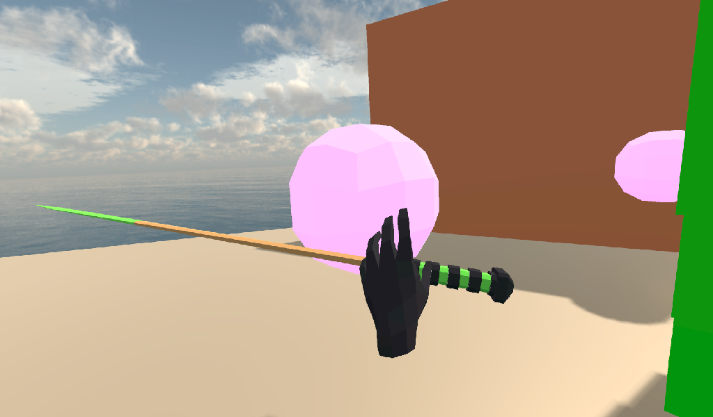
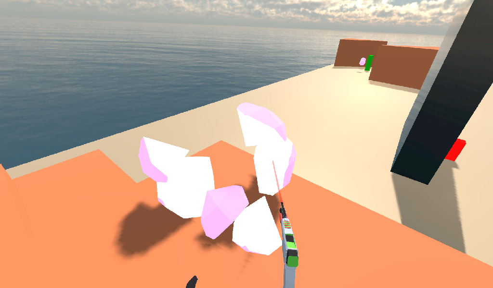

.. _doc_vr_starter_tutorial_part_two:

VR starter tutorial part 2
==========================

Introduction
------------

In this part of the VR starter tutorial series, we will be adding a number of special :ref:`RigidBody <class_RigidBody>`-based nodes that can be used in VR.

This continues from where we left on in the last tutorial part, where we just finished getting the VR controllers working and defined a custom
class called ``VR_Interactable_Rigidbody``.

.. tip:: You can find the finished project on the `OpenVR GitHub repository <https://github.com/GodotVR/godot_openvr_fps>`_.

Adding destroyable targets
--------------------------

Before we make any of the special :ref:`RigidBody <class_RigidBody>`-based nodes, we need something for them to do. Let's make a simple sphere target that will break into a bunch of pieces
when destroyed.

Open up ``Sphere_Target.tscn``, which is in the ``Scenes`` folder. The scene is fairly simple, with just a :ref:`StaticBody <class_StaticBody>` with a sphere shaped
:ref:`CollisionShape <class_CollisionShape>`, a :ref:`MeshInstance <class_MeshInstance>` node displaying a sphere mesh, and an :ref:`AudioStreamPlayer3D <class_AudioStreamPlayer3D>` node.

The special :ref:`RigidBody <class_RigidBody>` nodes will handle damaging the sphere, which is why we are using a :ref:`StaticBody <class_StaticBody>` node instead of something like
an :ref:`Area <class_Area>` or :ref:`RigidBody <class_RigidBody>` node. Outside of that, there isn't really a lot to talk about, so let's move straight into writing the code.

Select the ``Sphere_Target_Root`` node and make a new script called ``Sphere_Target.gd``. Add the following code:

.. tabs::
 .. code-tab:: gdscript GDScript

    extends Spatial

    var destroyed = false
    var destroyed_timer = 0
    const DESTROY_WAIT_TIME = 80

    var health = 80

    const RIGID_BODY_TARGET = preload("res://Assets/RigidBody_Sphere.scn")

    func _ready():
        set_physics_process(false)

    func _physics_process(delta):
        destroyed_timer += delta
        if destroyed_timer >= DESTROY_WAIT_TIME:
            queue_free()

    func damage(damage):
        if destroyed == true:
            return

        health -= damage

        if health <= 0:

            get_node("CollisionShape").disabled = true
            get_node("Shpere_Target").visible = false

            var clone = RIGID_BODY_TARGET.instance()
            add_child(clone)
            clone.global_transform = global_transform

            destroyed = true
            set_physics_process(true)

            get_node("AudioStreamPlayer").play()
            get_tree().root.get_node("Game").remove_sphere()

Let's go over how this script works.

Explaining the Sphere Target code
^^^^^^^^^^^^^^^^^^^^^^^^^^^^^^^^^

First, let's go through all the class variables in the script:

* ``destroyed``: A variable to track whether the sphere target has been destroyed.
* ``destroyed_timer``: A variable to track how long the sphere target has been destroyed.
* ``DESTROY_WAIT_TIME``: A constant to define the length of time the target can be destroyed for before it frees/deletes itself.
* ``health``: A variable to store the amount of health the sphere target has.
* ``RIGID_BODY_TARGET``: A constant to hold the scene of the destroyed sphere target.

.. note:: Feel free to check out the ``RIGID_BODY_TARGET`` scene. It is just a bunch of :ref:`RigidBody <class_RigidBody>` nodes and a broken sphere model.

          We'll be instancing this scene so when the target is destroyed, it looks like it broke into a bunch of pieces.

``_ready`` function step-by-step explanation
""""""""""""""""""""""""""""""""""""""""""""

All the ``_ready`` function does is that it stops the ``_physics_process`` from being called by calling ``set_physics_process`` and passing ``false``.
The reason we do this is because all the code in ``_physics_process`` is for destroying this node when enough time has passed, which we only want to
do when the target has been destroyed.

``_physics_process`` function step-by-step explanation
""""""""""""""""""""""""""""""""""""""""""""""""""""""

First this function adds time, ``delta``, to the ``destroyed_timer`` variable. It then checks to see if ``destroyed_timer`` is greater than or equal to
``DESTROY_WAIT_TIME``. If ``destroyed_timer`` is greater than or equal to ``DESTROY_WAIT_TIME``, then the sphere target frees/deletes itself by calling
the ``queue_free`` function.

``damage`` function step-by-step explanation
""""""""""""""""""""""""""""""""""""""""""""

The ``damage`` function will be called by the special :ref:`RigidBody <class_RigidBody>` nodes, which will pass the amount of damage done to the target, which is a function argument
variable called ``damage``. The ``damage`` variable will hold the amount of damage the special :ref:`RigidBody <class_RigidBody>` node did to the sphere target.

First this function checks to make sure the target is not already destroyed by checking if the ``destroyed`` variable is equal to ``true``. If ``destroyed`` is equal to ``true``, then
the function calls ``return`` so none of the other code is called. This is just a safety check so that if two things damage the target at exactly the same time, the target cannot be
destroyed twice.

Next the function removes the amount of damage taken, ``damage``, from the target's health, ``health``. If then checks to see if ``health`` is equal to zero or less, meaning that the
target has just been destroyed.

If the target has just been destroyed, then we disable the :ref:`CollisionShape <class_CollisionShape>` by setting it's ``disabled`` property to ``true``. We then make the ``Sphere_Target``
:ref:`MeshInstance <class_MeshInstance>` invisible by setting the ``visible`` property to ``false``. We do this so the target can no longer effect the physics world and so the non-broken target mesh is not visible.

After this the function then instances the ``RIGID_BODY_TARGET`` scene and adds it as a child of the target. It then sets the ``global_transform`` of the newly instanced scene, called ``clone``, to the
``global_transform`` of the non-broken target. This makes it where the broken target starts at the same position as the non-broken target with the same rotation and scale.

Then the function sets the ``destroyed`` variable to ``true`` so the target knows it has been destroyed and calls the ``set_physics_process`` function and passes ``true``. This will start
executing the code in ``_physics_process`` so that after ``DESTROY_WAIT_TIME`` seconds have passed, the sphere target will free/destroy itself.

The function then gets the :ref:`AudioStreamPlayer3D <class_AudioStreamPlayer3D>` node and calls the ``play`` function so it plays its sound.

Finally, the ``remove_sphere`` function is called in ``Game.gd``. To get ``Game.gd``, the code uses the scene tree and works its way from the root of the scene tree to the root of the
``Game.tscn`` scene.

Adding the ``remove_sphere`` function to ``Game.gd``
^^^^^^^^^^^^^^^^^^^^^^^^^^^^^^^^^^^^^^^^^^^^^^^^^^^^

You may have noticed we are calling a function in ``Game.gd``, called ``remove_sphere``, that we have not defined yet. Open up ``Game.gd`` and
add the following additional class variables:

.. tabs::
 .. code-tab:: gdscript GDScript

    var spheres_left = 10
    var sphere_ui = null

- ``spheres_left``: The amount of sphere targets left in the world. In the provided ``Game`` scene, there are ``10`` spheres, so that is the initial value.
- ``sphere_ui``: A reference to the sphere UI. We will use this later in the tutorial to display the amount of spheres left in the world.

With these variables defined, we can now add the ``remove_sphere`` function. Add the following code to ``Game.gd``:

.. tabs::
 .. code-tab:: gdscript GDScript

    func remove_sphere():
        spheres_left -= 1

        if sphere_ui != null:
            sphere_ui.update_ui(spheres_left)

Let's go through what this function does real quick:

First, it removes one from the ``spheres_left`` variable. It then checks to see if the ``sphere_ui`` variable is not equal to ``null``, and if it is not
equal to ``null`` it calls the ``update_ui`` function on ``sphere_ui``, passing in the number of spheres as an argument to the function.

.. note:: We will add the code for ``sphere_ui`` later in this tutorial!

Now the ``Sphere_Target`` is ready to be used, but we don't have any way to destroy it. Let's fix that by adding some special :ref:`RigidBody <class_RigidBody>`-based nodes
that can damage the targets.

Adding a pistol
---------------

Let's add a pistol as the first interactable :ref:`RigidBody <class_RigidBody>` node. Open up ``Pistol.tscn``, which you can find in the ``Scenes`` folder.

Let's quickly go over a few things of note in ``Pistol.tscn`` real quick before we add the code.

All of the nodes in ``Pistol.tscn`` expect the root node are rotated. This is so the pistol is in the correct rotation relative to the VR controller when it is picked up. The root node
is a :ref:`RigidBody <class_RigidBody>` node, which we need because we're going to use the ``VR_Interactable_Rigidbody`` class we created in the last part of this tutorial series.

There is a :ref:`MeshInstance <class_MeshInstance>` node called ``Pistol_Flash``, which is a simple mesh that we will be using to simulate the muzzle flash on the end of the pistol's barrel.
A :ref:`MeshInstance <class_MeshInstance>` node called ``LaserSight`` is used to as a guide for aiming the pistol, and it follows the direction of the :ref:`Raycast <class_Raycast>` node,
called ``Raycast``, that the pistol uses to detect if its 'bullet' hit something. Finally, there is an :ref:`AudioStreamPlayer3D <class_AudioStreamPlayer3D>` node at the end of the
pistol that we will use to play the sound of the pistol firing.

Feel free to look at the other parts of the scene if you want. Most of the scene is fairly straightforward, with the major changes mentioned above. Select the :ref:`RigidBody <class_RigidBody>`
node called ``Pistol`` and make a new script called ``Pistol.gd``. Add the following code:

.. tabs::
 .. code-tab:: gdscript GDScript

    extends VR_Interactable_Rigidbody

    var flash_mesh
    const FLASH_TIME = 0.25
    var flash_timer = 0

    var laser_sight_mesh
    var pistol_fire_sound

    var raycast
    const BULLET_DAMAGE = 20
    const COLLISION_FORCE = 1.5

    func _ready():
        flash_mesh = get_node("Pistol_Flash")
        flash_mesh.visible = false

        laser_sight_mesh = get_node("LaserSight")
        laser_sight_mesh.visible = false

        raycast = get_node("RayCast")
        pistol_fire_sound = get_node("AudioStreamPlayer3D")

    func _physics_process(delta):
        if flash_timer > 0:
            flash_timer -= delta
            if flash_timer <= 0:
                flash_mesh.visible = false

    func interact():
        if flash_timer <= 0:

            flash_timer = FLASH_TIME
            flash_mesh.visible = true

            raycast.force_raycast_update()
            if raycast.is_colliding():

                var body = raycast.get_collider()
                var direction_vector = raycast.global_transform.basis.z.normalized()
                var raycast_distance = raycast.global_transform.origin.distance_to(raycast.get_collision_point())

                if body.has_method("damage"):
                    body.damage(BULLET_DAMAGE)
                elif body is RigidBody:
                    var collision_force = (COLLISION_FORCE / raycast_distance) * body.mass
                    body.apply_impulse((raycast.global_transform.origin - body.global_transform.origin).normalized(), direction_vector * collision_force)

            pistol_fire_sound.play()

            if controller != null:
                controller.rumble = 0.25

    func picked_up():
        laser_sight_mesh.visible = true

    func dropped():
        laser_sight_mesh.visible = false

Let's go over how this script works.

Explaining the pistol code
^^^^^^^^^^^^^^^^^^^^^^^^^^

First, notice how instead of ``extends RigidBody``, we instead have ``extends VR_Interactable_Rigidbody``. This makes it where the pistol script extends the
``VR_Interactable_Rigidbody`` class so the VR controllers know this object can be interacted with and that the functions defined in ``VR_Interactable_Rigidbody``
can be called when this object is held by a VR controller.

Next, let's look at the class variables:

* ``flash_mesh``: A variable to hold the :ref:`MeshInstance <class_MeshInstance>` node that is used to simulate muzzle flash on the pistol.
* ``FLASH_TIME``: A constant to define how long the muzzle flash will be visible. This will also define how fast the pistol can fire.
* ``flash_timer``: A variable to hold the amount of time the muzzle flash has been visible for.
* ``laser_sight_mesh``: A variable to hold the :ref:`MeshInstance <class_MeshInstance>` node that acts as the pistol's 'laser sight'.
* ``pistol_fire_sound``: A variable to hold the :ref:`AudioStreamPlayer3D <class_AudioStreamPlayer3D>` node used for the pistol's firing sound.
* ``raycast``: A variable to hold the :ref:`Raycast <class_Raycast>` node that is used for calculating the bullet's position and normal when the pistol is fired.
* ``BULLET_DAMAGE``: A constant to define the amount of damage a single bullet from the pistol does.
* ``COLLISION_FORCE``: A constant that defines the amount of force that is applied to :ref:`RigidBody <class_RigidBody>` nodes when the pistol's bullet collides.

``_ready`` function step-by-step explanation
""""""""""""""""""""""""""""""""""""""""""""

This function gets the nodes and assigns them to their proper variables. For the ``flash_mesh`` and ``laser_sight_mesh`` nodes, both have their ``visible`` property set to ``false``
so they are not visible initially.

``_physics_process`` function step-by-step explanation
""""""""""""""""""""""""""""""""""""""""""""""""""""""

The ``_physics_process`` function first checks to see if the pistol's muzzle flash is visible by checking if ``flash_timer`` is more than zero. If ``flash_timer`` is more than
zero, then we remove time, ``delta`` from it. Next we check if the ``flash_timer`` variable is zero or less now that we removed ``delta`` from it. If it is, then the pistol
muzzle flash timer just finished and so we need to make ``flash_mesh`` invisible by setting it's ``visible`` property to ``false``.

``interact`` function step-by-step explanation
""""""""""""""""""""""""""""""""""""""""""""""

The interact function first checks to see if the pistol's muzzle flash is invisible by checking to see if ``flash_timer`` is less than or equal to zero. We do this so we
can limit the rate of fire of the pistol to the length of time the muzzle flash is visible, which is a simple solution for limiting how fast the player can fire.

If ``flash_timer`` is zero or less, we then set ``flash_timer`` to ``FLASH_TIME`` so there is a delay before the pistol can fire again. After that we set ``flash_mesh.visible``
to ``true`` so the muzzle flash at the end of the pistol is visible while ``flash_timer`` is more than zero.

Next we call the ``force_raycast_update`` function on the :ref:`Raycast <class_Raycast>` node in ``raycast`` so that it gets the latest collision info from the physics world.
We then check if the ``raycast`` hit something by checking if the ``is_colliding`` function is equal to ``true``.

_________________

If the ``raycast`` hit something, then we get the :ref:`PhysicsBody <class_PhysicsBody>` it collided with through the ``get_collider`` function. We assign the
hit :ref:`PhysicsBody <class_PhysicsBody>` to a variable called ``body``.

We then get the direction of the :ref:`Raycast <class_Raycast>` by getting it's positive ``Z`` directional axis from the :ref:`Basis <class_Basis>` on the ``raycast`` node's ``global_transform``.
This will give us the direction the raycast is pointing on the Z axis, which is the same direction as the blue arrow on the :ref:`Spatial <class_Spatial>` gizmo when
``Local space mode`` is enabled in the Godot editor. We store this direction in a variable called ``direction_vector``.

Next we get the distance from the :ref:`Raycast <class_Raycast>` origin to the :ref:`Raycast <class_Raycast>` collision point by getting the distance from the global position, ``global_transform.origin``
of the ``raycast`` node to the collision point of the :ref:`Raycast <class_Raycast>`, ``raycast.get_collision_point``, using the ``distance_to`` function. This will give us the distance the
:ref:`Raycast <class_Raycast>` traveled before it collided, which we store in a variable called ``raycast_distance``.

Then the code checks if the :ref:`PhysicsBody <class_PhysicsBody>`, ``body``, has a function/method called ``damage`` using the ``has_method`` function. If the :ref:`PhysicsBody <class_PhysicsBody>`
has a function/method called ``damage``, then we call the ``damage`` function and pass ``BULLET_DAMAGE`` so it takes damage from the bullet colliding into it.

Regardless of whether the :ref:`PhysicsBody <class_PhysicsBody>` has a ``damage`` function, we then check to see if ``body`` is a :ref:`RigidBody <class_RigidBody>`-based node. If ``body`` is a
:ref:`RigidBody <class_RigidBody>`-based node, then we want to push it when the bullet collides.

To calculate the amount of force applied, we simply take ``COLLISION_FORCE`` and divide it by ``raycast_distance``, then we multiply the whole thing by ``body.mass``. We store this calculation in
a variable called ``collision_force``. This will make collisions over a shorter distance apply move force than those over longer distances, giving a *slightly* more realistic collision response.

We then push the :ref:`RigidBody <class_RigidBody>` using the ``apply_impulse`` function, where the position is a zero Vector3 so the force is applied from the center, and the collision force is the ``collision_force`` variable we calculated.

_________________

Regardless of whether the ``raycast`` variable hit something or not, we then play the pistol shot sound by calling the ``play`` function on the ``pistol_fire_sound`` variable.

Finally, we check to see if the pistol is being held by a VR controller by checking to see if the ``controller`` variable is not equal to ``null``. If it is not equal to ``null``,
we then set the ``rumble`` property of the VR controller to ``0.25``, so there is a slight rumble when the pistol fires.

``picked_up`` function step-by-step explanation
"""""""""""""""""""""""""""""""""""""""""""""""

This function simply makes the ``laser_sight_mesh`` :ref:`MeshInstance <class_MeshInstance>` visible by setting the ``visible`` property to ``true``.

``dropped`` function step-by-step explanation
"""""""""""""""""""""""""""""""""""""""""""""

This function simply makes the ``laser_sight_mesh`` :ref:`MeshInstance <class_MeshInstance>` invisible by setting the ``visible`` property to ``false``.

Pistol finished
^^^^^^^^^^^^^^^

That is all we need to do to have working pistols in the project! Go ahead and run the project. If you climb up the stairs and grab the pistols, you can fire them at the sphere
targets in the scene using the trigger button on the VR controller! If you fire at the targets long enough, they will break into pieces.

Adding a shotgun
----------------

Next let's add a shotgun to the VR project.

Adding a special shotgun :ref:`RigidBody <class_RigidBody>` should be fairly straightforward, as almost everything with the shotgun is the same as the pistol.

Open up ``Shotgun.tscn``, which you can find in the ``Scenes`` folder and take a look at the scene. Almost everything is the same as in ``Pistol.tscn``.
The only thing that is different, beyond name changes, is that instead of a single :ref:`Raycast <class_Raycast>`, there are five :ref:`Raycast <class_Raycast>` nodes.
This is because a shotgun generally fires in a cone shape, so we are going to emulate that effect by having several :ref:`Raycast <class_Raycast>` nodes that will rotate
randomly in a cone shape when the shotgun fires.

Outside of that, everything is more or less the same as ``Pistol.tscn``.

Let's write the code for the shotgun. Select the :ref:`RigidBody <class_RigidBody>` node called ``Shotgun`` and make a new script called ``Shotgun.gd``. Add the following code:

.. tabs::
 .. code-tab:: gdscript GDScript

    extends VR_Interactable_Rigidbody

    var flash_mesh
    const FLASH_TIME = 0.25
    var flash_timer = 0

    var laser_sight_mesh
    var shotgun_fire_sound

    var raycasts
    const BULLET_DAMAGE = 30
    const COLLISION_FORCE = 4

    func _ready():
        flash_mesh = get_node("Shotgun_Flash")
        flash_mesh.visible = false

        laser_sight_mesh = get_node("LaserSight")
        laser_sight_mesh.visible = false

        raycasts = get_node("Raycasts")
        shotgun_fire_sound = get_node("AudioStreamPlayer3D")

    func _physics_process(delta):
        if flash_timer > 0:
            flash_timer -= delta
            if flash_timer <= 0:
                flash_mesh.visible = false

    func interact():
        if flash_timer <= 0:

            flash_timer = FLASH_TIME
            flash_mesh.visible = true

            for raycast in raycasts.get_children():

                if not raycast is RayCast:
                    continue

                raycast.rotation_degrees = Vector3(90 + rand_range(10, -10), 0, rand_range(10, -10))

                raycast.force_raycast_update()
                if raycast.is_colliding():

                    var body = raycast.get_collider()
                    var direction_vector = raycasts.global_transform.basis.z.normalized()
                    var raycast_distance = raycasts.global_transform.origin.distance_to(raycast.get_collision_point())

                    if body.has_method("damage"):
                        body.damage(BULLET_DAMAGE)

                    if body is RigidBody:
                        var collision_force = (COLLISION_FORCE / raycast_distance) * body.mass
                        body.apply_impulse((raycast.global_transform.origin - body.global_transform.origin).normalized(), direction_vector * collision_force)

            shotgun_fire_sound.play()

            if controller != null:
                controller.rumble = 0.25

    func picked_up():
        laser_sight_mesh.visible = true

    func dropped():
        laser_sight_mesh.visible = false

The majority of this code is exactly the same as the code for the pistol with just a few *minor* changes that are primarily just different names.
Due to how similar these scripts are, let's just focus on the changes.

Explaining the shotgun code
^^^^^^^^^^^^^^^^^^^^^^^^^^^

Like with the pistol, the shotgun extends ``VR_Interactable_Rigidbody`` so the VR controllers know that this object can be interacted with and what functions are
available.

There is only one new class variable:

* ``raycasts``: A variable to hold the node that has all of the :ref:`Raycast <class_Raycast>` nodes as its children.

The new class variable replaces the ``raycast`` variable from ``Pistol.gd``, because with the shotgun we need to process multiple :ref:`Raycast <class_Raycast>` nodes
instead of just one. All of the other class variables are the same as ``Pistol.gd`` and function the same way, some just are renamed to be non-pistol specific.

``interact`` function step-by-step explanation
""""""""""""""""""""""""""""""""""""""""""""""

The interact function first checks to see if the shotgun's muzzle flash is invisible by checking to see if ``flash_timer`` is less than or equal to zero. We do this so we
can limit the rate of fire of the shotgun to the length of time the muzzle flash is visible, which is a simple solution for limiting how fast the player can fire.

If ``flash_timer`` is zero or less, we then set ``flash_timer`` to ``FLASH_TIME`` so there is a delay before the shotgun can fire again. After that we set ``flash_mesh.visible``
to ``true`` so the muzzle flash at the end of the shotgun is visible while ``flash_timer`` is more than zero.

Next we call the ``force_raycast_update`` function on the :ref:`Raycast <class_Raycast>` node in ``raycast`` so that it gets the latest collision info from the physics world.
We then check if the ``raycast`` hit something by checking if the ``is_colliding`` function is equal to ``true``.

Next we go through each of the child nodes of the ``raycasts`` variable using a for loop. This way the code will go through each of the :ref:`Raycast <class_Raycast>` nodes
that are children of the ``raycasts`` variable.

_________________

For each node, we check to see if ``raycast`` is *not* a :ref:`Raycast <class_Raycast>` node. If the node is not a :ref:`Raycast <class_Raycast>` node, we simply use ``continue`` to skip it.

Next we rotate the ``raycast`` node randomly around a small ``10`` degrees cone by settings the ``rotation_degrees`` variable of the ``raycast`` to a Vector3 where the X and Z axis
are a random number from ``-10`` to ``10``. This random number is selected using the ``rand_range`` function.

Then we call the ``force_raycast_update`` function on the :ref:`Raycast <class_Raycast>` node in ``raycast`` so that it gets the latest collision info from the physics world.
We then check if the ``raycast`` hit something by checking if the ``is_colliding`` function is equal to ``true``.

The rest of the code is exactly the same, but this process is repeated for each :ref:`Raycast <class_Raycast>` node that is a child of the ``raycasts`` variable.

_________________

If the ``raycast`` hit something, then we get the :ref:`PhysicsBody <class_PhysicsBody>` it collided with through the ``get_collider`` function. We assign the
hit :ref:`PhysicsBody <class_PhysicsBody>` to a variable called ``body``.

We then get the direction of the raycast by getting it's positive ``Z`` directional axis from the :ref:`Basis <class_Basis>` on the ``raycast`` node's ``global_transform``.
This will give us the direction the raycast is pointing on the Z axis, which is the same direction as the blue arrow on the :ref:`Spatial <class_Spatial>` gizmo when
``Local space mode`` is enabled in the Godot editor. We store this direction in a variable called ``direction_vector``.

Next we get the distance from the raycast origin to the raycast collision point by getting the distance from the global position, ``global_transform.origin`` of the ``raycast``
node to the collision point of the raycast, ``raycast.get_collision_point``, using the ``distance_to`` function. This will give us the distance the :ref:`Raycast <class_Raycast>`
traveled before it collided, which we store in a variable called ``raycast_distance``.

Then the code checks if the :ref:`PhysicsBody <class_PhysicsBody>`, ``body``, has a function/method called ``damage`` using the ``has_method`` function. If the :ref:`PhysicsBody <class_PhysicsBody>`
has a function/method called ``damage``, then we call the ``damage`` function and pass ``BULLET_DAMAGE`` so it takes damage from the bullet colliding into it.

Regardless of whether the :ref:`PhysicsBody <class_PhysicsBody>` has a ``damage`` function, we then check to see if ``body`` is a :ref:`RigidBody <class_RigidBody>`-based node. If ``body`` is a
:ref:`RigidBody <class_RigidBody>`-based node, then we want to push it when the bullet collides.

To calculate the amount of force applied, we simply take ``COLLISION_FORCE`` and divide it by ``raycast_distance``, then we multiply the whole thing by ``body.mass``. We store this calculation in
a variable called ``collision_force``. This will make collisions over a shorter distance apply move force than those over longer distances, giving a *slightly* more realistic collision response.

We then push the :ref:`RigidBody <class_RigidBody>` using the ``apply_impulse`` function, where the position is a zero Vector3 so the force is applied from the center,
and the collision force is the ``collision_force`` variable we calculated.

_________________

Once all of the :ref:`Raycast <class_Raycast>`\s in the ``raycast`` variable have been iterated over, we then play the shotgun shot sound by calling the ``play`` function on the ``shotgun_fire_sound`` variable.

Finally, we check to see if the shotgun is being held by a VR controller by checking to see if the ``controller`` variable is not equal to ``null``. If it is not equal to ``null``,
we then set the ``rumble`` property of the VR controller to ``0.25``, so there is a slight rumble when the shotgun fires.

Shotgun finished
^^^^^^^^^^^^^^^^

Everything else is exactly the same as the pistol, with at most just some simple name changes.

Now the shotgun is finished! You can find the shotgun in the sample scene by looking around the back of one of the walls (not in the building though!).

Adding a bomb
-------------

Okay, let's add a different special :ref:`RigidBody <class_RigidBody>`. Instead of adding something that shoots, let's add something we can throw - a bomb!

Open up ``Bomb.tscn``, which is in the ``Scenes`` folder.

The root node is a :ref:`RigidBody <class_RigidBody>` node that we'll be extending to use ``VR_Interactable_Rigidbody``, which has a :ref:`CollisionShape <class_CollisionShape>`
like the other special :ref:`RigidBody <class_RigidBody>` nodes we've made so far. Likewise, there is a :ref:`MeshInstance <class_MeshInstance>` called ``Bomb`` that is used to
display the mesh for the bomb.

Then we have an :ref:`Area <class_Area>` node simply called ``Area`` that has a large :ref:`CollisionShape <class_CollisionShape>` as its child. We'll use this :ref:`Area <class_Area>`
node to effect anything within it when the bomb explodes. Essentially, this :ref:`Area <class_Area>` node will be the blast radius for the bomb.

There is also a couple :ref:`Particles <class_Particles>` nodes. One of the :ref:`Particles <class_Particles>` nodes are for the smoke coming out of the bomb's fuse, while another
is for the explosion. You can take a look at the :ref:`ParticlesMaterial <class_ParticlesMaterial>` resources, which define how the particles work, if you want. We will not be covering
how the particles work in this tutorial due to it being outside of the scope of this tutorial.

There is one thing with the :ref:`Particles <class_Particles>` nodes that we need to make note of. If you select the ``Explosion_Particles`` node, you'll find that its ``lifetime`` property
is set to ``0.75`` and that the ``one shot`` checkbox is enabled. This means that the particles will only play once, and the particles will last for ``0.75`` seconds.
We'll need to know this so we can time the removal of the bomb with the end of the explosion :ref:`Particles <class_Particles>`.

Let's write the code for the bomb. Select the ``Bomb`` :ref:`RigidBody <class_RigidBody>` node and make a new script called ``Bomb.gd``. Add the following code:

.. tabs::
 .. code-tab:: gdscript GDScript

    extends VR_Interactable_Rigidbody

    var bomb_mesh

    const FUSE_TIME = 4
    var fuse_timer = 0

    var explosion_area
    const EXPLOSION_DAMAGE = 100
    const EXPLOSION_TIME = 0.75
    var explosion_timer = 0
    var exploded = false

    const COLLISION_FORCE = 8

    var fuse_particles
    var explosion_particles
    var explosion_sound

    func _ready():

        bomb_mesh = get_node("Bomb")
        explosion_area = get_node("Area")
        fuse_particles = get_node("Fuse_Particles")
        explosion_particles = get_node("Explosion_Particles")
        explosion_sound = get_node("AudioStreamPlayer3D")

        set_physics_process(false)

    func _physics_process(delta):

        if fuse_timer < FUSE_TIME:

            fuse_timer += delta

            if fuse_timer >= FUSE_TIME:

                fuse_particles.emitting = false

                explosion_particles.one_shot = true
                explosion_particles.emitting = true

                bomb_mesh.visible = false

                collision_layer = 0
                collision_mask = 0
                mode = RigidBody.MODE_STATIC

                for body in explosion_area.get_overlapping_bodies():
                    if body == self:
                        pass
                    else:
                        if body.has_method("damage"):
                            body.damage(EXPLOSION_DAMAGE)

                        if body is RigidBody:
                            var direction_vector = body.global_transform.origin - global_transform.origin
                            var bomb_distance = direction_vector.length()
                            var collision_force = (COLLISION_FORCE / bomb_distance) * body.mass
                            body.apply_impulse(Vector3.ZERO, direction_vector.normalized() * collision_force)

                exploded = true
                explosion_sound.play()

        if exploded:

            explosion_timer += delta

            if explosion_timer >= EXPLOSION_TIME:

                explosion_area.monitoring = false

                if controller != null:
                    controller.held_object = null
                    controller.hand_mesh.visible = true

                    if controller.grab_mode == "RAYCAST":
                        controller.grab_raycast.visible = true

                queue_free()

    func interact():
        set_physics_process(true)

        fuse_particles.emitting = true

Let's go over how this script works.

Explaining the bomb code
^^^^^^^^^^^^^^^^^^^^^^^^

Like with the other special :ref:`RigidBody <class_RigidBody>` nodes, the bomb extends ``VR_Interactable_Rigidbody`` so the VR controllers know this object can be interacted with and
that the functions defined defined in ``VR_Interactable_Rigidbody`` can be called when this object is held by a VR controller.

Next, let's look at the class variables:

* ``bomb_mesh``: A variable to hold the :ref:`MeshInstance <class_MeshInstance>` node that is used for the non-exploded bomb.
* ``FUSE_TIME``: A constant to define how long the fuse will 'burn' before the bomb explodes
* ``fuse_timer``: A variable to hold the length of time that has passed since the bomb's fuse has started to burn.
* ``explosion_area``: A variable to hold the :ref:`Area <class_Area>` node used to detect objects within the bomb's explosion.
* ``EXPLOSION_DAMAGE``: A constant to define how much damage is applied with the bomb explodes.
* ``EXPLOSION_TIME``: A constant to define how long the bomb will last in the scene after it explodes. This value should be the same as the ``lifetime`` property of the explosion :ref:`Particles <class_Particles>` node.
* ``explosion_timer`` A variable to hold the length of time that has passed since the bomb exploded.
* ``exploded``: A variable to hold whether the bomb has exploded or not.
* ``COLLISION_FORCE``: A constant that defines the amount of force that is applied to :ref:`RigidBody <class_RigidBody>` nodes when the bomb explodes.
* ``fuse_particles``: A variable to hold a reference to the :ref:`Particles <class_Particles>` node used for the bomb's fuse.
* ``explosion_particles``: A variable to hold a reference to the :ref:`Particles <class_Particles>` node used for the bomb's explosion.
* ``explosion_sound``: A variable to hold a reference to the :ref:`AudioStreamPlayer3D <class_AudioStreamPlayer3D>` node used for the explosion sound.

``_ready`` function step-by-step explanation
""""""""""""""""""""""""""""""""""""""""""""

The ``_ready`` function first gets all of the nodes from the bomb scene and assigns them to their respective class variables for later use.

Then we call ``set_physics_process`` and pass ``false`` so ``_physics_process`` is not executed. We do this because the code in ``_physics_process`` will start burning
the fuse and exploding the bomb, which we only want to do when the user interacts with the bomb. If we did not disable ``_physics_process``, the bomb's fuse would start
before the user has a chance to get to the bomb.

``_physics_process`` function step-by-step explanation
""""""""""""""""""""""""""""""""""""""""""""""""""""""

The ``_physics_process`` function first checks to see if ``fuse_timer`` is less than ``FUSE_TIME``. If it is, then the bomb's fuse is still burning.

If the bomb's fuse is still burning, we then add time, ``delta``, to the ``fuse_timer`` variable. We then check to see if ``fuse_timer`` is more than or equal to ``FUSE_TIME``
now that we have added ``delta`` to it. If ``fuse_timer`` is more than or equal to ``FUSE_TIME``, then the fuse has just finished and we need to explode the bomb.

To explode the bomb, we first stop emitting particles for the fuse by setting ``emitting`` to ``false`` on ``fuse_particles``. We then tell the explosion :ref:`Particles <class_Particles>`
node, ``explosion_particles``, to emit all of its particle in a single shot by setting ``one_shot`` to ``true``. After that, we set ``emitting`` to ``true`` on ``explosion_particles`` so it looks
like the bomb has exploded. To help make it look like the bomb exploded, we hide the bomb :ref:`MeshInstance <class_MeshInstance>` node by setting ``bomb_mesh.visible`` to ``false``.

To keep the bomb from colliding with other objects in the physics world, we set the ``collision_layer`` and ``collision_mask`` properties of the bomb to ``0``. We also
change the :ref:`RigidBody <class_RigidBody>` mode to ``MODE_STATIC`` so the bomb :ref:`RigidBody <class_RigidBody>` does not move.

Then we need to get all of the :ref:`PhysicsBody <class_PhysicsBody>` nodes within the ``explosion_area`` node. To do this, we use the ``get_overlapping_bodies`` in a for loop. The ``get_overlapping_bodies``
function will return an array of :ref:`PhysicsBody <class_PhysicsBody>` nodes within the :ref:`Area <class_Area>` node, which is exactly what we are looking for.

_________________

For each :ref:`PhysicsBody <class_PhysicsBody>` node, which we store in a variable called ``body``, we check to see if it is equal to ``self``. We do this so the bomb does not accidentally explode
itself, as the ``explosion_area`` could potentially detect the ``Bomb`` :ref:`RigidBody <class_RigidBody>` as a PhysicsBody within the explosion area.

If the :ref:`PhysicsBody <class_PhysicsBody>` node, ``body``, is not the bomb, then we first check to see if the :ref:`PhysicsBody <class_PhysicsBody>` node has a function
called ``damage``. If the :ref:`PhysicsBody <class_PhysicsBody>` node has a function called ``damage``, we call it and pass ``EXPLOSION_DAMAGE`` to it so it takes damage from the explosion.

Next we check to see if the :ref:`PhysicsBody <class_PhysicsBody>` node is a :ref:`RigidBody <class_RigidBody>`. If ``body`` is a :ref:`RigidBody <class_RigidBody>`, we want to move it
when the bomb explodes.

To move the :ref:`RigidBody <class_RigidBody>` node when the bomb explodes, we first need to calculate the direction from the bomb to the :ref:`RigidBody <class_RigidBody>` node. To do this
we subtract the global position of the bomb, ``global_transform.origin`` from the global position of the :ref:`RigidBody <class_RigidBody>`. This will give us a :ref:`Vector3 <class_Vector3>`
that points from the bomb to the :ref:`RigidBody <class_RigidBody>` node. We store this :ref:`Vector3 <class_Vector3>` in a variable called ``direction_vector``.

We then calculate the distance the :ref:`RigidBody <class_RigidBody>` is from the bomb by using the ``length`` function on ``direction_vector``. We store the distance in a variable called
``bomb_distance``.

We then calculate the amount of force the bomb will be applied to the :ref:`RigidBody <class_RigidBody>` node when the bomb explodes by dividing ``COLLISION_FORCE`` by
``bomb_distance``, and multiplying that by ``collision_force``. This will make it so if the :ref:`RigidBody <class_RigidBody>` node is closer to the bomb, it will be pushed farther.

Finally, we push the :ref:`RigidBody <class_RigidBody>` node using the ``apply_impulse`` function, with a :ref:`Vector3 <class_Vector3>` position of zero and ``collision_force``
multiplied by ``direction_vector.normalized`` as the force. This will send the :ref:`RigidBody <class_RigidBody>` node flying when the bomb explodes.

_________________

After we have looped through all of the :ref:`PhysicsBody <class_PhysicsBody>` nodes within the ``explosion_area``, we set the ``exploded`` variable to ``true`` so the code knows the bomb
exploded and call ``play`` on ``explosion_sound`` so the sound of an explosion is played.

_________________

Alright, the next section of code starts by first checking if ``exploded`` is equal to ``true``.

If ``exploded`` is equal to ``true``, then that means the bomb is waiting for the explosion particles to finish before it frees/destroys itself. We add time, ``delta``, to
``explosion_timer`` so we can track how long it has been since the bomb has exploded.

If ``explosion_timer`` is greater than or equal to ``EXPLOSION_TIME`` after we added ``delta``, then the explosion timer just finished.

If the explosion timer just finished, we set ``explosion_area.monitoring`` to ``false``. The reason we do this is because there was a bug that would print an error when you
freed/deleted an :ref:`Area <class_Area>` node when the ``monitoring`` property was true. To make sure this doesn't happen, we simply set ``monitoring`` to false on ``explosion_area``.

Next we check to see if the bomb is being held by a VR controller by checking to see if the ``controller`` variable is not equal to ``null``. If the bomb is being held by a VR controller,
we set the ``held_object`` property of the VR controller, ``controller``, to ``null``. Because the VR controller is no longer holding anything, we make the VR controller's hand mesh
visible by setting ``controller.hand_mesh.visible`` to ``true``. Then we check to see if the VR controller grab mode is ``RAYCAST``, and if it is we set ``controller.grab_raycast.visible`` to
``true`` so the 'laser sight' for the grab raycast is visible.

Finally, regardless if the bomb is being held by a VR controller or not, we call ``queue_free`` so the bomb scene is freed/removed from the scene.

``interact`` function step-by-step explanation
""""""""""""""""""""""""""""""""""""""""""""""

First the ``interact`` function calls ``set_physics_process`` and passes ``true`` so the code in ``_physics_process`` starts executing. This will start the bomb's fuse and
eventually lead to the bomb exploding.

Finally, we start the fuse particles by setting ``fuse_particles.visible`` to ``true``.

Bomb finished
^^^^^^^^^^^^^

Now the bomb is ready to go! You can find the bombs in the orange building.

Because of how we are calculating the VR controller's velocity, it is easiest to throw the bombs using a thrusting-like motion instead of a more natural throwing-like motion.
The smooth curve of a throwing-like motion is harder to track with the code we are using for calculating the velocity of the VR controllers, so it does not always work correctly
and can lead inaccurately calculated velocities.

Adding a sword
--------------

Let's add one last special :ref:`RigidBody <class_RigidBody>`-based node that can destroy targets. Let's add a sword so we can slice through the targets!

Open up ``Sword.tscn``, which you can find in the ``Scenes`` folder.

There is not a whole lot going on here. All of the child nodes of the root ``Sword`` :ref:`RigidBody <class_RigidBody>` node are rotated to they are positioned correctly when the
VR controller picks them up, there is a :ref:`MeshInstance <class_MeshInstance>` node for displaying the sword, and there is an :ref:`AudioStreamPlayer3D <class_AudioStreamPlayer3D>`
node that holds a sound for the sword colliding with something.

There is one thing that is slightly different though. There is a :ref:`KinematicBody <class_KinematicBody>` node called ``Damage_Body``. If you take a look at it, you'll find that it
is not on any collision layers, and is instead only on a single collision mask. This is so the :ref:`KinematicBody <class_KinematicBody>` will not effect other
:ref:`PhysicsBody <class_PhysicsBody>` nodes in the scene, but it will still be effected by :ref:`PhysicsBody <class_PhysicsBody>` nodes.

We are going to use the ``Damage_Body`` :ref:`KinematicBody <class_KinematicBody>` node to detect the collision point and normal when the sword collides with something in the scene.

.. tip:: While this is perhaps not the best way of getting the collision information from a performance point of view, it does give us a lot of information we can use for post-processing!
         Using a :ref:`KinematicBody <class_KinematicBody>` this way means we can detect exactly where the sword collided with other :ref:`PhysicsBody <class_PhysicsBody>` nodes.

That is really the only thing note worthy about the sword scene. Select the ``Sword`` :ref:`RigidBody <class_RigidBody>` node and make a new script called ``Sword.gd``.
Add the following code:

.. tabs::
 .. code-tab:: gdscript GDScript

    extends VR_Interactable_Rigidbody

    const SWORD_DAMAGE = 2

    const COLLISION_FORCE = 0.15

    var damage_body = null

    func _ready():
        damage_body = get_node("Damage_Body")
        damage_body.add_collision_exception_with(self)
        sword_noise = get_node("AudioStreamPlayer3D")

    func _physics_process(_delta):

        var collision_results = damage_body.move_and_collide(Vector3.ZERO, true, true, true);

        if (collision_results != null):
            if collision_results.collider.has_method("damage"):
                collision_results.collider.damage(SWORD_DAMAGE)

            if collision_results.collider is RigidBody:
                if controller == null:
                    collision_results.collider.apply_impulse(
                        collision_results.position,
                        collision_results.normal * linear_velocity * COLLISION_FORCE)
                else:
                    collision_results.collider.apply_impulse(
                        collision_results.position,
                        collision_results.normal * controller.controller_velocity * COLLISION_FORCE)

            sword_noise.play()

Let's go over how this script works!

Explaining the sword code
^^^^^^^^^^^^^^^^^^^^^^^^^

Like with the other special :ref:`RigidBody <class_RigidBody>` nodes, the sword extends ``VR_Interactable_Rigidbody`` so the VR controllers know this object can be interacted with and
that the functions defined defined in ``VR_Interactable_Rigidbody`` can be called when this object is held by a VR controller.

Next, let's look at the class variables:

* ``SWORD_DAMAGE``: A constant to define the amount of damage the sword does. This damage is applied  to every object in the sword on every ``_physics_process`` call
* ``COLLISION_FORCE``: A constant that defines the amount of force applied to :ref:`RigidBody <class_RigidBody>` nodes when the sword collides with a :ref:`PhysicsBody <class_PhysicsBody>`.
* ``damage_body``: A variable to hold the :ref:`KinematicBody <class_KinematicBody>` node used to detect whether the sword is stabbing a :ref:`PhysicsBody <class_PhysicsBody>` node or not.
* ``sword_noise``: A variable to hold the :ref:`AudioStreamPlayer3D <class_AudioStreamPlayer3D>` node used to play a sound when the sword collides with something.

``_ready`` function step-by-step explanation
""""""""""""""""""""""""""""""""""""""""""""

All we are doing in the ``_ready`` function is getting the ``Damage_Body`` :ref:`KinematicBody <class_KinematicBody>` node and assigning it to ``damage_body``.
Because we do not want the sword to detect a collision with the root :ref:`RigidBody <class_RigidBody>` node of the sword, we call
``add_collision_exception_with`` on ``damage_body`` and pass ``self`` so the sword will not be detected.

Finally, we get the :ref:`AudioStreamPlayer3D <class_AudioStreamPlayer3D>` node for the sword collision sound and apply it to the ``sword_noise`` variable.

``_physics_process`` function step-by-step explanation
""""""""""""""""""""""""""""""""""""""""""""""""""""""

First we need to determine whether the sword is colliding with something or not. To do this, we use the ``move_and_collide`` function of the ``damage_body`` node.
Unlike how ``move_and_collide`` is normally used, we are not passing a velocity and instead are passing an empty :ref:`Vector3 <class_Vector3>`. Because we do not
want the ``damage_body`` node to move, we set the ``test_only`` argument (the fourth argument) as ``true`` so the :ref:`KinematicBody <class_KinematicBody>` generates
collision info without actually causing any collisions within the collision world.

The ``move_and_collide`` function will return a :ref:`KinematicCollision <class_KinematicCollision>` class that has all of the information we need for detecting collisions
on the sword. We assign the return value of ``move_and_collide`` to a variable called ``collision_results``.

Next we check to see if ``collision_results`` is not equal to ``null``. If ``collision_results`` is not equal to ``null``, then we know that the sword has collided with something.

We then check to see if the :ref:`PhysicsBody <class_PhysicsBody>` the sword collided with has a function/method called ``damage`` using the ``has_method`` function. If the
:ref:`PhysicsBody <class_PhysicsBody>` has a function called ``damage_body``, we call it and pass the amount of damage the sword does, ``SWORD_DAMAGE``, to it.

Next we check to see if the :ref:`PhysicsBody <class_PhysicsBody>` the sword collided with is a :ref:`RigidBody <class_RigidBody>`. If what the sword collided with is a
:ref:`RigidBody <class_RigidBody>` node, we then check to see if the sword is being held by a VR controller or not by checking to see if ``controller`` is equal to ``null``.

If the sword is not being held by a VR controller, ``controller`` is equal to ``null``, then we move the :ref:`RigidBody <class_RigidBody>` node the sword collided with using
the ``apply_impulse`` function. For the ``position`` of the ``apply_impulse`` function, we use ``collision_position`` variable stored within the :ref:`KinematicCollision <class_KinematicCollision>`
class in ``collision_results``. For the ``velocity`` of the ``apply_impulse`` function, we use the ``collision_normal`` multiplied by the ``linear_velocity`` of the sword's
:ref:`RigidBody <class_RigidBody>` node multiplied by ``COLLISION_FORCE``.

If the sword is being held by a VR controller, ``controller`` is not equal to ``null``, then we move the :ref:`RigidBody <class_RigidBody>` node the sword collided with using
the ``apply_impulse`` function. For the ``position`` of the ``apply_impulse`` function, we use ``collision_position`` variable stored within the :ref:`KinematicCollision <class_KinematicCollision>`
class in ``collision_results``. For the ``velocity`` of the ``apply_impulse`` function, we use the ``collision_normal`` multiplied by the VR controller's velocity multiplied by ``COLLISION_FORCE``.

Finally, regardless of whether the :ref:`PhysicsBody <class_PhysicsBody>` is a :ref:`RigidBody <class_RigidBody>` or not, we play the sound of the sword colliding with
something by calling ``play`` on ``sword_noise``.

Sword finished
^^^^^^^^^^^^^^

With that done, you can now slice through the targets! You can find the sword in the corner in between the shotgun and the pistol.

Updating the target UI
----------------------

Let's update the UI as the sphere targets are destroyed.

Open up ``Main_VR_GUI.tscn``, which you can find in the ``Scenes`` folder.
Feel free to look at how the scene is setup if you want, but in an effort to keep this tutorial from becoming too long, we will not be covering the scene setup in this tutorial.

Expand the ``GUI`` :ref:`Viewport <class_Viewport>` node and then select the ``Base_Control`` node. Add a new script called ``Base_Control.gd``, and add the following:

.. tabs::
 .. code-tab:: gdscript GDScript

    extends Control

    var sphere_count_label

    func _ready():
        sphere_count_label = get_node("Label_Sphere_Count")

        get_tree().root.get_node("Game").sphere_ui = self

    func update_ui(sphere_count):
        if sphere_count > 0:
            sphere_count_label.text = str(sphere_count) + " Spheres remaining"
        else:
            sphere_count_label.text = "No spheres remaining! Good job!"

Let's go over how this script works real quick.

First, in ``_ready``, we get the :ref:`Label <class_Label>` that shows how many spheres are left and assign it to the ``sphere_count_label`` class variable.
Next, we get ``Game.gd`` by using ``get_tree().root`` and assign ``sphere_ui`` to this script.

In ``update_ui``, we change the sphere :ref:`Label <class_Label>`'s text. If there is at least one sphere remaining, we change the text to show how many spheres are still
left in the world. If there are no more spheres remaining, we change the text and congratulate the player.

Adding the final special RigidBody
----------------------------------

Finally, before we finish this tutorial, let's add a way to reset the game while in VR.

Open up ``Reset_Box.tscn``, which you will find in ``Scenes``. Select the ``Reset_Box`` :ref:`RigidBody <class_RigidBody>` node and make a new script called ``Reset_Box.gd``.
Add the following code:

.. tabs::
 .. code-tab:: gdscript GDScript

    extends VR_Interactable_Rigidbody

    var start_transform

    var reset_timer = 0
    const RESET_TIME = 10
    const RESET_MIN_DISTANCE = 1

    func _ready():
        start_transform = global_transform

    func _physics_process(delta):
        if start_transform.origin.distance_to(global_transform.origin) >= RESET_MIN_DISTANCE:
            reset_timer += delta
            if reset_timer >= RESET_TIME:
                global_transform = start_transform
                reset_timer = 0

    func interact():
        # (Ignore the unused variable warning)
        # warning-ignore:return_value_discarded
        get_tree().change_scene("res://Game.tscn")

    func dropped():
        global_transform = start_transform
        reset_timer = 0

Let's quickly go over how this script works.

Explaining the reset box code
^^^^^^^^^^^^^^^^^^^^^^^^^^^^^

Like with the other special :ref:`RigidBody <class_RigidBody>`-based objects we've created, the reset box extends ``VR_Interactable_Rigidbody``.

The ``start_transform`` class variable will store the global transform of the reset box when the game starts, the ``reset_timer`` class variable will hold the length of
time that has passed since the reset box's position has moved, the ``RESET_TIME`` constant defines the length of time the reset box has to wait before being reset, and
the ``RESET_MIN_DISTANCE`` constant defines how far the reset box has to be away from it's initial position before the reset timer starts.

In the ``_ready`` function all we are doing is storing the ``global_transform`` of the reset position when the scene starts. This is so we can reset the position, rotation, and scale
of the reset box object to this initial transform when enough time has passed.

In the ``_physics_process`` function, the code checks to see if the reset box's initial position to the reset box's current position is farther than ``RESET_MIN_DISTANCE``. If it is
farther, then it starts adding time, ``delta``, to ``reset_timer``. Once ``reset_timer`` is more than or equal to ``RESET_TIME``, we reset the ``global_transform`` to the ``start_transform``
so the reset box is back in its initial position. We then set ``reset_timer`` to ``0``.

The ``interact`` function simply reloads the ``Game.tscn`` scene using ``get_tree().change_scene``. This will reload the game scene, resetting everything.

Finally, the ``dropped`` function resets the ``global_transform`` to the initial transform in ``start_transform`` so the reset box has its initial position/rotation. Then ``reset_timer`` is
set to ``0`` so the timer is reset.

Reset box finished
^^^^^^^^^^^^^^^^^^

With that done, when you grab and interact with the reset box, the entire scene will reset/restart and you can destroy all the targets again!

.. note:: Resetting the scene abruptly without any sort of transition can lead to discomfort in VR.

Final notes
-----------

Whew! That was a lot of work.

Now you have a fully working VR project with multiple different types of special :ref:`RigidBody <class_RigidBody>`-based nodes that can be used and extended. Hopefully this will
help serve as an introduction to making fully-featured VR games in Godot! The code and concepts detailed in this tutorial can be expanded on to make puzzle games, action games,
story-based games, and more!

.. warning:: You can download the finished project for this tutorial series on the `OpenVR GitHub repository <https://github.com/GodotVR/godot_openvr_fps>`_, under the releases tab!
