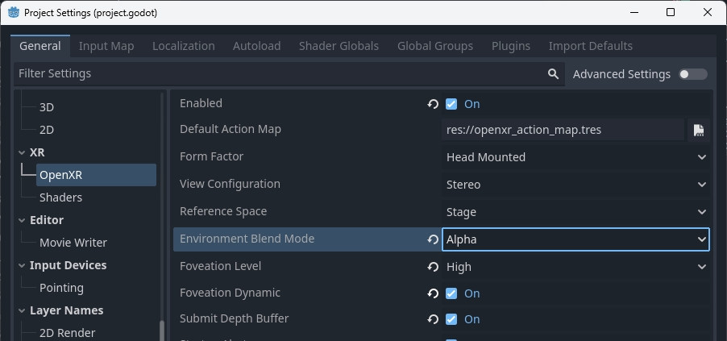
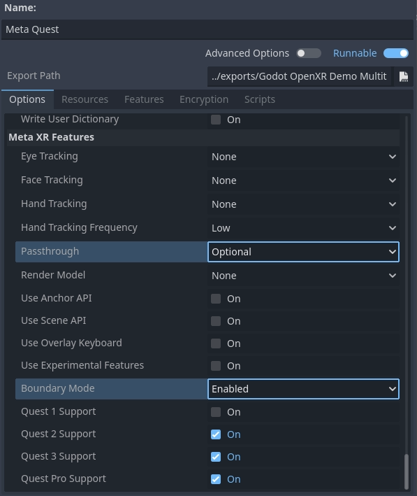
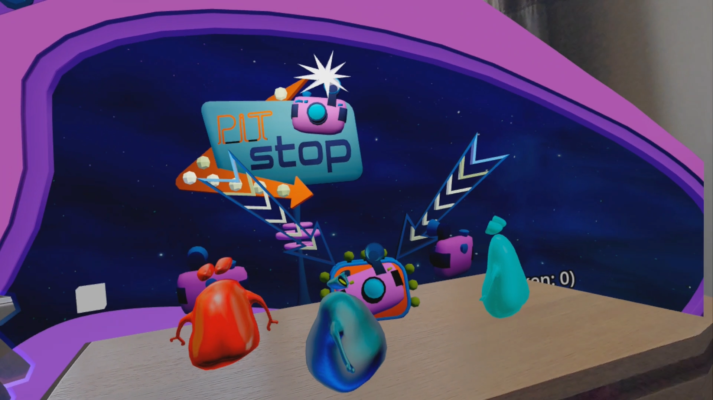

.. _doc_openxr_passthrough:

AR / Passthrough
================

Augmented Reality is supported through various methods depending on the capabilities of the hardware.

Headsets such as the Magic Leap and glasses such as TiltFive show the rendered result on
`see-through displays <https://en.wikipedia.org/wiki/See-through_display>`__ allowing the user
to see the real world.

Headsets such as the Quest, HTC Elite, and Lynx R1 implement this through a technique called video passthrough,
where cameras record the real world and these images are used as the background on top of which our rendered
result is used.

.. note::

    Passthrough is implemented very differently across platforms.

    In Godot 4.3 we have implemented a unified approach that is explained on this help page
    so you don't need to worry about these differences, the :ref:`XRInterface <class_xrinterface>`
    implementation is now responsible for applying the correct platform-dependent method [#]_.

    For headsets such as the Meta Quest and HTC Elite you will need to use the
    `OpenXR vendors plugin v3.0.0 <https://github.com/GodotVR/godot_openxr_vendors/releases>`__
    or later to enable video passthrough.

    For backwards compatibility the old API for passthrough is still available but it is recommended
    to follow the new instructions below.

Environment blend modes
-----------------------

The way we configure VR or AR functionality is through setting the environment blend mode.
This mode determines how the (real world) environment is blended with the virtual world.

.. list-table:: Blend modes
  :widths: 35 65
  :header-rows: 1

  * - Blend mode
    - Description
  * - XR_ENV_BLEND_MODE_OPAQUE
    - The rendered image is opaque, we do not see the real world. We're in VR mode.
      This will turn off passthrough if video-passthrough is used.
  * - XR_ENV_BLEND_MODE_ADDITIVE
    - The rendered image is added to the real world and will look semi transparent.
      This mode is generally used with see-through devices that are unable to obscure
      the real world.
      This will turn on passthrough if video-passthrough is used.
  * - XR_ENV_BLEND_MODE_ALPHA_BLEND
    - The rendered image is alpha blended with the real world.
      On see-through devices that support this, the alpha will control the translucency
      of the optics.
      On video-passthrough devices alpha blending is applied with the video image.
      passthrough will also be enabled if applicable. 
        
You can set the environment blend mode for your application through the ``environment_blend_mode``
property of the :ref:`XRInterface <class_xrinterface>` instance.

You can query the supported blend modes on the hardware using the
``get_supported_environment_blend_modes`` property on the same instance.

Configuring your background
---------------------------

When setting the blend mode to ``XR_ENV_BLEND_MODE_ALPHA_BLEND`` you must set
the ``transparent_bg`` property on :ref:`Viewport <class_viewport>` to true.
When using the ``XR_ENV_BLEND_MODE_ADDITIVE`` blend mode you should set your
background color to black.

Either solution will result in the background rendering not contributing to lighting.
It is thus also recommended you adjust your environment settings accordingly and ensure
there is adequate ambient light set to illuminate your scene.

.. note::

    Some AR SDKs do provide ambient lighting information or even provide a full radiance
    map to allow for real world reflections in your virtual objects.
    The core Godot XR functionality doesn't currently have support for this, however this
    functionality can be exposed through plugins.

OpenXR specific
---------------

In OpenXR you can configure the default blend mode you want to use.
Godot will select this blend mode at startup if available.
If not available Godot will default to the first supported blend mode provided
by the XR runtime.

For passthrough devices OpenXR requires additional settings to be configured.
These settings are platform-dependent and provided through the OpenXR vendors plugin.

For example, these are the settings required on Meta Quest:

The ``Passthrough`` setting defines whether passthrough is supported or even required.

The ``Boundary Mode`` allows you to define whether the guardian is needed,
disabling this fully requires passthrough to be enabled at all times.

Putting it together
-------------------

Putting the above together we can use the following code as a base:

.. code-block:: gdscript

    @onready var viewport : Viewport = get_viewport()
    @onready var environment : Environment = $WorldEnvironment.environment

    func switch_to_ar() -> bool:
        var xr_interface: XRInterface = XRServer.primary_interface
        if xr_interface:
            var modes = xr_interface.get_supported_environment_blend_modes()
            if XRInterface.XR_ENV_BLEND_MODE_ALPHA_BLEND in modes:
                xr_interface.environment_blend_mode = XRInterface.XR_ENV_BLEND_MODE_ALPHA_BLEND
                viewport.transparent_bg = true
            elif XRInterface.XR_ENV_BLEND_MODE_ADDITIVE in modes:
                xr_interface.environment_blend_mode = XRInterface.XR_ENV_BLEND_MODE_ADDITIVE
                viewport.transparent_bg = false
        else:
            return false

        environment.background_mode = Environment.BG_COLOR
        environment.background_color = Color(0.0, 0.0, 0.0, 0.0)
        environment.ambient_light_source = Environment.AMBIENT_SOURCE_COLOR
        return true

    func switch_to_vr() -> bool:
        var xr_interface: XRInterface = XRServer.primary_interface
        if xr_interface:
            var modes = xr_interface.get_supported_environment_blend_modes()
            if XRInterface.XR_ENV_BLEND_MODE_OPAQUE in modes:
                xr_interface.environment_blend_mode = XRInterface.XR_ENV_BLEND_MODE_OPAQUE
            else:
                return false

        viewport.transparent_bg = false
        environment.background_mode = Environment.BG_SKY
        environment.ambient_light_source = Environment.AMBIENT_SOURCE_BG
        return true

Shadow to opacity
-----------------

Shadow to opacity is a render mode for Godot spatial shaders
that was introduced in Godot 3 specifically for AR.
It is a special render mode where the more a surface is in shadow,
the more opaque the surface becomes. When a surface is fully lit,
the surface becomes fully transparent and thus shows the real world.

However the surface is rendered during the opaque state effectively.
This has two consequences:

* As both the depth buffer and color buffer are written to, we occlude
  any geometry behind our surface even when fully transparent.
* As we are making the surface opaque if in shadow, we can have virtual
  objects cast shadows on real world objects [#]_.

    Image showing shadow to opacity being used to show the user's desk.

This enabled the following use cases:

* You can render a box mesh around a real world table, this ensures the
  table remains visible even if a virtual object is placed underneath it.
  The virtual object will be correctly occluded.
  Placing a virtual object on top of the real world table, will result in
  a shadow being cast on the table.
* You can use a shader with this render mode when render a hand mesh
  using the hand tracking functionality, and ensure your hands properly
  occlude virtual objects.

The following shader code is a good base for this functionality:

.. code-block:: glsl

    shader_type spatial;
    render_mode blend_mix, depth_draw_opaque, cull_back, shadow_to_opacity;

    void fragment() {
        ALBEDO = vec3(0.0, 0.0, 0.0);
    }

.. [#] Restrictions may apply depending on XR interface implementation.
.. [#] This feature is still being perfected.
