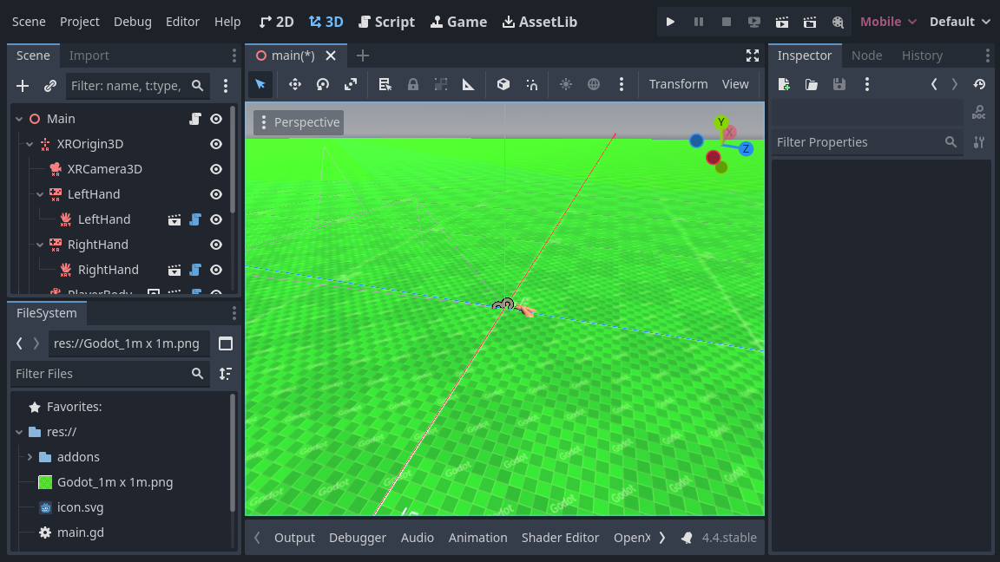
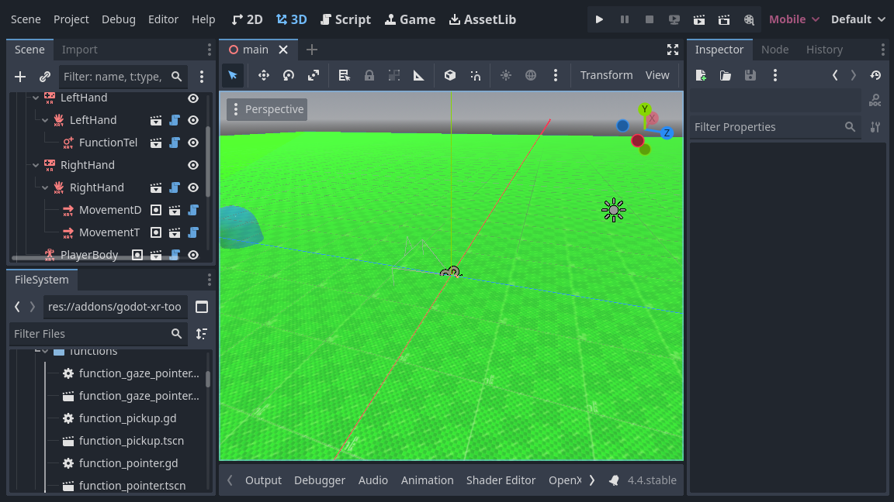

.. _doc_basic_xr_locomotion:

Basic XR Locomotion
===================

For basic locomotion we're going to continue using our Godot XR Tools library. The library contains both basic movement features as more advanced features.

Adding our player body
----------------------

The first step we need to do is to add a helper node to our :ref:`XROrigin3D <class_xrorigin3d>` node.
Because XR supports roomscale tracking you can't simply add your XR setup to a :ref:`CharacterBody3D <class_characterbody3d>` node and expect things to work.
You will run into trouble when the user moves around their physical space and is no longer standing in the center of their room.
Godot XR Tools embeds the needed logic into a helper node called ``PlayerBody``.

Select your :ref:`XROrigin3D <class_xrorigin3d>` node and click on the ``instantiate Child Scene`` button to add a child scene.
Select ``addons/godot-xr-tools/player/player_body.tscn`` and add this node.

Adding a floor
--------------

This node governs the in game movement of your character and will immediately react to gravity.
So to prevent our player from infinitely falling down we'll quickly add a floor to our scene.

We start by adding a :ref:`StaticBody3D <class_staticbody3d>` node to our root node and we rename this to ``Floor``.
We add a :ref:`MeshInstance3D <class_meshinstance3d>` node as a child node for our ``Floor``. 
Then create a new :ref:`PlaneMesh <class_planemesh>` as it's mesh.
For now we set the size of the mesh to 100 x 100 meters.
Next we add a :ref:`CollisionShape3D <class_collisionshape3d>` node as a child node for our ``Floor``.
Then create a ``BoxShape`` as our shape.
We set the size of this box shape to 100 x 1 x 100 meters.
We also need to move our collision shape down by 0.5 meters so the top of our box is flush with the floor.

To make it easier to see that we're actually moving around our world, a white floor isn't going to do it.
For this we add a material to our PlaneMesh and set the albedo to a grid texture we've created with `Wahooneys excellent free texture generator <https://wahooney.itch.io/texture-grid-generator>`_. 

Direct movement
---------------

We're going to start adding some basic direct movement to our setup.
This allows the user to move through the virtual world using joystick input.

.. note::
  It is important to note that moving through the virtual world while the player is standing still in the real world, can be nausea inducing especially for players who are new to VR.
  The default settings on our movement functions are fairly conservative.
  We advise you to stick to these defaults but offer features in game to enable less comfortable settings for more experienced users who are used to playing VR games.

We want to enable this on the right hand controller.
We do this by adding a subscene to the right hand :ref:`XRController3D <class_xrcontroller3d>` node.
Select ``addons/godot-xr-tools/functions/movement_direct.tscn`` as the scene to add.

This function adds forward and backwards movement to the player by using the joystick on the right hand controller.
It has an option to also add left/right strafe but by default this is disabled.

Instead, we are going to add the ability for the player to also turn with this joystick.
We will add another subscene to our controller node, select ``addons/godot-xr-tools/functions/movement_turn.tscn`` for this.

The turn system by default uses a snap turn approach.
This means that turning happens in steps.
This may seem jarring however it is a tried and tested method of combating motion sickness.
You can easily switch to a mode that offers smooth turning by changing the ``mode`` property on the turn node.

If you run your game at this point in time you will find that you can move through the world freely using the right hand joystick.

Teleport
--------

An alternative to direct movement that some users find more pleasant is the ability to teleport to another location within your game world.
Godot XR Tools supports this through the teleport function and we will be adding this to our left hand controller.

Add a new child scene to your left hand :ref:`XRController3D <class_xrcontroller3d>` node by selecting the ``addons/godot-xr-tools/functions/function_teleport.tscn`` scene.

With this scene added the player will be able to teleport around the world by pressing the trigger on the left hand controller, pointing where they want to go, and then releasing the trigger.
The player can also adjust the orientation by using the left hand controllers joystick.

If you've followed all instructions correctly your scene should now look something like this:

More advanced movement features
-------------------------------

Godot XR Tools adds many more movement features such as gliding, a grapple hook implementation, a jetpack, climbing mechanics, etc.

Most work similarly to the basic movement features we've handled so far, simply add the relevant subscene from the plugin to the controller that implements it. 

We'll look at some of these in more detail later on in this tutorial where additional setup is required (such as climbing) but for others please look at Godot XR Tools own help pages for details.
