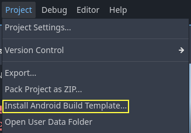
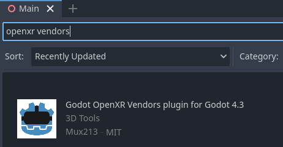
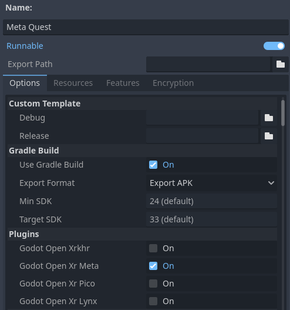
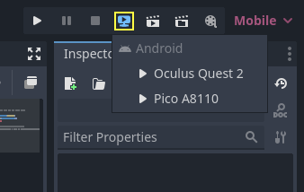

.. _doc_deploying_to_android:

Deploying to Android
====================

Setup
------------
Most standalone headsets run on Android and OpenXR support is making its way to these platforms.

Before following the OpenXR-specific instructions here, you'll need to first setup your system to export to Android in general, including:

- Installing OpenJDK 17
- Installing Android Studio
- Configuring the location of the Android SDK in Godot

See :ref:`doc_exporting_for_android` for the full details, and return here when you've finished these steps.

.. warning::
    While the Mobile Vulkan renderer has many optimizations targeted at mobile devices, we're still working out the kinks.
    It is highly advisable to use the compatibility renderer (OpenGL) for the time being when targeting Android based XR devices.

Gradle Android build
--------------------

.. note::
    Official support for the Android platform wasn't added to the OpenXR specification initially resulting in various vendors creating custom loaders to make OpenXR available on their headsets.
    While the long term expectation is that all vendors will adopt the official OpenXR loader, for now these loaders need to be added to your project.

In order to include the vendor-specific OpenXR loader into your project, you will need to setup a gradle Android build.

Select **Install Android Build Template...** from the **Project** menu:

This will create a folder called **android** inside of your project that contains all the runtime files needed on Android. You can now customize this installation. Godot won't show this in the editor but you can find it with a file browser.

You can read more about gradle builds here: :ref:`doc_android_gradle_build`.

Installing the vendors plugin
-----------------------------

The vendors plugin can be downloaded from the asset library, search for "OpenXR vendors"
and install the one named "Godot OpenXR Vendors plugin v4".

You will find the installed files inside the **addons** folder. Alternatively you
can manually install the vendors plugin by downloading it `from the release page here <https://github.com/GodotVR/godot_openxr_vendors/releases>`__.
You will need to copy the `assets/addons/godotopenxrvendors` folder from the zip
file into your projects `addons` folder.

You can find the main repository of the vendors plugin `here <https://github.com/GodotVR/godot_openxr_vendors>`__.

Creating the export presets
---------------------------
You will need to setup a separate export preset for each device, as each device will need its own loader included.

Open **Project** and select **Export..**.
Click on **Add..** and select **Android**.
Next change the name of the export preset for the device you're setting this up for, say **Meta Quest**.
And enable **Use Gradle Build**.
If you want to use one-click deploy (described below), ensure that **Runnable** is enabled.

If the vendors plugins were installed correctly you should find entries for the
different headsets under **XR Features**. Change the **XR Mode** to **OpenXR**, then
select the entry for your headset if you see one. If you don't see one enable the
Khronos plugin.

Scroll to the bottom of the list and you'll find additional XR feature sections,
currently only **Meta XR Features**, **Pico XR Features**, **Magicleap XR Features**
and **Khronos XR Features** for HTC are available. You will need to select the
appropriate settings if you wish to use these features.

Running on your device from the Godot editor
--------------------------------------------
If you've setup your export settings as described above, and your headset is connected to your computer and correctly recognized, you can launch it directly from the Godot editor using :ref:`doc_one-click_deploy`:

For some devices on some platforms, you may need to perform some extra steps in order for your device to be recognized correctly, so be sure to check the developer documentation from your headset vendor.

For example, with the Meta Quest 2, you need to enable developer mode on the headset, and if you're on Windows, you'll need to install special ADB drivers. See the `official Meta Quest developer documentation <https://developer.oculus.com/documentation/native/android/mobile-device-setup/>`_ for more details.

If you're having any issues with one-click deploy, check the :ref:`Troubleshooting section <doc_one-click_deploy_troubleshooting>`.
