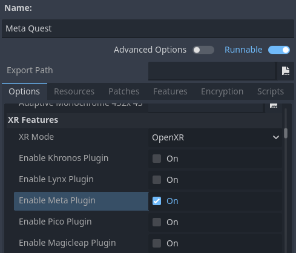

.. _doc_deploying_to_android:

Deploying to Android
====================

Setup
------------
Most mobile headsets run on Android and OpenXR support is making its way to these platforms. There are specific requirements for deploying XR projects to Android.
For general requirements around exporting to Android, please first read :ref:`doc_exporting_for_android`.

.. note::
	Official support for the Android platform wasn't added to the OpenXR specification initially resulting in various vendors creating custom loaders to make OpenXR available on their headsets.
	While the long term expectation is that all vendors will adopt the official OpenXR loader, for now these loaders need to be added to your project.

Custom Android build
--------------------
In order to deploy the loaders into your project you will need to setup a custom Android build.

Select **Install Android Build Template...** from the **Project** menu:

.. image:: img/android_custom_build.webp

This will create a folder called **android** inside of your project that contains all the runtime files needed on Android. You can now customize this installation. Godot won't show this in the editor but you can find it with a file browser.

You can read more about custom builds here: :ref:`doc_android_custom_build`.

Installing the loader plugins
-----------------------------
Inside the **android** folder you will find a subfolder called **plugins**, we will need to install our loader plugins into this folder.

.. note::
	Once an official release becomes available you will be able to install this plugin through the asset library. For now this is a manual install.

You can find the loader plugin `here <https://github.com/GodotVR/godot_openxr_loaders/releases>`__.

Download the **godotopenxrloaders.zip** file for the release marked as **Latest**. From this zip file copy the files found in **asset/android/plugins** into the **android/plugins** folder of your project.

Creating the export templates
-----------------------------
You will need to setup a separate export template for each device as each device will need its own loader included.

Open **Project** and select **Export..**.
Click on **Add..** and select **Android**.
Next change the name of the export profile for the device you're setting this up for, say **Meta Quest**.
And enable **Use Custom Build**.

If the loader plugins were installed correctly you should find entries for the different headsets, select the entry for meta:

Scroll further down the list until you find the **XR Features** section.
Change the **XR Mode** to **OpenXR**.
The hand tracking and passthrough settings here currently only work for the Meta Quest and you will need to select the appropriate settings if you wish to use these features.

.. image:: img/xr_export_features.webp

Now you can repeat the same process for the other devices. Note that if you wish to test your game with Godots one-click deploy, you have to mark the export profile for your device as **Runnable** so Godot knows which loader to deploy.

.. note::
	Currently only Meta Quest and PICO are supported. Other loaders will be added as soon as possible.

.. warning::
	While the Mobile Vulkan renderer has many optimizations targeted at mobile devices, we're still working out the kinks. It is highly advisable to use the OpenGL renderer for the time being when targeting Android based XR devices.

	Note that we are awaiting a driver update on the PICO before Vulkan support will work on PICO devices.

