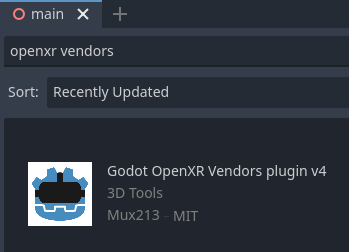

.. _doc_deploying_to_android:

Deploying to Android
====================

Setup
------------
Most standalone headsets run on Android and OpenXR support is making its way to these platforms.

Before following the OpenXR-specific instructions here, you'll need to first setup your system to export to Android in general, including:

- Installing OpenJDK 11
- Installing Android Studio
- Creating a debug.keystore
- Configuring the location of the Android SDK and debug.keystore in Godot

See :ref:`doc_exporting_for_android` for the full details, and return here when you've finished these steps.

Custom Android build
--------------------

.. note::
    Official support for the Android platform wasn't added to the OpenXR specification initially resulting in various vendors creating custom loaders to make OpenXR available on their headsets.
    While the long term expectation is that all vendors will adopt the official OpenXR loader, for now these loaders need to be added to your project.

In order to include the vendor-specific OpenXR loader into your project, you will need to setup a custom Android build.

Select **Install Android Build Template...** from the **Project** menu:

.. image:: img/android_custom_build.webp

This will create a folder called **android** inside of your project that contains all the runtime files needed on Android. You can now customize this installation. Godot won't show this in the editor but you can find it with a file browser.

You can read more about custom builds here: :ref:`doc_android_custom_build`.

Installing the loader plugins
-----------------------------

.. warning::
    The Android plugin structure has been restructured in Godot 4.2, if you've previously installed the loader plugin you need to delete it from the `android/plugins` folder.
    The loader plugin available in the asset library is still the old one, it will be updated to the new one after 4.2 is released.

The loaders can be downloaded from the asset library, search for OpenXR Loaders and install the plugin:

You will find the installed files inside the **addons** folder.

Alternatively you can manually install the loader plugin by downloading the v2.x version of the plugin `from the release page here <https://github.com/GodotVR/godot_openxr_loaders/releases>`__.

You will need to copy the `assets/addons/godotopenxr` folder from the zip file into your projects `assets/addons` folder.

You can find the main repository of the loader plugin `here <https://github.com/GodotVR/godot_openxr_loaders>`__.

Creating the export presets
---------------------------
You will need to setup a separate export preset for each device, as each device will need its own loader included.

Open **Project** and select **Export..**.
Click on **Add..** and select **Android**.
Next change the name of the export preset for the device you're setting this up for, say **Meta Quest**.
And enable **Use Gradle Build**.
If you want to use one-click deploy (described below), ensure that **Runnable** is enabled.

If the loader plugins were installed correctly you should find entries for the different headsets, select the entry for meta:

.. image:: img/android_meta_quest.webp

Also change the **XR Mode** to **OpenXR**.

Scroll to the bottom of the list and you'll find additional XR feature sections, currently only **Meta XR Features** is available.
The hand tracking and passthrough settings here currently only work for the Meta Quest and you will need to select the appropriate settings if you wish to use these features.

.. image:: img/xr_export_features.webp

Now you can repeat the same process for the other devices.

.. note::
    There are separate loaders for the Meta Quest, Pico and Lynx R1 headsets.

    The fourth option is the official Khronos (KHR) loader, in due time all headsets should work with this loader.
    At the moment this loader has been tested with the Magic Leap 2 and standalone HTC headsets.

.. warning::
    While the Mobile Vulkan renderer has many optimizations targeted at mobile devices, we're still working out the kinks.
    It is highly advisable to use the OpenGL renderer for the time being when targeting Android based XR devices.

    Note that we are awaiting driver updates on various devices before Vulkan support will work on these.

Running on your device from the Godot editor
--------------------------------------------
If you've setup your export settings as described above, and your headset is connected to your computer and correctly recognized, you can launch it directly from the Godot editor using :ref:`doc_one-click_deploy`:

.. image:: img/android_one_click_deploy.webp

For some devices on some platforms, you may need to perform some extra steps in order for your device to be recognized correctly, so be sure to check the developer documentation from your headset vendor.

For example, with the Meta Quest 2, you need to enable developer mode on the headset, and if you're on Windows, you'll need to install special ADB drivers. See the `official Meta Quest developer documentation <https://developer.oculus.com/documentation/native/android/mobile-device-setup/>`_ for more details.

If you're having any issues with one-click deploy, check the :ref:`Troubleshooting section <doc_one-click_deploy_troubleshooting>`.
