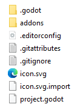
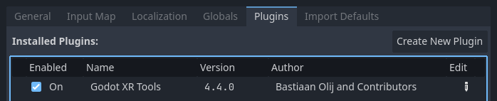
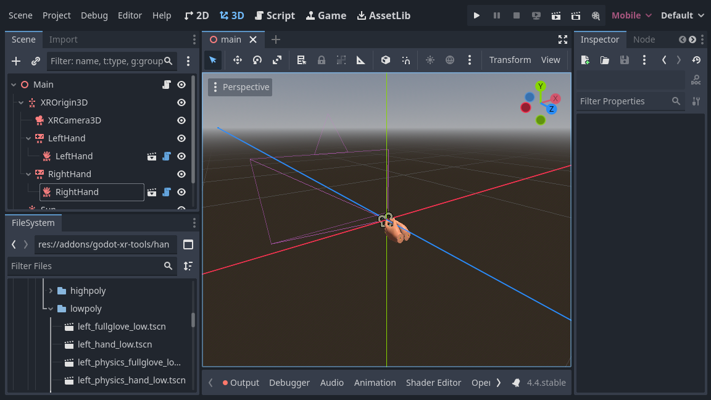

.. _doc_introducing_xr_tools:

Introducing XR tools
====================

Out of the box Godot gives you all the basic support to setup an XR project.
XR specific game mechanics however need to be implemented on top of this foundation.
While Godot makes this relatively easy this can still be a daunting task.

For this reason Godot has developed a toolkit called `Godot XR Tools <https://github.com/GodotVR/godot-xr-tools>`_
that implements many of the basic mechanics found in XR games, from locomotion to object interaction to UI interaction. 

This toolkit is designed to work with both OpenXR and WebXR runtimes.
We'll be using this as a base for our documentation here.
It helps developers hit the ground running but for more specific use cases building your own logic is just as valid.
In that case XR tools can help in providing inspiration.

Installing XR Tools
-------------------

Continuing on from our project we started in :ref:`doc_setting_up_xr` we want to add in the Godot XR Tools library.
This can be downloaded from the `Godot XR Tools releases page <https://github.com/GodotVR/godot-xr-tools/releases>`_.
Find the latest release for Godot 4, and under **Assets**, download the
``godot-xr-tools.zip`` file. You can also find it in the asset library with the
title "Godot XR Tools for Godot 4".

If you're using the zip file, once it's downloaded unzip it.
You will notice the files are held within a ``godot-xr-tools`` subfolder.
Inside of this folder you will find an ``addons`` folder.
It is this folder that you want to copy in its entirety to your Godot project folder. Your project should now look something like this:

Now open up your project in Godot, if you haven't already, and give it a minute or
so to import all the resources of the plugin. If it asks for a path to Blender to
be set you can just click the option to disable blender import and restart the
editor.

After the import finishes you may notice that several "failed to load script"
messages popped up, that's normal, the plugin just needs to be enabled in the
project settings.

Next open the ``Project`` menu and select ``Project Settings..``.
Now go to the ``Plugins`` tab and enable the plugin.

After doing that you need to close and re-open your project so everything is
properly enabled.

Basic hands
-----------

Just to get a feel of things we're going to add a few standard components that dress up our scene starting with hands for our player.

OpenXR supports full hand tracking however there currently are significant differences in capabilities between the different XR Runtimes.

As a reliable alternative Godot XR Tools comes with a number of rigged hand scenes that react on trigger and grip inputs of your controller.
These hands come in low and high poly versions, come in a few configurations, a number of animation files to control finger positions and a number of different textures.

In your scene tree select your left hand :ref:`XRController3D <class_xrcontroller3d>` node.
Now click on the **instantiate Child Scene** button to add a child scene. Click the
**addons** toggle so the addons folder can be searched. Then search for ``left_hand_low.tscn``,
and select it.

As you can see from the path of this scene, low poly models are in the ``lowpoly`` subfolder while high poly models are in the ``highpoly`` subfolder.
You will want to use the low poly versions if you plan to release your game on mobile devices.

The default hand we chose is just a hand. The other options are:

  * tac_glove - the hand is wearing a glove with fingers exposed
  * full_glove - the hand is wearing a glove that covers the entire hand

Finally each hand comes in a ``physics`` version.
This exposes all the bones.
We'll look at how that can be used in another tutorial.

We repeat the same for the right hand.

More information
----------------

We'll continue with adding features to our tutorial project using Godot XR tools in the next couple of pages.
More detailed information about the toolkit can be found `on the toolkits help pages <https://godotvr.github.io/godot-xr-tools/>`_.
