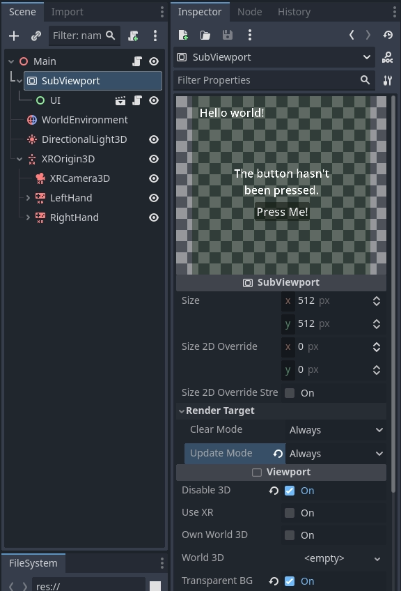
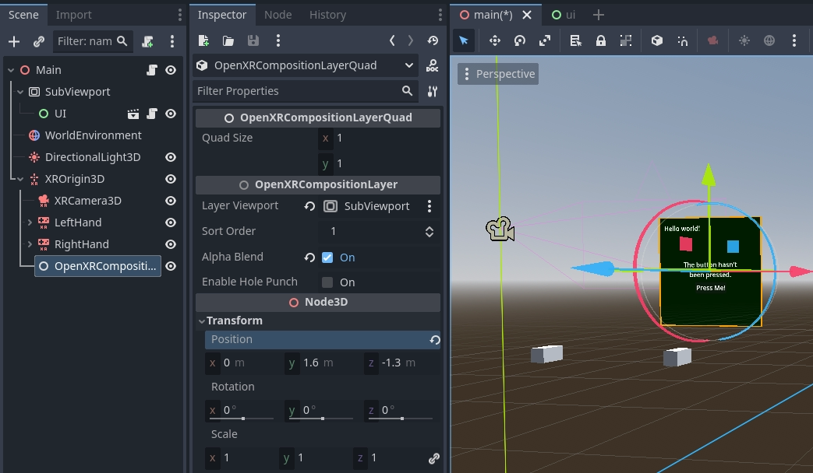
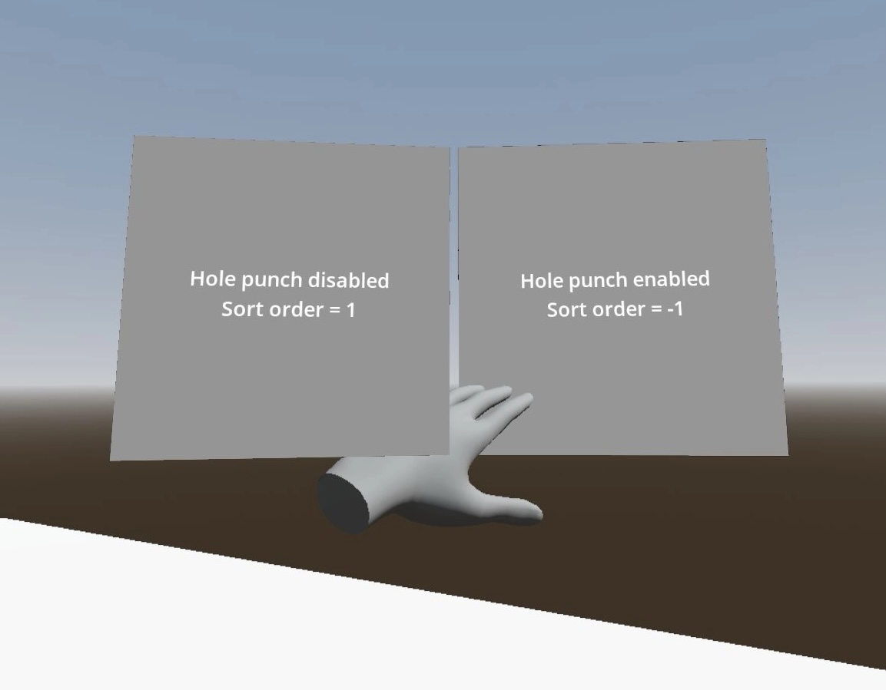

.. _doc_openxr_composition_layers:

OpenXR composition layers
=========================

Introduction
------------

In XR games you generally want to create user interactions that happen in 3D space 
and involve users touching objects as if they are touching them in real life.

Sometimes however creating a more traditional 2D interface is unavoidable.
In XR however you can't just add 2D components to your scene.
Godot needs depth information to properly position these elements so they appear at
a comfortable place for the user.
Even with depth information there are headsets with slanted displays that make it impossible 
for the standard 2D pipeline to correctly render the 2D elements.

The solution then is to render the UI to a :ref:`SubViewport <class_subviewport>`
and display the result of this using a :ref:`ViewportTexture <class_viewporttexture>` on a 3D mesh.
The :ref:`QuadMesh <class_quadmesh>` is a suitable option for this.

.. note::
    See the `GUI in 3D <https://github.com/godotengine/godot-demo-projects/tree/master/viewport/gui_in_3d>`_
    example project for an example of this approach.

The problem with displaying the viewport in this way is that the rendered result
is sampled for lens distortion by the XR runtime and the resulting quality loss 
can make UI text hard to read.

OpenXR offers a solution to this problem through composition layers.
With composition layers it is possible for the contents of a viewport to be projected
on a surface after lens distortion resulting in a much higher quality end result.

.. note::
    As not all XR runtimes support all composition layer types,
    Godot implements a fallback solution where we render the viewport
    as part of the normal scene but with the aforementioned quality
    limitations.

.. warning::
    When the composition layer is supported,
    it is the XR runtime that presents the subviewport.
    This means the UI is only visible in the headset,
    it will not be accessible by Godot and will thus
    not be shown when you have a spectator view on the desktop.

There are currently 3 nodes that expose this functionality:

- :ref:`OpenXRCompositionLayerCylinder <class_OpenXRCompositionLayerCylinder>` shows the contents of the SubViewport on the inside of a cylinder (or "slice" of a cylinder).
- :ref:`OpenXRCompositionLayerEquirect <class_OpenXRCompositionLayerEquirect>` shows the contents of the SubViewport on the interior of a sphere (or "slice" of a sphere).
- :ref:`OpenXRCompositionLayerQuad <class_OpenXRCompositionLayerQuad>` shows the contents of the SubViewport on a flat rectangle. 

Setting up the SubViewport
--------------------------

The first step is adding a SubViewport for our 2D UI,
this doesn't require any specific steps.
For our example we do mark the viewport as transparent.

You can now create the 2D UI by adding child nodes to the SubViewport as you normally would.
It is advisable to save the 2D UI in a subscene, this makes it easier to do your layout.

.. warning::
    The update mode "When Visible" will not work as Godot can't determine whether
    the viewport is visible to the user.
    When assigning our viewport to a composition layer Godot will automatically adjust this.

Adding a composition layer
--------------------------

The second step is adding our composition layer.
We can add the correct composition layer node as a child node of
our :ref:`XROrigin3D <class_xrorigin3d>` node.
This is very important as the XR runtime positions everything in relation to our origin.

We want to position the composition layer so it is at eye height and roughly 1 to 1.5 meters
away from the player.

We now assign the SubViewport to the ``Layer Viewport`` property and enable Alpha Blend.

.. note::
    As the player can walk away from the origin point,
    you will want to reposition the composition layer when the player recenters the view.
    Using the reference space ``Local Floor`` will apply this logic automatically.

Making the interface work
-------------------------

So far we're only displaying our UI, to make it work we need to add some code.
For this example we're going to keep things simple and
make one of the controllers work as a pointer.
We'll then simulate mouse actions with this pointer.

This code also requires a ``MeshInstance3D`` node called ``Pointer`` to be added
as a child to our ``OpenXRCompositionLayerQuad`` node.
We configure a ``SphereMesh`` with a radius ``0.01`` meters.
We'll be using this as a helper to visualize where the user is pointing.

The main function that drives this functionality is the ``intersects_ray``
function on our composition layer node.
This function takes the global position and orientation of our pointer and returns
the UV where our ray intersects our viewport.
It returns ``Vector2(-1.0, -1.0)`` if we're not pointing at our viewport.

We start with setting up some variables, important here are the export variables
which identify our controller node with which we point to our screen.

.. code:: gdscript

    extends OpenXRCompositionLayerQuad

    const NO_INTERSECTION = Vector2(-1.0, -1.0)

    @export var controller : XRController3D
    @export var button_action : String = "trigger_click"

    var was_pressed : bool = false
    var was_intersect : Vector2 = NO_INTERSECTION

    ...

Next we define a helper function that takes the value returned from ``intersects_ray``
and gives us the global position for that intersection point.
This implementation only works for our ``OpenXRCompositionLayerQuad`` node.

.. code:: gdscript

    ...

    func _intersect_to_global_pos(intersect : Vector2) -> Vector3:
        if intersect != NO_INTERSECTION:
            var local_pos : Vector2 = (intersect - Vector2(0.5, 0.5)) * quad_size
            return global_transform * Vector3(local_pos.x, -local_pos.y, 0.0)
        else:
            return Vector3()

    ...

We also define a helper function that takes our ``intersect`` value and
returns our location in the viewport's local coordinate system:

.. code:: gdscript

    ...

    func _intersect_to_viewport_pos(intersect : Vector2) -> Vector2i:
        if layer_viewport and intersect != NO_INTERSECTION:
            var pos : Vector2 = intersect * Vector2(layer_viewport.size)
            return Vector2i(pos)
        else:
            return Vector2i(-1, -1)

    ...

The main logic happens in our ``_process`` function.
Here we start by hiding our pointer,
we then check if we have a valid controller and viewport,
and we call ``intersects_ray`` with the position and orientation of our controller:

.. code:: gdscript

    ...

    # Called every frame. 'delta' is the elapsed time since the previous frame.
    func _process(_delta):
        # Hide our pointer, we'll make it visible if we're interacting with the viewport.
        $Pointer.visible = false

        if controller and layer_viewport:
            var controller_t : Transform3D = controller.global_transform
            var intersect : Vector2 = intersects_ray(controller_t.origin, -controller_t.basis.z)

    ...

Next we check if we're intersecting with our viewport.
If so, we check if our button is pressed and place our pointer at our intersection point.

.. code:: gdscript

    ...

            if intersect != NO_INTERSECTION:
                var is_pressed : bool = controller.is_button_pressed(button_action)

                # Place our pointer where we're pointing
                var pos : Vector3 = _intersect_to_global_pos(intersect)
                $Pointer.visible = true
                $Pointer.global_position = pos

    ...

If we were intersecting in our previous process call and our pointer has moved,
we prepare an :ref:`InputEventMouseMotion <class_InputEventMouseMotion>` object
to simulate our mouse moving and send that to our viewport for further processing.

.. code:: gdscript

    ...

                if was_intersect != NO_INTERSECTION and intersect != was_intersect:
                    # Pointer moved
                    var event : InputEventMouseMotion = InputEventMouseMotion.new()
                    var from : Vector2 = _intersect_to_viewport_pos(was_intersect)
                    var to : Vector2 = _intersect_to_viewport_pos(intersect)
                    if was_pressed:
                        event.button_mask = MOUSE_BUTTON_MASK_LEFT 
                    event.relative = to - from
                    event.position = to
                    layer_viewport.push_input(event)

    ...

If we've just released our button we also prepare
an :ref:`InputEventMouseButton <class_InputEventMouseButton>` object
to simulate a button release and send that to our viewport for further processing.

.. code:: gdscript

    ...

                if not is_pressed and was_pressed:
                    # Button was let go?
                    var event : InputEventMouseButton = InputEventMouseButton.new()
                    event.button_index = 1
                    event.pressed = false
                    event.position = _intersect_to_viewport_pos(intersect)
                    layer_viewport.push_input(event)

    ...

Or if we've just pressed our button we prepare
an :ref:`InputEventMouseButton <class_InputEventMouseButton>` object
to simulate a button press and send that to our viewport for further processing.

.. code:: gdscript

    ...

                elif is_pressed and not was_pressed:
                    # Button was pressed?
                    var event : InputEventMouseButton = InputEventMouseButton.new()
                    event.button_index = 1
                    event.button_mask = MOUSE_BUTTON_MASK_LEFT
                    event.pressed = true
                    event.position = _intersect_to_viewport_pos(intersect)
                    layer_viewport.push_input(event)

    ...

Next we remember our state for next frame.

.. code:: gdscript

    ...

                was_pressed = is_pressed
                was_intersect = intersect

    ...

Finally, if we aren't intersecting, we clear our state.

.. code:: gdscript

    ...

            else:
                was_pressed = false
                was_intersect = NO_INTERSECTION

Hole punching
-------------

As the composition layer is composited on top of the render result,
it can be rendered in front of objects that are actually forward of the viewport.

By enabling hole punch you instruct Godot to render a transparent object
where our viewport is displayed.
It does this in a way that fills the depth buffer and clears the current rendering result.
Anything behind our viewport will now be cleared,
while anything in front of our viewport will be rendered as usual.

You also need to set ``Sort Order`` to a negative value,
the XR compositor will now draw the viewport first, and then overlay our rendering result.

   Use case showing how the user's hand is incorrectly obscured
   by a composition layer when hole punching is not used.
