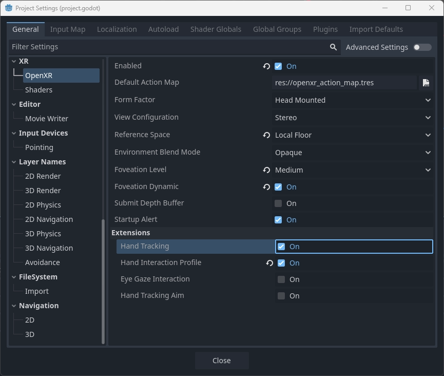
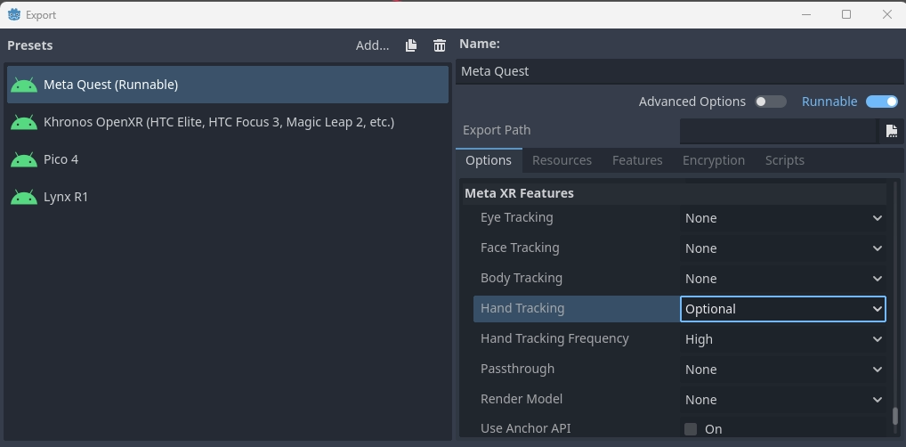
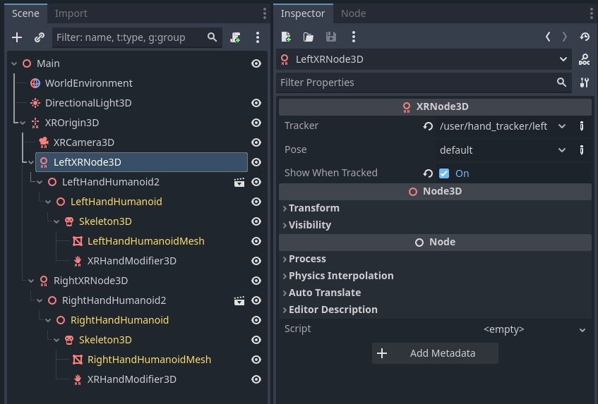
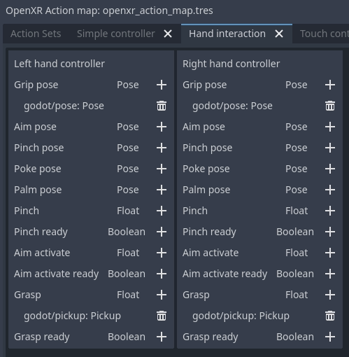
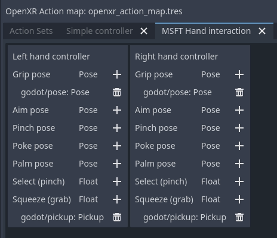
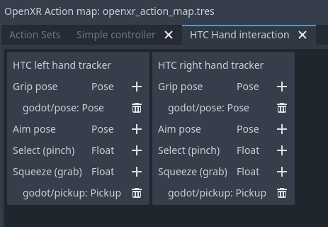
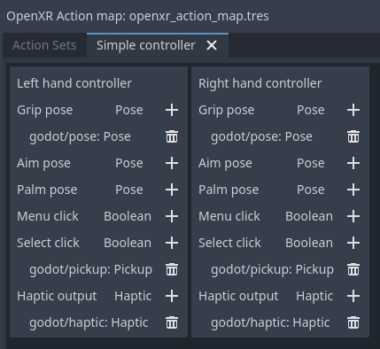

.. _doc_openxr_hand_tracking:

OpenXR hand tracking
====================

Introduction
------------

.. note::

    This page focuses specifically on the feature set exposed through OpenXR.
    Parts of the functionality presented here also applies to WebXR and can by provided
    by other XR interfaces.

When discussing hand tracking it is important to know that there are differences of opinion as to where lines are drawn.
The practical result of this is that there are differences in implementation between the different OpenXR runtimes.
You may find yourself in a place where chosen hardware doesn't support a piece of the puzzle or does things differently
enough from the other platforms that you need to do extra work.

That said, recent improvements to the OpenXR specification are closing these gaps and as platforms implement
these improvements we are getting closer to a future where we have either full portability between platforms
or at least a clear way to detect the capabilities of a platform.

When we look at the early days of VR the focus of the major platforms was on tracked controller based input.
Here we are tracking a physical device that also has buttons for further input.
From the tracking data we can infer the location of the player's hands but no further information is known,
traditionally it was left up to the game to implement a mechanism to display the player's hand and animate
the fingers based on further input from the controller, be it due to buttons being pressed or through proximity
sensors.
Often fingers are also placed based on context, what the user is holding, and what action a user is performing.

More recently optical hand tracking has become a popular solution, where cameras track the user's hands
and full tracking data for the hand and finger positions becomes available.
Many vendors saw this as completely separate from controller tracking and introduced independent APIs to
access hand and finger positions and orientation data.
When handling input, it was up to the game developer to implement a gesture detection mechanism.

This split also exists in OpenXR, where controller tracking is handled primarily by the action map system,
while optical hand tracking is primarily handled by the hand tracking API extension.

However, the world is not that black and white and we're seeing a number of scenarios
where we cross the line:

 *  Devices that fit in both categories, such as tracked gloves
    and controllers such as the Index controller that also perform finger tracking.
 *  XR Runtimes that implement inferred hand tracking from controller data as a means
    to solve proper finger placement for multiple controllers.
 *  XR applications that wish to seamlessly switch between controller and hand tracking
    offering the same user experience regardless of approach used.

OpenXR is answering this call by introducing further extensions that lets us query the capabilities of
the XR runtime/hardware or that add further functionality across this divide.
The problem that currently does remain is that there are gaps in adopting these extensions,
with some platforms thus not reporting capabilities to their full extent.
As such you may need to test for the features available on specific hardware
and adjust your approach accordingly.

Demo project
------------

The information presented on this page was used to create a demo project that can be found
`here <https://github.com/godotengine/godot-demo-projects/tree/master/xr/openxr_hand_tracking_demo>`_.

The Hand Tracking API
---------------------

As mentioned in our introduction, the hand tracking API is primarily used with optical hand tracking
and on many platforms only works when the user is not holding a controller.
Some platforms support controller inferred hand tracking meaning that you will get hand tracking data
even if the user is holding a controller.
This includes SteamVR, Meta Quest (currently native only but Meta link support is likely coming),
and hopefully soon others as well.

The hand tracking implementation in Godot has been standardized around the Godot Humanoid Skeleton
and works both in OpenXR and WebXR. The instructions below will thus work in both environments.

In order to use the hand tracking API with OpenXR you first need to enable it.
This can be done in the project settings:

For some standalone XR devices you also need to configure the hand tracking extension in export settings,
for instance for Meta Quest:

Now you need to add 3 components into your scene for each hand:

 *  A tracked node to position the hand.
 *  A properly skinned hand mesh with skeleton.
 *  A skeleton modifier that applies finger tracking data to the skeleton.

Hand tracking node
~~~~~~~~~~~~~~~~~~

The hand tracking system uses separate hand trackers to track the position of the player's hands
within our tracking space. 

This information has been separated out for the following use cases:

 *  Tracking happens in the local space of the :ref:`XROrigin3D <class_xrorigin3d>` node.
    This node must be a child of the `XROrigin3D` node in order to be correctly placed.
 *  This node can be used as an IK target when an upper body mesh with arms is used instead
    of separate hand meshes.
 *  Actual placement of the hands may be loosely bound to the tracking in scenarios such as
    avatar creation UIs, fake mirrors, or similar situations
    resulting in the hand mesh and finger tracking being localized elsewhere.

We'll concentrate on the first use case only.

For this you need to add an :ref:`XRNode3D <class_xrnode3d>` node to your ``XROrigin3D`` node.

 *  On this node the ``tracker`` should be set to ``/user/hand_tracker/left`` or ``/user/hand_tracker/right``
    for the left or right hand respectively.
 *  The ``pose`` should remain set to ``default``, no other option will work here.
 *  The checkbox ``Show When Tracked`` will automatically hide this node if no tracking data is available,
    or make this node visible if tracking data is available. 

Rigged hand mesh
~~~~~~~~~~~~~~~~

In order to display our hand we need a hand mesh that is properly rigged and skinned.
For this Godot uses the hand bone structure as defined for the :ref:`Godot Humanoid <class_skeletonprofilehumanoid>`
but optionally supporting an extra tip bone for each finger.

The `OpenXR hand tracking demo <https://github.com/godotengine/godot-demo-projects/tree/master/xr/openxr_hand_tracking_demo>`_
contains example glTF files of properly rigged hands.

We will be using those here and add them as a child to our ``XRNode3D`` node.
We also need to enable editable children to gain access to our :ref:`Skeleton3D <class_skeleton3d>` node.

The hand skeleton modifier
~~~~~~~~~~~~~~~~~~~~~~~~~~

Finally we need to add an :ref:`XRHandModifier3D <class_xrhandmodifier3d>` node as a child to our ``Skeleton3D`` node.
This node will obtain the finger tracking data from OpenXR and apply it the hand model.

You need to set the ``Hand Tracker`` property to either ``/user/hand_tracker/left`` or ``/user/hand_tracker/right``
depending on whether we are apply the tracking data of respectively the left or right hand.

You can also set the ``Bone Update`` mode on this node.

 *  ``Full`` applies the hand tracking data fully.
    This does mean that the skeleton positioning will potentially reflect the size of the actual hand of the user.
    This can lead to scrunching effect if meshes aren't weighted properly to account for this.
    Make sure you test your game with players of all sizes when optical hand tracking is used!
 *  ``Rotation Only`` will only apply rotation to the bones of the hands and keep the bone length as is.
    In this mode the size of the hand mesh doesn't change.

With this added, when we run the project we should see the hand correctly displayed if hand tracking is supported. 

The hand tracking data source
-----------------------------

This is an OpenXR extension that provides information about the source of the hand tracking data.
At this moment only a few runtimes implement it but if it is available, Godot will activate it.

If this extension is not supported and thus unknown is returned, you can make the following assumptions:

 *  If you are using SteamVR (including Steam link), only controller based hand tracking is supported.
 *  For any other runtime, if hand tracking is supported, only optical hand tracking is supported
    (Note, Meta Link currently fall into this category).
 *  In all other cases, no hand tracking is supported at all.

You can access this information through code:

.. code-block:: gdscript

    var hand_tracker : XRHandTracker = XRServer.get_tracker('/user/hand_tracker/left')
    if hand_tracker:
        if hand_tracker.has_tracking_data:
            if hand_tracker.hand_tracking_source == XRHandTracker.HAND_TRACKING_SOURCE_UNKNOWN:
                print("Hand tracking source unknown")
            elif hand_tracker.hand_tracking_source == XRHandTracker.HAND_TRACKING_SOURCE_UNOBSTRUCTED:
                print("Hand tracking source is optical hand tracking")
            elif hand_tracker.hand_tracking_source == XRHandTracker.HAND_TRACKING_SOURCE_CONTROLLER:
                print("Hand tracking data is inferred from controller data")
            else:
                print("Unknown hand tracking source ", hand_tracker.hand_tracking_source)
        else:
            print("Hand is currently not being tracked")
    else:
        print("No hand tracker registered")

This example logs the state for the left hand.

If in this example no hand tracker is returned by ``get_tracker``,
this means the hand tracking API is not supported on the XR runtime at all.

If there is a tracker but `has_tracking_data` is false, the user's hand is currently not being tracked.
This is likely caused by one of the following reasons:

 *  The player's hand is not visible by any of the tracking cameras on the headset
 *  The player is currently using a controller and the headset only supports optical hand tracking
 *  The controller is turned off and only controller hand tracking is supported.

Handling user input
-------------------

Reacting to actions performed by the user is handled through :ref:`doc_xr_action_map`
if controllers are used.
In the action map you can map various inputs like the trigger or joystick on the controller
to an action. This can then drive logic in your game.

When hand tracking is used we originally had no such inputs,
inputs are driven by gestures made by the user such as making a fist to grab
or pinching the thumb and index finger together to select something.
It was up to the game developer to implement this.

Recognizing that there is an increasing demand for applications that can switch seamlessly
between controller and hand tracking and the need some form of basic input capability,
a number of extensions were added to the specification that provide some basic gesture recognition
and can be used with the action map.

The hand interaction profile
~~~~~~~~~~~~~~~~~~~~~~~~~~~~

The `hand interaction profile extension <https://github.khronos.org/OpenXR-Inventory/extension_support.html#XR_EXT_hand_interaction>`_
is a new core extension which supports pinch, grasp, and poke gestures and related poses.
There is still limited support for this extension but it should become available in more
runtimes in the near future.

The pinch gesture is triggered by pinching your thumb and index finger together.
This is often used as a select gesture for menu systems, similar to using your controller
to point at an object and press the trigger to select and is thus often mapped as such.

 *  The ``pinch pose`` is a pose positioned in the middle between the tip of the thumb and
    the tip of the index finger and oriented such that a ray cast can be used to identify a target.
 *  The ``pinch`` float input is a value between 0.0 (the tip of the thumb and index finger are apart)
    and 1.0 (the tip of the thumb and index finger are touching).
 *  The ``pinch ready`` input is true when the tips of the fingers are (close to) touching.

The grasp gesture is triggered by making a fist and is often used to pick items up,
similar to engaging the squeeze input on controllers.

 *  The ``grasp`` float input is a value between 0.0 (open hand) and 1.0 (fist).
 *  The ``grasp ready`` input is true when the user made a fist.

The poke gesture is triggered by extending your index finger, this one is a bit
of an exception as the pose at the tip of your index finger is often used to poke
an interactable object. The ``poke pose`` is a pose positioned on the tip of the index finger.

Finally the ``aim activate (ready)`` input is defined as an input that is 1.0/true
when the index finger is extended and pointing at a target that can be activated.
How runtimes interpret this, is not clear.

With this setup the normal ``left_hand`` and ``right_hand`` trackers are used and you can
thus seamlessly switch between controller and hand tracking input.

.. note::

    You need to enable the hand interaction profile extension in the OpenXR project settings.

Microsoft hand interaction profile
~~~~~~~~~~~~~~~~~~~~~~~~~~~~~~~~~~

The `Microsoft hand interaction profile extension <https://github.khronos.org/OpenXR-Inventory/extension_support.html#XR_MSFT_hand_interaction>`_
was introduced by Microsoft and loosely mimics the simple controller profile.
Meta has also added support for this extension but only on their native OpenXR client,
it is currently not available over Meta Link.

Pinch support is exposed through the ``select`` input, the value of which
is 0.0 when the tip of the thumb and index finger are apart
and 1.0 when they are together.

Note that in this profile the ``aim pose`` is redefined as a pose between thumb
and index finger, oriented so a ray cast can be used to identify a target.

Grasp support is exposed through the ``squeeze`` input, the value of which
is 0.0 when the hand is open, and 1.0 when a fist is made. 

With this setup the normal ``left_hand`` and ``right_hand`` trackers are used and you can
thus seamlessly switch between controller and hand tracking input.

HTC hand interaction profile
~~~~~~~~~~~~~~~~~~~~~~~~~~~~

The `HTC hand interaction profile extension <https://github.khronos.org/OpenXR-Inventory/extension_support.html#XR_HTC_hand_interaction>`_
was introduced by HTC and is defined similarly to the Microsoft extension.
It is only supported by HTC for the Focus 3 and Elite XR headsets.

See the Microsoft hand interaction profile for the gesture support.

The defining difference is that this extension introduces two new trackers,
``/user/hand_htc/left`` and ``/user/hand_htc/right``.
This means that extra logic needs to be implemented to switch between the default trackers
and the HTC specific trackers when the user puts down, or picks up, their controller.

Simple controller profile
~~~~~~~~~~~~~~~~~~~~~~~~~

The simple controller profile is a standard core profile defined as a fallback profile
when a controller is used for which no profile exists.

There are a number of OpenXR runtimes that will mimic controllers through
the simple controller profile when hand tracking is used.

Unfortunately there is no sound way to determine whether an unknown controller is used
or whether hand tracking is emulating a controller through this profile.

XR runtimes are free to define how the simple controller profile operates,
so there is also no certainty to how this profile is mapped to gestures.

The most common mapping seems to be that ``select click`` is true
when the tip of the thumb and index fingers are touching while the
user's palm is facing away from the user.
``menu click`` will be true when tip of the thumb and index fingers
are touching while the user's palm is facing towards the user.

With this setup the normal ``left_hand`` and ``right_hand`` trackers are used and you can
thus seamlessly switch between controller and hand tracking input.

.. note::

    As some of these interaction profiles have overlap it is important to know
    that you can add each profile to your action map and the XR runtime will choose
    the best fitting profile.

    For instance, a Meta Quest supports both the Microsoft hand interaction profile
    and simple controller profile.
    If both are specified the Microsoft hand interaction profile will take precedence
    and will be used.

    The expectation is that once Meta supports the core hand interaction profile
    extension, that profile will take precedence over both Microsoft
    and simple controller profiles.

Gesture based input
~~~~~~~~~~~~~~~~~~~

If the platform doesn't support any interaction profiles when hand tracking is used,
or if you're building an application where you need more complicated gesture support
you're going to need to build your own gesture recognition system.

You can obtain the full hand tracking data through the :ref:`XRHandTracker <class_xrhandtracker>`
resource for each hand. You can obtain the hand tracker by calling ``XRServer.get_tracker``
and using either ``/user/hand_tracker/left`` or ``/user/hand_tracker/left`` as the tracker.
This resource provides access to all the joint information for the given hand.

Detailing out a full gesture recognition algorithm goes beyond the scope of this manual
however there are a number of community projects you can look at:

 *  `Julian Todd's Auto hands library <https://github.com/Godot-Dojo/Godot-XR-AH>`_
 *  `Malcolm Nixons Hand Pose Detector <https://github.com/Malcolmnixon/GodotXRHandPoseDetector>`_
