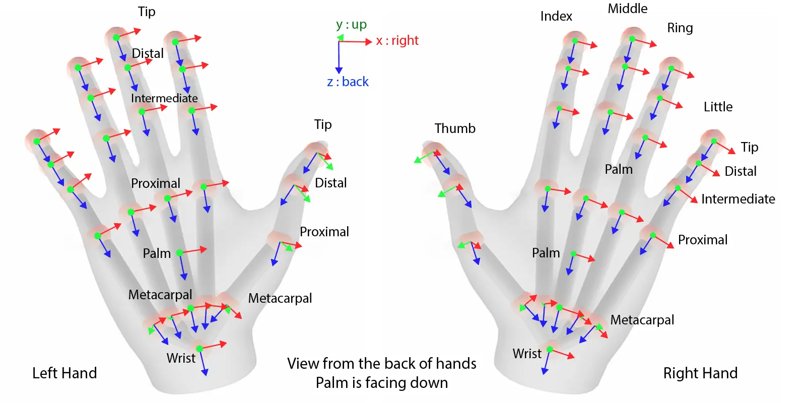

.. _doc_openxr_hand_tracking:

The OpenXR hand tracking
========================

Hand tracking is the process by which the position and orientation of the players hands are tracked,
including the orientation of the players fingers.
We can identify 3 categories of this:

One, hand tracking through external sensors such as cameras.
This is what Hololens, Quest, UltraLeap and similar devices do.
This often results in very accurate tracking of all fingers of the players hands.

Two, hand tracking through VR gloves.
This method is still mostly experimental but is likely to gain popularity soon.
Gloves often have good finger tracking capabilities but their real selling point is the ability to restrict movement.
This allows the sensation of touch.
Gloves are often also recognised as controllers and often will have additional controls such as buttons embedded.

Three, inferred hand tracking.
This has been the de facto approach since the early days of VR.
As we know the player is holding a controller and we know the position of this controller,
we can infer where to render the players hand.
Fingers can be positioned based on the controls the player is interacting with.
Many modern VR controllers have additional sensors to help determine finger positions on the controller.

.. note::

  Traditionally inferred hand tracking has been the responsibility of the game.
  However the principles behind the action map have somewhat limited the viable options here.
  Valve is currently the only XR Runtime that has implemented inferred hand tracking as part of the hand tracking extension.
  There is an expectation that other XR Runtimes will follow this example in the near future.

  Until then we recommend that if your game depends on inferred hand tracking,
  to use the hand assets that are part of Godot XR Tools.

Tracking through interaction profiles
-------------------------------------

Tracking the location and state of controllers are performed through interaction profiles.
Bindings can be set within the :ref:`action map <doc_xr_action_map>`.

However it is important to realise that in OpenXR controllers are bound to paths indicating the usage of these controllers.
I.e. the controller held in the players left hand is bound to ``/user/hand/left``
while the controller in the players right hand is bound to ``/user/hand/right``.
And while not yet supported outside of the HTC tracker extension,
it is likely OpenXR will be extended with paths such as ``/user/foot/left`` and ``/user/foot/right`` at some point.

.. warning::

  This paradigm therefore begs the question what happens to a controller that is not being held by a user.
  There is no answer to this question yet, this is still being debated and the specification may change in the near future.
  The behavior is thus undefined and can be different for different platforms.

  The most common is that the controller will remain bound regardless of whether the player is actually holding the controller.

  However there are runtimes, such as the Quest, that can unbind a controller when it is not being held by the user.

  This may become the norm in the future and the expectation is that the action map system will be enhanced accordingly.

The hand tracking extension
---------------------------

OpenXR has an extension that exposes hand tracking functionality.
This extension allows a game to request the hand skeleton with all bone positions for each hand.

  Copyright (c) 2017-2022, The Khronos Group Inc. SPDX-License-Identifier: CC-BY-4.0

The above image shows the joints that have to be provided by each XR runtime that implements this extension.

Currently Godot exposes this functionality through the :ref:`OpenXRHand <class_openxrhand>` node.
This is a helper node that will retrieve the hand tracking data from OpenXR and apply it to a skeleton in Godot.
You select either the left or right hand through the ``hand`` property on this node.

The hand asset itself has to be provided by the developer and is thus separate from the OpenXRHand node.
You set the ``hand_skeleton`` on the OpenXRHand node to the skeleton it needs to apply the tracking data to.

If supported by the XR runtime you can also set the ``motion_range`` property to limit how far the hand can close.

The skeleton for this asset has to have the following bones:

.. list-table:: OpenXR hand skeleton
  :widths: 50 50
  :header-rows: 1

  * - Left hand
    - Right hand
  * - Palm_L
    - Palm_R
  * - Wrist_L
    - Wrist_R
  * - Thumb_Metacarpal_L
    - Thumb_Metacarpal_R
  * - Thumb_Proximal_L
    - Thumb_Proximal_R
  * - Thumb_Distal_L
    - Thumb_Distal_R
  * - Thumb_Tip_L
    - Thumb_Tip_R
  * - Index_Metacarpal_L
    - Index_Metacarpal_R
  * - Index_Proximal_L
    - Index_Proximal_R
  * - Index_Intermediate_L
    - Index_Intermediate_R
  * - Index_Distal_L
    - Index_Distal_R
  * - Index_Tip_L
    - Index_Tip_R
  * - Middle_Metacarpal_L
    - Middle_Metacarpal_R
  * - Middle_Proximal_L
    - Middle_Proximal_R
  * - Middle_Intermediate_L
    - Middle_Intermediate_R
  * - Middle_Distal_L
    - Middle_Distal_R
  * - Middle_Tip_L
    - Middle_Tip_R
  * - Ring_Metacarpal_L
    - Ring_Metacarpal_R
  * - Ring_Proximal_L
    - Ring_Proximal_R
  * - Ring_Intermediate_L
    - Ring_Intermediate_R
  * - Ring_Distal_L
    - Ring_Distal_R
  * - Ring_Tip_L
    - Ring_Tip_R
  * - Little_Metacarpal_L
    - Little_Metacarpal_R
  * - Little_Proximal_L
    - Little_Proximal_R
  * - Little_Intermediate_L
    - Little_Intermediate_R
  * - Little_Distal_L
    - Little_Distal_R
  * - Little_Tip_L
    - Little_Tip_R

.. warning::

  The skeleton data returned from different XR runtimes are often not compatible which poses a problem for cross platform development.

  For instance both Microsoft and Meta runtimes base the skeleton on the actual hands of the player.
  These skeletons will thus conform to the size of the players hand.

  Contrast that to Valve where a fixed skeleton is used if inferred hand tracking is applied.

  We are still gathering experience on how best to deal with these differences in the platforms.

When exporting to Meta Quest you need to enable the following setting:

.. image:: img/xr_enable_handtracking.webp

Body tracking
-------------

At the time of writing, OpenXR does not support body tracking as part of the core spec.
We are expecting this to change in the near future as more and more body tracking solutions are hitting the market.

For now the only option available here is through HTC trackers.
There is an extension that becomes available if HTC trackers are supported by the XR runtime.
These are fully exposed through the action map system.

Godot has full support for these and you can setup the trackers in the action map.
Each tracker is assigned a usage within the SteamVR interface.

These are exposed through the following trackers:

.. list-table:: HTC trackers
  :widths: 100
  :header-rows: 0

  * - /user/vive_tracker_htcx/role/handheld_object
  * - /user/vive_tracker_htcx/role/left_foot
  * - /user/vive_tracker_htcx/role/right_foot
  * - /user/vive_tracker_htcx/role/left_shoulder
  * - /user/vive_tracker_htcx/role/right_shoulder
  * - /user/vive_tracker_htcx/role/left_elbow
  * - /user/vive_tracker_htcx/role/right_elbow
  * - /user/vive_tracker_htcx/role/left_knee
  * - /user/vive_tracker_htcx/role/right_knee
  * - /user/vive_tracker_htcx/role/waist
  * - /user/vive_tracker_htcx/role/chest
  * - /user/vive_tracker_htcx/role/camera
  * - /user/vive_tracker_htcx/role/keyboard

Some final words
----------------

Hand tracking is an area that is still under active development and we are expecting improvements in the near future.

The underlying principle that we're hoping will eventuate is that the action map will be used to handle interactions,
while the hand tracking extension will primarily be a means for visualising the players hand.
The hope here is that improvements to the OpenXR specification will ensure better portability between platforms.

