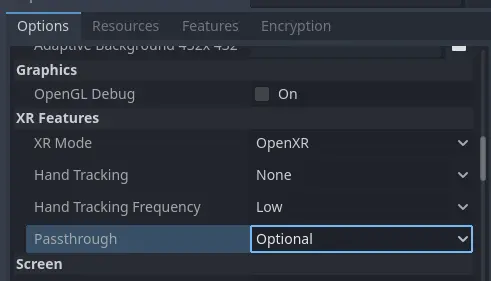

.. _doc_openxr_passthrough:

The OpenXR passthrough
======================

Passthrough is a technique where camera images are used to present the environment of the user as the background.
This turns a VR headset into an AR headset, often referred to as Mixed Reality or MR.

.. note::

  As passthrough is relatively new there isn't a singular way this is implemented across platforms.
  There may be additions in the future so this is a work in progress.

Passthrough extension
---------------------

OpenXR has a vendor extension for passthrough submitted by Meta.
Currently this extension is only supported on Quest and PICO but may be adopted by other headsets in the future.

:ref:`XRInterface <class_xrinterface>` has entry points for passthrough so different interfaces can implement this feature.
For :ref:`OpenXRInterface <class_openxrinterface>` the meta passthrough extension is implemented here.

In code you can call ``is_passthrough_supported`` to check if this extension is available.
If so you can simply enable passthrough by calling ``start_passthrough``.
You can call ``stop_passthrough`` to disable passthrough.

You do need to make sure the background is transparent.
You need to enable the ``transparent_bg`` property on the viewport.
Some background environment settings will still fill the background with an opaque color,
you can use a ``custom color`` with a color that has alpha set to 0.

The OpenXR runtime will display the camera image as the background.

.. note::

  For privacy reasons **no access** is given to the camera image.

.. warning::

  After passthrough is enabled it is possible to change settings that will break passthrough.
  Be sure not to disable the ``transparent_bg`` setting or change the environment blend mode.
  This will result in the camera image no longer being visible but you still incur the overhead.

  Always use ``stop_passthrough`` if you wish to turn off passthrough.

Finally, for using passthrough on the Quest you must set the following export property:

Passthrough through AR
----------------------

Some of the headsets recently adding OpenXR support have taken a different approach.
They simply mimic being an AR device. The Lynx R1 is such a device but others may be doing the same.

The following thus applies to both passthrough devices that mimic AR, and actual AR devices.

If ``is_passthrough_supported`` returns false the next step is to call ``get_supported_environment_blend_modes``.
This will return a list of supported blend modes for submitting the main render image to OpenXR.

We need to check if ``XR_ENV_BLEND_MODE_ALPHA_BLEND`` is present in this list.
If so we can tell OpenXR to expect an image that can be alpha blended with a background.
To do this, we simply call ``set_environment_blend_mode(xr_interface.XR_ENV_BLEND_MODE_ALPHA_BLEND)``.

We must also set ``transparent_bg`` to true and adjust the environment to ensure we submit the right image.

Putting it together
-------------------

Putting the above together we can use the following code as a base:

.. code-block:: gdscript

  func enable_passthrough() -> bool:
    var xr_interface: XRInterface = XRServer.primary_interface
    if xr_interface and xr_interface.is_passthrough_supported():
      if !xr_interface.start_passthrough():
        return false
    else:
      var modes = xr_interface.get_supported_environment_blend_modes()
      if xr_interface.XR_ENV_BLEND_MODE_ALPHA_BLEND in modes:
        xr_interface.set_environment_blend_mode(xr_interface.XR_ENV_BLEND_MODE_ALPHA_BLEND)
      else:
        return false

    get_viewport().transparent_bg = true
    return true
