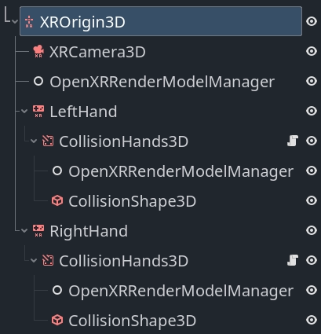

.. _doc_openxr_render_models:

OpenXR Render Models
====================

A cornerstone of OpenXR's API design is being as platform agnostic as possible.
A great example of this is OpenXR's action map system where XR runtimes
have to support core interaction profiles to fall back on,
if no interaction profile exists for the hardware being used.
This ensures that OpenXR applications keep functioning even when used on
hardware that didn't exist when the application was released,
or that the developers of the application did not have access too.

A consequence of this is that the application developer doesn't know with any
certainty what hardware is being used, as the XR runtime could be mimicking
other hardware.
The application developer thus can't show anything in relation to the actual
hardware used, the most common use case being showing the controllers the user
is currently holding.

Showing the correct controller models and having these models
correctly positioned is important to a proper sense of immersion.

This is where OpenXR's `render models API <https://registry.khronos.org/OpenXR/specs/1.1/html/xrspec.html#XR_EXT_render_models>`_ comes in.
This API allows us to query the XR runtime for 3D assets that are correct
for the physical hardware being used.
The API also allows us to query the position of this hardware within the
tracking volume and the correct positioning of subcomponents of this hardware.

For instance, we can correctly position and animate the trigger or show buttons
being pressed.

For those runtimes that support the
`controller data source for hand tracking <https://registry.khronos.org/OpenXR/specs/1.1/html/xrspec.html#XR_EXT_hand_tracking_data_source>`_
, we can also correctly position the user's fingers and hand according to the
shape of the controller.
Do note that this works in combination with the
`hand joints motion range extension <https://registry.khronos.org/OpenXR/specs/1.1/html/xrspec.html#XR_EXT_hand_joints_motion_range>`_
to prevent clipping of the fingers.

OpenXR Render models node
-------------------------

The :ref:`OpenXRRenderModelManager<class_OpenXRRenderModelManager>`
node can be used to automate most of the render models functionality. 
This node keeps track of the active render models currently made
available by the XR runtime.

It will create child nodes for each active render model resulting in
that render model being displayed.

This node must have an :ref:`XROrigin3D<class_XROrigin3D>` node as an
ancestor.

If ``tracker`` is set to ``Any`` our node will show all render models
currently being tracked. In this scenario this node must be a direct
child of our :ref:`XROrigin3D<class_XROrigin3D>` node.

If ``tracker`` is set to ``None set`` our node will only show render
models for which no tracker has been identified. In this scenario this
node must also be a direct child of our
:ref:`XROrigin3D<class_XROrigin3D>` node.

If ``tracker`` is set to ``Left Hand`` or ``Right Hand`` our node will
only show render models related to our left or right hand respectively.
In this scenario, our node can be placed deeper in the scene tree.

.. warning::

    For most XR runtimes this means the render model represents a controller
    that is actually being held by the user but this is not a guarantee.
    Some XR runtimes will always set the tracker to either the left or right
    hand even if the controller is not currently held but is being tracked.
    You should always test this as this will lead to unwanted behavior.

In this scenario we can also specify an action for a pose in the action map
by setting the ``make_local_to_pose`` property to the pose action.
Use this in combination with an :ref:`XRController3D<class_XRController3D>`
node that is using the same pose and you can now add a layer that allows
you to deviate from the tracked position of both your controller and the
related render model (see example below).

.. note::

    Combining the above with hand tracking does introduce the problem
    that hand tracking is completely independent from the action map
    system. You will need to combine the hand tracking and controller
    tracking poses to properly offset the render models.

    This falls beyond the scope of this documentation.

Render model manager example
~~~~~~~~~~~~~~~~~~~~~~~~~~~~

You can download `our render models demo <https://github.com/godotengine/godot-demo-projects/tree/master/xr/openxr_render_models>`_
which implements the setup described below.

In this setup we find an :ref:`OpenXRRenderModelManager<class_OpenXRRenderModelManager>`
node directly underneath our :ref:`XROrigin3D<class_XROrigin3D>` node.
On this node our ``target`` property is set to ``None set`` and will handle
showing all render models that are currently not related to our left or
right hand controllers.

We then see the same setup for our left and right hand so we'll focus on
just the left hand.

We have an :ref:`XRController3D<class_XRController3D>` that will track the
location of our hand.

.. note::

    We are using the ``grip`` pose in this example. The ``palm`` pose is
    arguably more suitable and predictable however it is not supported
    by all XR runtimes. See the hand tracking demo project for a
    solution to switching between these poses based on what is supported.

As a child of the node we have an :ref:`AnimatableBody3D<class_AnimatableBody3D>`
node that follows the tracked location of the hand **but** will interact
with physics objects to stop the player's hand from going through walls etc.
This node has a collision shape that encapsulates the hand.

.. note::

    It is important to set the physics priority so that this logic runs 
    after any physics logic that moves the XROrigin3D node or the hand
    will lag a frame behind.

The script below shows a basic implementation for this that you can build
upon.

.. code-block:: gdscript

    class_name CollisionHands3D
    extends AnimatableBody3D

    func _ready():
        # Make sure these are set correctly.
        top_level = true
        sync_to_physics = false
        process_physics_priority = -90

    func _physics_process(_delta):
        # Follow our parent node around.
        var dest_transform = get_parent().global_transform

        # We just apply rotation for this example.
        global_basis = dest_transform.basis

        # Attempt to move to where our tracked hand is.
        move_and_collide(dest_transform.origin - global_position)

Finally we see another :ref:`OpenXRRenderModelManager<class_OpenXRRenderModelManager>`
node, this one with ``target`` set to the appropriate hand and
``make_local_to_pose`` set to the correct pose.
This will ensure that the render models related to this hand are properly
shown and offset if our collision handler has altered the location.

.. raw:: html

    

        <iframe src="https://www.youtube-nocookie.com/embed/_gNOd7wQ62M" frameborder="0" allowfullscreen style="position: absolute; top: 0; left: 0; width: 100%; height: 100%;"></iframe>
    

Render model node
-----------------

The :ref:`OpenXRRenderModel<class_OpenXRRenderModel>` node implements
all the logic to display and position a given render model provided by
the render models API.

Instances of this node are added by the render model manager node we used up
above but you can interact with these directly if you wish.

Whenever Godot obtains information about a new render model an RID is
created to reference that render model.

By assigning that RID to the ``render_model`` property on this node,
the node will start displaying the render model and manage both the
transform that places the render model in the correct place and
animates all the sub objects.

The ``get_top_level_path`` function will return the top level path
associated with this render model. This will point to either the 
left or right hand. As the top level path can be set or cleared
depending on whether the user picks up, or puts down, the controller
you can connect to the ``render_model_top_level_path_changes`` signal
and react to these changes.

Depending on your setup of the
:ref:`OpenXRRenderModelManager<class_OpenXRRenderModelManager>` nodes,
render models will be removed or added as their top level path changes.

Backend access
--------------

The nodes we've detailed out above handle all the display logic
for us but it is possible to interact with the data that drives
this directly and create your own implementation.

For this you can access the
:ref:`OpenXRRenderModelExtension<class_OpenXRRenderModelExtension>`
singleton.

This object also lets you query whether render models are
supported and enabled on the device currently being used by
calling the ``is_active`` function on this object.

The built-in logic implements the
`interaction render model API <https://registry.khronos.org/OpenXR/specs/1.1/html/xrspec.html#XR_EXT_interaction_render_model>`_
that lists all render models related to controllers and similar
devices that are present in the action map.
It will automatically create and remove render model entities
that are exposed through this API.

As other extensions become available these can be implemented
in a GDExtension plugin. Such a plugin can call
``render_model_create`` and ``render_model_destroy`` to
create the object that will provide access to that render
model through the core render models API.

You should not destroy a render model outside of this logic. 

You can connect to the ``render_model_added`` and 
``render_model_removed`` signals to be informed when new render
models are added or removed.

The core methods for working with this API are listed
below:

.. list-table:: Render modele extension functions
   :header-rows: 1

   * - Function
     - Description
   * - render_model_get_all
     - Provides an array of RIDs for all render models
       that are being tracked.
   * - render_model_new_scene_instance
     - Provides a new scene that contains all meshes
       needed to display the render model.
   * - render_model_get_subaction_paths
     - Provides a list of subaction paths from your
       action map related to this render mode.
   * - render_model_get_top_level_path
     - Returns the top level path associated with this
       render model (if any).
       Use the ``render_model_top_level_path_changed``
       signal to react to this changing.
   * - render_model_get_confidence
     - Returns the tracking confidence for the tracking
       data for this render model.
   * - render_model_get_root_transform
     - Returns the root transform for this render model
       within our current reference space. This can be
       used to place the render model in space.
   * - render_model_get_animatable_node_count
     - Returns the number of nodes in our render model
       scene that can be animated
   * - render_model_get_animatable_node_name
     - Returns the name of the node that we can animate.
       Note that this node can be any number of levels
       deep within the scene.
   * - render_model_is_animatable_node_visible
     - Returns true if this animatable node should be
       visible
   * - render_model_get_animatable_node_transform
     - Returns the transform for this animatable node.
       This is a local transform that can be directly
       applied.

