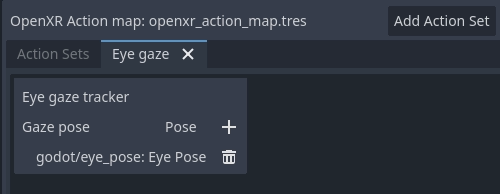

.. _doc_openxr_settings:

OpenXR Settings
===============

OpenXR has its own set of settings that are applied when OpenXR starts.
While it is possible for OpenXR extensions implemented through Godot plugins to add additional settings,
we will only discuss the settings in the core of Godot here.

.. image:: img/openxr_settings.png

Enabled
-------

This setting enables the OpenXR module when Godot starts.
This is required when the Vulkan backend is used.
For other backends you can enable OpenXR at any time by calling ``initialize`` on the :ref:`OpenXRInterface <class_openxrinterface>`.

This also needs to be enabled to get access to the action map editor.

You can use the ``--xr-mode on`` command line switch to force this to on.

Default Action Map
------------------

This specifies the path of the action map file that OpenXR will load and communicate to the XR Runtime.

Form Factor
-----------

This specifies whether your game is designed for:

- ``Head Mounted`` devices such as a Meta Quest, Valve Index, or Magic Leap,
- ``Handheld`` devices such as phones.

If the device on which you run your game does not match the selection here, OpenXR will fail to initialise.

View Configuration
------------------

This specifies the view configuration your game is designed for:

- ``Mono``, your game provides a single image output. E.g. phone based AR;
- ``Stereo``, your game provides stereo image output. E.g. head mounted devices.

If the device on which you run your game does not match the selection here, OpenXR will fail to initialise.

.. note::
  OpenXR has additional view configurations for very specific devices that Godot doesn't support yet.
  For instance, Varjo headsets have a quad view configuration that outputs two sets of stereo images.
  These may be supported in the near future. 

Reference Space
---------------

Within XR all elements like the player's head and hands are tracked within a tracking volume.
At the base of this tracking volume is our origin point, which maps our virtual space to the real space.
There are however different scenarios that place this point in different locations,
depending on the XR system used.
In OpenXR these scenarios are well defined and selected by setting a reference space.

Local
^^^^^

The local reference space places our origin point at the player's head by default.
Some XR runtimes will do this each time your game starts, others will make the position persist over sessions.

This reference space however does not prevent the user from walking away so you will need to detect if the user does so
if you wish to prevent the user from leaving the vehicle they are controlling, which could potentially be game breaking.

This reference space is the best option for games like flight simulators or racing simulators
where we want to place the :ref:`XROrigin3D <class_xrorigin3d>` node where the player's head should be.

When the user enacts the recenter option on their headset, the method of which is different per XR runtime,
the XR runtime will move the :ref:`XRCamera3D <class_xrcamera3d>` to the :ref:`XROrigin3D <class_xrorigin3d>` node.
The :ref:`OpenXRInterface <class_openxrinterface>` will also emit the ``pose_recentered`` signal
so your game can react accordingly.

.. Note::
  Any other XR tracked elements such as controllers or anchors will also be adjusted accordingly. 

.. Warning::
  You should **not** call ``center_on_hmd`` when using this reference space.

Stage
^^^^^

The stage reference space is our default reference space and places our origin point at the center of our play space.
For XR runtimes that allow you to draw out a guardian boundary this location and its orientation is often set by the user.
Other XR runtimes may decide on the placement of this point by other means.
It is however a stationary point in the real world.

This reference space is the best option for room scale games where the user is expected to walk around a larger space,
or for games where there is a need to switch between game modes.
See :ref:`Room Scale <doc_xr_room_scale>` for more information.

When the user enacts the recenter option on their headset, the method of which is different per XR runtime,
the XR runtime will not change the origin point.
The :ref:`OpenXRInterface <class_openxrinterface>` will emit the ``pose_recentered`` signal
and it is up to the game to react appropriately.
Not doing so will prevent your game from being accepted on various stores.

In Godot you can do this by calling the ``center_on_hmd`` function on the :ref:`XRServer <class_xrserver>`:

- Calling ``XRServer.center_on_hmd(XRServer.RESET_BUT_KEEP_TILT, true)`` will move the :ref:`XRCamera3D <class_xrcamera3d>` node
  to the :ref:`XROrigin3D <class_xrorigin3d>` node similar to the ``Local`` reference space.
- Calling ``XRServer.center_on_hmd(XRServer.RESET_BUT_KEEP_TILT, true)`` will move the :ref:`XRCamera3D <class_xrcamera3d>` node
  above the :ref:`XROrigin3D <class_xrorigin3d>` node keeping the player's height, similar to the ``Local Floor`` reference space.

.. Note::
  Any other XR tracked elements such as controllers or anchors will also be adjusted accordingly. 

Local Floor
^^^^^^^^^^^

The local floor reference space is similar to the local reference space as it positions the origin point where the player is.
In this mode however the height of the player is kept.
Same as with the local reference space, some XR runtimes will persist this location over sessions.

It is thus not guaranteed the player will be standing on the origin point,
the only guarantee is that they were standing there when the user last recentered.
The player is thus also free to walk away.

This reference space is the best option of games where the user is expected to stand in the same location
or for AR type games where the user's interface elements are bound to the origin node
and are quickly placed at the player's location on recenter.

When the user enacts the recenter option on their headset, the method of which is different per XR runtime,
the XR runtime will move the :ref:`XRCamera3D <class_xrcamera3d>` above the :ref:`XROrigin3D <class_xrorigin3d>` node
but keeping the player's height.
The :ref:`OpenXRInterface <class_openxrinterface>` will also emit the ``pose_recentered`` signal
so your game can react accordingly.

.. Warning::
  Be careful using this mode in combination with virtual movement of the player.
  The user recentering in this scenario can be unpredictable unless you counter the move when handling the recenter signal.
  This can even be game breaking as the effect in this scenario would be the player teleporting to whatever abstract location
  the origin point was placed at during virtual movement, including the ability for players teleporting into
  locations that should be off limits.
  It is better to use the Stage mode in this scenario and limit resetting to orientation only when a ``pose_recentered`` signal is received.

.. Note::
  Any other XR tracked elements such as controllers or anchors will also be adjusted accordingly. 

.. Warning::
  You should **not** call ``center_on_hmd`` when using this reference space.

Environment Blend Mode
----------------------

The environment blend mode defines how our rendered output is blended into "the real world" provided this is supported by the headset.

- ``Opaque`` means our output obscures the real world, we are in VR mode.
- ``Additive`` means our output is added to the real world,
  this is an AR mode where optics do not allow us to fully obscure the real world (e.g. Hololens),
- ``Alpha`` means our output is blended with the real world using the alpha output (viewport should have transparent background enabled),
  this is an AR mode where optics can fully obscure the real world (Magic Leap, all pass through devices, etc.).

If a mode is selected that is not supported by the headset, the first available mode will be selected.

.. Note::
  Some OpenXR devices have separate systems for enabling/disabling passthrough.
  From Godot 4.3 onwards selecting the alpha blend mode will also perform these extra steps.
  This does require the latest vendor plugin to be installed.

Foveation Level
---------------

Sets the foveation level used when rendering provided this feature is supported by the hardware used.
Foveation is a technique where the further away from the center of the viewport we render content, the lower resolution we render at.
Most XR runtimes only support fixed foveation, but some will take eye tracking into account and use the focal point for this effect.

The higher the level, the better the performance gains, but also the more reduction in quality there is in the users peripheral vision.

.. Note::
  **Compatibility renderer only**,
  for Mobile and Forward+ renderer, set the ``vrs_mode`` property on :ref:`Viewport <class_viewport>` to ``VRS_XR``.

.. Warning::
  This feature is disabled if post effects are used such as glow, bloom, or DOF.

Foveation Dynamic
-----------------

When enabled the foveation level will be adjusted automatically depending on current GPU load.
It will be adjusted between low and the select foveation level in the previous setting.
It is therefore best to combine this setting with foveation level set to high.

.. Note::
  **Compatibility renderer only**

Submit Depth Buffer
-------------------

If enabled an OpenXR supplied depth buffer will be used while rendering which is submitted alongside the rendered image.
The XR runtime can use this for improved reprojection.

.. Note::
  Enabling this feature will disable stencil support during rendering.
  Not many XR runtimes make use of this,
  it is advised to leave this setting off unless it provides noticeable benefits for your use case.

Startup Alert
-------------

If enabled this will result in an alert message presented to the user if OpenXR fails to start.
We don't always receive feedback from the XR system as to why starting fails. If we do we log this to the console.
Common failure reasons are:

- No OpenXR runtime is installed on the host system.
- Microsofts WMR OpenXR runtime is currently active, this only supports DirectX and will fail if OpenGL or Vulkan is used.
- SteamVR is used but no headset is connected/turned on.

Disable this if you support a fallback mode in your game so it can be played in desktop mode when no VR headset is connected,
or if you're handling the failure condition yourself by checking ``OpenXRInterface.is_initialized()``.

Extensions
----------

This subsection provides access to various optional OpenXR extensions.

Hand Tracking
^^^^^^^^^^^^^

This enables the hand tracking extension when supported by the device used. This is on by default for legacy reasons.
The hand tracking extension provides access to data that allows you to visualise the user's hands with correct finger positions.
Depending on platform capabilities the hand tracking data can be inferred from controller inputs, come from data gloves, 
come from optical hand tracking sensors or any other applicable source.

If your game only supports controllers this should be turned off. 

See the chapter on :ref:`hand tracking <doc_openxr_hand_tracking>` for additional details.

Eye Gaze Interaction
^^^^^^^^^^^^^^^^^^^^

This enables the eye gaze interaction extension when supported by the device used.
When enabled we will get feedback from eye tracking through a pose situated between the user's eyes
orientated in the direction the user is looking. This will be a unified orientation.

In order to use this functionality you need to edit your action map and add a new pose action,
say ``eye_pose``.
Now add a new interaction profile for the eye gaze interaction and map the ``eye_pose``:

Don't forget to save!

Next add a new :ref:`XRController3D <class_xrcontroller3d>` node to your origin node
and set its ``tracker`` property to ``/user/eyes_ext``
and set its ``pose`` property to ``eye_pose``.

Now you can add things to this controller node such as a raycast, and control things with your eyes.
