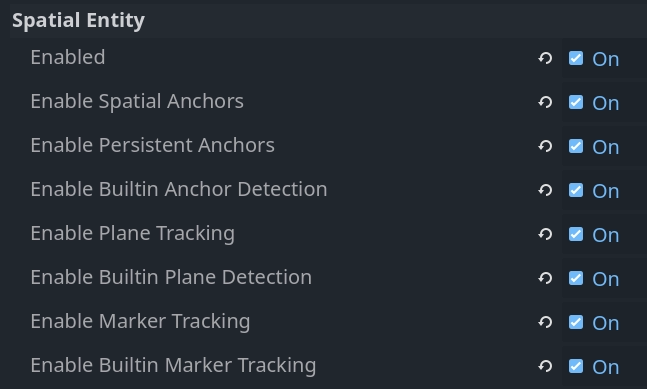

.. _doc_openxr_spatial_entities:

OpenXR spatial entities
=======================

For any sort of augmented reality application you need to access real world information, and be able to
track real world locations. OpenXR's spatial entities API was introduced for this exact purpose.

It has a very modular design. The core of the API defines how real world entities are structured,
how they are found, and how information about them is stored and accessed.

Various extensions are added on top, which implement specific systems such as marker tracking,
plane tracking, and anchors. These are referred to as spatial capabilities.

Each entity that can be handled by the system is broken up into smaller components, which makes it easy
to extend the system and add new capabilities.

Vendors have the ability to implement and expose additional capabilities and component types that can be
used with the core API. For Godot these can be implemented in extensions. These implementations
however fall outside of the scope of this manual.

Finally it is important to note that the spatial entity system makes use of asynchronous functions.
This means that you can start a process, and then get informed of it finishing later on.

Setup
-----

In order to use spatial entities you need to enable the related project settings.
You can find these in the OpenXR section:

.. list-table:: Spatial entity settings
   :header-rows: 1

   * - Setting
     - Description
   * - Enabled
     - Enables the core of the spatial entities system. This must be enabled for any of the spatial
       entities systems to work.
   * - Enable spatial anchors
     - Enables the spatial anchors capability that allow creating and tracking spatial anchors.
   * - Enable persistent anchors
     - Enables the ability to make spatial anchors persistent. This means that their location is stored
       and can be retrieved in subsequent sessions.
   * - Enable built-in anchor detection
     - Enables our built-in anchor detection logic, this will automatically retrieve persistent anchors
       and adjust the positioning of anchors when tracking is updated.
   * - Enable plane tracking
     - Enables the plane tracking capability that allows detection of surfaces such as floors, walls,
       ceilings, and tables.
   * - Enable built-in plane detection
     - Enables our built-in plane detection logic, this will automatically react to new plane data
       becoming available.
   * - Enable marker tracking
     - Enables our marker tracking capability that allows detection of markers such as QR codes,
       Aruco markers, and April tags. 
   * - Enable built-in marker tracking
     - Enables our built-in marker detection logic, this will automatically react to new markers being
       found or markers being moved around the player's space.

.. note::

    Note that various XR devices also require permission flags to be set. These will need to be
    enabled in the export preset settings.

Enabling the different capabilities activates the related OpenXR APIs, but additional logic is needed
to interact with this data.
For each core system we have built-in logic that can be enabled that will do this for you.

We'll discuss the spatial entities system under the assumption that the built-in logic is enabled first.
We will then take a look at the underlying APIs and how you can implement this yourself, however it
should be noted that this is often overkill and that the underlying APIs are mostly exposed to allow
GDExtension plugins to implement additional capabilities.

Creating our spatial manager
----------------------------

When spatial entities are detected or created an
:ref:`OpenXRSpatialEntityTracker<class_OpenXRSpatialEntityTracker>`
object is instantiated and registered with the :ref:`XRServer<class_XRServer>`.

Each type of spatial entity will implement its own subclass and we can thus react differently to
each type of entity.

Generally speaking we will instance different subscenes for each type of entity.
As the tracker objects can be used with :ref:`XRAnchor3D<class_XRAnchor3D>` nodes, these subscenes
should have such a node as their root node.

All entity trackers will expose their location through the ``default`` pose.

We can automate creating these subscenes and adding them to our scene tree by creating a manager
object. As all locations are local to the :ref:`XROrigin3D<class_XROrigin3D>` node, we should create
our manager as a child node of our origin node.

Below is the basis of the script that implements our manager logic:

.. code-block:: gdscript

    class_name SpatialEntitiesManager
    extends Node3D

    ## Signals a new spatial entity node was added.
    signal added_spatial_entity(node: XRNode3D)

    ## Signals a spatial entity node is about to be removed.
    signal removed_spatial_entity(node: XRNode3D)

    ## Scene to instantiate for spatial anchor entities.
    @export var spatial_anchor_scene: PackedScene

    ## Scene to instantiate for plane tracking spatial entities.
    @export var plane_tracker_scene: PackedScene

    ## Scene to instantiate for marker tracking spatial entities.
    @export var marker_tracker_scene: PackedScene

    # Trackers we manage nodes for.
    var _managed_nodes: Dictionary[OpenXRSpatialEntityTracker, XRAnchor3D]

    # Enter tree is called whenever our node is added to our scene.
    func _enter_tree():
        # Connect to signals that inform us about tracker changes.
        XRServer.tracker_added.connect(_on_tracker_added)
        XRServer.tracker_updated.connect(_on_tracker_updated)
        XRServer.tracker_removed.connect(_on_tracker_removed)

        # Set up existing trackers.
        var trackers : Dictionary = XRServer.get_trackers(XRServer.TRACKER_ANCHOR)
        for tracker_name in trackers:
            var tracker: XRTracker = trackers[tracker_name]
            if tracker and tracker is OpenXRSpatialEntityTracker:
                _add_tracker(tracker)

    # Exit tree is called whenever our node is removed from our scene.
    func _exit_tree():
        # Clean up our signals.
        XRServer.tracker_added.disconnect(_on_tracker_added)
        XRServer.tracker_updated.disconnect(_on_tracker_updated)
        XRServer.tracker_removed.disconnect(_on_tracker_removed)

        # Clean up trackers.
        for tracker in _managed_nodes:
            removed_spatial_entity.emit(_managed_nodes[tracker])
            remove_child(_managed_nodes[tracker])
            _managed_nodes[tracker].queue_free()

        _managed_nodes.clear()

    # See if this tracker should be managed by us and add it.
    func _add_tracker(tracker: OpenXRSpatialEntityTracker):
        var new_node: XRAnchor3D

        if _managed_nodes.has(tracker):
            # Already being managed by us!
            return

        if tracker is OpenXRAnchorTracker:
            # Note: Generally spatial anchors are controlled by the developer and
            # are unlikely to be handled by our manager.
            # But just for completeness we'll add it in.
            if spatial_anchor_scene:
                var new_scene = spatial_anchor_scene.instantiate()
                if new_scene is XRAnchor3D:
                    new_node = new_scene
                else:
                    push_error("Spatial anchor scene doesn't have an XRAnchor3D as a root node and can't be used!")
                    new_scene.free()
        elif tracker is OpenXRPlaneTracker:
            if plane_tracker_scene:
                var new_scene = plane_tracker_scene.instantiate()
                if new_scene is XRAnchor3D:
                    new_node = new_scene
                else:
                    push_error("Plane tracking scene doesn't have an XRAnchor3D as a root node and can't be used!")
                    new_scene.free()
        elif tracker is OpenXRMarkerTracker:
            if marker_tracker_scene:
                var new_scene = marker_tracker_scene.instantiate()
                if new_scene is XRAnchor3D:
                    new_node = new_scene
                else:
                    push_error("Marker tracking scene doesn't have an XRAnchor3D as a root node and can't be used!")
                    new_scene.free()
        else:
            # Type of spatial entity tracker we're not supporting?
            push_warning("OpenXR Spatial Entities: Unsupported anchor tracker " + tracker.get_name() + " of type " + tracker.get_class())

        if not new_node:
            # No scene defined or able to be instantiated? We're done!
            return

        # Set up and add to our scene.
        new_node.tracker = tracker.name
        new_node.pose = "default"
        _managed_nodes[tracker] = new_node
        add_child(new_node)

        added_spatial_entity.emit(new_node)

    # A new tracker was added to our XRServer.
    func _on_tracker_added(tracker_name: StringName, type: int):
        if type == XRServer.TRACKER_ANCHOR:
            var tracker: XRTracker = XRServer.get_tracker(tracker_name)
            if tracker and tracker is OpenXRSpatialEntityTracker:
                _add_tracker(tracker)

    # A tracked managed by XRServer was changed.
    func _on_tracker_updated(_tracker_name: StringName, _type: int):
        # For now we ignore this, there aren't any changes here we need to react
        # to and the instanced scene can react to this itself if needed.
        pass

    # A tracker was removed from our XRServer.
    func _on_tracker_removed(tracker_name: StringName, type: int):
        if type == XRServer.TRACKER_ANCHOR:
            var tracker: XRTracker = XRServer.get_tracker(tracker_name)
            if _managed_nodes.has(tracker):
                # We emit this right before we remove it!
                removed_spatial_entity.emit(_managed_nodes[tracker])

                # Remove the node.
                remove_child(_managed_nodes[tracker])

                # Queue free the node.
                _managed_nodes[tracker].queue_free()

                # And remove from our managed nodes.
                _managed_nodes.erase(tracker)

Spatial anchors
---------------

Spatial anchors allow us to map real world locations in our virtual world in such a way that the
XR runtime will keep track of these locations and adjust them as needed.
If supported, anchors can be made persistent which means the anchors will be recreated in the correct
location when your application starts again.

You can think of use cases such as:
- placing virtual windows around your space that are recreated when your application restarts
- placing virtual objects on your table or on your walls and have them recreated

Spatial anchors are tracked using :ref:`OpenXRAnchorTracker<class_OpenXRAnchorTracker>` objects
registered with the XRServer.

When needed, the location of the spatial anchor will be updated automatically; the pose on the
related tracker will be updated and thus the :ref:`XRAnchor3D<class_XRAnchor3D>` node will 
reposition.

When a spatial anchor has been made persistent, a Universally Unique Identifier (or UUID) is
assigned to the anchor. You will need to store this with whatever information you need to
reconstruct the scene.
In our example code below we'll simply call ``set_scene_path`` and ``get_scene_path``, but you
will need to supply your own implementations for these functions.

In order to create a persistent anchor you need to follow a specific flow:
- Create the spatial anchor
- Wait until the tracking status changes to ``ENTITY_TRACKING_STATE_TRACKING``
- Make the anchor persistent
- Obtain the UUID and save it

When an existing persistent anchor is found a new tracker is added that has the UUID already
set. It is this difference in workflow that allows us to correctly react to new and existing
persistent anchors.

.. note::

    If you unpersist an anchor, the UUID is destroyed but the anchor is not
    removed automatically.
    You will need to react to the completion of unpersisting an anchor and then clean it up.
    Also you will get an error if you try to destroy an anchor that is still persistent.

To complete our anchor system we start by creating a scene that we'll set as the scene
to instantiate for anchors on our spatial manager node.

This scene should have an :ref:`XRAnchor3D<class_XRAnchor3D>` node as the root but nothing
else. We will add a script to it that will load a subscene that contains the actual visual
aspect of our anchor so we can create different anchors in our scene.
We'll assume the intention is to make these anchors persistent and save the path to this
subscene as metadata for our UUID.

.. code-block:: gdscript

    class_name OpenXRSpatialAnchor3D
    extends XRAnchor3D

    var anchor_tracker: OpenXRAnchorTracker
    var child_scene: Node
    var made_persistent: bool = false

    ## Return the scene path for our UUID.
    func get_scene_path(p_uuid: String) -> String:
        # Placeholder, implement this.
        return ""

    ## Store our scene path for our UUID.
    func set_scene_path(p_uuid: String, p_scene_path: String):
        # Placeholder, implement this.
        pass

    ## Remove info related to our UUID.
    func remove_uuid(p_uuid: String):
        # Placeholder, implement this.
        pass

    ## Set our child scene for this anchor, call this when creating a new anchor.
    func set_child_scene(p_child_scene_path: String):
        var packed_scene: PackedScene = load(p_child_scene_path)
        if not packed_scene:
            return

        child_scene = packed_scene.instantiate()
        if not child_scene:
            return

        add_child(child_scene)

    # Called when our tracking state changes.
    func _on_spatial_tracking_state_changed(new_state) -> void:
        if new_state == OpenXRSpatialEntityTracker.ENTITY_TRACKING_STATE_TRACKING and not made_persistent:
            # Only attempt to do this once.
            made_persistent = true

            # This warning is optional if you don't want to rely on persistence.
            if not OpenXRSpatialAnchorCapability.is_spatial_persistence_supported():
                push_warning("Persistent spatial anchors are not supported on this device!")
                return

            # Make this persistent, this will notify that the UUID changed on the anchor,
            # we can then store our scene path which we've already applied to our
            # tracked scene.
            OpenXRSpatialAnchorCapability.persist_anchor(anchor_tracker, RID(), Callable())

    func _on_uuid_changed() -> void:
        if anchor_tracker.uuid != "":
            made_persistent = true

            if child_scene:
                # If we already have a subscene, save that with the UUID.
                set_scene_path(anchor_tracker.uuid, child_scene.scene_file_path)
            else:
                # If we do not, look up the UUID in our stored cache.
                var scene_path: String = get_scene_path(anchor_tracker.uuid)
                if scene_path.is_empty():
                    # Give a warning that we don't have a scene file stored for this UUID.
                    push_warning("Unknown UUID given, can't determine child scene.")
                    
                    # Load a default scene so we can at least see something.
                    set_child_scene("res://unknown_anchor.tscn")
                    return

                set_child_scene(scene_path)

    func _ready():
        anchor_tracker = XRServer.get_tracker(tracker)
        if anchor_tracker:
            _on_uuid_changed()

            anchor_tracker.spatial_tracking_state_changed.connect(_on_spatial_tracking_state_changed)
            anchor_tracker.uuid_changed.connect(_on_uuid_changed)

With our anchor scene in place we can add a couple of functions to our spatial manager script
to create or remove anchors:

.. code-block:: gdscript

    ...

    ## Create a new spatial anchor with the associated child scene.
    ## If persistent anchors are supported, this will be created as a persistent node
    ## and we will store the child scene path with the anchor's UUID for future recreation.
    func create_spatial_anchor(p_transform: Transform3D, p_child_scene_path: String):
        # Do we have anchor support?
        if not OpenXRSpatialAnchorCapability.is_spatial_anchor_supported():
            push_error("Spatial anchors are not supported on this device!")
            return

        # Adjust our transform to local space.
        var t: Transform3D = global_transform.inverse() * p_transform

        # Create anchor on our current manager.
        var new_anchor = OpenXRSpatialAnchorCapability.create_new_anchor(t, RID())
        if not new_anchor:
            push_error("Couldn't create an anchor for %s." % [ p_child_scene_path ])
            return

        # Creating a new anchor should have resulted in an XRAnchor being added to the scene
        # by our manager. We can thus continue assuming this has happened.

        var anchor_scene = get_tracked_scene(new_anchor)
        if not anchor_scene:
            push_error("Couldn't locate anchor scene for %s, has the manager been configured with an applicable anchor scene?" % [ new_anchor.name ])
            return
        if not anchor_scene is OpenXRSpatialAnchor3D:
            push_error("Anchor scene for %s is not an OpenXRSpatialAnchor3D scene, has the manager been configured with an applicable anchor scene?" % [ new_anchor.name ])
            return

        anchor_scene.set_child_scene(p_child_scene_path)

    ## Removes this spatial anchor from our scene.
    ## If the spatial anchor is persistent, the associated UUID will be cleared.
    func remove_spatial_anchor(p_anchor: XRAnchor3D):
        # Do we have anchor support?
        if not OpenXRSpatialAnchorCapability.is_spatial_anchor_supported():
            push_error("Spatial anchors are not supported on this device!")
            return

        var tracker: XRTracker = XRServer.get_tracker(p_anchor.tracker)
        if tracker and tracker is OpenXRAnchorTracker:
            var anchor_tracker: OpenXRAnchorTracker = tracker
            if anchor_tracker.has_uuid() and OpenXRSpatialAnchorCapability.is_spatial_persistence_supported():
                # If we have a UUID we should first make the anchor unpersistent
                # and then remove it on its callback.
                remove_uuid(anchor_tracker.uuid)
                OpenXRSpatialAnchorCapability.unpersist_anchor(anchor_tracker, RID(), _on_unpersist_complete)
            else:
                # Otherwise we can just remove it.
                # This will remove it from the XRServer, which in turn will trigger cleaning up our node.
                OpenXRSpatialAnchorCapability.remove_anchor(tracker)

    func _on_unpersist_complete(p_tracker: XRTracker):
        # Our tracker is now no longer persistent, we can remove it.
        OpenXRSpatialAnchorCapability.remove_anchor(p_tracker)

    ## Retrieve the scene we've added for a given tracker (if any).
    func get_tracked_scene(p_tracker: XRTracker) -> XRNode3D:
        for node in get_children():
            if node is XRNode3D and node.tracker == p_tracker.name:
                return node

        return null

.. note::

    There seems to be a bit of magic going on in the code above.
    Whenever a spatial anchor is created or removed on our anchor capability,
    the related tracker object is created or destroyed.
    This results in the spatial manager adding or removing the child scene for this
    anchor. Hence we can rely on this here.

Plane tracking
--------------

Plane tracking allows us to detect surfaces such as walls, floors, ceilings, and tables in
the player's vicinity. This data could come from a room capture performed by the user at
any time in the past, or detected live by optical sensors.
The plane tracking extension doesn't make a distinction here.

.. note::

    Some XR runtimes do require vendor extensions to enable and/or configure this process
    but the data will be exposed through this extension.

The code we wrote up above for the spatial manager will already detect our new planes.
We do need to set up a new scene and assign that scene to the spatial manager.

The root node for this scene must be an :ref:`XRAnchor3D<class_XRAnchor3D>` node.
We'll add a :ref:`StaticBody3D<class_StaticBody3D>` node as a child and add a
:ref:`CollisionShape3D<class_CollisionShape3D>` and :ref:`MeshInstance3D<class_MeshInstance3D>`
node as children of the static body.

The static body and collision shape will allow us to make the plane interactable.

The mesh instance node allows us to apply a "hole punch" material to the plane,
when combined with passthrough this turns our plane into a visual occluder.
Alternatively we can assign a material that will visualize the plane for debugging.

We configure this material as the ``material_override`` material on our MeshInstance3D.
For our "hole punch" material, create a :ref:`ShaderMaterial<class_ShaderMaterial>`
and use the following code as the shader code:

.. code-block:: glsl

    shader_type spatial;
    render_mode unshaded, shadow_to_opacity;

    void fragment() {
        ALBEDO = vec3(0.0, 0.0, 0.0);
    }

We also need to add a script to our scene to ensure our collision and mesh are applied.

.. code-block:: gdscript

    extends XRAnchor3D

    var plane_tracker: OpenXRPlaneTracker

    func _update_mesh_and_collision():
        if plane_tracker:
            # Place our static body using our offset so both collision
            # and mesh are positioned correctly.
            $StaticBody3D.transform = plane_tracker.get_mesh_offset()

            # Set our mesh so we can occlude the surface.
            $StaticBody3D/MeshInstance3D.mesh = plane_tracker.get_mesh()

            # And set our shape so we can have things collide things with our surface.
            $StaticBody3D/CollisionShape3D.shape = plane_tracker.get_shape()

    func _ready():
        plane_tracker = XRServer.get_tracker(tracker)
        if plane_tracker:
            _update_mesh_and_collision()

            plane_tracker.mesh_changed.connect(_update_mesh_and_collision)

If supported by the XR runtime there is additional metadata you can query on the plane tracker
object. 
Of specific note is the ``plane_label`` property that, if available, identifies the type of surface.
Please consult the :ref:`OpenXRPlaneTracker<class_OpenXRPlaneTracker>` class documentation for
further information.

Marker tracking
---------------

Marker tracking detects specific markers in the real world. These are usually printed images such
as QR codes.

The API exposes support for 4 different codes, QR codes, Micro QR codes, Aruco codes, and April tags,
however XR runtimes are not required to support them all.

When markers are detected, :ref:`OpenXRMarkerTracker<class_OpenXRMarkerTracker>` objects are
instantiated and registered with the XRServer.

Our existing spatial manager code already detects these, all we need to do is create a scene
with an :ref:`XRAnchor3D<class_XRAnchor3D>` node at the root, save this, and assign it to the
spatial manager as the scene to instantiate for markers.

The marker tracker should be fully configured when assigned, so all that is needed is a
``_ready`` function that reacts to the marker data. Below is a template for the
required code:

.. code-block:: gdscript

    extends XRAnchor3D

    var marker_tracker: OpenXRMarkerTracker

    func _ready():
        marker_tracker = XRServer.get_tracker(tracker)
        if marker_tracker:
            match marker_tracker.marker_type:
                OpenXRSpatialComponentMarkerList.MARKER_TYPE_QRCODE:
                    var data = marker_tracker.get_marker_data()
                    if data.type_of() == TYPE_STRING:
                        # Data is a QR code as a string, usually a URL.
                        pass
                    elif data.type_of() == TYPE_PACKED_BYTE_ARRAY:
                        # Data is binary, can be anything.
                        pass
                OpenXRSpatialComponentMarkerList.MARKER_TYPE_MICRO_QRCODE:
                    var data = marker_tracker.get_marker_data()
                    if data.type_of() == TYPE_STRING:
                        # Data is a QR code as a string, usually a URL.
                        pass
                    elif data.type_of() == TYPE_PACKED_BYTE_ARRAY:
                        # Data is binary, can be anything.
                        pass
                OpenXRSpatialComponentMarkerList.MARKER_TYPE_ARUCO:
                    # Use marker_tracker.marker_id to identify the marker.
                    pass
                OpenXRSpatialComponentMarkerList.MARKER_TYPE_APRIL_TAG:
                    # Use marker_tracker.marker_id to identify the marker.
                    pass

As we can see, QR Codes provide a data block that is either a string or a byte array.
Aruco and April tags provide an ID that is read from the code.

It's up to your use case how best to link the marker data to the scene that needs to be loaded.
An example would be to encode the name of the asset you wish to display in a QR code.

Backend access
--------------

For most purposes the core system, along with any vendor extensions, should be what most
users would use as provided.

For those who are implementing vendor extensions, or those for whom the built-in logic doesn't
suffice, backend access is provided through a set of singleton objects.

These objects can also be used to query what capabilities are supported by the headset in use.
We've already added code that checks for these in our spatial manager and spatial anchor code
in the sections above.

.. note::

    The spatial entities system will encapsulate many OpenXR entities in resources that are
    returned as RIDs.

Spatial entity core
~~~~~~~~~~~~~~~~~~~

The core spatial entity functionality is exposed through the 
:ref:`OpenXRSpatialEntityExtension<class_OpenXRSpatialEntityExtension>` singleton.

Specific logic is exposed through capabilities that introduce specialised component types,
and give access to specific types of entities, however they all use the same mechanisms
for accessing the entity data managed by the spatial entity system.

We'll start by having a look at the individual components that make up the core system.

Spatial contexts
""""""""""""""""

A spatial context is the main object through which we query the spatial entities system.
Spatial contexts allow us to configure how we interact with one or more capabilities.

It's recommended to create a spatial context for each capability that you wish to interact
with, in fact, this is what Godot does for its built-in logic.

We start by setting the capability configuration objects for the capabilities we wish to
access.
Each capability will enable the components we support for that capability.
Settings can determine which components will be enabled.
We'll look at these configuration objects in more detail as we look at each supported capability.

Creating a spatial context is an asynchronous action. This means we ask the XR runtime to
create a spatial context, and at a point in the future the XR runtime will provide us
with the result.

The following script is the start of our example and can be added as a node to your scene.
It shows the creation of a spatial context for plane tracking,
and sets up our entity discovery.

.. code-block:: gdscript

    extends Node

    var spatial_context: RID

    func _set_up_spatial_context():
        # Already set up?
        if spatial_context:
            return

        # Not supported or we're not yet ready?
        if not OpenXRSpatialPlaneTrackingCapability.is_supported():
            return

        # We'll use plane tracking as an example here, our configuration object
        # here does not have any additional configuration. It just needs to exist.
        var plane_capability : OpenXRSpatialCapabilityConfigurationPlaneTracking = OpenXRSpatialCapabilityConfigurationPlaneTracking.new()

        var future_result : OpenXRFutureResult = OpenXRSpatialEntityExtension.create_spatial_context([ plane_capability ])

        # Wait for async completion.
        await future_result.completed

        # Obtain our result.
        spatial_context = future_result.get_spatial_context()
        if spatial_context:
            # Connect to our discovery signal.
            OpenXRSpatialEntityExtension.spatial_discovery_recommended.connect(_on_perform_discovery)

            # Perform our initial discovery.
            _on_perform_discovery(spatial_context)

    func _enter_tree():
        var openxr_interface : OpenXRInterface = XRServer.find_interface("OpenXR")
        if openxr_interface and openxr_interface.is_initialized():
            # Just in case our session hasn't started yet,
            # call our spatial context creation on start.
            openxr_interface.session_begun.connect(_set_up_spatial_context)

            # And in case it is already up and running, call it already,
            # it will exit if we've called it too early.
            _set_up_spatial_context()

    func _exit_tree():
        if spatial_context:
            # Disconnect from our discovery signal.
            OpenXRSpatialEntityExtension.spatial_discovery_recommended.disconnect(_on_perform_discovery)

            # Free our spatial context, this will clean it up.
            OpenXRSpatialEntityExtension.free_spatial_context(spatial_context)
            spatial_context = RID()

        var openxr_interface : OpenXRInterface = XRServer.find_interface("OpenXR")
        if openxr_interface and openxr_interface.is_initialized():
            openxr_interface.session_begun.disconnect(_set_up_spatial_context)

    func _on_perform_discovery(p_spatial_context):
        # See next section.
        pass

Discovery snapshots
"""""""""""""""""""

Once our spatial context has been created the XR runtime will start managing spatial entities
according to the configuration of the specified capabilities.

In order to find new entities, or to get information about our current entities, we can create
a discovery snapshot. This will tell the XR runtime to gather specific data related to all
the spatial entities currently managed by the spatial context.

This function is asynchronous as it may take some time to gather this data and offer its results.
Generally speaking you will want to perform a discovery snapshot when new entities are found.
OpenXR emits an event when there are new entities to be processed, this results in the
``spatial_discovery_recommended`` signal being emitted by our
:ref:`OpenXRSpatialEntityExtension<class_OpenXRSpatialEntityExtension>` singleton.

Note in the example code shown above, we're already connecting to this signal and calling the
``_on_perform_discovery`` method on our node. Let's implement this: 

.. code-block:: gdscript

    ...

    var discovery_result : OpenXRFutureResult

    func _on_perform_discovery(p_spatial_context):
        # We get this signal for all spatial contexts, so exit if this is not for us.
        if p_spatial_context != spatial_context:
            return
        
        # If we currently have an ongoing discovery result, cancel it.
        if discovery_result:
            discovery_result.cancel_discovery()

        # Perform our discovery.
        discovery_result = OpenXRSpatialEntityExtension.discover_spatial_entities(spatial_context, [ \
                OpenXRSpatialEntityExtension.COMPONENT_TYPE_BOUNDED_2D, \
                OpenXRSpatialEntityExtension.COMPONENT_TYPE_PLANE_ALIGNMENT \
            ])

        # Wait for async completion.
        await discovery_result.completed

        var snapshot : RID = discovery_result.get_spatial_snapshot()
        if snapshot:
            # Process our snapshot result.
            _process_snapshot(snapshot)

            # And clean up our snapshot.
            OpenXRSpatialEntityExtension.free_spatial_snapshot(snapshot)

    func _process_snapshot(p_snapshot):
        # See further down.
        pass

Note that when calling ``discover_spatial_entities`` we specify a list of components.
The discovery query will find any entity that is managed by the spatial context and has
at least one of the specified components.

Update snapshots
""""""""""""""""

Performing an update snapshot allows us to get updated information about entities
we already found previously with our discovery snapshot.
This function is synchronous, and is mainly meant to obtain status and positioning data
and can be run every frame.

Generally speaking you would only perform update snapshots when it's likely entities
change or have a lifetime process. A good example of this are persistent anchors and
markers. Consult the documentation about a capability to determine if this is needed.

It is not needed for plane tracking however to complete our example, here is an example
of what an update snapshot would look like for plane tracking if we needed one:

.. code-block:: gdscript

    ...

    func _process(_delta):
        if not spatial_context:
            return

        if entities.is_empty():
            return

        var entity_rids: Array[RID]
        for entity_id in entities:
            entity_rids.push_back(entities[entity_id].entity)

        var snapshot : RID = OpenXRSpatialEntityExtension.update_spatial_entities(spatial_context, entity_rids, [ \
                OpenXRSpatialEntityExtension.COMPONENT_TYPE_BOUNDED_2D, \
                OpenXRSpatialEntityExtension.COMPONENT_TYPE_PLANE_ALIGNMENT \
            ])
        if snapshot:
            # Process our snapshot.
            _process_snapshot(snapshot)

            # And clean up our snapshot.
            OpenXRSpatialEntityExtension.free_spatial_snapshot(snapshot)

Note that in our example here we're using the same ``_process_snapshot`` function to process the snapshot.
This makes sense in most situations. However if the components you've specified when creating the snapshot
are different between your discovery snapshot and your update snapshot,
you have to take the different components into account.

Querying snapshots
""""""""""""""""""

Once we have a snapshot we can run queries over that snapshot to obtain the data held within.
The snapshot is guaranteed to remain unchanged until you free it.

For each component we've added to our snapshot we have an accompanying data object.
This data object has a double function, adding it to your query ensures we query that component type,
and it is the object into which the queried data is loaded.

There is one special data object that must always be added to our request list as the very first
entry and that is :ref:`OpenXRSpatialQueryResultData<class_OpenXRSpatialQueryResultData>`.
This object will hold an entry for every returned entity with its unique ID and the current state
of the entity.

Completing our discovery logic we add the following:

.. code-block:: gdscript

    ...

    var entities : Dictionary[int, OpenXRSpatialEntityTracker]

    func _process_snapshot(p_snapshot):
        # Always include our query result data.
        var query_result_data : OpenXRSpatialQueryResultData = OpenXRSpatialQueryResultData.new()

        # Add our bounded 2D component data.
        var bounded2d_list : OpenXRSpatialComponentBounded2DList = OpenXRSpatialComponentBounded2DList.new()

        # And our plane alignment component data.
        var alignment_list : OpenXRSpatialComponentPlaneAlignmentList = OpenXRSpatialComponentPlaneAlignmentList.new()

        if OpenXRSpatialEntityExtension.query_snapshot(p_snapshot, [ query_result_data, bounded2d_list, alignment_list]):
            for i in query_result_data.get_entity_id_size():
                var entity_id = query_result_data.get_entity_id(i)
                var entity_state = query_result_data.get_entity_state(i)

                if entity_state == OpenXRSpatialEntityTracker.ENTITY_TRACKING_STATE_STOPPED:
                    # This state should only appear when doing an update snapshot
                    # and tells us this entity is no longer tracked.
                    # We thus remove it from our dictionary which should result
                    # in the entity being cleaned up.
                    if entities.has(entity_id):
                        var entity_tracker : OpenXRSpatialEntityTracker = entities[entity_id]
                        entity_tracker.spatial_tracking_state = entity_state
                        XRServer.remove_tracker(entity_tracker)
                        entities.erase(entity_id)
                else:
                    var entity_tracker : OpenXRSpatialEntityTracker
                    var register_with_xr_server : bool = false
                    if entities.has(entity_id):
                        entity_tracker = entities[entity_id]
                    else:
                        entity_tracker = OpenXRSpatialEntityTracker.new()
                        entity_tracker.entity = OpenXRSpatialEntityExtension.make_spatial_entity(spatial_context, entity_id)
                        entities[entity_id] = entity_tracker
                        register_with_xr_server = true

                    # Copy the state.
                    entity_tracker.spatial_tracking_state = entity_state

                    # If we're tracking, we should query the rest of our components.
                    if entity_state == OpenXRSpatialEntityTracker.ENTITY_TRACKING_STATE_TRACKING:
                        var center_pose : Transform3D = bounded2d_list.get_center_pose(i)
                        entity_tracker.set_pose("default", center_pose, Vector3(), Vector3(), XRPose.XR_TRACKING_CONFIDENCE_HIGH)

                        # For this example I'm using OpenXRSpatialEntityTracker which does not
                        # hold further data. You should extend this class to store the additional
                        # state retrieved. For plane tracking this would be OpenXRPlaneTracker
                        # and we can store the following data in the tracker:
                        var size : Vector2 = bounded2d_list.get_size(i)
                        var alignment = alignment_list.get_plane_alignment(i)
                    else:
                        entity_tracker.invalidate_pose("default")

                    # We don't register our tracker until after we've set our initial data.
                    if register_with_xr_server:
                        XRServer.add_tracker(entity_tracker)

.. note::

    In the above example we're relying on ``ENTITY_TRACKING_STATE_STOPPED`` to clean up
    spatial entities that are no longer being tracked. This is only available with update snapshots.

    For capabilities that only rely on discovery snapshots you may wish to do a cleanup based on
    entities that are no longer part of the snapshot instead of relying on the state change.

Spatial entities
""""""""""""""""

With the above information we now know how to query our spatial entities and get information about
them, but there is a little more we need to look at when it comes to the entities themselves.

In theory we're getting all our data from our snapshots, however OpenXR has an extra API
where we create a spatial entity object from our entity ID.
While this object exists the XR runtime knows that we are using this entity and that the
entity is not cleaned up early. This is a prerequisite for performing an update query on
this entity.

In our example code we do so by calling ``OpenXRSpatialEntityExtension.make_spatial_entity``.

Some spatial entity APIs will automatically create the object for us.
In this case we need to call ``OpenXRSpatialEntityExtension.add_spatial_entity`` to register
the created object with our implementation.

Both functions return an RID that we can use in further functions that require our entity object.

When we're done we can call ``OpenXRSpatialEntityExtension.free_spatial_entity``.

Note that we didn't do so in our example code. This is automatically handled when our
:ref:`OpenXRSpatialEntityTracker<class_OpenXRSpatialEntityTracker>` instance is destroyed.

Spatial anchor capability
~~~~~~~~~~~~~~~~~~~~~~~~~

Spatial anchors are managed by our :ref:`OpenXRSpatialAnchorCapability<class_OpenXRSpatialAnchorCapability>`
singleton object.
After the OpenXR session has been created you can call ``OpenXRSpatialAnchorCapability.is_spatial_anchor_supported``
to check if the spatial anchor feature is supported on your hardware.

The spatial anchor capability breaks the mold a little from what we've shown above.

The spatial anchor system allows us to identify, track, persist, and share a physical location.
What makes this different is that we're creating and destroying the anchor and are thus
managing its lifecycle.

We thus only use the discovery system to discover anchors created and persisted in previous sessions,
or anchors shared with us.

.. note::

    Sharing of anchors is currently not supported in the spatial entities specification.

As we showed in our example before we always start with creating a spatial context but now using the
:ref:`OpenXRSpatialCapabilityConfigurationAnchor<class_OpenXRSpatialCapabilityConfigurationAnchor>`
configuration object.
We'll show an example of this code after we discuss persistence scopes.
First we'll look at managing local anchors.

There is no difference in creating spatial anchors from what we've discussed around the built-in
logic. The only important thing is to pass your own spatial context as a parameter to
``OpenXRSpatialAnchorCapability.create_new_anchor``.

Making an anchor persistent requires you to wait until the anchor is tracking, this means that you
must perform update queries for any anchor you create so you can process state changes.

In order to enable making anchors persistent you also have to set up a persistence scope.
In the core of OpenXR two types of persistence scopes are supported:

.. list-table:: Persistence scopes
   :header-rows: 1

   * - Enum
     - Description
   * - PERSISTENCE_SCOPE_SYSTEM_MANAGED
     - Provides the application with read-only access (i.e. applications cannot modify this store)
       to spatial entities persisted and managed by the system.
       The application can use the UUID in the persistence component for this store to correlate 
       entities across spatial contexts and device reboots.
   * - PERSISTENCE_SCOPE_LOCAL_ANCHORS
     - Persistence operations and data access is limited to spatial anchors, on the same device,
       for the same user and app (using `persist_anchor` and
       `unpersist_anchor` functions)

We'll start with a new script that handles our spatial anchors. It will be similar to the
script presented earlier but with a few differences.

The first being the creation of our persistence scope.

.. code-block:: gdscript

    extends Node

    var persistence_context : RID

    func _set_up_persistence_context():
        # Already set up?
        if persistence_context:
            # Check our spatial context.
            _set_up_spatial_context()
            return

        # Not supported or we're not yet ready? Just exit.
        if not OpenXRSpatialAnchorCapability.is_spatial_anchor_supported():
            return

        # If we can't use a persistence scope, just create our spatial context without one.
        if not OpenXRSpatialAnchorCapability.is_spatial_persistence_supported():
            _set_up_spatial_context()
            return

        var scope : int = 0
        if OpenXRSpatialAnchorCapability.is_persistence_scope_supported(OpenXRSpatialAnchorCapability.PERSISTENCE_SCOPE_LOCAL_ANCHORS):
            scope = OpenXRSpatialAnchorCapability.PERSISTENCE_SCOPE_LOCAL_ANCHORS
        elif OpenXRSpatialAnchorCapability.is_persistence_scope_supported(OpenXRSpatialAnchorCapability.PERSISTENCE_SCOPE_SYSTEM_MANAGED):
            scope = OpenXRSpatialAnchorCapability.PERSISTENCE_SCOPE_SYSTEM_MANAGED
        else:
            # Don't have a known persistence scope, report and just set up without it.
            push_error("No known persistence scope is supported.")
            _set_up_spatial_context()
            return

        # Create our persistence scope.
        var future_result : OpenXRFutureResult = OpenXRSpatialAnchorCapability.create_persistence_context(scope)
        if not future:
            # Couldn't create persistence scope? Just set up without it.
            _set_up_spatial_context()
            return

        # Now wait for our process to complete.
        await future_result.completed

        # Get our result.
        persistence_context = future_result.get_result()
        if persistence_context:
            # Now set up our spatial context.
            _set_up_spatial_context()

    func _enter_tree():
        var openxr_interface : OpenXRInterface = XRServer.find_interface("OpenXR")
        if openxr_interface and openxr_interface.is_initialized():
            # Just in case our session hasn't started yet,
            # call our context creation on start beginning with our persistence scope.
            openxr_interface.session_begun.connect(_set_up_persistence_context)

            # And in case it is already up and running, call it already,
            # it will exit if we've called it too early.
            _set_up_persistence_context()

    func _exit_tree():
        if spatial_context:
            # Disconnect from our discovery signal.
            OpenXRSpatialEntityExtension.spatial_discovery_recommended.disconnect(_on_perform_discovery)

            # Free our spatial context, this will clean it up.
            OpenXRSpatialEntityExtension.free_spatial_context(spatial_context)
            spatial_context = RID()

        if persistence_context:
            # Free our persistence context...
            OpenXRSpatialAnchorCapability.free_persistence_context(persistence_context)
            persistence_context = RID()

        var openxr_interface : OpenXRInterface = XRServer.find_interface("OpenXR")
        if openxr_interface and openxr_interface.is_initialized():
            openxr_interface.session_begun.disconnect(_set_up_persistence_context)

With our persistence scope created, we can now create our spatial context. 

.. code-block:: gdscript

    ...

    var spatial_context: RID

    func _set_up_spatial_context():
        # Already set up?
        if spatial_context:
            return

        # Not supported or we're not yet set up.
        if not OpenXRSpatialAnchorCapability.is_spatial_anchor_supported():
            return

        # Create our anchor capability.
        var anchor_capability : OpenXRSpatialCapabilityConfigurationAnchor = OpenXRSpatialCapabilityConfigurationAnchor.new()

        # And set up our persistence configuration object (if needed).
        var persistence_config : OpenXRSpatialContextPersistenceConfig
        if persistence_context:
            persistence_config = OpenXRSpatialContextPersistenceConfig.new()
            persistence_config.add_persistence_context(persistence_context)

        var future_result : OpenXRFutureResultg = OpenXRSpatialEntityExtension.create_spatial_context([ anchor_capability ], persistence_config)

        # Wait for async completion.
        await future_result.completed

        # Obtain our result.
        spatial_context = future_result.get_spatial_context()
        if spatial_context:
            # Connect to our discovery signal.
            OpenXRSpatialEntityExtension.spatial_discovery_recommended.connect(_on_perform_discovery)

            # Perform our initial discovery.
            _on_perform_discovery(spatial_context)

Creating our discovery snapshot for our anchors is nearly the same as we did before, however it only makes sense
to create our snapshot for persistent anchors. We already know the anchors we created during our session, we
just want access to those coming from the XR runtime.

We also want to perform regular update queries, here we are only interested in the state so we do want to
process our snapshot slightly differently.

The anchor system gives us access to two components:

.. list-table:: Anchor components
   :header-rows: 1

   * - Component
     - Data class
     - Description
   * - COMPONENT_TYPE_ANCHOR
     - :ref:`OpenXRSpatialComponentAnchorList<class_OpenXRSpatialComponentAnchorList>`
     - Provides us with the pose (location + orientation) of each anchor
   * - COMPONENT_TYPE_PERSISTENCE
     - :ref:`OpenXRSpatialComponentPersistenceList<class_OpenXRSpatialComponentPersistenceList>`
     - Provides us with the persistence state and UUID of each anchor

.. code-block:: gdscript

    ...

    var discovery_result : OpenXRFutureResult
    var entities : Dictionary[int, OpenXRAnchorTracker]

    func _on_perform_discovery(p_spatial_context):
        # We get this signal for all spatial contexts, so exit if this is not for us.
        if p_spatial_context != spatial_context:
            return

        # Skip this if we don't have a persistence context.
        if not persistence_context:
            return

        # If we currently have an ongoing discovery result, cancel it.
        if discovery_result:
            discovery_result.cancel_discovery()

        # Perform our discovery.
        discovery_result = OpenXRSpatialEntityExtension.discover_spatial_entities(spatial_context, [ \
                OpenXRSpatialEntityExtension.COMPONENT_TYPE_ANCHOR, \
                OpenXRSpatialEntityExtension.COMPONENT_TYPE_PERSISTENCE \
            ])

        # Wait for async completion.
        await discovery_result.completed

        var snapshot : RID = discovery_result.get_spatial_snapshot()
        if snapshot:
            # Process our snapshot result.
            _process_snapshot(snapshot, true)

            # And clean up our snapshot.
            OpenXRSpatialEntityExtension.free_spatial_snapshot(snapshot)

    func _process(_delta):
        if not spatial_context:
            return

        if entities.is_empty():
            return

        var entity_rids: Array[RID]
        for entity_id in entities:
            entity_rids.push_back(entities[entity_id].entity)

        # We just want our anchor component here.
        var snapshot : RID = OpenXRSpatialEntityExtension.update_spatial_entities(spatial_context, entity_rids, [ \
                OpenXRSpatialEntityExtension.COMPONENT_TYPE_ANCHOR, \
            ])
        if snapshot:
            # Process our snapshot.
            _process_snapshot(snapshot)

            # And clean up our snapshot.
            OpenXRSpatialEntityExtension.free_spatial_snapshot(snapshot)

    func _process_snapshot(p_snapshot, p_get_uuids):
        pass

Finally we can process our snapshot. Note that we are using :ref:`OpenXRAnchorTracker<class_OpenXRAnchorTracker>`
as our tracker class as this already has all the support for anchors built in.

.. code-block:: gdscript

    ...

    func _process_snapshot(p_snapshot, p_get_uuids):
        var result_data : Array
        
        # Always include our query result data.
        var query_result_data : OpenXRSpatialQueryResultData = OpenXRSpatialQueryResultData.new()
        result_data.push_back(query_result_data)

        # Add our anchor component data.
        var anchor_list : OpenXRSpatialComponentAnchorList = OpenXRSpatialComponentAnchorList.new()
        result_data.push_back(anchor_list)

        # And our persistent component data.
        var persistent_list : OpenXRSpatialComponentPersistenceList
        if p_get_uuids:
            # Only add this when we need it.
            persistent_list = OpenXRSpatialComponentPersistenceList.new()
            result_data.push_back(persistent_list)

        if OpenXRSpatialEntityExtension.query_snapshot(p_snapshot, result_data):
            for i in query_result_data.get_entity_id_size():
                var entity_id = query_result_data.get_entity_id(i)
                var entity_state = query_result_data.get_entity_state(i)

                if entity_state == OpenXRSpatialEntityTracker.ENTITY_TRACKING_STATE_STOPPED:
                    # This state should only appear when doing an update snapshot
                    # and tells us this entity is no longer tracked.
                    # We thus remove it from our dictionary which should result
                    # in the entity being cleaned up.
                    if entities.has(entity_id):
                        var entity_tracker : OpenXRAnchorTracker = entities[entity_id]
                        entity_tracker.spatial_tracking_state = entity_state
                        XRServer.remove_tracker(entity_tracker)
                        entities.erase(entity_id)
                else:
                    var entity_tracker : OpenXRAnchorTracker
                    var register_with_xr_server : bool = false
                    if entities.has(entity_id):
                        entity_tracker = entities[entity_id]
                    else:
                        entity_tracker = OpenXRAnchorTracker.new()
                        entity_tracker.entity = OpenXRSpatialEntityExtension.make_spatial_entity(spatial_context, entity_id)
                        entities[entity_id] = entity_tracker
                        register_with_xr_server = true

                    # Copy the state.
                    entity_tracker.spatial_tracking_state = entity_state

                    # If we're tracking, we update our position.
                    if entity_state == OpenXRSpatialEntityTracker.ENTITY_TRACKING_STATE_TRACKING:
                        var anchor_transform = anchor_list.get_entity_pose(i)
                        entity_tracker.set_pose("default", anchor_transform, Vector3(), Vector3(), XRPose.XR_TRACKING_CONFIDENCE_HIGH)
                    else:
                        entity_tracker.invalidate_pose("default")

                    # But persistence data is a big exception, it can be provided even if we're not tracking.
                    if p_get_uuids:
                        var persistent_state = persistent_list.get_persistent_state(i)
                        if persistent_state == 1:
                            entity_tracker.uuid = persistent_list.get_persistent_uuid(i)

                    # We don't register our tracker until after we've set our initial data.
                    if register_with_xr_server:
                        XRServer.add_tracker(entity_tracker)

Plane tracking capability
~~~~~~~~~~~~~~~~~~~~~~~~~

Plane tracking is handled by the
:ref:`OpenXRSpatialPlaneTrackingCapability<class_OpenXRSpatialPlaneTrackingCapability>`
singleton class. 

After the OpenXR session has been created you can call ``OpenXRSpatialPlaneTrackingCapability.is_supported``
to check if the plane tracking feature is supported on your hardware.

While we've provided most of the code for plane tracking up above, we'll present the full implementation below
as it has a few small tweaks. 
There is no need to update snapshots here, we just do our discovery snapshot and implement our process function.

Plane tracking gives access to two components that are guaranteed to be supported, and three optional components. 

.. list-table:: Plane tracking components
   :header-rows: 1

   * - Component
     - Data class
     - Description
   * - COMPONENT_TYPE_BOUNDED_2D
     - :ref:`OpenXRSpatialComponentBounded2DList<class_OpenXRSpatialComponentBounded2DList>`
     - Provides us with the center pose and bounding rectangle for each plane.
   * - COMPONENT_TYPE_PLANE_ALIGNMENT
     - :ref:`OpenXRSpatialComponentPlaneAlignmentList<class_OpenXRSpatialComponentPlaneAlignmentList>`
     - Provides us with the alignment of each plane
   * - COMPONENT_TYPE_MESH_2D
     - :ref:`OpenXRSpatialComponentMesh2DList<class_OpenXRSpatialComponentMesh2DList>`
     - Provides us with a 2D mesh that shapes each plane
   * - COMPONENT_TYPE_POLYGON_2D
     - :ref:`OpenXRSpatialComponentPolygon2DList<class_OpenXRSpatialComponentPolygon2DList>`
     - Provides us with a 2D polygon that shapes each plane
   * - COMPONENT_TYPE_PLANE_SEMANTIC_LABEL
     - :ref:`OpenXRSpatialComponentPlaneSemanticLabelList<class_OpenXRSpatialComponentPlaneSemanticLabelList>`
     - Provides us with a type identification of each plane

Our plane tracking configuration object already enables all supported components, but we'll need to interrogate
it so we'll store our instance in a member variable.
We can use our :ref:`OpenXRPlaneTracker<class_OpenXRPlaneTracker>` tracker object to store our component data.

.. code-block:: gdscript

    extends Node

    var plane_capability : OpenXRSpatialCapabilityConfigurationPlaneTracking
    var spatial_context: RID
    var discovery_result : OpenXRFutureResult
    var entities : Dictionary[int, OpenXRPlaneTracker]

    func _set_up_spatial_context():
        # Already set up?
        if spatial_context:
            return

        # Not supported or we're not yet ready?
        if not OpenXRSpatialPlaneTrackingCapability.is_supported():
            return

        # We'll use plane tracking as an example here, our configuration object
        # here does not have any additional configuration. It just needs to exist.
        plane_capability = OpenXRSpatialCapabilityConfigurationPlaneTracking.new()

        var future_result : OpenXRFutureResult = OpenXRSpatialEntityExtension.create_spatial_context([ plane_capability ])

        # Wait for async completion.
        await future_result.completed

        # Obtain our result.
        spatial_context = future_result.get_spatial_context()
        if spatial_context:
            # Connect to our discovery signal.
            OpenXRSpatialEntityExtension.spatial_discovery_recommended.connect(_on_perform_discovery)

            # Perform our initial discovery.
            _on_perform_discovery(spatial_context)

    func _enter_tree():
        var openxr_interface : OpenXRInterface = XRServer.find_interface("OpenXR")
        if openxr_interface and openxr_interface.is_initialized():
            # Just in case our session hasn't started yet,
            # call our spatial context creation on start.
            openxr_interface.session_begun.connect(_set_up_spatial_context)

            # And in case it is already up and running, call it already,
            # it will exit if we've called it too early.
            _set_up_spatial_context()

    func _exit_tree():
        if spatial_context:
            # Disconnect from our discovery signal.
            OpenXRSpatialEntityExtension.spatial_discovery_recommended.disconnect(_on_perform_discovery)

            # Free our spatial context, this will clean it up.
            OpenXRSpatialEntityExtension.free_spatial_context(spatial_context)
            spatial_context = RID()

        var openxr_interface : OpenXRInterface = XRServer.find_interface("OpenXR")
        if openxr_interface and openxr_interface.is_initialized():
            openxr_interface.session_begun.disconnect(_set_up_spatial_context)

    func _on_perform_discovery(p_spatial_context):
        # We get this signal for all spatial contexts, so exit if this is not for us.
        if p_spatial_context != spatial_context:
            return
            
        # If we currently have an ongoing discovery result, cancel it.
        if discovery_result:
            discovery_result.cancel_discovery()

        # Perform our discovery.
        discovery_result = OpenXRSpatialEntityExtension.discover_spatial_entities(spatial_context, \
                plane_capability.get_enabled_components())

        # Wait for async completion.
        await discovery_result.completed

        var snapshot : RID = discovery_result.get_spatial_snapshot()
        if snapshot:
            # Process our snapshot result.
            _process_snapshot(snapshot)

            # And clean up our snapshot.
            OpenXRSpatialEntityExtension.free_spatial_snapshot(snapshot)

    func _process_snapshot(p_snapshot):
        var result_data : Array

        # Make a copy of the entities we've currently found.
        var org_entities : PackedInt64Array
        for entity_id in entities:
            org_entities.push_back(entity_id)

        # Always include our query result data.
        var query_result_data : OpenXRSpatialQueryResultData = OpenXRSpatialQueryResultData.new()
        result_data.push_back(query_result_data)

        # Add our bounded 2D component data.
        var bounded2d_list : OpenXRSpatialComponentBounded2DList = OpenXRSpatialComponentBounded2DList.new()
        result_data.push_back(bounded2d_list)

        # And our plane alignment component data.
        var alignment_list : OpenXRSpatialComponentPlaneAlignmentList = OpenXRSpatialComponentPlaneAlignmentList.new()
        result_data.push_back(alignment_list)

        # We need either a Mesh2D or a Polygon2D, we don't need both.
        var mesh2d_list : OpenXRSpatialComponentMesh2DList
        var polygon2d_list : OpenXRSpatialComponentPolygon2DList
        if plane_capability.get_supports_mesh_2d():
            mesh2d_list = OpenXRSpatialComponentMesh2DList.new()
            result_data.push_back(mesh2d_list)
        elif plane_capability.get_supports_polygons():
            polygon2d_list = OpenXRSpatialComponentPolygon2DList.new()
            result_data.push_back(polygon2d_list)

        # And add our semantic labels if supported.
        var label_list : OpenXRSpatialComponentPlaneSemanticLabelList
        if plane_capability.get_supports_labels():
            label_list = OpenXRSpatialComponentPlaneSemanticLabelList.new()
            result_data.push_back(label_list)

        if OpenXRSpatialEntityExtension.query_snapshot(p_snapshot, result_data):
            for i in query_result_data.get_entity_id_size():
                var entity_id = query_result_data.get_entity_id(i)
                var entity_state = query_result_data.get_entity_state(i)

                # Remove the entity from our original list.
                if org_entities.has(entity_id):
                    org_entities.erase(entity_id)

                if entity_state == OpenXRSpatialEntityTracker.ENTITY_TRACKING_STATE_STOPPED:
                    # We're not doing update snapshots so we shouldn't get this,
                    # but just to future proof:
                    if entities.has(entity_id):
                        var entity_tracker : OpenXRPlaneTracker = entities[entity_id]
                        entity_tracker.spatial_tracking_state = entity_state
                        XRServer.remove_tracker(entity_tracker)
                        entities.erase(entity_id)
                else:
                    var entity_tracker : OpenXRPlaneTracker
                    var register_with_xr_server : bool = false
                    if entities.has(entity_id):
                        entity_tracker = entities[entity_id]
                    else:
                        entity_tracker = OpenXRPlaneTracker.new()
                        entity_tracker.entity = OpenXRSpatialEntityExtension.make_spatial_entity(spatial_context, entity_id)
                        entities[entity_id] = entity_tracker
                        register_with_xr_server = true

                    # Copy the state.
                    entity_tracker.spatial_tracking_state = entity_state

                    # If we're tracking, we should query the rest of our components.
                    if entity_state == OpenXRSpatialEntityTracker.ENTITY_TRACKING_STATE_TRACKING:
                        var center_pose : Transform3D = bounded2d_list.get_center_pose(i)
                        entity_tracker.set_pose("default", center_pose, Vector3(), Vector3(), XRPose.XR_TRACKING_CONFIDENCE_HIGH)

                        entity_tracker.bounds_size = bounded2d_list.get_size(i)
                        entity_tracker.plane_alignment = alignment_list.get_plane_alignment(i)

                        if mesh2d_list:
                            entity_tracker.set_mesh_data( \
                                    mesh2d_list.get_transform(i), \
                                    mesh2d_list.get_vertices(p_snapshot, i), \
                                    mesh2d_list.get_indices(p_snapshot, i))
                        elif polygon2d_list:
                            # The logic in our tracker will convert the polygon to a mesh.
                            entity_tracker.set_mesh_data( \
                                    polygon2d_list.get_transform(i), \
                                    polygon2d_list.get_vertices(p_snapshot, i))
                        else:
                            entity_tracker.clear_mesh_data()

                        if label_list:
                            entity_tracker.plane_label = label_list.get_plane_semantic_label(i)
                    else:
                        entity_tracker.invalidate_pose("default")

                    # We don't register our tracker until after we've set our initial data.
                    if register_with_xr_server:
                        XRServer.add_tracker(entity_tracker)

        # Any entities we've got left over, we can remove.
        for entity_id in org_entities:
            var entity_tracker : OpenXRPlaneTracker = entities[entity_id]
            entity_tracker.spatial_tracking_state = OpenXRSpatialEntityTracker.ENTITY_TRACKING_STATE_STOPPED
            XRServer.remove_tracker(entity_tracker)
            entities.erase(entity_id)

Marker tracking capability
~~~~~~~~~~~~~~~~~~~~~~~~~~

Marker tracking is handled by the
:ref:`OpenXRSpatialMarkerTrackingCapability<class_OpenXRSpatialMarkerTrackingCapability>`
singleton class. 

Marker tracking works similarly to plane tracking, however we're now tracking specific entities in
the real world based on some code printed on an object like a piece of paper.

There are various different marker tracking options. OpenXR supports 4 out of the box, the following
table provides more information and the function name with which to check if your headset supports
a given option:

.. list-table:: Marker tracking options
   :header-rows: 1

   * - Option
     - Check for support
     - Configuration object
   * - April tag
     - ``april_tag_is_supported``
     - :ref:`OpenXRSpatialCapabilityConfigurationAprilTag<class_OpenXRSpatialCapabilityConfigurationAprilTag>`
   * - Aruco
     - ``aruco_is_supported``
     - :ref:`OpenXRSpatialCapabilityConfigurationAruco<class_OpenXRSpatialCapabilityConfigurationAruco>`
   * - QR code
     - ``qrcode_is_supported``
     - :ref:`OpenXRSpatialCapabilityConfigurationQrCode<class_OpenXRSpatialCapabilityConfigurationQrCode>`
   * - Micro QR code
     - ``micro_qrcode_is_supported``
     - :ref:`OpenXRSpatialCapabilityConfigurationMicroQrCode<class_OpenXRSpatialCapabilityConfigurationMicroQrCode>`

Each option has its own configuration object that you can use when creating a spatial entity.

QR codes allow you to encode a string which is decoded by the XR runtime and accessible when a marker is found.
With April tags and Aruco markers, binary data is encoded which you again can access when a marker is found,
however you need to configure the detection with the correct decoding format.

As an example we'll create a spatial context that will find QR codes and Aruco markers.

.. code-block:: gdscript

    extends Node

    var qrcode_config : OpenXRSpatialCapabilityConfigurationQrCode
    var aruco_config : OpenXRSpatialCapabilityConfigurationAruco
    var spatial_context: RID

    func _set_up_spatial_context():
        # Already set up?
        if spatial_context:
            return

        var configurations : Array

        # Add our QR code configuration.
        if not OpenXRSpatialMarkerTrackingCapability.qrcode_is_supported():
            qrcode_config = OpenXRSpatialCapabilityConfigurationQrCode.new()
            configurations.push_back(qrcode_config)

        # Add our Aruco marker configuration.
        if not OpenXRSpatialMarkerTrackingCapability.aruco_is_supported():
            aruco_config = OpenXRSpatialCapabilityConfigurationAruco.new()
            aruco_config.aruco_dict = OpenXRSpatialCapabilityConfigurationAruco.ARUCO_DICT_7X7_1000
            configurations.push_back(aruco_config)

        # Nothing supported?
        if configurations.is_empty():
            return

        var future_result : OpenXRFutureResult = OpenXRSpatialEntityExtension.create_spatial_context(configurations)

        # Wait for async completion.
        await future_result.completed

        # Obtain our result.
        spatial_context = future_result.get_spatial_context()
        if spatial_context:
            # Connect to our discovery signal.
            OpenXRSpatialEntityExtension.spatial_discovery_recommended.connect(_on_perform_discovery)

            # Perform our initial discovery.
            _on_perform_discovery(spatial_context)

    func _enter_tree():
        var openxr_interface : OpenXRInterface = XRServer.find_interface("OpenXR")
        if openxr_interface and openxr_interface.is_initialized():
            # Just in case our session hasn't started yet,
            # call our spatial context creation on start.
            openxr_interface.session_begun.connect(_set_up_spatial_context)

            # And in case it is already up and running, call it already,
            # it will exit if we've called it too early.
            _set_up_spatial_context()

    func _exit_tree():
        if spatial_context:
            # Disconnect from our discovery signal.
            OpenXRSpatialEntityExtension.spatial_discovery_recommended.disconnect(_on_perform_discovery)

            # Free our spatial context, this will clean it up.
            OpenXRSpatialEntityExtension.free_spatial_context(spatial_context)
            spatial_context = RID()

        var openxr_interface : OpenXRInterface = XRServer.find_interface("OpenXR")
        if openxr_interface and openxr_interface.is_initialized():
            openxr_interface.session_begun.disconnect(_set_up_spatial_context)

Every marker regardless of typer will consist of two components:

.. list-table:: Marker tracking components
   :header-rows: 1

   * - Component
     - Data class
     - Description
   * - COMPONENT_TYPE_MARKER
     - :ref:`OpenXRSpatialComponentMarkerList<class_OpenXRSpatialComponentMarkerList>`
     - Provides us with the type, ID (Aruco and April Tag), and/or data (QR Code) for each marker.
   * - COMPONENT_TYPE_BOUNDED_2D
     - :ref:`OpenXRSpatialComponentBounded2DList<class_OpenXRSpatialComponentBounded2DList>`
     - Provides us with the center pose and bounding rectangle for each plane.

We add our discovery implementation:

.. code-block:: gdscript

    ...

    var discovery_result : OpenXRFutureResult
    var entities : Dictionary[int, OpenXRMarkerTracker]

    func _on_perform_discovery(p_spatial_context):
        # We get this signal for all spatial contexts, so exit if this is not for us.
        if p_spatial_context != spatial_context:
            return
            
        # If we currently have an ongoing discovery result, cancel it.
        if discovery_result:
            discovery_result.cancel_discovery()

        # Perform our discovery.
        discovery_result = OpenXRSpatialEntityExtension.discover_spatial_entities(spatial_context, [\
                OpenXRSpatialEntityExtension.COMPONENT_TYPE_MARKER, \
                OpenXRSpatialEntityExtension.COMPONENT_TYPE_BOUNDED_2D \
            ])

        # Wait for async completion.
        await discovery_result.completed

        var snapshot : RID = discovery_result.get_spatial_snapshot()
        if snapshot:
            # Process our snapshot result.
            _process_snapshot(snapshot, true)

            # And clean up our snapshot.
            OpenXRSpatialEntityExtension.free_spatial_snapshot(snapshot)

    func _process_snapshot(p_snapshot, bool p_is_discovery):
        var result_data : Array

        # Make a copy of the entities we've currently found.
        var org_entities : PackedInt64Array
        if p_is_discovery:
            # Only on discovery will we check if we have untracked entities to clean up.
            for entity_id in entities:
                org_entities.push_back(entity_id)

        # Always include our query result data.
        var query_result_data : OpenXRSpatialQueryResultData = OpenXRSpatialQueryResultData.new()
        result_data.push_back(query_result_data)

        # And our marker component data.
        var marker_list : OpenXRSpatialComponentMarkerList
        if p_is_discovery:
            # Only on discovery do we check our marker data
            marker_list = OpenXRSpatialComponentMarkerList.new()
            result_data.push_back(marker_list)

        # Add our bounded 2D component data.
        var bounded2d_list : OpenXRSpatialComponentBounded2DList = OpenXRSpatialComponentBounded2DList.new()
        result_data.push_back(bounded2d_list)

        if OpenXRSpatialEntityExtension.query_snapshot(p_snapshot, result_data):
            for i in query_result_data.get_entity_id_size():
                var entity_id = query_result_data.get_entity_id(i)
                var entity_state = query_result_data.get_entity_state(i)

                # Remove the entity from our original list.
                if org_entities.has(entity_id):
                    org_entities.erase(entity_id)

                if entity_state == OpenXRSpatialEntityTracker.ENTITY_TRACKING_STATE_STOPPED:
                    # We should only get this when doing an update,
                    # and we'll remove our marker in that case.
                    if entities.has(entity_id):
                        var entity_tracker : OpenXRMarkerTracker = entities[entity_id]
                        entity_tracker.spatial_tracking_state = entity_state
                        XRServer.remove_tracker(entity_tracker)
                        entities.erase(entity_id)
                else:
                    var entity_tracker : OpenXRMarkerTracker
                    var register_with_xr_server : bool = false
                    if entities.has(entity_id):
                        entity_tracker = entities[entity_id]
                    else:
                        entity_tracker = OpenXRMarkerTracker.new()
                        entity_tracker.entity = OpenXRSpatialEntityExtension.make_spatial_entity(spatial_context, entity_id)
                        entities[entity_id] = entity_tracker
                        register_with_xr_server = true

                    # Copy the state.
                    entity_tracker.spatial_tracking_state = entity_state

                    # If we're tracking, we should query the rest of our components.
                    if entity_state == OpenXRSpatialEntityTracker.ENTITY_TRACKING_STATE_TRACKING:
                        var center_pose : Transform3D = bounded2d_list.get_center_pose(i)
                        entity_tracker.set_pose("default", center_pose, Vector3(), Vector3(), XRPose.XR_TRACKING_CONFIDENCE_HIGH)

                        entity_tracker.bounds_size = bounded2d_list.get_size(i)

                        if p_is_discovery:
                            entity_tracker.marker_type = marker_list.get_marker_type(i)
                            entity_tracker.marker_id = marker_list.get_marker_id(i)
                            entity_tracker.marker_data = marker_list.get_marker_data(p_snapshot, i)
                    else:
                        entity_tracker.invalidate_pose("default")

                    # We don't register our tracker until after we've set our initial data.
                    if register_with_xr_server:
                        XRServer.add_tracker(entity_tracker)

        if p_is_discovery:
            # Any entities we've got left over, we can remove.
            for entity_id in org_entities:
                var entity_tracker : OpenXRMarkerTracker = entities[entity_id]
                entity_tracker.spatial_tracking_state = OpenXRSpatialEntityTracker.ENTITY_TRACKING_STATE_STOPPED
                XRServer.remove_tracker(entity_tracker)
                entities.erase(entity_id)

And we add our update functionality:

.. code-block:: gdscript

    ...

    func _process(_delta):
        if not spatial_context:
            return

        if entities.is_empty():
            return

        var entity_rids: Array[RID]
        for entity_id in entities:
            entity_rids.push_back(entities[entity_id].entity)

        # We just want our anchor component here.
        var snapshot : RID = OpenXRSpatialEntityExtension.update_spatial_entities(spatial_context, entity_rids, [ \
                OpenXRSpatialEntityExtension.COMPONENT_TYPE_BOUNDED_2D, \
            ])
        if snapshot:
            # Process our snapshot.
            _process_snapshot(snapshot, false)

            # And clean up our snapshot.
            OpenXRSpatialEntityExtension.free_spatial_snapshot(snapshot)

