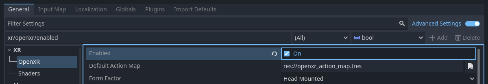
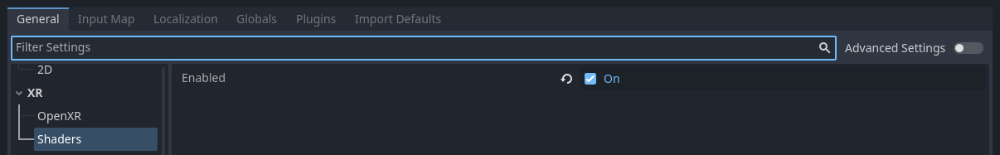
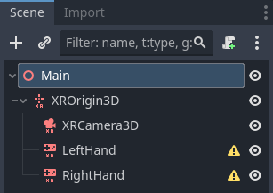
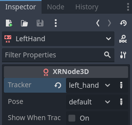

.. _doc_setting_up_xr:

Setting up XR
=============

Introduction to the XR system in Godot
--------------------------------------

Godot provides a modular XR system that abstracts many of the different XR platform specifics away from the user.
At the core sits the :ref:`XRServer <class_xrserver>` which acts as a central interface to the XR system that allows users to discover interfaces and interact with the components of the XR system.

Each supported XR platform is implemented as an :ref:`XRInterface <class_xrinterface>`.
A list of supported platforms can be found on the list of features page :ref:`here <doc_xr_support>`.
Supported interfaces register themselves with the :ref:`XRServer <class_xrserver>`
and can be queried with the ``find_interface`` method on the :ref:`XRServer <class_xrserver>`.
When the desired interface is found it can be initialized by calling ``initialize``
on the interface.

.. warning::
    A registered interface means nothing more than that the interface is available, if the interface is not supported by the host system, initialization may fail and return ``false``. This can have many reasons and sadly the reasons differ from platform to platform. It can be because the user hasn't installed the required software, or that the user simply hasn't plugged in their headset. You as a developer must thus react properly on an interface failing to initialize.

Due to the special requirements for output in XR, especially for head mounted devices that supply different images to each eye, the :ref:`XRServer <class_xrserver>` in Godot will override various features in the rendering system. For stand-alone devices this means the final output is handled by the :ref:`XRInterface <class_xrinterface>` and Godot's usual output system is disabled. For desktop XR devices that work as a second screen it is possible to dedicate a separate :ref:`Viewport <class_viewport>` to handle the XR output, leaving the main Godot window available for displaying alternative content.

.. note::
    Note that only one interface can be responsible for handling the output to an XR device, this is known as the primary interface and by default will be the first interface that is initialized. Godot currently thus only supports implementations with a single headset.
    It is possible, but increasingly uncommon, to have a secondary interface, for example to add tracking to an otherwise 3DOF only device.

There are three XR specific node types that you will find in nearly all XR applications:

- :ref:`XROrigin3D <class_xrorigin3d>` represents, for all intents and purposes, the center point of your play space. That is an oversimplified statement but we'll go into more detail later. All objects tracked in physical space by the XR platform are positioned in relation to this point.
- :ref:`XRCamera3D <class_xrcamera3d>` represents the (stereo) camera that is used when rendering output for the XR device. The positioning of this node is controlled by the XR system and updated automatically using the tracking information provided by the XR platform.
- :ref:`XRController3D <class_xrcontroller3d>` represents a controller used by the player, commonly there are two, one held in each hand. These nodes give access to various states on these controllers and send out signals when the player presses buttons on them. The positioning of this node is controlled by the XR system and updated automatically using the tracking information provided by the XR platform.

There are other XR related nodes and there is much more to say about these three nodes, but we'll get into that later on.

Which Renderer to use
---------------------

Godot has 3 renderer options for projects: Compatibility, Mobile, and Forward+.
The current recommendation is to use the Mobile renderer for any desktop VR project,
and use the Compatibility renderer for any project running on a standalone headset
like the Meta Quest 3. XR projects will run with the Forward+ renderer, but it isn't
well optimized for XR right now compared to the other two.

OpenXR
------

OpenXR is a new industry standard that allows different XR platforms to present themselves through a standardised API to XR applications. This standard is an open standard maintained by the Khronos Group and thus aligns very well with Godot's interests.

The Vulkan implementation of OpenXR is closely integrated with Vulkan, taking over part of the Vulkan system. This requires tight integration of certain core graphics features in the Vulkan renderer which are needed before the XR system is setup. This was one of the main deciding factors to include OpenXR as a core interface.

This also means OpenXR needs to be enabled when Godot starts in order to set things
up correctly. Check the :ref:`Enabled<class_ProjectSettings_property_xr/openxr/enabled>`
setting in your project settings under **XR > OpenXR**.

You can find several other settings related to OpenXR here as well. These can't be
changed while your application is running. The default settings will get us started,
but for more information on what's here see :ref:`doc_openxr_settings`.

You'll also need to go to **XR > Shaders** in the project settings and check the
:ref:`Enabled<class_ProjectSettings_property_xr/shaders/enabled>`
box to enable them. Once you've done that click the **Save & Restart** button.

.. warning::
    Many post process effects have not yet been updated to support stereoscopic rendering. Using these will have adverse effects.

Setting up the XR scene
-----------------------

Every XR application needs at least an :ref:`XROrigin3D <class_xrorigin3d>` and an :ref:`XRCamera3D <class_xrcamera3d>` node. Most will have two :ref:`XRController3D <class_xrcontroller3d>`, one for the left hand and one for the right. Keep in mind that the camera and controller nodes should be children of the origin node. Add these nodes to a new scene and rename the controller nodes to ``LeftHand`` and ``RightHand``, your scene should look something like this:

The warning icons are expected and should go away after you configure the
controllers. Select the left hand and set it up as follows:

And the right hand:

.. image:: img/xr_right_hand.webp

Right now all these nodes are on the floor, they will be positioned correctly in runtime. To help during development, it can be helpful to move the camera upwards so its ``y`` is set to ``1.7``, and move the controller nodes to ``-0.5, 1.0, -0.5`` and ``0.5, 1.0, -0.5`` for respectively the left and right hand.

Next we need to add a script to our root node. Add the following code into this script:

.. tabs::
  .. code-tab:: gdscript GDScript

    extends Node3D

    var xr_interface: XRInterface

    func _ready():
        xr_interface = XRServer.find_interface("OpenXR")
        if xr_interface and xr_interface.is_initialized():
            print("OpenXR initialized successfully")

            # Turn off v-sync!
            DisplayServer.window_set_vsync_mode(DisplayServer.VSYNC_DISABLED)

            # Change our main viewport to output to the HMD
            get_viewport().use_xr = true
        else:
            print("OpenXR not initialized, please check if your headset is connected")

  .. code-tab:: csharp

    using Godot;

    public partial class MyNode3D : Node3D
    {
        private XRInterface _xrInterface;

        public override void _Ready()
        {
            _xrInterface = XRServer.FindInterface("OpenXR");
            if(_xrInterface != null && _xrInterface.IsInitialized())
            {
                GD.Print("OpenXR initialized successfully");

                // Turn off v-sync!
                DisplayServer.WindowSetVsyncMode(DisplayServer.VSyncMode.Disabled);

                // Change our main viewport to output to the HMD
                GetViewport().UseXR = true;
            }
            else
            {
                GD.Print("OpenXR not initialized, please check if your headset is connected");
            }
        }
    }

This code fragment assumes we are using OpenXR, if you wish to use any of the other interfaces you can change the ``find_interface`` call.

.. warning::

    As you can see in the code snippet above, we turn off v-sync.
    When using OpenXR you are outputting the rendering results to an HMD that often requires us to run at 90Hz or higher.
    If your monitor is a 60hz monitor and v-sync is turned on, you will limit the output to 60 frames per second.

    XR interfaces like OpenXR perform their own sync.

    Also note that by default the physics engine runs at 60Hz as well and this can result in choppy physics.
    You should set ``Engine.physics_ticks_per_second`` to a higher value.

If you run your project at this point in time, everything will work but you will be in a dark world. So to finish off our starting point add a :ref:`DirectionalLight3D <class_directionallight3d>` and a :ref:`WorldEnvironment <class_worldenvironment>` node to your scene.
You may wish to also add a mesh instance as a child to each controller node just to temporarily visualise them.
Make sure you configure a sky in your world environment.

Now run your project, you should be floating somewhere in space and be able to look around.

.. note::

    While traditional level switching can definitely be used with XR applications, where this scene setup is repeated in each level, most find it easier to set this up once and loading levels as a subscene. If you do switch scenes and replicate the XR setup in each one, do make sure you do not run ``initialize`` multiple times. The effect can be unpredictable depending on the XR interface used.

    For the rest of this basic tutorial series we will create a game that uses a single scene.
