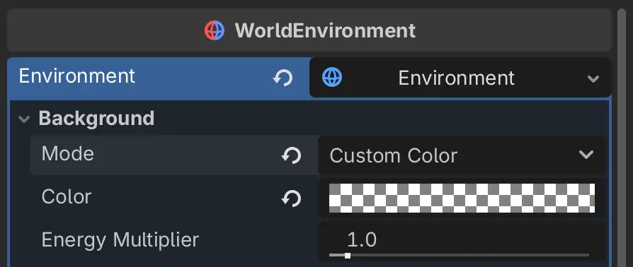
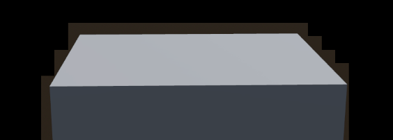
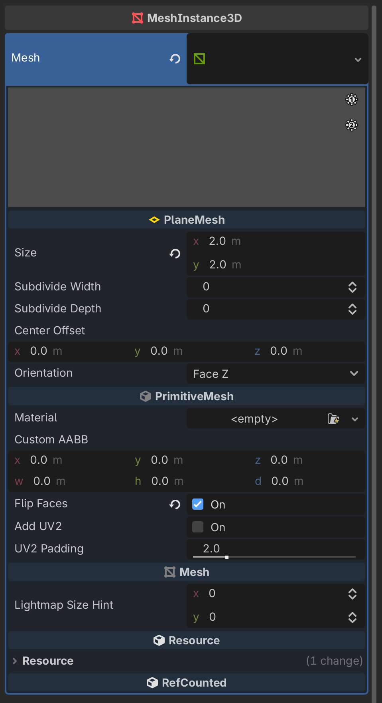
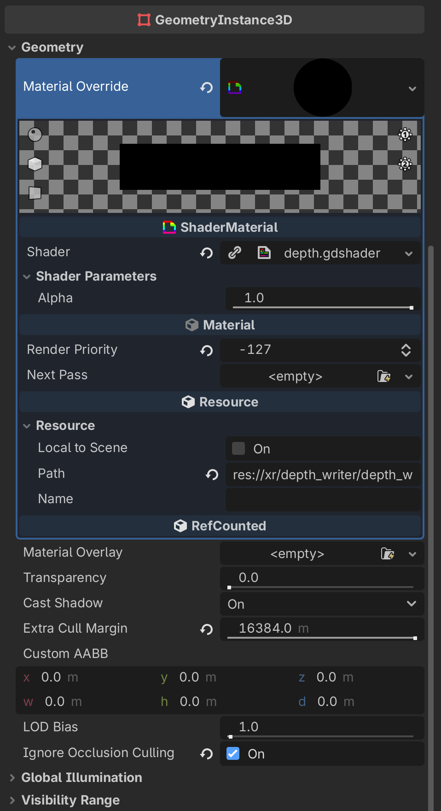

.. _doc_visionos_intro:

XR on visionOS
--------------

To use the XR mode on visionOS, start by :ref:`setting up XR <doc_setting_up_xr>`:

-  enable **XR shaders**.
-  add an :ref:`class_XROrigin3D`.
-  add an :ref:`class_XRCamera3D`.

You can initialize the visionOS XR interface similarly to any
other :ref:`class_XRInterface`. In your viewport, enable ``use_xr``,
enable ``use_hdr_2d``, and set ``vrs_mode`` to ``Viewport.VRS_XR``.

.. code-block:: gdscript

    func _ready() -> void:
        var interface = XRServer.find_interface("visionOS")
        if interface and interface.initialize():
            var viewport: Viewport = get_viewport()
            viewport.use_hdr_2d = true
            viewport.vrs_mode = Viewport.VRS_XR
            viewport.use_xr = true

Hand and controller tracking
~~~~~~~~~~~~~~~~~~~~~~~~~~~~

You can enable hand and controller tracking in the project settings.
visionOS will show a prompt asking for authorization when the game is launched. You
can customize the prompt's message, in the export settings, to explain why your game needs hand
or controller tracking.

The Godot nodes to use controller and hand tracking are the same as the other XRInterfaces:
:ref:`class_XRController3D`, :ref:`class_XRHandTracker`,
and :ref:`class_XRHandModifier3D`.

Transparent background
~~~~~~~~~~~~~~~~~~~~~~

When using **Mixed** immersion, the game is displayed as alpha-premultiplied on top of your physical
surroundings. To get a fully transparent background, use a black background color with an alpha of 0.
Any color other than black will render as additive on top of passthrough, even if alpha is 0.

Here are examples of different background modes:

.. table::
   :widths: auto

   +----------------------------+----------------------------+
   | Background Color           | Result                     |
   +----------------------------+----------------------------+
   | Color(0, 0, 0, 0)          | Passthrough                |
   +----------------------------+----------------------------+
   | Color(0, 0, 0, 1)          | Opaque Black               |
   +----------------------------+----------------------------+
   | Color(0, 0, 0, 0.9)        | Dimmed Passthrough         |
   +----------------------------+----------------------------+
   | Color(0.5, 0.25, 0, 0.5)   | Orange semi-transparent    |
   +----------------------------+----------------------------+
   | Color(1.0, 0.5, 0, 0)      | Orange additive            |
   +----------------------------+----------------------------+

If you are using a colored background (either a flat color or a custom sky), make sure
to :ref:`write to the depth buffer <doc_visionos_sky_depth_write>`.

Mobile renderer
~~~~~~~~~~~~~~~

The immersive mode on visionOS only supports the Mobile renderer. The game will
fall back to the Mobile renderer, even if your project is configured to use Forward+.

However, you might want to increase the :ref:`quality of shadows <doc_lights_and_shadows_shadow_filter_mode>`
in the **Project Settings** since Godot's default quality for shadows is lower on mobile.

Depth Re-projection
~~~~~~~~~~~~~~~~~~~

visionOS uses the depth buffer of your rendered scene to re-project frames
when the game doesn't render at the display's refresh rate. Be mindful of this when
rendering transparent objects: write to the depth buffer for opaque parts that
should be re-projected but do not write to the depth buffer for transparent or invisible objects
that are less opaque than their background.

For transparent objects on top of the passthrough background (such as particles or
:ref:`glow <doc_environment_and_post_processing_glow>`), make sure that at least one layer is
writing depth, to avoid having :ref:`the content be discarded <doc_visionos_sky_depth_write>`.

Troubleshooting
---------------

.. _doc_visionos_sky_depth_write:

Block-shaped artifacts around edges
~~~~~~~~~~~~~~~~~~~~~~~~~~~~~~~~~~~

If you see block-shaped artifacts around the edges, this is because Godot's sky shader
does not write to depth and visionOS only displays content that has written depth.

Fix this by doing one of the following:

1. Make the sky black if you want a transparent background.
2. Add a full-screen quad that writes depth to the background, if you want to render a virtual sky
   (opaque or semi-transparent).

To write depth to the sky, add a :ref:`class_MeshInstance3D` with the
following shader:

.. code-block:: glsl
    :caption: depth.gdshader

    shader_type spatial;
    render_mode unshaded, fog_disabled, depth_draw_always, blend_add;

    // visionOS interprets a depth of 0 as having no content.
    #define DEPTH_BIAS 0.00000001

    // between 0 (transparent background) and 1 (opaque background).
    uniform float alpha: hint_range(0, 1) = 1.0;

    void vertex() {
        POSITION = vec4(VERTEX.xy, DEPTH_BIAS, 1.0);
    }

    void fragment() {
        ALBEDO = vec3(0);
        ALPHA = alpha;
    }

And the following geometry:

.. table::
   :widths: auto

   +------------------+------------------+
   | |depth_geometry| | |depth_material| |
   +------------------+------------------+

This object does the following:

-  renders in ``[-1.0; 1.0]`` in screen space.
-  writes depth to ``0.00000001`` and alpha to ``1.0`` (or another alpha if you want semi-transparency).
-  renders as the first transparent object.
-  never gets culled.

This is similar to doing :ref:`post-processing <doc_advanced_postprocessing>` in Godot, but is
just writing depth and alpha.

Camera near plane
~~~~~~~~~~~~~~~~~

visionOS (and more specifically `CompositorServices <https://developer.apple.com/documentation/compositorservices>`_)
requires the near plane of the :ref:`class_XRCamera3D` to be at least 0.1 meters.

If you use a value below 0.1, the scene won't render. To solve this:

- increase the near value of you *XRCamera3D* to be ``0.1`` or greater.
- take into account the *world_scale* (including floating-point precision errors): ``znear = 0.1 * world_scale + margin``.
- make sure that the *XRCamera3D* is the current camera, because Godot derives the near/far planes
  from the camera on your viewport, which might not be the *XRCamera3D*. You can check the current
  camera with ``get_viewport().get_camera_3d()``.

Crash after freezing for 2 seconds
~~~~~~~~~~~~~~~~~~~~~~~~~~~~~~~~~~

On visionOS, the OS kills CompositorServices apps if they hang for more than 2 seconds (except on
the first frame).

Godot does not currently support loading shaders in the background without freezing the render
thread; you can fix this error by loading all your shaders upfront in the first scene of
your Godot game.

.. attention::

    The 2 seconds timeout does not apply when the app is attached to Xcode. So make sure
    to test your game without launching from Xcode, before sharing it with more people, especially
    if it has long loading times.
