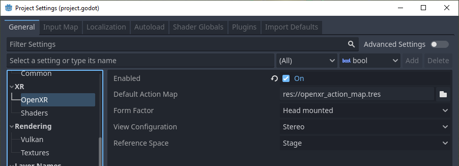
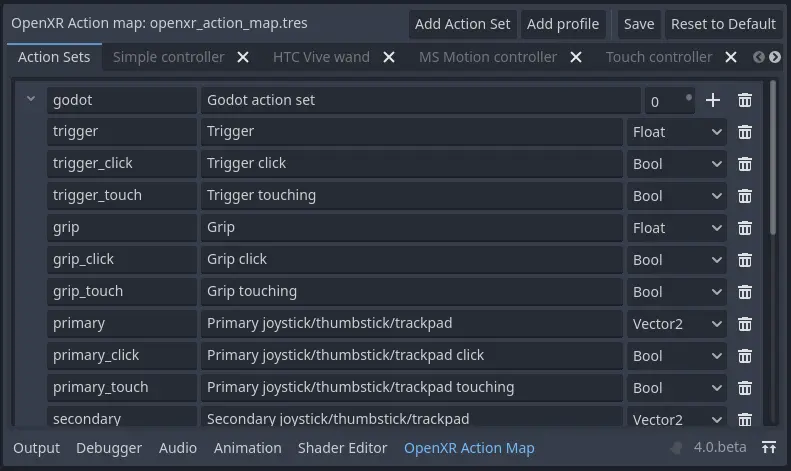
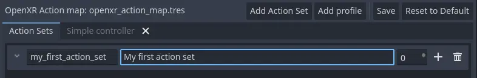
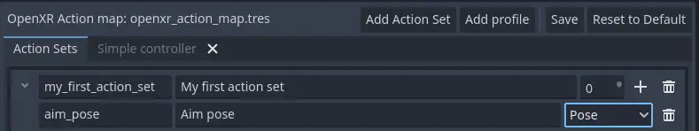
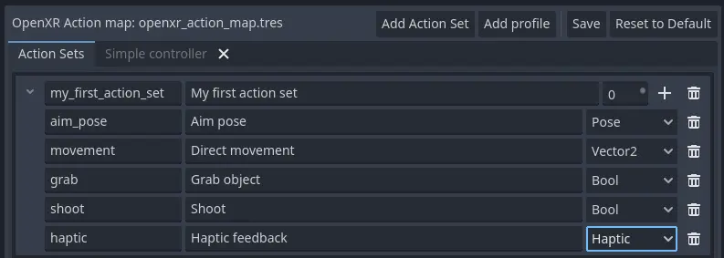
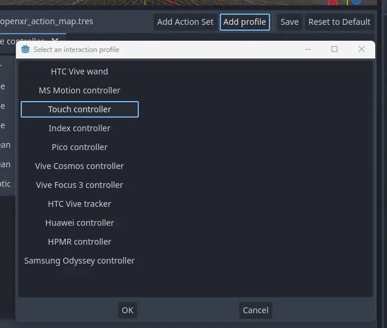
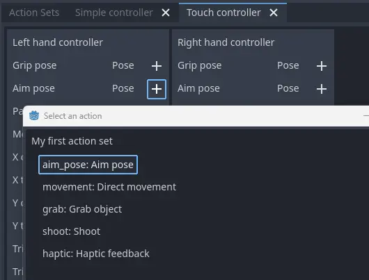
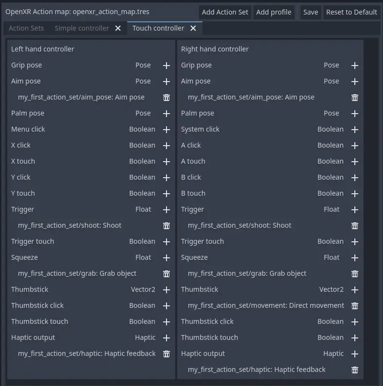
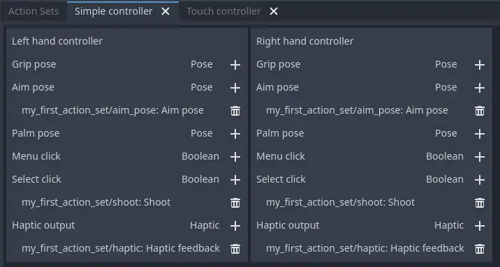

.. _doc_xr_action_map:

The XR action map
=================

Godot has an action map feature as part of the XR system.
At this point in time this system is part of the OpenXR module.
There are plans to encompass WebXR into this in the near future hence we call it the XR action map system in this document.
It implements the built-in action map system of OpenXR mostly exactly as it is offered.

The XR action map system exposes input, positional data and output for XR controllers to your game/application.
It does this by exposing named actions that can be tailored to your game/application and binding these to the actual inputs and outputs on your XR devices.

As the XR action map is currently part of the OpenXR module, OpenXR needs to be enabled in your project settings to expose it:

You will then find the XR Action Map interface in the bottom of the screen:

.. note::
  Godot's built-in input system has many things in common with the XR action map system.
  In fact our original idea was to add functionality to the existing input system and expose the data to the OpenXR action map system.
  We may revisit that idea at some point but as it turns out there were just too many problems to overcome.
  To name a few:

    * Godot's input system mainly centers around button inputs, XR adds triggers, axis, poses and haptics (output) into the mix.
      This would greatly complicate the input system with features that won't work for normal controllers or contrast with the current approach.
      It was felt this would lead to confusion for the majority of Godot users.
    * Godot's input system works with raw input data that is parsed and triggers emitting actions.
      This input data is made available to the end user.
      OpenXR completely hides raw data and does all the parsing for us, we only get access to already parsed action data.
      This inconsistency is likely to lead to bugs when an unsuspecting user tries to use an XR device as a normal input device.
    * Godot's input system allows changes to what inputs are bound to actions in runtime, OpenXR does not.
    * Godot's input system is based on device ids which are meaningless in OpenXR.

  This does mean that a game/application that mixes traditional inputs with XR controllers will have a separation.
  For most applications either one or the other is used and this is not seen as a problem.
  In the end, it's a limitation of the system.

The default action map
----------------------

Godot will automatically create a default action map if no action map file is found.

.. warning::
  This default map was designed to help developers port their XR games/applications from Godot 3 to Godot 4.
  As a result this map essentially binds all known inputs on all controllers supported by default, to actions one on one.
  This is not a good example of setting up an action map.
  It does allow a new developer to have a starting point when they want to become familiar with Godot XR.
  It prevents having to design a proper action map for their game/application first.

For this walkthrough we're going to start with a blank action map.
You can simply delete the "Godot action set" entry at the top by pressing the trash can icon.
This will clear out all actions.
You might also want to remove the controllers that you do not wish to setup, more on this later.

Action sets
-----------

.. note::
  Before we dive in, you will see the term XR runtime used throughout this document.
  With XR runtime we mean the software that is controlling and interacting with the AR or VR headset.
  The XR runtime then exposes this to us through an API such as OpenXR.
  So:

    * for Steam this is SteamVR,
    * for Meta on desktop this is the Oculus Client (including when using Quest link),
    * for Meta on Quest this is the Quest's native OpenXR client,
    * on Linux this could be Monado, etc.

The action map allows us to organize our actions in sets.
Each set can be enabled or disabled on its own.

The concept here is that you could have different sets that provide bindings in different scenarios.
You could have:

  * a ``Character control`` set for when you're walking around,
  * a ``Vehicle control`` set for when you're operating a vehicle,
  * a ``Menu`` set for when a menu is open.

Only the action set applicable to the current state of your game/application can then be enabled.

This is especially important if you wish to bind the same input on a controller to a different action.
For instance:

  * in your ``Character control`` set you may have an action ``Jump``, 
  * in your ``Vehicle control`` set you may have an action ``Accelerate``, 
  * in your ``Menu`` set you may have an action ``Select``.

All are bound to the trigger on your controller.

OpenXR will only bind an input or output to a single action.
If the same input or output is bound to multiple actions the one in the active action set with the highest priority will be the one updated/used.
So in our above example it will thus be important that only one action set is active.

For your first XR game/application we highly recommend starting with just a single action set and to not over-engineer things.

For our walkthrough in this document we will thus create a single action set called ``my_first_action_set``.
We do this by pressing the ``Add action set`` button:

The columns in our table are as follows:

.. list-table::
  :class: wrap-normal
  :width: 100%
  :widths: 7 23 70
  :header-rows: 1

  * - Col
    - Value
    - Description
  * - 1
    - my_first_action_set
    - This is the internal name of the action set.
      OpenXR doesn't specify specific restrictions on this name other then size, however some XR runtimes will not like spaces or special characters.
  * - 2
    - My first action set
    - This is a human-readable name for the action set.
      Some XR runtimes will display this name to the end user, for example in configuration dialogs.
  * - 3
    - 0
    - This is the priority of the action set.
      If multiple active action sets have actions bound to the same controllers inputs or outputs, the action set with the highest priority value will determine the action that is updated.

Actions
-------

In the XR action map, actions are the entities that your game/application will interact with.
For instance, we can define an action ``Shoot`` and the input bound to that action will trigger the ``button_pressed`` signal on the relevant :ref:`XRController3D <class_xrcontroller3d>` node in your scene with ``Shoot`` as the ``name`` parameter of the signal.

You can also poll the current state of an action.
:ref:`XRController3D <class_xrcontroller3d>` for instance has an ``is_button_pressed`` method.

Actions can be used for both input and output and each action has a type that defines its behavior.

* The ``Bool`` type is used for discrete input like buttons.
* The ``Float`` type is used for analogue input like triggers.

These two are special as they are the only ones that are interchangeable.
OpenXR will handle conversions between ``Bool`` and ``Float`` inputs and actions.
You can get the value of a ``Float`` type action by calling the method ``get_float`` on your :ref:`XRController3D <class_xrcontroller3d>` node.
It emits the ``input_float_changed`` signal when changed.

.. note::
  Where analogue inputs are queried as buttons a threshold is applied.
  This threshold is currently managed exclusively by the XR runtime.
  There are plans to extend Godot to provide some level of control over these thresholds in the future.

The ``Vector2`` type defines the input as an axis input.
Touchpads, thumbsticks and similar inputs are exposed as vectors.
You can get the value of a ``Vector2`` type action by calling the method ``get_vector2`` on your :ref:`XRController3D <class_xrcontroller3d>` node.
It emits the ``input_vector2_changed`` signal when changed.

The ``Pose`` type defines a spatially tracked input.
Multiple "pose" inputs are available in OpenXR: ``aim``, ``grip`` and ``palm``.
Your :ref:`XRController3D <class_xrcontroller3d>` node is automatically positioned based on the pose action assigned to ``pose`` property of this node.
More about poses later.

.. note::
  The OpenXR implementation in Godot also exposes a special pose called ``Skeleton``.
  This is part of the hand tracking implementation.
  This pose is exposed through the ``skeleton`` action that is supported outside of the action map system.
  It is thus always present if hand tracking is supported.
  You don't need to bind actions to this pose to use it.

Finally, the only output type is ``Haptic`` and it allows us to set the intensity of haptic feedback, such as controller vibration.
Controllers can have multiple haptic outputs and support for haptic vests is coming to OpenXR.

So lets add an action for our aim pose, we do this by clicking on the ``+`` button for our action set:

The columns in our table are as follows:

.. list-table::
  :class: wrap-normal
  :width: 100%
  :widths: 7 23 70
  :header-rows: 1

  * - Col
    - Value
    - Description
  * - 1
    - aim_pose
    - This is the internal name of the action.
      OpenXR doesn't specify specific restrictions on this name other then size, however some XR runtimes will not like spaces or special characters.
  * - 2
    - Aim pose
    - This is a human-readable name for the action.
      Some XR runtimes will display this name to the end user, for example in configuration dialogs.
  * - 3
    - Pose
    - The type of this action.

OpenXR defines a number of bindable input poses that are commonly available for controllers.
There are no rules for which poses are supported for different controllers.
The poses OpenXR currently defines are:

  * The aim pose on most controllers is positioned slightly infront of the controller and aims forward.
    This is a great pose to use for laser pointers or to align the muzzle of a weapon with.
  * The grip pose on most controllers is positioned where the grip button is placed on the controller.
    The orientation of this pose differs between controllers and can differ for the same controller on different XR runtimes.
  * The palm pose on most controllers is positioned in the center of the palm of the hand holding the controller.
    This is a new pose that is not available on all XR runtimes.

 .. note::
  If hand tracking is used, there are currently big differences in implementations between the different XR runtimes.
  As a result the action map is currently not suitable for hand tracking. Work is being done on this so stay tuned.

Let's complete our list of actions for a very simple shooting game/application:

The actions we have added are:

  * movement, which allows the user to move around outside of normal room scale tracking.
  * grab, which detects that the user wants to hold something.
  * shoot, which detects that the user wants to fire the weapon they are holding.
  * haptic, which allows us to output haptic feedback.

Now note that we don't distinguish between the left and right hand.
This is something that is determined at the next stage.
We've implemented the action system in such a way that you can bind the same action to both hands.
The appropriate :ref:`XRController3D <class_xrcontroller3d>` node will emit the signal.

.. warning::
  For both grab and shoot we've used the ``Bool`` type.
  As mentioned before, OpenXR does automatic conversions from an analogue controls however not all XR Runtimes currently apply sensible thresholds.

  We recommend as a workaround to use the ``Float`` type when interacting with triggers and grip buttons and apply your own threshold.

  For buttons like A/B/X/Y and similar where there is no analogue option, the ``Bool`` type works fine.

.. note::
  You can bind the same action to multiple inputs for the same controller on the same profile.
  In this case the XR runtime will attempt to combine the inputs.
  
  * For ``Bool`` inputs, this will perform an ``OR`` operation between the buttons.
  * For ``Float`` inputs, this will take the highest value of the bound inputs.
  * The behavior for ``Pose`` inputs is undefined, but the first bound input is likely to be used.

  You shouldn't bind multiple actions of the same action set to the same controller input.
  If you do this, or if actions are bound from multiple action sets but they have overlapping priorities, the behavior is undefined.
  The XR runtime may simply not accept your action map, or it may take this on a first come first serve basis.

  We are still investigating the restrictions around binding multiple actions to the same output as this scenario makes sense.
  The OpenXR specification seems to not allow this.  

Now that we have our basic actions defined, it's time to hook them up.

Profiles
--------

In OpenXR controller bindings are captured in so-called "Interaction Profiles".
We've simply shortened it to "Profiles" because it takes up less space.

This generic name is chosen because controllers don't cover the entire system.
Currently there are also profiles for trackers, remotes and tracked pens.
There are also provisions for devices such as treadmills, haptic vests and such even though those are not part of the specification yet.

.. warning::
  It is important to know that OpenXR has strict checking on supported devices.
  The core specification identifies a number of controllers and similar devices with their supported inputs and outputs.
  Every XR runtime must accept these interaction profiles even if they aren't applicable.

  New devices are added through extensions and XR runtimes must specify which ones they support.
  XR runtimes that do not support a device added through extensions will not accept these profiles.
  XR runtimes that do not support added input or output types will often crash if supplied.

  As such Godot keeps meta data of all available devices, their inputs and outputs and which extension adds support for them.
  You can create interaction profiles for all devices you wish to support.
  Godot will filter out those not supported by the XR runtime the user is using.

  This does mean that in order to support new devices, you might need to update to a more recent version of Godot.

It is however also important to note that the action map has been designed with this in mind.
When new devices enter the market, or when your users use devices that you do not have access to, the action map system relies on the XR runtime.
It is the XR runtime's job to choose the best fitting interaction profile that has been specified and adapt it for the controller the user is using.

How the XR runtime does this is left to the implementation of the runtime and there are thus vast differences between the runtimes.
Some runtimes might even permit users to edit the bindings themselves.

A common approach for a runtime is to look for a matching interaction profile first.
If this is not found it will check the most common profiles such as that of the "Touch controller" and do a conversion.
If all else fails, it will check the generic :ref:`"Simple controller" <doc_xr_action_map_simple>`.

.. note::
  There is an important conclusion to be made here:
  When a controller is found, and the action map is applied to it, the XR runtime is not limited to the exact configurations you set up in Godot's action map editor.
  While the runtime will generally choose a suitable mapping based on one of the bindings you set up in the action map, it can deviate from it.

  For example, when the Touch controller profile is used any of the following scenarios could be true:

    * we could be using a Quest 1 controller,
    * we could be using a Quest 2 controller,
    * we could be using a Quest Pro controller but no Quest Pro profile was given or the XR runtime being used does not support the Quest Pro controller,
    * it could be a completely different controller for which no profile was given but the XR runtime is using the touch bindings as a base.

  Ergo, there currently is no way to know with certainty, which controller the user is actually using.

.. warning::
  Finally, and this trips up a lot of people, the bindings aren't set in stone.
  It is fully allowed, and even expected, that an XR runtime allows a user to customise the bindings.

  At the moment none of the XR runtimes offer this functionality though SteamVR has an existing UI from OpenVRs action map system that is still accessible.
  This is actively being worked on however.

Our first controller binding
----------------------------

Let's set up our first controller binding, using the Touch controller as an example.

Press "Add profile", find the Touch controller, and add it.
If it is not in the list, then it may already have been added.

Our UI now shows panels for both the left and right controllers.
The panels contain all of the possible inputs and outputs for each controller.
We can use the ``+`` next to each entry to bind it to an action:

Let's finish our configuration:

Each action is bound the given input or output for both controllers to indicate that we support the action on either controller.
The exception is the movement action which is bound only to the right hand controller.
It is likely that we would want to use the left hand thumbstick for a different purpose, say a teleport function.

In developing your game/application you have to account for the possibility that the user changes the binding and binds the movement to the left hand thumbstick.

Also note that our shoot and grab boolean actions are linked to inputs of type ``Float``.
As mentioned before OpenXR will do conversions between the two, but do read the warning given on that subject earlier in this document.

.. note::
  Some of the inputs seem to appear in our list multiple times.
  
  For instance we can find the ``X`` button twice, once as ``X click`` and then as ``X touch``.
  This is due to the Touch controller having a capacitive sensor.
  
  * ``X touch`` will be true if the user is merely touching the X button.
  * ``X click`` will be true when the user is actually pressing down on the button.

  Similarly for the thumbstick we have:
  
  * ``Thumbstick touch`` which will be true if the user is touching the thumbstick.
  * ``Thumbstick`` which gives a value for the direction the thumbstick is pushed to.
  * ``Thumbstick click`` which is true when the user is pressing down on the thumbstick.

  It is important to note that only a select number of XR controllers support touch sensors or have click features on thumbsticks.
  Keep that in mind when designing your game/application. 
  Make sure these are used for optional features of your game/application.

.. _doc_xr_action_map_simple:

The simple controller
---------------------

The "Simple controller" is a generic controller that OpenXR offers as a fallback.
We'll apply our mapping:

As becomes painfully clear, the simple controller is often far too simple and falls short for anything but the simplest of VR games/applications.

This is why many XR runtimes only use it as a last resort and will attempt to use bindings from one of the more popular systems as a fallback first.

.. note::
  Due to the simple controller likely not covering the needs of your game, it is tempting to provide bindings for every controller supported by OpenXR.
  The default action map seems to suggest this as a valid course of action.
  As mentioned before, the default action map was designed for ease of migration from Godot 3.

  It is the recommendation from the OpenXR Working Group that only bindings for controllers actually tested by the developer are setup.
  The XR runtimes are designed with this in mind.
  They can perform a better job of rebinding a provided binding than a developer can make educated guesses.
  Especially as the developer can't test if this leads to a comfortable experience for the end user.

  This is our advice as well: limit your action map to the interaction profiles for devices you have actually tested your game with.
  The Oculus Touch controller is widely used as a fallback controller by many runtimes.
  If you are able to test your game using a Meta Rift or Quest and add this profile there is a high probability your game will work with other headsets.

