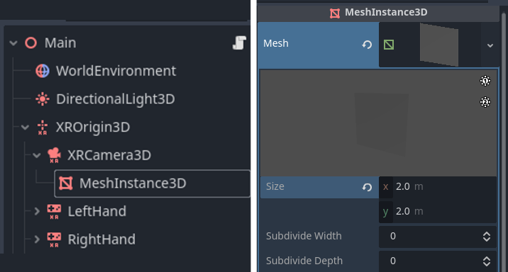
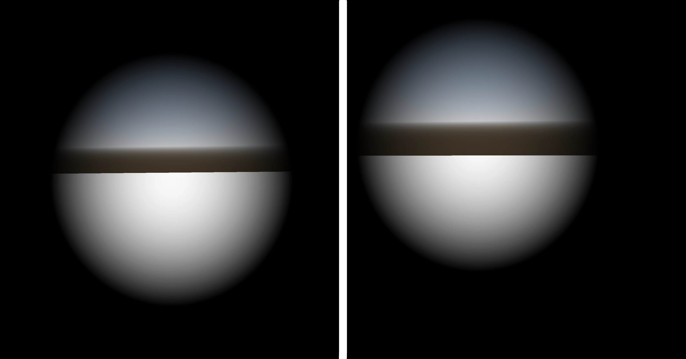
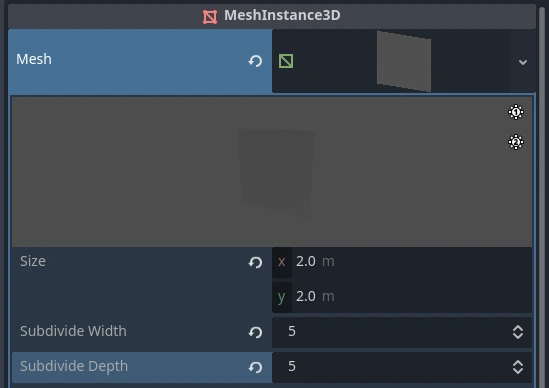

.. _doc_xr_full_screen_effects:

XR full screen effects
======================

When adding custom full screen effects to your XR application, one valid approach is
applying a full screen quad to the XR camera and applying effects to that quad's shader.

Here is a simple vignette shader that you might apply to the quad, darkening the edges
of a user's screen:

.. code-block:: glsl

  shader_type spatial;
  render_mode depth_test_disabled, skip_vertex_transform, unshaded, cull_disabled;

  void vertex() {
	  POSITION = vec4(VERTEX.xy, 1.0, 1.0);
  }

  void fragment() {
	  ALBEDO = vec3(0.0);
	  ALPHA = dot(UV * 2.0 - 1.0, UV * 2.0 - 1.0) * 2.0;
  }

However, when creating an effect that is centered straight ahead in the user's view
(such as the above vignette effect), the end result may look incorrect in XR.
Below shows two captures of the right-eye view with a vignette shader. The left capture is an
unmodified shader; the right capture adjusts the full screen quad using the projection matrix.
This adjustment is what we're looking for.

Applying the projection matrix
------------------------------

To properly center the effect, the ``POSITION`` of the full screen quad
needs to take the asymmetric field of view into account. To do this while also ensuring the quad
has full coverage of the entire render target, we can subdivide the quad and apply the projection matrix
to the inner vertices. Let's increase the subdivide width and depth of the quad.

Then, in the vertex function of our shader, we apply an offset from the projection matrix to
the inner vertices. Here's an example of how you might do this with the above simple vignette shader:

.. code-block:: glsl

  shader_type spatial;
  render_mode depth_test_disabled, skip_vertex_transform, unshaded, cull_disabled;

  void vertex() {
	  vec2 vert_pos = VERTEX.xy;

	  if (length(vert_pos) < 0.99) {
		  vec4 offset = PROJECTION_MATRIX * vec4(0.0, 0.0, 1.0, 1.0);
		  vert_pos += (offset.xy / offset.w);
	  }

	  POSITION = vec4(vert_pos, 1.0, 1.0);
  }

  void fragment() {
	  ALBEDO = vec3(0.0);
	  ALPHA = dot(UV * 2.0 - 1.0, UV * 2.0 - 1.0) * 2.0;
  }

.. note:: For more info on asymmetric FOV and its purpose, see this
          `Meta Asymmetric Field of View FAQ <https://developers.meta.com/horizon/documentation/unity/unity-asymmetric-fov-faq/>`_.

Limitations
-----------

Currently, full screen effects that require reading from the screen texture effectively disable all
rendering performance optimizations in XR. This is because, when reading from the screen texture,
Godot makes a full copy of the render buffer. Since this may create performance issues, it is recommended
that custom effects be limited to per-pixel ones such as the above vignette shader.
