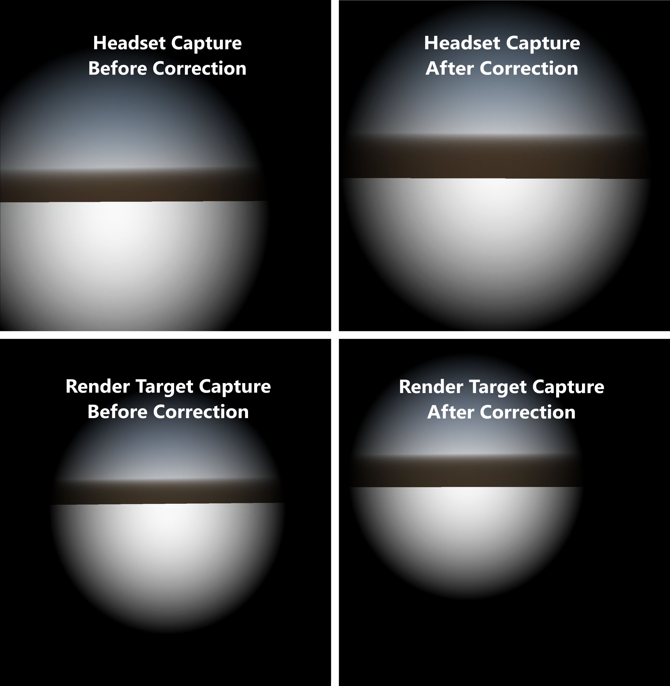

.. _doc_xr_full_screen_effects:

XR full screen effects
======================

When adding custom full screen effects to your XR application, one approach is
using a full screen quad and applying effects to that quad's shader.
Add a :ref:`MeshInstance3D <class_MeshInstance3D>` node
to your scene as a child of your :ref:`XRCamera3D <class_XRCamera3D>`,
and set the ``mesh`` property to a :ref:`QuadMesh <class_QuadMesh>`.
Set the width and height of the quad to ``2``.

.. image:: img/xr_full_screen_effects_starting_quad.webp

You can then add a shader to your quad to make it cover the screen. This is done by setting the
vertex shader's ``POSITION`` built-in to ``vec4(VERTEX.xy, 1.0, 1.0)``.
However, when creating an effect that is centered straight ahead in the user's view
(such as a vignette effect), the end result may look incorrect in XR.

Below shows captures of the right-eye view with a vignette shader, both from the headset and the render target itself.
The left captures are an unmodified shader; the right captures adjust the full screen quad using the projection matrix.
While the capture on the left is centered in the render target, it is off-center in the headset view.
But, after applying the projection matrix, we see that the effect is centered in the headset itself.

Applying the projection matrix
------------------------------

To properly center the effect, the ``POSITION`` of the full screen quad
needs to take the asymmetric field of view into account. To do this while also ensuring the quad
has full coverage of the entire render target, we can subdivide the quad and apply the projection matrix
to the inner vertices. Let's increase the subdivide width and depth of the quad.

Then, in the vertex function of our shader, we apply an offset from the projection matrix to
the inner vertices. Here's an example of how you might do this with the above simple vignette shader:

.. code-block:: glsl

  shader_type spatial;
  render_mode depth_test_disabled, skip_vertex_transform, unshaded, cull_disabled;

  // Modify VERTEX.xy using the projection matrix to correctly center the effect.
  void vertex() {
	  vec2 vert_pos = VERTEX.xy;

	  if (length(vert_pos) < 0.99) {
		  vec4 offset = PROJECTION_MATRIX * vec4(0.0, 0.0, 1.0, 1.0);
		  vert_pos += (offset.xy / offset.w);
	  }

	  POSITION = vec4(vert_pos, 1.0, 1.0);
  }

  void fragment() {
	  ALBEDO = vec3(0.0);
	  ALPHA = dot(UV * 2.0 - 1.0, UV * 2.0 - 1.0) * 2.0;
  }

.. note:: For more info on asymmetric FOV and its purpose, see this
          `Meta Asymmetric Field of View FAQ <https://developers.meta.com/horizon/documentation/unity/unity-asymmetric-fov-faq/>`_.

Limitations
-----------

This full screen effect method has no performance concerns for per-pixel effects such as the above vignette shader.
However, it is not recommended to read from the screen texture when using this technique.
Full screen effects that require reading from the screen texture effectively disable all rendering performance optimizations in XR.
This is because, when reading from the screen texture, Godot makes a full copy of the render buffer;
this drastically increases the workload for the GPU and can create performance concerns.
