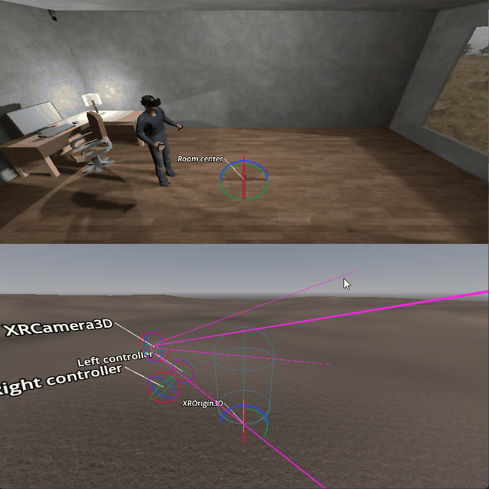
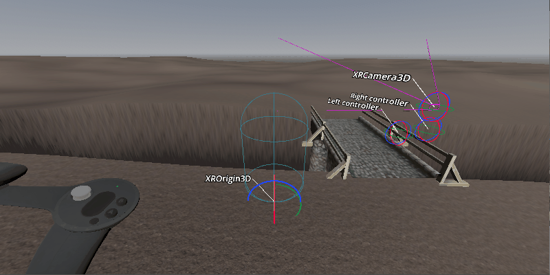
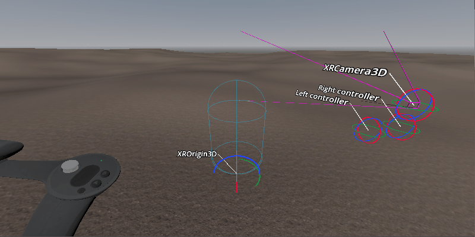
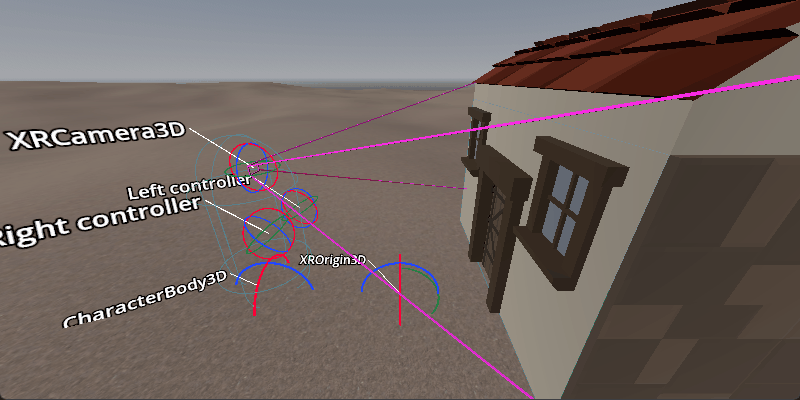
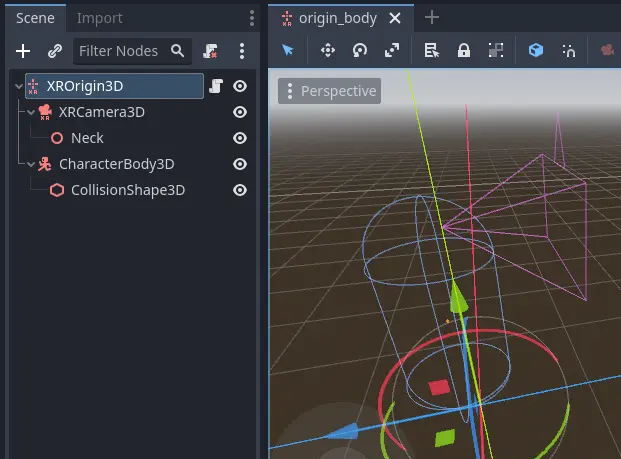
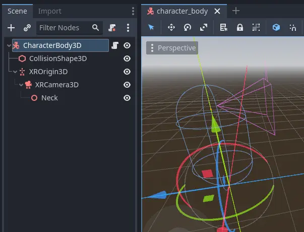

.. _doc_xr_room_scale:

Room scale in XR
================

One of the staples of XR projects is the ability to walk around freely in a large space.
This space is often constrained by the room the player is physically in with tracking sensors placed within this space.
With the advent of inside out tracking however ever larger play spaces are possible.

As a developer this introduces a number of interesting challenges.
In this document we will look at a number of the challenges you may face and outline some solutions.
We'll discuss the issues and challenges for seated XR games in another document.

.. note::
  Often developers sit behind their desk while building the foundation to their game.
  In this mode the issues with developing for room scale don't show themselves until it is too late.
  The advice here is to start testing while standing up and walking around as early as possible.
  Once you are happy your foundation is solid, you can develop in comfort while remaining seated.

In traditional first person games a player is represented by a :ref:`CharacterBody3D <class_characterbody3d>` node.
This node is moved by processing traditional controller, mouse or keyboard input.
A camera is attached to this node at a location roughly where the player's head will be.

Applying this model to the XR setup, we add an :ref:`XROrigin3D <class_xrorigin3d>` node as a child of the character body,
and add an :ref:`XRCamera3D <class_xrcamera3d>` as a child of the origin node. At face value this seems to work.
However, upon closer examination this model does not take into account that there are two forms of movement in XR.
The movement through controller input, and the physical movement of the player in the real world.

As a result, the origin node does not represent the position of the player.
It represents the center, or start of, the tracking space in which the player can physically move.
As the player moves around their room this movement is represented through the tracking of the player's headset.
In game this translates to the camera node's position being updated accordingly.
For all intents and purposes, we are tracking a disembodied head.
Unless body tracking is available, we have no knowledge of the position or orientation of the player's body.

The first problem this causes is fairly obvious.
When the player moves with controller input, we can use the same approach in normal games and move the player in a forward direction.
However the player isn't where we think they are and as we move forward we're checking collisions in the wrong location.

The second problem really shows itself when the player walks further away from the center of the tracking space and uses controller input to turn.
If we rotate our character body, the player will be moved around the room in a circular fashion.

If we fix the above issues, we will find a third issue.
When the path for the player is blocked in the virtual world, the player can still physically move forward.

We will look at solving the first two problem with two separate solutions, and then discuss dealing with the third.

Origin centric solution
-----------------------

Looking at the first approach for solving this we are going to change our structure.
This is the approach currently implemented in XR Tools.

In this setup we mark the character body as top level so it does not move with the origin.

We also have a helper node that tells us where our neck joint is in relation to our camera.
We use this to determine where our body center is.

Processing our character movement is now done in three steps.

.. note::
  The `Origin centric movement demo <https://github.com/godotengine/godot-demo-projects/tree/master/xr/openxr_origin_centric_movement>`__ contains a more elaborate example of the technique described below.

Step 1
------

In the first step we're going to process the physical movement of the player.
We determine where the player is right now, and attempt to move our character body there.

.. code-block:: gdscript

  func _process_on_physical_movement(delta):
    # Remember our current velocity, we'll apply that later
    var current_velocity = $CharacterBody3D.velocity

    # Remember where our player body currently is
    var org_player_body: Vector3 = $CharacterBody3D.global_transform.origin

    # Determine where our player body should be
    var player_body_location: Vector3 = $XRCamera3D.transform * $XRCamera3D/Neck.transform.origin
    player_body_location.y = 0.0
    player_body_location = global_transform * player_body_location

    # Attempt to move our character
    $CharacterBody3D.velocity = (player_body_location - org_player_body) / delta
    $CharacterBody3D.move_and_slide()

    # Set back to our current value
    $CharacterBody3D.velocity = current_velocity

    # Check if we managed to move all the way, ignoring height change
    var movement_left = player_body_location - $CharacterBody3D.global_transform.origin
    movement_left.y = 0.0
    if (movement_left).length() > 0.01:
      # We'll talk more about what we'll do here later on
      return true
    else:
      return false

  func _physics_process(delta):
    var is_colliding = _process_on_physical_movement(delta)

Note that we're returning ``true`` from our ``_process_on_physical_movement`` function when we couldn't move our player all the way.

Step 2
------

The second step is to handle rotation of the player as a result of user input.

As the input used can differ based on your needs we are simply calling the function ``_get_rotational_input``.
This function should obtain the necessary input and return the rotational speed in radians per second.

.. note::
  For our example we are going to keep this simple and straight forward.
  We are not going to worry about comfort features such as snap turning and applying a vignette.
  We highly recommend implementing such comfort features.

.. code-block:: gdscript

  func _get_rotational_input() -> float:
    # Implement this function to return rotation in radians per second.
    return 0.0

  func _copy_player_rotation_to_character_body():
    # We only copy our forward direction to our character body, we ignore tilt
    var camera_forward: Vector3 = -$XRCamera3D.global_transform.basis.z
    var body_forward: Vector3 = Vector3(camera_forward.x, 0.0, camera_forward.z)

    $CharacterBody3D.global_transform.basis = Basis.looking_at(body_forward, Vector3.UP)

  func _process_rotation_on_input(delta):
    var t1 := Transform3D()
    var t2 := Transform3D()
    var rot := Transform3D()

    # We are going to rotate the origin around the player
    var player_position = $CharacterBody3D.global_transform.origin - global_transform.origin

    t1.origin = -player_position
    t2.origin = player_position
    rot = rot.rotated(Vector3(0.0, 1.0, 0.0), _get_rotational_input() * delta)
    global_transform = (global_transform * t2 * rot * t1).orthonormalized()

    # Now ensure our player body is facing the correct way as well
    _copy_player_rotation_to_character_body()

  func _physics_process(delta):
    var is_colliding = _process_on_physical_movement(delta)
    if !is_colliding:
      _process_rotation_on_input(delta)

.. note::
  We've added the call for processing our rotation to our physics process but we are only executing this if we were able to move our player fully.
  This means that if the player moves somewhere they shouldn't, we don't process further movement.

Step 3
------

The third and final step is moving the player forwards, backwards or sideways as a result of user input.

Just like with the rotation the inputs differ from project to project so we are simply calling the function ``_get_movement_input``.
This function should obtain the necessary input and return a directional vector scaled to the required velocity.

.. note::
  Just like with rotation we're keeping it simple. Here too it is advisable to look at adding comfort settings.

.. code-block:: gdscript

  var gravity = ProjectSettings.get_setting("physics/3d/default_gravity")

  func _get_movement_input() -> Vector2:
    # Implement this to return requested directional movement in meters per second.
    return Vector2()

  func _process_movement_on_input(delta):
    # Remember where our player body currently is
    var org_player_body: Vector3 = $CharacterBody3D.global_transform.origin

    # We start with applying gravity
    $CharacterBody3D.velocity.y -= gravity * delta

    # Now we add in our movement
    var input: Vector2 = _get_movement_input()
    var movement: Vector3 = ($CharacterBody3D.global_transform.basis * Vector3(input.x, 0, input.y))
    $CharacterBody3D.velocity.x = movement.x
    $CharacterBody3D.velocity.z = movement.z

    # Attempt to move our player
    $CharacterBody3D.move_and_slide()

    # And now apply the actual movement to our origin
    global_transform.origin += $CharacterBody3D.global_transform.origin - org_player_body

  func _physics_process(delta):
    var is_colliding = _process_on_physical_movement(delta)
    if !is_colliding:
      _process_rotation_on_input(delta)
      _process_movement_on_input(delta)

Character body centric solution
-------------------------------

In this setup we are going to keep our character body as our root node and as such is easier to combine with traditional game mechanics.

Here we have a standard character body with collision shape, and our XR origin node and camera as normal children.
We also have our neck helper node.

Processing our character movement is done in the same three steps but implemented slightly differently.

.. note::
  The `Character centric movement demo <https://github.com/godotengine/godot-demo-projects/tree/master/xr/openxr_character_centric_movement>`__ contains a more elaborate example of the technique described below.

Step 1
------

In this approach step 1 is where all the magic happens.
Just like with our previous approach we will be applying our physical movement to the character body,
but we will counter that movement on the origin node.

This will ensure that the player's location stays in sync with the character body's location.

.. code-block:: gdscript

  # Helper variables to keep our code readable
  @onready var origin_node = $XROrigin3D
  @onready var camera_node = $XROrigin3D/XRCamera3D
  @onready var neck_position_node = $XROrigin3D/XRCamera3D/Neck

  func _process_on_physical_movement(delta) -> bool:
    # Remember our current velocity, we'll apply that later
    var current_velocity = velocity

    # Start by rotating the player to face the same way our real player is
    var camera_basis: Basis = origin_node.transform.basis * camera_node.transform.basis
    var forward: Vector2 = Vector2(camera_basis.z.x, camera_basis.z.z)
    var angle: float = forward.angle_to(Vector2(0.0, 1.0))

    # Rotate our character body
    transform.basis = transform.basis.rotated(Vector3.UP, angle)

    # Reverse this rotation our origin node
    origin_node.transform = Transform3D().rotated(Vector3.UP, -angle) * origin_node.transform

    # Now apply movement, first move our player body to the right location
    var org_player_body: Vector3 = global_transform.origin
    var player_body_location: Vector3 = origin_node.transform * camera_node.transform * neck_position_node.transform.origin
    player_body_location.y = 0.0
    player_body_location = global_transform * player_body_location

    velocity = (player_body_location - org_player_body) / delta
    move_and_slide()

    # Now move our XROrigin back
    var delta_movement = global_transform.origin - org_player_body
    origin_node.global_transform.origin -= delta_movement

    # Return our value
    velocity = current_velocity

    if (player_body_location - global_transform.origin).length() > 0.01:
      # We'll talk more about what we'll do here later on
      return true
    else:
      return false

  func _physics_process(delta):
    var is_colliding = _process_on_physical_movement(delta)

In essence the code above will move the character body to where the player is, and then move the origin node back in equal amounts.
The result is that the player stays centered above the character body.

We start with applying the rotation.
The character body should be facing where the player was looking the previous frame.
We calculate our camera orientation in the space of the character body.
We can now calculate the angle by which the player has rotated their head.
We rotate our character body by the same amount so our character body faces the same direction as the player.
And then we reverse the rotation on the origin node so the camera ends up aligned with the player again.

For the movement we do much the same.
The character body should be where the player was standing the previous frame.
We calculate by how much the player has moved from this location.
Then we attempt to move the character body to this location.

As the player may hit a collision body and be stopped, we only move the origin point back by the amount we actually moved the character body.
The player may thus move away from this location but that will be reflected in the positioning of the player.

As with our previous solution we return true if this is the case.

Step 2
------

In this step we again apply the rotation based on controller input.
However in this case the code is nearly identical to how one would implement this in a normal first person game.

As the input used can differ based on your needs we are simply calling the function ``_get_rotational_input``.
This function should obtain the necessary input and return the rotational speed in radians per second.

.. code-block:: gdscript

  func _get_rotational_input() -> float:
    # Implement this function to return rotation in radians per second.
    return 0.0

  func _process_rotation_on_input(delta):
    rotation.y += _get_rotational_input() * delta

  func _physics_process(delta):
    var is_colliding = _process_on_physical_movement(delta)
    if !is_colliding:
      _process_rotation_on_input(delta)

Step 3
------

For step three we again apply the movement based on controller input.
However just like at step 2, we can now implement this as we would in a normal first person game.

Just like with the rotation the inputs differ from project to project so we are simply calling the function ``_get_movement_input``.
This function should obtain the necessary input and return a directional vector scaled to the required velocity.

.. code-block:: gdscript

  func _get_movement_input() -> Vector2:
    # Implement this to return requested directional movement in meters per second.
    return Vector2()

  func _process_movement_on_input(delta):
    var movement_input = _get_movement_input()
    var direction = global_transform.basis * Vector3(movement_input.x, 0, movement_input.y)
    if direction:
      velocity.x = direction.x
      velocity.z = direction.z
    else:
      velocity.x = move_toward(velocity.x, 0, delta)
      velocity.z = move_toward(velocity.z, 0, delta)

    move_and_slide()

  func _physics_process(delta):
    var is_colliding = _process_on_physical_movement(delta)
    if !is_colliding:
      _process_rotation_on_input(delta)
      _process_movement_on_input(delta)

When the player walks to somewhere they shouldn't
-------------------------------------------------

Think of a situation where the player is outside a locked room.
You don't want the player to go into that room until the door is unlocked.
You also don't want the player to see what is in this room.

The logic for moving the player through controller input nicely prevents this.
The player encounters a static body, and the code prevents the player from moving into the room.

However with XR, nothing is preventing the player from taking a real step forward.

With both the approaches worked out up above we will prevent the character body from moving where the player can't go.
As the player has physically moved to this location, the camera will now have moved into the room.

The logical solution would be to prevent the movement altogether
and adjust the placement of the XR origin point so the player stays outside of the room.

The problem with this approach is that physical movement is now not replicated in the virtual space.
This will cause nausea for the player.

What many XR games do instead, is to measure the distance between where the player physically is,
and where the player's virtual body has been left behind.
As this distance increases, usually to a distance of a few centimeters, the screen slowly blacks out.

Our solutions up above would allow us to add this logic into the code at the end of step 1.

Further improvements to the code presented could be:

  - allowing controller input as long as this distance is still small,
  - still applying gravity to the player even when controller input is disabled.

.. note::
  The movement demos in our demo repository contain an example of blacking out the screen when a user walks into restricted areas.

Further suggestions for improvements
------------------------------------

The above provides two good options as starting points for implementing room scale XR games.

A few more things that are worth pointing out that you will likely want to implement:

  * The height of the camera can be used to detect whether the player is standing up, crouching, jumping or lying down.
    You can adjust the size and orientation of the collision shape accordingly.
    Extra bonus points for adding multiple collision shapes so the head and body have their own, more accurately sized, shapes.
  * When a scene first loads, the player may be far away from the center of the tracking space.
    This could result in the player spawning into a different room than our origin point.
    The game will now attempt, and fail, to move the player body from the starting point to where the player is standing.
    You should implement a reset function that moves the origin point so the player is in the correct starting position.

Both of the above improvements require the player to be ready and standing up straight.
There is no guarantee as the player may still be putting their headset on.

Many games, including XR Tools, solve this by introducing an intro screen or loading screen where the player must press a button when they are ready.
This starting environment is often a large location where the positioning of the player has little impact on what the player sees.
When the player is ready, and presses the button, this is the moment you record the position and height of the camera.
